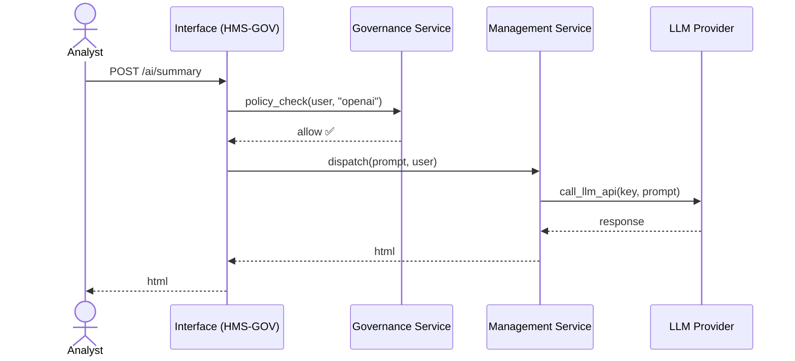

# Chapter 1: Three-Layer Architecture (Governance / Management / Interface)

> “Why can’t I just click **‘Generate Research Summary’**?”
>
> — NSF program officer, day 1 of pilot

The National Science Foundation (NSF) wants staff to generate quick literature reviews with Large-Language Models (LLMs).  
At the moment, hitting the button fails with the message:

```
Unable to generate content from LLM.
Please provide API keys for Anthropic Claude, OpenAI GPT, or Google Gemini models.
```

The root cause is **system functionality**: without a place to store, rotate, and expose those keys—securely and auditable—the feature can’t run. HMS solves this by enforcing a **Three-Layer Architecture**:  

```
Governance  →  Management  →  Interface
 City Hall      Public Works     Service Desk
```

Everything you will build—including secure LLM access—fits into this mental model. Let’s see how.

---

## 1. Why Three Layers Fix the “Missing API Key” Problem

• If _anyone_ can stash keys anywhere, you violate federal security policy.  
• If _no one_ can rotate or revoke keys on schedule, the system breaks at midnight.  
• If analysts must learn `curl` to use the keys, productivity tanks.

Separating the concerns keeps each responsibility clear:

| Layer        | What it owns for our use case | Quick analogy |
|--------------|------------------------------|---------------|
| Governance   | • Key-storage rules (FIPS-140) <br>• Who may use which provider | City Hall writes the ordinances |
| Management   | • Key rotation & usage quotas <br>• Actual LLM call orchestration | Public Works operates the water pumps |
| Interface    | • Buttons, CLI, or API endpoints that staff click | Service Desk hands citizens their water bill |

---

## 2. A 60-Second Tour of Each Layer

### 2.1 Governance (“City Hall”)

* YAML or JSON policy files live in `hms/governance/`.
* Example rule: *“Only users with role `nsf_research_staff` may invoke GPT-4-Turbo, max budget \$50/day.”*
* Keeps an audit trail for Inspector General reviews.

```yaml
# governance/llm_policy.yaml
provider_policies:
  openai:
    allowed_roles: [nsf_research_staff]
    daily_budget_usd: 50
```

### 2.2 Management (“Public Works”)

* Reads the above file every hour.
* Retrieves or rotates keys from a secure vault (HashiCorp, AWS Secrets Manager, etc.).
* Queues LLM jobs, tracks spend, and throttles if near the \$50 limit.

```python
# management/llm_dispatcher.py
def dispatch(prompt, user, provider="openai"):
    assert governance.allowed(user.role, provider)
    key = secret_vault.get_latest(provider)
    return call_llm_api(key, prompt)
```

### 2.3 Interface (“Service Desk”)

* A Vue.js dashboard in **HMS-GOV** exposes “Generate Research Summary”.
* A small REST endpoint also lives in **HMS-API** so scripts can automate.

```python
# interface/llm_route.py  (Flask-style pseudocode)
@app.post("/ai/summary")
def generate():
    user  = current_user()
    text  = request.json["prompt"]
    html  = management.dispatch(text, user)
    return {"html": html}
```

---

## 3. Hands-On: Calling the LLM From an NSF Notebook

Below is everything an analyst needs to do once the architecture is in place:

```python
# analyst_notebook.py
import requests, getpass

prompt = "Summarize recent work on quantum networking grants."
token  = getpass.getpass("HMS session token: ")

resp = requests.post(
    "https://hms-api.gov.ai/ai/summary",
    headers={"Authorization": f"Bearer {token}"},
    json={"prompt": prompt},
)
print(resp.json()["html"])
```

What you don’t see:

* Governance already confirmed the analyst’s role.
* Management silently grabbed the correct key, logged \$0.06 spend.
* Interface returned sanitized HTML back to the notebook.

Mission accomplished—no one ever typed an API key.

---

## 4. Under the Hood During That Single Click



1. **Policy Check** – Governance validates role and budget.  
2. **Key Retrieval & Call** – Management fetches key, invokes LLM.  
3. **Delivery** – Interface streams final output to the analyst.

Logs in **HMS-API** show who used how many tokens—ready for NSF audits.

---

## 5. Where This Touches the Rest of HMS

* Governance rules are edited through the upcoming [Policy Deployment](07_policy_deployment_.md) pipeline.  
* Management relies on **HMS-API** agents (folder `app/Agents/LLM`) to talk to each provider.  
* Interface surfaces real-time spend via the [Real-Time Synchronization](06_real_time_synchronization_event_broadcast_.md) event bus so finance officers can watch budgets live.  
* Security aligns with the [Zero-Trust Security Model](12_zero_trust_security_model_.md).

---

## 6. Beginner FAQ

| Question | Answer |
|----------|--------|
| “Where are the raw keys stored?” | Inside a dedicated secret vault—never in Git. Governance only stores *rules*, not secrets. |
| “What if we add Gemini tomorrow?” | Add a new block in `llm_policy.yaml` and drop a rotating key into the vault. Management auto-detects it. |
| “Can I bypass Governance in dev?” | Yes—set `HMS_DEV_ALLOW_ALL=true` in your `.env`. NEVER push that to prod. |

---

## 7. Key Takeaways

1. Three layers separate **rules**, **operations**, and **user interaction**.  
2. This separation lets NSF add or revoke LLM providers without code chaos.  
3. Auditors get clean logs; analysts get one-click summaries; keys stay safe.

---

### Next Stop → Chapter 2

Now that you know **where** the big red “Generate” button plugs in, Chapter 2 describes **who** is allowed to press it and how humans stay in the loop: [Human-in-the-Loop (HITL) & Decision-Maker Engagement](02_human_in_the_loop_hitl_decision_maker_engagement_.md).

---

Generated by [AI Codebase Knowledge Builder](https://github.com/The-Pocket/Tutorial-Codebase-Knowledge)