# Chapter 2: Human-in-the-Loop (HITL) & Decision-Maker Engagement

```markdown
# Chapter 2: Human-in-the-Loop (HITL) & Decision-Maker Engagement  
_file: 02_human_in_the_loop__hitl____decision_maker_engagement_.md_

---

[← Back to Chapter 1: Three-Layer Architecture](01_three_layer_architecture_governance_management_interface_.md)

> “The bot has prepared everything—who signs off on actually storing the keys?”  
> — NSF Chief Information Security Officer (CISO)

The architecture in Chapter 1 showed **where** an LLM API key must live.  
This chapter explains **who** gets to *pull the trigger* and **how** HMS guarantees that a real NSF official can review, amend, or veto any change the AI proposes.

We do that with the `_ref` component—our **Human-in-the-Loop (HITL) cockpit**.

---

## 1. Motivation — The “API-Key Request” Story

Concrete use-case flow:

1. An analyst presses **Generate Research Summary**.  
2. HMS detects *no valid key* → fires an *“API-Key Provisioning Request”* event.  
3. The `_ref` cockpit places that request into a **review queue** for two people:
   * ​Carol — NSF Security Engineer  
   * ​Dr. Lee — NSF Program Director  
4. Automation pauses until they both approve (quorum = 2/2).  

This solves the *system functionality* gap without sacrificing federal compliance:  
keys appear quickly, yet every action bears a human signature and audit stamp.

---

## 2. Key Concepts Breakdown

| #: | Sub-Concept | Why It Matters for NSF |
|----|-------------|------------------------|
| 2.1 | Review Queue | All pending AI suggestions (like “add key `openai_primary`”) show up here. |
| 2.2 | Quorum Rules | You define how many (and which) roles must approve—e.g. *1 Security + 1 Program*. |
| 2.3 | Expiry Logic | If nobody acts in 48 h, the request auto-expires; the analyst sees a clear status. |
| 2.4 | Override / Amend | Reviewers can edit scopes (`"gpt-4-turbo" → "gpt-3.5-turbo"`) before approval. |
| 2.5 | Immutable Audit Log | Every click is timestamped and stored for later GAO audits. |

Think of `_ref` as the **autopilot disconnect switch**: automation flies the plane unless a certified pilot grabs the yoke.

---

## 3. Hands-On: Approving an API-Key Provisioning Request

Below is a 16-line Vue component (`KeyRequestReview.vue`) that lives in **HMS-GOV**.  
Carol uses it to approve the OpenAI key request.

```html
<!-- KeyRequestReview.vue -->
<template>
  <div>
    <h3>API-Key Request #101</h3>
    <pre>{{ req.details }}</pre>

    <textarea v-model="note" placeholder="Why approve / reject?"/>
    <button @click="decide('APPROVE')">Approve</button>
    <button @click="decide('REJECT')">Reject</button>
  </div>
</template>

<script>
export default {
  data(){return{req:{},note:''}},
  async created(){this.req = await fetch('/api/requests/101').then(r=>r.json())},
  methods:{
    decide(action){
      fetch(`/api/requests/101/decision`,{
        method:'POST',
        headers:{'Content-Type':'application/json'},
        body:JSON.stringify({action, note:this.note})
      });
    }
  }
}
</script>
```

• **Input**: Reviewer’s verdict + rationale.  
• **Output**: HMS-API locks the decision and moves the request downstream.

---

## 4. Internal Flow – What Happens After “Approve”

```mermaid
sequenceDiagram
    participant UI  as HMS-GOV (Carol)
    participant REF as _ref HITL Layer
    participant SEC as Secure Vault
    participant MGT as Management Service
    participant API as HMS-API Logs

    UI->>REF: POST /decision {approve, note}
    REF->>API: Write audit record
    REF->>SEC: storeKey("openai_primary", encryptedKey)
    REF->>MGT: emit KeyReady(openai_primary)
    MGT->>UI: real-time toast “Key available 🎉”
```



Key points:

1. **Audit first** → every decision is permanent.  
2. Key is written to the vault—never exposed in the UI.  
3. Management service receives a `KeyReady` event and retries the analyst’s original LLM call automatically.

---

## 5. Minimal Backend Endpoint (Laravel-style, 18 lines)

```php
// app/Http/Controllers/DecisionController.php
public function store(Request $r, $id){
  $r->validate(['action'=>'in:APPROVE,REJECT','note'=>'max:500']);
  abort_unless($r->user()->can('approveKey'), 403);

  $req = KeyRequest::findOrFail($id);
  $req->update(['status'=>$r->action,'note'=>$r->note,'reviewer_id'=>$r->user()->id]);

  Audit::log('key_request_decision',$req,$r->user());

  if($r->action==='APPROVE'){
      Vault::put($req->key_name, $req->encrypted_value);   // secure store
      event(new KeyReady($req->key_name));
  }
  return ['status'=>$req->status];
}
```

Under 20 lines, yet it:

• validates permission,  
• records the audit trail,  
• stores the key,  
• and notifies downstream services.

---

## 6. Where `_ref` Fits in the HMS Ecosystem

* Receives **Key Provisioning Requests** from the Management layer (see Chapter 1).  
* Emits `KeyReady` through [Real-Time Synchronization](06_real_time_synchronization_event_broadcast_.md).  
* Uses identity scopes provided by [Stakeholder Access Model](11_stakeholder_access_model_five_wristbands_.md).  
* Approved keys flow into [Policy Deployment](07_policy_deployment_.md) for scheduled rotation rules.  
* All clicks are logged in HMS-API, consumable by [AI Governance Framework](09_ai_governance_framework_.md).

---

## 7. Analogy Corner

Picture a **drawbridge**:

• Automation = the bridge machinery.  
• `_ref` reviewers = the bridge operator who checks the river traffic list.  
Only when the operator gives a thumbs-up does the bridge lift, letting ships (API keys) pass safely.

---

## 8. Recap & What’s Next

`_ref` guarantees that adding or rotating LLM API keys happens **fast, traceably, and with the right humans in charge**—eliminating the painful “Please provide API keys” error while staying audit-ready for NSF.

Next, we’ll see how staff actually **talk to** the AI once the keys are in place, via a universal chat entry point:  
[Chapter 3: Collaboration Interface (Agent Dial-Tone)](03_collaboration_interface_agent_dial_tone_.md)

---
```

---

Generated by [AI Codebase Knowledge Builder](https://github.com/The-Pocket/Tutorial-Codebase-Knowledge)