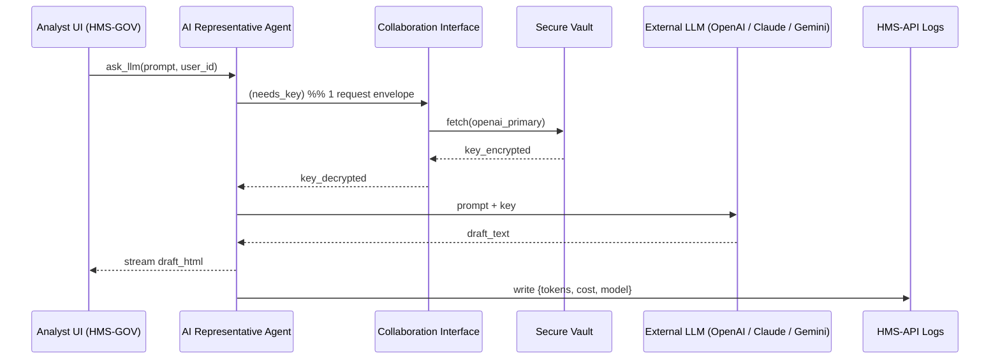

# Chapter 4: AI Representative Agent

```markdown
# Chapter 4: AI Representative Agent  
_file: 04_ai_representative_agent_.md_

[← Back to Chapter&nbsp;3: Collaboration Interface (Agent Dial-Tone)](03_collaboration_interface_agent_dial_tone_.md)

---

> “Great, the OpenAI key was approved and broadcast—but who actually **uses** it so my ‘Generate Research Summary’ button stops flashing red?”  
> — NSF program officer, day 6 of pilot

That final mile—from *key now available* to *draft text on screen*—is the exact slice of **system functionality** the **AI Representative Agent** covers.  
Think of it as a tireless junior analyst who:

1. Hears that a new credential is ready.  
2. Grabs the key securely.  
3. Calls the outside LLM.  
4. Hands the answer back to the analyst, fully logged and policy-compliant.

Without this agent, NSF would still be stuck at the dreaded:

```
Unable to generate content from LLM.
Please provide API keys …
```

---

## 1. Key Concepts (What the Agent Actually Does)

| Piece | Role in the NSF flow | 1-Sentence Analogy |
|-------|----------------------|--------------------|
| Event Listener | Subscribes to `KeyReady` messages on the HMS event bus. | Doorbell that only rings when a key is activated. |
| Credential Fetcher | Pulls the fresh key from the Vault, never writes it to disk. | Unlocks a safety-deposit box, copies nothing. |
| LLM Invoker | Sends the program officer’s prompt + key to GPT / Claude / Gemini. | Places a phone call to an outside expert. |
| Response Router | Streams the LLM answer back through WebSocket to the UI. | Slides the finished memo under the office door. |
| Token Logger | Records usage so Governance can cap budget. | Time-clock punch for auditors. |

---

## 2. How Do I Use It? – NSF One-Click Example

Once the key is approved (Chapter 2) and the dial-tone is live (Chapter 3), an NSF analyst needs only these few lines:

```python
# analyst_portal_call.py   (≤ 16 lines)
from hms_agents.llm_client import ask_llm   # wrapper around the AI Rep Agent

def make_summary(question, user):
    return ask_llm(
        prompt = f"Generate a 300-word research summary:\n\n{question}",
        user_id = user.id           # used for quota & logging
    )

draft_html = make_summary("quantum networking grants, 2022-2024")
print(draft_html)                  # → formatted summary ready to paste
```

Input: a plain English prompt.  
Output: HTML draft—no key handling, no rate-limit headaches.

---

## 3. Internal Flow in the Target Use Case



What this diagram shows in plain words:

1. **Needs Key** – Agent asks via the dial-tone; Vault responds.  
2. **Single Use** – Key lives only in memory for one API call.  
3. **Answer Delivered** – Draft flows back to the browser; usage flows to logs for auditors.

---

## 4. Mini Code Walk-Through (< 20 Lines Total)

```python
# hms_agents/llm_client.py
import httpx, hms_ci, hms_secrets, hms_events

def ask_llm(prompt: str, user_id: int):
    # 1️⃣ fetch credential
    key = hms_secrets.get("openai_primary")      # pulled via CI helper
    assert key, "Key missing; should never happen after approval"

    # 2️⃣ call external model
    resp = httpx.post(
        "https://api.openai.com/v1/chat/completions",
        headers={"Authorization": f"Bearer {key}"},
        json={"model": "gpt-4o", "messages":[{"role":"user","content":prompt}]},
        timeout=25
    ).json()["choices"][0]["message"]["content"]

    # 3️⃣ return and log
    hms_events.emit("LLMUsage",
        {"user_id": user_id, "model":"gpt-4o", "tokens":len(resp)//4})
    return resp
```

Follow the emoji comments:

1️⃣ Secure key retrieval → 2️⃣ LLM call → 3️⃣ Usage log.  
Notice: no local file writes, no long-lived tokens—fully compliant with NSF security rules.

---

## 5. Where It Touches Other HMS Components

Component | Interaction in this Chapter
----------|----------------------------
[Three-Layer Architecture](01_three_layer_architecture_governance_management_interface_.md) | Agent sits in the **Management** layer, translating Governance rules into real calls.
[HITL Cockpit](02_human_in_the_loop_hitl_decision_maker_engagement_.md) | Only fires after reviewers approve or rotate keys.
[Collaboration Interface](03_collaboration_interface_agent_dial_tone_.md) | Provides the envelopes (`needs_key`, `llm_response`) the agent sends/receives.
[Backend API (“Heart” / Communication Hub)](05_backend_api_heart_communication_hub_.md) | Stores token logs and exposes them for audits.
[Real-Time Synchronization](06_real_time_synchronization_event_broadcast_.md) | Streams draft_html back to the analyst in milliseconds.
[Zero-Trust Security Model](12_zero_trust_security_model_.md) | Ensures the decrypted key never leaves a trusted enclave.

---

## 6. Analogy Corner 📨

Picture a **courier in a secure government building**:

1. Security desk (Vault) hands the courier a sealed envelope (API key).  
2. Courier exits, makes a single phone call (LLM request).  
3. Immediately shreds the envelope, writes a note in the logbook (token usage), and hands the message to the requester (draft summary).  

Fast, logged, and nothing sensitive lingers.

---

## 7. Summary & Transition

The **AI Representative Agent** closes the loop that started with “missing API key,” transforming an approved credential into the actual research summary NSF staff asked for—thus restoring full **system functionality**.

Ready to see where all these messages live and how they stay queryable months later?  
Head to [Chapter 5: Backend API (“Heart” / Communication Hub)](05_backend_api_heart_communication_hub_.md).

---
```

---

Generated by [AI Codebase Knowledge Builder](https://github.com/The-Pocket/Tutorial-Codebase-Knowledge)