# Chapter 5: Backend API (“Heart” / Communication Hub)

```markdown
# Chapter 5: Backend API (“Heart” / Communication Hub)  
_file: 05_backend_api___heart____communication_hub__.md_

[← Back to Chapter 4: AI Representative Agent](04_ai_representative_agent_.md)

---

> “Carol approved the OpenAI key, the AI Agent is waiting—  
> but **who** actually tells every service the key is live?” 
> — NSF DevOps lead, sprint demo

The NSF pilot now has  
• Governance rules (Chapter 1)  
• HITL approvals (Chapter 2)  
• A common agent language (Chapter 3)  
• An AI Representative ready to call GPT (Chapter 4)  

Yet the analyst’s screen can *still* flash the error:

```
Unable to generate content from LLM.
Please provide API keys …
```

Why?  
Because there is no single, always-awake component that

1. records the approved key,  
2. exposes it to the right agents, and  
3. broadcasts the “all clear” in milliseconds.

That central organ is the **Backend API (“Heart” / Communication Hub)**.

---

## 1. Motivation – The Last Mile of System Functionality

Concrete use-case moment:

1. Carol (security engineer) presses **Approve** on `openai_primary`.  
2. Within one second, every HMS service **must** know:  
   • the key value,  
   • its current status = `active`,  
   • which policy applies,  
   • and who pressed approve.

If any service misses the memo, the analyst hits “Generate Research Summary” and again sees *system functionality failure*.  
The Backend API prevents that by acting like a **24/7 postal hub**—no message, key, or policy moves without its stamp.

---

## 2. Key Concepts Breakdown

| Piece | Role in our NSF Flow | Beginner Analogy |
|-------|----------------------|------------------|
| Credential Store | Encrypts & saves the API key once approved. | Bank vault deposit box |
| Message Router | Publishes `KeyActivated` events to all listeners. | Sorting belts in a mail center |
| Policy Cache | Links the key to its Governance rule so agents grab limits with the key. | Sticky note attached to each envelope |
| Idempotency Gate | Drops duplicate approvals (double-clicks). | “Already stamped” detector |
| Audit Log | Immutable record for NSF Inspector General. | Security camera over the vault |

---

## 3. How to Use It – Approving a Key (Live Example)

Below is the *exact* call the HITL cockpit makes after Carol clicks **Approve**.  
< 15 lines, real PHP/Laravel route from `HMS-API`.

```php
// routes/api.php  -- HMS-API
Route::post('/keys/{id}/approve', function ($id) {
    $key = PendingKey::findOrFail($id);
    abort_unless(auth()->user()->can('approveKeys'), 403);

    DB::transaction(function() use ($key) {

        // 1️⃣ store securely
        KeyVault::put($key->provider, $key->ciphertext);

        // 2️⃣ mark active for all services
        $key->status = 'active';
        $key->save();

        // 3️⃣ emit heartbeat
        event(new KeyActivated($key->provider));
    });

    return ['status' => 'active'];
});
```

Input: the key’s database `id`, authenticated by Carol’s JWT.  
Output: JSON `{status: "active"}` plus an internal `KeyActivated` event that the AI Agent and UIs will catch.

---

## 4. Internal Dance – What Happens After the Call

```mermaid
sequenceDiagram
    participant HITL as Carol’s _ref Cockpit
    participant API  as Backend API (“Heart”)
    participant VAULT as Secure Vault
    participant BUS   as Real-Time Bus
    participant AGENT as AI Representative Agent
    participant UI    as Analyst Dashboard

    HITL->>API: POST /keys/42/approve
    API->>VAULT: store(encrypted_key)
    VAULT-->>API: OK
    API->>BUS: publish KeyActivated(openai_primary)
    BUS-->>AGENT: event
    BUS-->>UI: websocket push
    API-->>HITL: {status:"active"}
    note over AGENT,UI: Analyst can now click “Generate Research Summary” and succeed.
```



If any arrow fails, the system reverts to the “Unable to generate content” error—hence the heart’s criticality.

---

## 5. Mini Code – Agent Side Listener (Python, 12 lines)

```python
# ai_agent/key_watcher.py
import hms_bus, hms_secrets

@hms_bus.on("KeyActivated")
def when_key_is_ready(evt):
    prov = evt["provider"]          # "openai_primary"
    key  = hms_secrets.get(prov)    # pulled from Backend API
    hms_bus.emit("KeyReadyForLLM", {"provider": prov})
```

One tiny callback, yet it only works because the Backend API published the event instantly.

---

## 6. Where the Heart Connects in HMS

Component | Relationship in this Use Case
----------|--------------------------------
[Three-Layer Architecture](01_three_layer_architecture_governance_management_interface_.md) | Lives at the **Management**/Governance border as the single truth source.
[HITL Cockpit](02_human_in_the_loop_hitl_decision_maker_engagement_.md) | Sends approval calls to the Backend API.
[Collaboration Interface](03_collaboration_interface_agent_dial_tone_.md) | Uses the Backend API’s events as message payloads.
[AI Representative Agent](04_ai_representative_agent_.md) | Subscribes to `KeyActivated`; fetches the key via `/secrets` endpoint.
[Real-Time Synchronization](06_real_time_synchronization_event_broadcast_.md) | The next chapter dives into the BUS box in the diagram above.

---

## 7. Analogy Corner 🩺

Imagine the Backend API as **the heart in a hospital’s trauma unit**:  
Doctors (agents) and nurses (UIs) act only when the heart pumps fresh, oxygenated blood (events + data).  
If the heart skips a beat, the entire unit stalls—patients (analysts) wait, alarms blare.

---

## 8. Quick FAQ

| Q | A |
|---|---|
| “Can a frontend bypass the Backend API and pull the key directly?” | No—network policy blocks that path. All secrets flow through the heart for auditing. |
| “What if two admins approve the same key?” | The Idempotency Gate in the route drops duplicate events; the second call returns `409 Conflict`. |
| “How long are events stored?” | 7 years in an append-only log (`hms_event_log` table) to satisfy federal audit rules. |

---

## 9. Key Takeaways

1. Backend API is the **single source of truth** for keys, policies, and status.  
2. It fixes the final blocker in NSF’s “missing API key” saga: *instant, consistent distribution*.  
3. Without this heartbeat, all previous chapters’ work—policies, approvals, agents—would never reach the analyst.

---

### Up Next → Chapter 6

Now that the heart can publish events, we need an **arterial system** that delivers them in real time to every corner of HMS.  
Chapter 6 shows how **Real-Time Synchronization (Event Broadcast)** turns these heartbeats into milliseconds-fast updates for dashboards, agents, and auditors.

[Continue to Chapter 6: Real-Time Synchronization (Event Broadcast)](06_real_time_synchronization_event_broadcast_.md)

---
```

---

Generated by [AI Codebase Knowledge Builder](https://github.com/The-Pocket/Tutorial-Codebase-Knowledge)