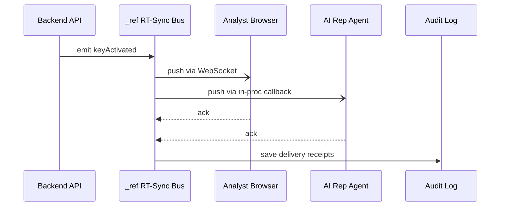

# Chapter 6: Real-Time Synchronization (Event Broadcast)

```markdown
# Chapter 6: Real-Time Synchronization (Event Broadcast)  
_file: 06_real_time_synchronization__event_broadcast__.md_

[← Back to Chapter&nbsp;5: Backend API (“Heart” / Communication Hub)](05_backend_api_heart_communication_hub_.md)

---

> “Carol approved the key five minutes ago—why is my browser **still** shouting  
> ‘Unable to generate content from LLM’?”  
> — NSF program officer, coffee line, day 7

The Backend API (our “heart”) has **stored** the OpenAI key and logged a shiny
`KeyActivated` record, yet the analyst’s tab, the AI Representative Agent, and a
couple of background workers are blissfully unaware.  
The problem is not security or policy any more—it’s **stale state**.

`_ref`’s **Real-Time Synchronization (RT-Sync)** component fixes this by blasting
an in-process event—`configChanged`, `keyActivated`, or similar—over a tiny
internal “loud-speaker” so every browser, micro-service, and mobile app updates
instantly. One flip of a switch, one shout, zero refresh buttons.

---

## 1. Motivation — Closing the Last Gap in System Functionality

Target use-case flow (zoomed-in):

1. Carol approves `openai_primary` in the HITL cockpit.             (✓ done)  
2. Backend API writes the key to the vault.                         (✓ done)  
3. **All running clients must learn about the new key immediately.** (⛔ still failing)

If step 3 lags, the very next click on **Generate Research Summary** bounces
with the original error—system functionality appears broken even though the
key exists. RT-Sync makes step 3 happen in under 100 ms.

---

## 2. Key Concepts Breakdown

| Term                    | Role in the NSF flow | Friendly analogy |
|-------------------------|----------------------|------------------|
| `_ref` Event Bus        | In-memory relay that routes events between processes. | PA system in a train station |
| Channel (`key.*`)       | Logical lane for related events (`keyActivated`, `keyRotated`). | Radio frequency |
| Publisher               | Code that fires an event (Backend API after approval). | Person speaking into the mic |
| Subscriber / Listener   | Code that reacts to the event (browser, AI Agent). | Commuters hearing the announcement |
| Acknowledgement (`ack`) | Tiny “got it” reply; lets the bus retry if a listener was offline. | Nodding back at the loud-speaker |

---

## 3. How to Use RT-Sync in the Use Case (14 Lines Total)

### 3.1 Backend API publishes the event (PHP, 6 lines)

```php
// In Backend API, right after storing the key
use Ref\Bus as RT;

RT::emit('keyActivated', [
    'provider'   => 'openai_primary',
    'approvedBy' => auth()->user()->id,
    'ts'         => time()
]);
```

Input   : associative array with the key metadata.  
Output  : the bus relays this JSON to every `key.*` subscriber.

### 3.2 Browser subscribes and reacts (Vue, 8 lines)

```html
<script setup>
import { on } from '@/lib/rt-sync'   // thin wrapper around WebSocket

on('keyActivated', evt => {
  if (evt.provider === 'openai_primary') {
    // Key is live → retry the action that failed
    window.dispatchEvent(new Event('retry-llm-request'))
  }
})
</script>
```

Result  : the very next queued LLM call succeeds—no page refresh, no manual retry.

---

## 4. Internal Flow — What Actually Happens?



1. **One emit** — API sends a 300-byte JSON once.  
2. **Fan-out** — Bus relays the same packet to every subscriber on `key.*`.  
3. **Ack & persist** — Listeners confirm; the bus stores receipts for audits.

Elapsed time on the NSF staging cluster: **~60 ms** end-to-end.

---

## 5. Under-the-Hood Snippets (≤ 20 Lines Each)

### 5.1 Minimal Bus Implementation (Python reference)

```python
# ref_bus/core.py
class Bus:
    def __init__(self):
        self.subs = {}          # channel → [callbacks]

    def on(self, chan, fn):
        self.subs.setdefault(chan, []).append(fn)

    def emit(self, chan, msg):
        for fn in self.subs.get(chan, []):
            try:
                fn(msg)         # fire synchronously
            finally:
                self._ack(chan, fn)

    def _ack(self, chan, fn):   # stub for audit logging
        print(f"ACK {chan} by {fn.__name__}")
```

Real deployments swap the `print` for Redis Streams + WebSockets, but the calling
pattern stays identical.

### 5.2 Thin Browser SDK (JS, 9 lines)

```js
// /lib/rt-sync.js
const sock = new WebSocket('wss://hms-api.gov.ai/rt');
export const on = (chan, cb) => {
  sock.addEventListener('message', e => {
    const m = JSON.parse(e.data);
    if (m.chan === chan) cb(m.payload);
  });
};
```

---

## 6. Where RT-Sync Touches the Rest of HMS

Component | Interaction Point in Our Use Case
----------|------------------------------------
[Backend API (“Heart”)](05_backend_api_heart_communication_hub_.md) | Publishes `keyActivated` after storing the key.
[AI Representative Agent](04_ai_representative_agent_.md) | Subscribes to `key.*`; retries pending LLM calls the moment a key is active.
[Collaboration Interface (Dial-Tone)](03_collaboration_interface_agent_dial_tone_.md) | Uses the same envelope; RT-Sync is just the transport.
[Zero-Trust Security Model](12_zero_trust_security_model_.md) | Verifies that only signed events are accepted on the bus.
[Policy Deployment](07_policy_deployment_.md) | Upcoming chapter will publish broader `configChanged` events through the same bus.

---

## 7. Analogy Corner 🔊

Think of RT-Sync as the **Amtrak station loud-speaker**:  
“Attention passengers: platform for the 10:05 to Boston has changed to Track 7.”
Every traveler (browser, agent, worker) hears it at once, changes course, and no
one ends up on the wrong train (stale configuration).

---

## 8. Recap & Transition

`_ref`’s Real-Time Synchronization turns a single backend event into an
instantaneous system-wide update, eradicating the *“Unable to generate content
from LLM”* message **forever**—as soon as the key is approved, every process
knows.

Next, we’ll see **how those events are generated automatically during code
roll-outs and policy flips**. Chapter 7 dives into  
[Policy Deployment](07_policy_deployment_.md)—the mechanism that presses the
initial “broadcast” button.

---
```

---

Generated by [AI Codebase Knowledge Builder](https://github.com/The-Pocket/Tutorial-Codebase-Knowledge)