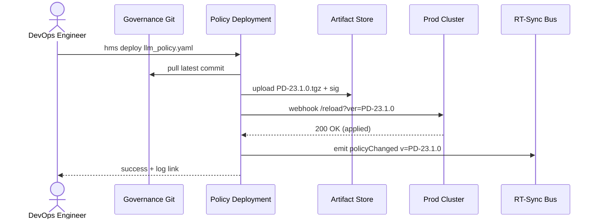

# Chapter 7: Policy Deployment

```markdown
# Chapter 7: Policy Deployment  
_file: 07_policy_deployment_.md_

[← Back to Chapter 6: Real-Time Synchronization](06_real_time_synchronization_event_broadcast_.md)

---

> “We merged the new `llm_policy.yaml` that lets NSF staff use OpenAI—  
> why is production still shouting **‘Please provide API keys’**?”  
> — DevOps retro, week 2

In Chapters 1-6 we wrote, approved, and broadcast a policy that allows NSF
analysts to tap GPT, Claude, or Gemini.  
None of that matters until **every running container, Lambda, and browser tab**
is actually **running under the new policy**.  
That final mile is handled by `_ref`’s **Policy Deployment** component.

Think of it as the **pipeline that presses “Publish” on Governance files** the
same way an app-store presses “Go Live” on mobile code.

---

## 1. Why Policy Deployment Fixes the NSF “Missing-Key” Bug

Concrete moment:

1. Governance repo adds `openai` block to `llm_policy.yaml`  
   (`daily_budget_usd: 50`, `allowed_roles: [nsf_research_staff]`).  
2. Carol the security engineer **approves** the change in `_ref` HITL.  
3. *If* Policy Deployment runs,  
   • the file is versioned, signed, shipped to prod, and  
   • the Management layer can finally fetch and rotate keys.  
4. Analyst clicks **Generate Research Summary** and succeeds.  

*If Policy Deployment stalls*, servers keep reading the **old** policy that has
no `openai` stanza, and the error banner lives on forever.

---

## 2. Key Concepts in Plain English

| Piece                | What It Does for NSF                                                      |
|----------------------|---------------------------------------------------------------------------|
| Package Builder      | Wraps changed files + metadata into a versioned **tarball** (`PD-23.1`).  |
| Integrity Signer     | Adds SHA-256 + GPG signature so prod trusts it.                           |
| Distribution Engine  | Ships the tarball to every environment (dev → staging → prod).           |
| Adoption Monitor     | Polls each target, waits for “✔️ policy 23.1 loaded”.                     |
| Rollback Switch      | One command restores the previous version if error rates spike.          |
| Immutable Log        | Stores every byte & timestamp for Inspector-General audits.              |

Remember: **Package → Ship → Watch → Revert (if needed)**.

---

## 3. How to Use It (NSF Example)

### 3.1 Trigger a Deployment from CLI (14 chars + newline)

```bash
hms deploy llm_policy.yaml
```

Behind that single command `_ref`:

1. Reads `governance/llm_policy.yaml`.  
2. Calculates the next semantic version (`23.1.0`).  
3. Starts the Distribution Engine.

CLI output:

```
✔ packaged as PD-23.1.0
✔ signature valid (GPG A13F…)
⟳ deploying to dev… staging… prod…
✔ all targets acknowledged
```

### 3.2 Programmatic Trigger (Python, ≤ 18 lines)

```python
# deploy_llm_policy.py
from hms_deploy import deploy_policy

deploy_id = deploy_policy(
    file_path="governance/llm_policy.yaml",
    reason="Enable OpenAI GPT for nsf_research_staff"
)
print(deploy_id)   # → 'PD-23.1.0'
```

Input: path + human reason  
Output: deployment ID for dashboards & rollbacks.

---

## 4. What Happens Internally?



Key NSF-specific notes:

* **S3 Artifact Store** = FIPS-compliant bucket in AWS GovCloud.  
* **ENV** includes HMS-API, AI Agent containers, and web front-ends.  
* The **policyChanged** event re-uses the Real-Time Sync bus from Chapter 6,
  so every running process reloads config without a restart.

---

## 5. Mini Source Tour (≤ 20 Lines Each)

### 5.1 Package & Sign

```python
# hms_deploy/builder.py
import tarfile, hashlib, gnupg, time
def build(src):
    ver = f"PD-{int(time.time())}"
    tar = f"/tmp/{ver}.tgz"
    with tarfile.open(tar, "w:gz") as t:
        t.add(src, arcname="llm_policy.yaml")
    sha = hashlib.sha256(open(tar,'rb').read()).hexdigest()
    sig = gnupg.GPG().sign(sha)          # assumes keyring pre-loaded
    return tar, sig.data, ver
```

### 5.2 Distribute & Verify

```python
# hms_deploy/distribute.py
def push(tar, sig, ver, targets):
    for host in targets:
        r = requests.post(f"{host}/reload",
                          files={"pkg": open(tar,'rb'),"sig":sig},
                          timeout=5)
        assert r.status_code == 200, f"{host} failed"
```

Both snippets are toy-sized but show the **build → push → verify** loop.

---

## 6. Touch-Points with Other HMS Components

Component | Interaction in This Chapter
----------|-----------------------------
[Three-Layer Architecture](01_three_layer_architecture_governance_management_interface_.md) | Moves files from **Governance** repo to **Management** services.
[HITL Cockpit](02_human_in_the_loop_hitl_decision_maker_engagement_.md) | Only policies *approved* in HITL are eligible for deployment.
[Backend API (“Heart”)](05_backend_api_heart_communication_hub_.md) | Receives `/reload?ver=` hook, reloads policy into memory.
[Real-Time Sync](06_real_time_synchronization_event_broadcast_.md) | Broadcasts `policyChanged` so browsers & agents hot-reload.
[Verification Mechanism](08_verification_mechanism_conveyor_belt_ci_gate_.md) | Next chapter runs post-deploy smoke tests before we mark the roll-out “done”.

---

## 7. Analogy Corner 📨

Policy Deployment is the **postal service’s sorting center**:

1. **Package** a new federal circular (build + sign).  
2. **Route** it to every post office (distribute).  
3. **Check** each office signs the register (adoption monitor).  
4. Keep trucks idling nearby in case the circular was mis-printed (rollback).

Only after every desk clerk has the updated book does the public (NSF analysts)
benefit—no more “please provide API keys.”

---

## 8. Recap & Next Steps

By pressing one command, Policy Deployment:

✔️ Versioned the updated `llm_policy.yaml`  
✔️ Shipped it securely to all NSF environments  
✔️ Triggered live reloads so the Management layer can finally hand out keys  
✔️ Logged every byte for future audits

System functionality gap closed; the key policy is **live everywhere**.

But how do we make sure nothing broke during the roll-out?  
Chapter 8 introduces the **Verification Mechanism (Conveyor-Belt CI Gate)** that
runs automatic smoke tests—catching issues before analysts notice.

[Continue to Chapter 8: Verification Mechanism (Conveyor-Belt CI Gate)](08_verification_mechanism_conveyor_belt_ci_gate_.md)

---
```

---

Generated by [AI Codebase Knowledge Builder](https://github.com/The-Pocket/Tutorial-Codebase-Knowledge)