# Chapter 8: Verification Mechanism (Conveyor-Belt CI Gate)

```markdown
# Chapter 8: Verification Mechanism (Conveyor-Belt CI Gate)  
_file: 08_verification_mechanism__conveyor_belt_ci_gate__.md_

[← Back to Chapter 7: Policy Deployment](07_policy_deployment_.md)

---

> “I merged the new *OpenAI-key* support and shipped the updated policy,  
> but the NSF analyst still gets **‘Unable to generate content from LLM’**—what now?” 
> — junior dev, code-review thread

Policy files and secrets are finally in place (Chapters 1-7), yet a single typo
in yesterday’s pull-request can crash the rotation script or break the
`llm_dispatcher` import path.  
NSF would be *right back* at the dreaded error banner—**system functionality
gone**—even though the keys exist.

The cure is `_ref`’s **Verification Mechanism**, a six-line script that runs the
same four “gates” on every laptop *and* in CI:

```
🧹 Lint → 🧪 Unit Tests → 🏗️ Architecture Check → 📚 Doc Check
```

No code, policy, or config “boards the production plane” until the conveyor belt
gives a full-green light.

---

## 1. Why NSF Needs a Conveyor Belt (Concrete Use-Case)

Scenario in our running story:

1. Dev adds new `Vault.fetch("openai_primary")` call.  
2. Accidentally imports `vault` from the wrong module (`hms_vault`
   vs `hms_secrets`).  
3. Code compiles locally, **but** the import violates HMS’ architecture rules.  
4. If merged, the AI Representative Agent raises `ImportError`
   → analysts see *system functionality* failure again.

Gate 3 (“Architecture Check”) rejects the PR *before* it reaches prod, keeping
our new OpenAI path healthy.

---

## 2. Gate-by-Gate Breakdown

| Gate | Tool (default) | Catches | Role for the API-Key Use Case |
|------|----------------|---------|-------------------------------|
| 🧹 Linter | `ruff` / `eslint` | Typos, dead vars | Prevents quick breakages in key-rotation code |
| 🧪 Unit Tests | `pytest` / `jest` | Logic errors | Confirms `Vault.fetch()` really returns decrypted keys |
| 🏗️ Architecture | `import-linter` | Forbidden imports | Stops cross-layer leaks (`interface` pulling secrets) |
| 📚 Docs | `mkdocs build --strict` | Missing docs / links | Ensures updated *“How to add a provider”* page renders |

One failure = whole belt stops.

---

## 3. How to Use It (Hands-On)

### 3.1 Local run

```bash
$ make verify         # alias for ./verify.sh
✅ All gates passed
```

### 3.2 The 6-line script (repo root)

```bash
#!/usr/bin/env bash             # verify.sh
ruff .            || exit 1     # 🧹
pytest -q         || exit 1     # 🧪
import-linter -q  || exit 1     # 🏗️
mkdocs build -q   || exit 1     # 📚
echo "✅ All gates passed"
```

Input: *nothing*—just your current working tree.  
Output: non-zero exit if any gate fails; green tick otherwise.

---

## 4. Internal Flow During the Use-Case

```mermaid
sequenceDiagram
    actor Dev as Developer
    participant VS as verify.sh (local)
    participant GH as GitHub CI
    participant LINT as Linter Gate
    participant TEST as Unit-Test Gate
    participant ARCH as Arch Gate
    participant DOC as Doc Gate

    Dev->>VS: make verify
    VS-->>Dev: ❌ if any gate fails
    Dev->>GH: push branch      %% only after local pass
    GH->>LINT: run
    LINT-->>GH: ✔︎/✖︎
    GH->>TEST: if ✔︎
    GH->>ARCH: if ✔︎
    GH->>DOC:  if ✔︎
    GH-->>Dev: CI status ✅ / ❌
```



Result: branch can’t merge unless *every* gate returns ✔︎—guaranteeing the new
OpenAI code won’t re-break system functionality.

---

## 5. Minimal CI Workflow (9 Lines)

```yaml
# .github/workflows/verify.yml
name: Conveyor-Belt
on: [pull_request]
jobs:
  verify:
    runs-on: ubuntu-latest
    steps:
      - uses: actions/checkout@v4
      - run: chmod +x verify.sh
      - run: ./verify.sh
```

Same belt, but in the cloud—prevents “works-on-my-machine” surprises.

---

## 6. Customising or Extending Gates

Want a Federal-grade scanner?

```bash
# Gate 0 – static-sec scan, before the linter
trivy fs . || exit 1
```

Add the line above at the top of `verify.sh`; experts extend, newcomers still
just run `make verify`.

---

## 7. Where the Conveyor Belt Connects in HMS

Component | Interaction
----------|------------
[Policy Deployment](07_policy_deployment_.md) | Conveyor runs *before* every deploy tag (`PD-23.1.0`) is created.
[Backend API (“Heart”)](05_backend_api_heart_communication_hub_.md) | Tests ping `/secrets` and `/ai/summary` endpoints to ensure key flow still works.
[Real-Time Sync](06_real_time_synchronization_event_broadcast_.md) | Architecture gate checks that UI only listens to approved RT channels.
[Stakeholder Access Model](11_stakeholder_access_model_five_wristbands_.md) | Linter verifies no code leaks high-clearance data to low-clearance paths.

---

## 8. Analogy Corner ✈️

Picture TSA at an airport:

1. ID check (lint)  
2. X-ray (unit tests)  
3. Body scanner (architecture)  
4. Gate agent verifying ticket & destination (docs)

Only passengers (code) who clear **all** checkpoints board the plane to
production. No missing bolts = no mid-air errors for NSF.

---

## 9. Summary & Next Stop

The **Verification Mechanism** makes sure every line of code, every updated
policy, and every new key pathway is *safe, sane, and documented* **before** it
touches NSF analysts—permanently burying the
“Please provide API keys” outage.

Up next, we widen the lens: Chapter 9 introduces the **AI Governance Framework**,
showing how NSF sets strategic guard-rails around all these moving parts.

[Continue to Chapter 9: AI Governance Framework](09_ai_governance_framework_.md)
```

---

Generated by [AI Codebase Knowledge Builder](https://github.com/The-Pocket/Tutorial-Codebase-Knowledge)