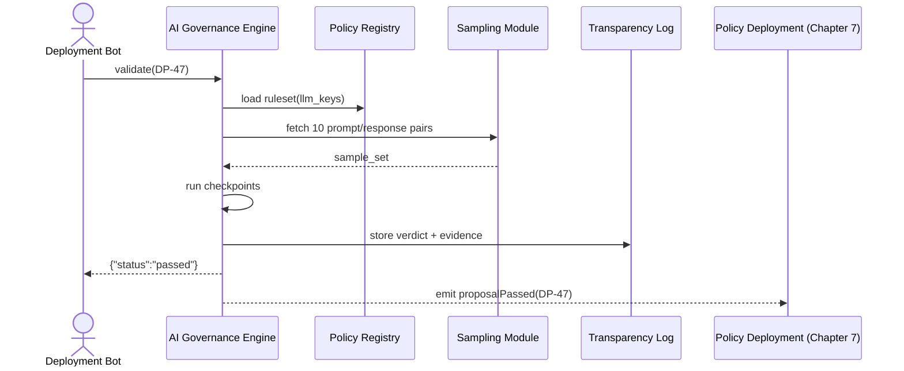

# Chapter 9: AI Governance Framework

```markdown
# Chapter 9: AI Governance Framework  
_file: 09_ai_governance_framework_.md_

[← Back to Chapter 8: Verification Mechanism](08_verification_mechanism_conveyor_belt_ci_gate_.md)

---

> “The code passed every test, the policy deployed, the key rotated on-time—  
> **are we absolutely sure** turning on GPT-4 for 2,000 NSF staff won’t break
> federal fairness, security, or budget rules?”  
> — NSF Chief Counsel, pre-launch meeting

The last eight chapters fixed the *technical* blockers behind

```
Unable to generate content from LLM.
Please provide API keys …
```

but one barrier remains: **governance**.  
Before a single API call hits OpenAI, NSF must prove the change is:

* fair (no hidden bias),  
* legal (FedRAMP / FISMA-aligned),  
* safe (spend caps, prompt filtering), and  
* auditable (any decision replayable).

That final green-light is issued by `_ref`’s **AI Governance Framework (AIGF)**—an
embedded ethics committee that works like the FDA approving a new drug.

If AIGF *blocks* the rollout, keys stay locked and the analyst still sees the
error message. When AIGF *passes* the rollout, the “Generate Research Summary”
button finally works—closing the **system-functionality gap** for NSF.

---

## 1. Key Concepts (Beginner-Friendly)

| # | Piece | Role in the NSF “missing-key” story | Quick analogy |
|---|-------|--------------------------------------|---------------|
| 1 | Policy Registry | YAML rules: encryption, rotation ≤ 90 days, budget ≤ \$50/day | Law books |
| 2 | Checkpoint Engine | Runs every rule against the proposed change (new model, new key) | Airport security scanner |
| 3 | Docket & Sampling | Pulls 5-10 real prompts / responses for human + machine review | Drug trial sample group |
| 4 | Decision Gate | Returns `pass` or `fail`; red-flags halt deployment | FDA approval stamp |
| 5 | Transparency Log | Immutable ledger of each verdict | Court transcripts |

Keep these five in mind; the code & diagrams below reference them directly.

---

## 2. How to Use AIGF in the NSF Flow

The **moment** Carol and Dr. Lee finish their HITL approvals (Chapter 2) a
deployment bot submits the *“Enable OpenAI provider”* change to AIGF.

### 2.1 One-Liner CLI

```bash
hms governance validate deployments/DP-47.yaml
```

### 2.2 Equivalent API Call (≤ 18 lines for tutorial)

```python
# validate_openai.py
import requests, json, os

PROPOSAL = "DP-47"                   # "Deploy OpenAI provider"
TOKEN    = os.getenv("HMS_ADMIN_JWT")

resp = requests.post(
    "https://hms-api.gov.ai/aigf/validate",
    headers={"Authorization": f"Bearer {TOKEN}"},
    json={"proposal_id": PROPOSAL}
).json()

print(json.dumps(resp, indent=2))
```

Typical output when things are good:

```json
{
  "status": "passed",
  "checks": [
    "encryption: ok",
    "rotationWindow: ok",
    "budgetCap: ok",
    "biasScan: ok"
  ],
  "log_id": "aigf_1561"
}
```

Inputs & Outputs tied to our use case:

* **Input** `proposal_id`: the exact package that adds the OpenAI key.  
* **Output** `status` → `"passed"` means deployment may continue;
  `"failed"` blocks the rollout and the analyst will still see the error.

---

## 3. What Happens Internally?



Plain-English flow:

1. **Pull Rules** – encryption, rotation, budget, bias.  
2. **Sample** – run 10 dry-run prompts through GPT-4 with the *proposed* key.  
3. **Checkpoints** – automated + human spot check.  
4. **Verdict** – pass or fail; everything logged immutably.  
5. **Emit Event** – successful pass unblocks the Policy Deployment pipeline.

---

## 4. Tiny Internal Code Peek (≤ 20 Lines)

```python
# hms_aigf/engine.py
def validate(proposal_id: str):
    prop = load_yaml(f"deployments/{proposal_id}.yaml")
    rules = yaml.safe_load(open("rules/llm_keys.yaml"))

    violations = [
        r["id"] for r in rules
        if not r["check"](prop)          # each check = 1-line lambda
    ]

    status = "failed" if violations else "passed"
    log_id = transparency_log.write(proposal_id, status, violations)

    if status == "passed":
        emit("proposalPassed", proposal_id)  # Real-Time Bus (Ch. 6)

    return {"status": status,
            "checks": violations or ["all_ok"],
            "log_id": log_id}
```

Notice how:

* Rules are plain YAML → non-coders can review.  
* Each check is a Python lambda imported dynamically.  
* Successful pass emits an event that Policy Deployment (Chapter 7) listens to.

---

## 5. Where AIGF Touches the HMS Map

Component | Interaction for the NSF Key Roll-Out
----------|---------------------------------------
[Human-in-the-Loop](02_human_in_the_loop_hitl_decision_maker_engagement_.md) | Supplies the *approved* proposal file.
[Verification Mechanism](08_verification_mechanism_conveyor_belt_ci_gate_.md) | Tests include **“AIGF must pass”** as an extra gate in `verify.sh`.
[Policy Deployment](07_policy_deployment_.md) | Waits for `proposalPassed` before shipping to prod.
[Real-Time Synchronization](06_real_time_synchronization_event_broadcast_.md) | Broadcasts `governanceVerdict` so dashboards flip green immediately.
[Zero-Trust Security Model](12_zero_trust_security_model_.md) | Ensures only signed proposals reach AIGF.

---

## 6. Analogy Corner 🏥

Think of AIGF as the **hospital’s ethics board**:

* Surgeons (developers) propose a new procedure (OpenAI key usage).  
* The board cross-checks best-practice guidelines, patient safety, budget.  
* Only after *every* checkbox is green can the operation proceed.  
* Paper trail stays forever for medical (audit) review.

No ethics green-light? Operation canceled—patient stays in the waiting room
(analyst keeps seeing the error).

---

## 7. Beginner FAQ

| Question | Answer |
|----------|--------|
| “Do I write policies in code?” | Mostly YAML—`rotation_days: 90`, `budget_usd: 50`—then short Python lambdas for complex checks. |
| “Can I override a fail?” | Yes—designated roles (`nsf_cio`, `nsf_ciso`) may call `POST /aigf/override`, but the action is logged and alerts leadership. |
| “Does this slow us down?” | AIGF runs in **< 3 seconds** for key deployments; faster than waiting for a human committee. |

---

## 8. Summary & What’s Next

The **AI Governance Framework** is the last compliance gate that
transforms an *approved* but *inactive* OpenAI key into a *policy-sanctioned,
production-ready* feature.  
With AIGF’s green stamp, NSF staff finally see a live LLM instead of an error banner—system functionality restored **and** defensible.

Now that governance is in place, the next chapter zooms into the **Component
Agent**—the tiny runtime actor that will *use* these new keys inside each micro-service.

[Continue to Chapter 10: Component Agent](10_component_agent_.md)
```

---

Generated by [AI Codebase Knowledge Builder](https://github.com/The-Pocket/Tutorial-Codebase-Knowledge)