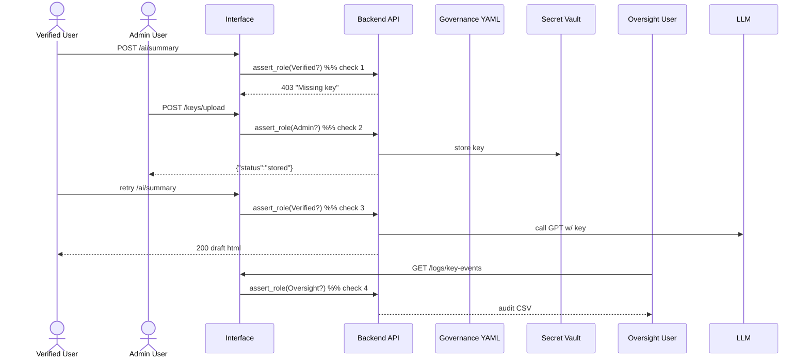

# Chapter 11: Stakeholder Access Model (Five Wristbands)

```markdown
# Chapter 11: Stakeholder Access Model (Five Wristbands)  
_file: 11_stakeholder_access_model__five_wristbands_.md_

[← Back to Chapter 10: Component Agent](10_component_agent_.md)

---

> “My screen still says *‘Unable to generate content from LLM’* but the logs
> show **someone** added a key last night.  
> Who was it, and were they even allowed?”  
> — NSF Program Officer, morning stand-up

Chapters 1-10 solved the *plumbing*—keys can be stored, rotated, approved,
broadcast, even patched into code automatically.  
What keeps the whole thing safe is **who may do each step**.  
Enter `_ref`’s **Stakeholder Access Model**—five color-coded wristbands that
lock or unlock every API, button, and CLI command in HMS.

Without this model the very fix for our **system functionality** bug
(“missing API keys”) would create a bigger one: anyone could upload a random key
or drain the budget. With wristbands in place, NSF gets the keys *and* keeps
control.

---

## 1. Motivation — The “Who Pressed Upload?” Moment

Target flow, condensed:

1. Analyst (`Verified`) clicks **Generate Research Summary** → system says *No key*.  
2. Security Engineer (`Admin`) uploads `openai_primary` key.  
3. Oversight Auditor (`Oversight`) later reviews the upload.  
4. Analysts may now generate summaries; public users still cannot.

Each step is just an HTTP call ⟷ wristband check. No check → **403** → bug persists.

---

## 2. The Five Wristbands at a Glance

| Wristband  | Typical NSF Actors                        | Key Powers for Our Use Case               |
|------------|-------------------------------------------|-------------------------------------------|
| Public     | Anonymous site visitors                   | See docs **only** (`/status`, `/docs`)    |
| Registered | Interns, vendors testing sandbox          | Hit non-sensitive endpoints (`/status/ai`)|
| Verified   | NSF research staff, program officers      | Call LLM summary endpoint **once keys exist** |
| Admin      | Security engineers, DevOps maintainers    | Upload / rotate keys, manage quotas       |
| Oversight  | Inspector General, GAO auditors           | Read-only access to logs & keys metadata  |

Roles live as a simple string in every JWT: `role: "Verified"` etc.

---

## 3. How to Use the Wristbands (NSF-Focused Demo)

### 3.1 YAML Rule (Governance Layer)

```yaml
# governance/roles.yaml
roles:
  Public:      []
  Registered:  []
  Verified:    ["ai:invoke-summary"]
  Admin:       ["ai:invoke-summary", "ai:key:write"]
  Oversight:   ["ai:read-logs"]
```

### 3.2 One-Line Guard (Interface Layer, 9 lines)

```python
# interface/security.py
ORDER = ["Public","Registered","Verified","Admin","Oversight"]

def assert_role(user, need):
    """
    Blocks if user.role ranks below required 'need'.
    """
    if ORDER.index(user.role) < ORDER.index(need):
        raise PermissionError(f"{user.role} < {need}")
```

### 3.3 Example Endpoints (< 20 lines each)

```python
# interface/routes.py
@post("/ai/summary")
def generate(user, prompt):
    assert_role(user, "Verified")
    return llm.ask(prompt, user_id=user.id)

@post("/keys/upload")
def upload_key(user, provider, cipher):
    assert_role(user, "Admin")      # ONLY Admin uploads
    vault.put(provider, cipher)
    return {"status":"stored"}
```

Inputs & outputs speak directly to our bug:

* ✅ Analysts (Verified) can ask the LLM **only after** an Admin uploads a key.  
* ❌ Anyone else is blocked with `403 PermissionError`.

---

## 4. Internal Flow During the Use Case



Every arrow marked “check” is one call to `assert_role()` using the wristbands.

---

## 5. Tiny Token Issuer (Management Layer, 14 lines)

```python
# management/issue_token.py
import jwt, yaml, datetime as dt

ROLES = yaml.safe_load(open("governance/roles.yaml"))["roles"]

def issue(user_id, role):
    assert role in ROLES, "Unknown wristband"
    claims = {
        "sub":  user_id,
        "role": role,
        "exp":  dt.datetime.utcnow() + dt.timedelta(hours=8)
    }
    return jwt.encode(claims, "hms-secret", algorithm="HS256")
```

Attach this JWT in the `Authorization: Bearer …` header and every HMS component
knows the caller’s wristband.

---

## 6. Touch-Points with Other HMS Components

Component | How Wristbands Interact with It
----------|---------------------------------
[Human-in-the-Loop](02_human_in_the_loop_hitl_decision_maker_engagement_.md) | HITL UI shows or hides approval buttons based on `Admin` vs `Oversight`.
[Backend API (“Heart”)](05_backend_api_heart_communication_hub_.md) | Stores the role claim alongside each `KeyActivated` event.
[Real-Time Sync](06_real_time_synchronization_event_broadcast_.md) | Bus tags every envelope with `role`; low roles can’t subscribe to high-risk channels.
[AI Governance Framework](09_ai_governance_framework_.md) | AIGF rules enforce that only `Verified` and above may trigger paid LLM calls.
[Zero-Trust Security Model](12_zero_trust_security_model_.md) | Uses the same role claim as an input to deeper network & token checks.

---

## 7. Analogy Corner 🎡

Think of NSF’s HMS as a **science-fair venue**:

* Visitors (Public) wander halls.  
* Badge-holders (Registered) attend talks.  
* Speakers (Verified) access the podium.  
* Organisers (Admin) hold the master keys.  
* Judges (Oversight) can enter any room but may not touch exhibits.

Colored wristbands—fast, intuitive, and instantly visible.

---

## 8. Recap & Transition

The **Stakeholder Access Model** puts just enough fence around every action:

* Analysts can finally use the newly stored OpenAI key.  
* Only authorised staff can upload or rotate keys.  
* Auditors get read-only transparency—all enforced with a 9-line helper.

With roles nailed down we can harden the perimeter even further.  
Next, we extend these wristbands into a **Zero-Trust Security Model** that
validates *every* packet, even inside the firewall.

[Continue to Chapter 12: Zero-Trust Security Model](12_zero_trust_security_model_.md)
```

---

Generated by [AI Codebase Knowledge Builder](https://github.com/The-Pocket/Tutorial-Codebase-Knowledge)