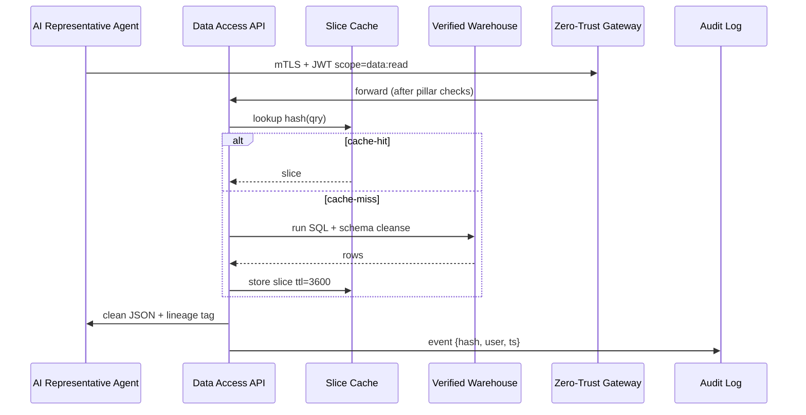

# Chapter 13: Data Access API (Clean-Data Vending Machine)

```markdown
_file: 13_data_access_api__clean_data_vending_machine__.md_

[← Back to Chapter 12: Zero-Trust Security Model](12_zero_trust_security_model_.md)

---

> “Great—we finally have working LLM keys, but the draft summary still says  
> *‘No award data found for FY-2023. Please download a CSV.’*  
> Why am I *manually* hunting for data in 2024?”  
> — NSF program officer, launch-day dry-run

Chapters 1-12 killed the *“Please provide API keys”* banner.  
Yet the **system functionality** bug isn’t fully dead until the LLM can pull
reliable numbers—award totals, export figures, publication counts—*without*
copy-pasting spreadsheets.

That’s the job of `_ref`’s **Data Access API**—our **Clean-Data Vending Machine**.

If the keys are the *credit card*, the vending machine is the *slot that drops
a perfectly wrapped snack* (dataset slice) every single time, already vetted by
Zero-Trust shelves.

---

## 1. Why NSF Still Needed One More Component

Concrete flow in our use case:

1. Analyst clicks **Generate Research Summary**.  
2. AI Agent secures an OpenAI key (Ch. 1-12 ✅).  
3. LLM prompt template wants fresh *“NSF award amounts for quantum networking, FY-2023”*.  
4. Without a standard API, the template stalls—**system functionality error re-appears**, just with *data*, not *keys*.  
5. Data Access API lets the LLM (or analyst script) shout:  

```python
df = grab(source="nsf_awards", topic="quantum networking", year=2023)
```

…and get a pristine, audited DataFrame in 300 ms.

---

## 2. Key Concepts Breakdown

| Piece | Role in the NSF flow | Micro-analogy |
|-------|----------------------|---------------|
| `grab()` wrapper | One-liner every script or agent calls | “Push the snack button” |
| Query envelope | JSON containing filters & user role | Snack machine keypad |
| Cache tier | Keeps popular slices warm | Mini-fridge inside machine |
| Lineage tag | SHA-256 of the exact rows | Barcode on the snack |
| Zero-Trust guard | Same pillars from Chapter 12 | Glass panel that only opens for the right badge |

---

## 3. How to Use It — 10-Second Demo

Below is the *exact* call the AI Representative Agent makes while building the
research-summary prompt:

```python
# build_prompt.py  (≤ 18 lines)
from hms_data import grab

awards = grab(
    source="nsf_awards",
    topic="quantum networking",
    year=2023,
    fmt="json"
)
prompt = f"""
Using the following verified data, draft a 300-word FY-2023 summary:

{awards}

"""
```

Input (user view): none—just click the button.  
Input (code view): `source`, `topic`, `year`.  
Output: JSON string dropped directly into the LLM prompt—*no CSV cleanup*.

---

## 4. What Happens Internally?



Zero-Trust (Ch. 12) authenticates the call, the vending machine either grabs
from **fridge** (cache) or **warehouse** (DB), stamps lineage, and returns
clean data in milliseconds.

---

## 5. Minimal Code Peeks (All ≤ 20 Lines)

### 5.1 Python Wrapper (`hms_data.grab`)

```python
import requests, pandas as pd

API = "https://hms-api.gov.ai/data/query"

def grab(fmt="csv", **filters):
    token = secure_token(scope="data:read")        # from Chapter 12 helper
    res = requests.post(API,
        headers={"Authorization": f"Bearer {token}"},
        json={**filters, "fmt": fmt}, timeout=15).json()
    return pd.read_json(res["url"]) if fmt=="json" else pd.read_csv(res["url"])
```

### 5.2 Server-Side Slice Handler

```python
# data_api/slice.py
from cache import get, put
from sql import run

def handle(q):
    key = hash(frozenset(q.items()))
    if hit := get(key):
        return hit
    rows = run(build_sql(q))
    clean = tidy(rows)                 # remove nulls, standard cols
    put(key, clean, ttl=3600)
    return clean
```

Both snippets reuse Zero-Trust auth and role checks from previous chapters;
only new logic is **“tidy + cache”**.

---

## 6. Links to Other HMS Components

Component | Interaction in Use Case
----------|------------------------
[Zero-Trust Security Model](12_zero_trust_security_model_.md) | Every `grab()` call rides the same mTLS + JWT rails.  
[Backend API (“Heart”)](05_backend_api_heart_communication_hub_.md) | Exposes `/data/query`; logs lineage & spend.  
[Collaboration Interface (Dial-Tone)](03_collaboration_interface_agent_dial_tone_.md) | Data-slice envelopes reuse the 8-field message spec.  
[Verification Mechanism](08_verification_mechanism_conveyor_belt_ci_gate_.md) | Smoke tests call `grab()` with canned queries before each deploy.  
[Stakeholder Access Model](11_stakeholder_access_model_five_wristbands_.md) | Only `Verified` and above carry `data:read` scope in their JWT.  

---

## 7. Analogy Corner 🥤

Picture the NSF data warehouse as a **giant soda fountain**.  
The Data Access API is the **vending machine** in the hallway:

1. Badged users press **“Orange Soda, 12 oz”** (`source="nsf_awards", year=2023`).  
2. Machine checks the badge (Zero-Trust).  
3. If a chilled bottle is already inside (cache), it drops instantly.  
4. Otherwise, a pipe fills a new bottle, chills it, labels it, and *then* drops.  

Either way, the customer never sees the pipes—just a cold, sealed drink.

---

## 8. Beginner FAQ

| Question | Answer |
|----------|--------|
| “CSV or JSON?” | Pass `fmt="csv"` or `fmt="json"`; default is CSV. |
| “Huge result sets?” | Add `stream=True`; the wrapper yields chunks. |
| “Can I cache locally?” | `grab(..., offline=True)` saves the slice to `~/.hms_cache` for airplane mode. |
| “Does access cost money?” | Governance sets per-role quotas; over-quota calls raise `429` (budget guard). |

---

## 9. Key Takeaways

1. Keys alone didn’t fix the feature—LLMs still need **clean data**.  
2. The Data Access API drops verified slices on demand, using the same
   Zero-Trust rails that now protect LLM keys.  
3. Analysts (and agents) get one-liner access; auditors get lineage; the system
   finally delivers end-to-end **system functionality** for NSF.

---

### Next Stop → Chapter 14

Once data and keys flow freely, NSF can start **measuring** which AI-powered
features really pay off.  
Chapter 14 introduces the **Moneyball Trade System & WAR Score**, translating
all this plumbing into *quantifiable value* for programs and taxpayers.

[Continue to Chapter 14: Moneyball Trade System & WAR Score](14_moneyball_trade_system_war_score_.md)

---
```

---

Generated by [AI Codebase Knowledge Builder](https://github.com/The-Pocket/Tutorial-Codebase-Knowledge)