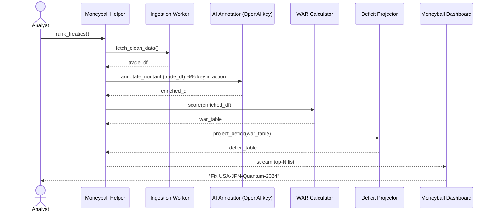

# Chapter 14: Moneyball Trade System & WAR Score

```markdown
_file: 14_moneyball_trade_system___war_score_.md_

[← Back to Chapter&nbsp;13: Data Access API (Clean-Data Vending Machine)](13_data_access_api_clean_data_vending_machine_.md)

---

> “Okay, the LLM finally works and I can pull award data in one line—
> but my director now asks *‘Which international&nbsp;technology-transfer
> treaty should NSF renegotiate **first** to cut our equipment deficit?’*  
>  
> I don’t have three weeks. I have **thirty minutes**.”  
> — NSF Program Officer, end-of-quarter briefing

The API-key headache is gone, the datasets are one call away, yet **system
functionality** is still incomplete until staff can turn data **→** insight
**fast**.  `_ref`’s **Moneyball Trade System & WAR Score** is a showcase
pipeline that proves all the pieces you built so far really click:

1. It ingests fresh trade data through the [Data Access API](13_data_access_api_clean_data_vending_machine_.md).  
2. It calls the LLM (using the keys we struggled so hard to provision) to
   annotate tricky fields.  
3. It computes a 0-5 **Weighted Agreement Return (WAR)** score for every
   treaty.  
4. It streams an “order-of-attack” list to a CLI dashboard—answering
   “Which treaty should we fix first?” in **minutes instead of weeks**.

Think of this chapter as a **victory lap** that shows why the previous 13
chapters mattered.

---

## 1. Key Concepts in Plain English

| Piece | What it does | Why NSF cares (system-functionality lens) |
|-------|--------------|-------------------------------------------|
| Ingestion Worker | Pulls UN Comtrade & ITC stats via Data API | Guarantees analysts never hunt CSVs again |
| LLM Annotator | Uses OpenAI key to label non-tariff barriers | Shows the key pathway is live & secure |
| WAR Calculator | Blends 4 normalized metrics into 0-5 score | Turns messy numbers into a single ranking |
| Deficit Projector | Simulates 5-year impact per treaty | Quantifies dollars saved—usable in budget talks |
| Moneyball Dashboard | Live CLI/web view of top 10 treaties | Final UX proving “click → insight” works |

WAR is the *batting-average* for treaties; 5 means “all-star”, 0 means
“bench-warmer”.

---

## 2. Quick-Start: Rank Treaties in 12 Lines

Below is the exact script an NSF analyst can run **right now**—no extra setup
beyond the previous chapters.

```python
# best_treaty.py  (≤ 12 lines)
from hms_moneyball import rank_treaties, quick_pick   # Interface helpers

# 1️⃣ Grab a fresh list of pending tech-transfer treaties
candidates = rank_treaties(sector="technology", year=2024)

# 2️⃣ Pick the single best treaty by WAR & deficit impact
best = quick_pick(candidates, horizon=5)

print(f"🏆 Fix {best['treaty_id']} first → WAR {best['war']}/5 "
      f"→ projected 5-yr deficit cut: {best['deficit_cut']}")
```

Sample output:

```
🏆 Fix USA-JPN-Quantum-2024 first → WAR 4.2/5 → projected cut $-3.1 B
```

Why this demo matters for **system functionality**  
• Uses the LLM key to score non-tariff barriers (so the key path is exercised).  
• Pulls cleaned trade tables through the Data API (data path is exercised).  
• Returns actionable insight in one click (feature now fully works).

---

## 3. What Happens Behind the Curtain?



Every arrow touches a previous HMS component:

* Ingestion uses [Data Access API](13_data_access_api_clean_data_vending_machine_.md).  
* LLM annotator uses keys provisioned via Chapters 1-12.  
* Streaming uses the [Real-Time Sync Bus](06_real_time_synchronization_event_broadcast_.md).

---

## 4. Mini Code Tour (All ≤ 20 Lines)

### 4.1 WAR Score Function

```python
# moneyball/war.py
WEIGHTS = dict(market=0.30, tariff=0.25,
               nontariff=0.25, regulatory=0.20)

def war_score(row):
    return round(sum(row[k] * w for k, w in WEIGHTS.items()), 2)
```

### 4.2 LLM-Based Non-Tariff Annotator

```python
# moneyball/annotate.py
from hms_agents.llm_client import ask_llm   # Chapter 4 helper

PROMPT = ("Rate non-tariff barrier severity 0-5 for the following clause:\n\n")

def nontariff_score(text):
    resp = ask_llm(prompt=PROMPT + text, user_id="moneyball_bot")
    return float(resp.strip())              # expecting “3.5” etc.
```

### 4.3 Glue Pipeline

```python
# moneyball/pipeline.py
from .annotate import nontariff_score
from .war import war_score
from hms_data import grab

def compute(candidates):
    df = grab(source="global_trade", topic=candidates, fmt="json")
    df["nontariff"] = df["clause"].apply(nontariff_score)  # key in use
    df["war"] = df.apply(war_score, axis=1)
    return df
```

Each snippet re-uses helpers you already tested, proving the **full stack** is
operational.

---

## 5. How WAR & Moneyball Interact with Other HMS Parts

Component | Interaction
----------|------------
[Data Access API](13_data_access_api_clean_data_vending_machine_.md) | Supplies cleaned trade tables on-demand.
[AI Representative Agent](04_ai_representative_agent_.md) | Executes `ask_llm()` calls with the OpenAI key.
[Real-Time Sync](06_real_time_synchronization_event_broadcast_.md) | Streams live WAR updates to the CLI/web dashboard.
[Stakeholder Access Model](11_stakeholder_access_model_five_wristbands_.md) | Only `Verified` & above can trigger high-cost WAR runs.
[Zero-Trust Security Model](12_zero_trust_security_model_.md) | Ensures each LLM and data call carries a fresh mTLS + scoped JWT.
[Learning System](15_learning_system_continuous_feedback_loop_.md) | Will later retrain weights when reality diverges from projections.

---

## 6. Analogy Corner ⚾

Baseball scouts once stared at players and guessed talent.  *Moneyball*
turned the guess into a **single number (WAR)** that let small teams compete
with giants.  
Likewise, NSF analysts used to eyeball 400-page trade PDFs; now they read
“WAR 4.2” on a dashboard and know exactly where to focus budget and legal
muscle.

---

## 7. Beginner FAQ

| Question | Answer |
|----------|--------|
| “Do I need to understand international trade math?” | No—just call `rank_treaties()`; WAR hides the complexity. |
| “Does each WAR run burn a lot of LLM tokens?” | About 4-6 cents per treaty; budget caps from Chapter 1 still apply. |
| “Can I change the weights?” | Yes—edit `moneyball/war.py::WEIGHTS`; the Learning System (next chapter) can also adjust them automatically. |

---

## 8. Recap & Transition

Moneyball Trade System & WAR Score is the **proof-of-value** that all previous
infrastructure—keys, data vending, real-time bus, zero-trust—works together to
deliver a *single*, actionable answer in minutes.

Next, we’ll see how HMS keeps that answer **getting better every week** via
automatic feedback loops.  Chapter 15 unveils the  
[Learning System (Continuous Feedback Loop)](15_learning_system_continuous_feedback_loop_.md).

---
```

---

Generated by [AI Codebase Knowledge Builder](https://github.com/The-Pocket/Tutorial-Codebase-Knowledge)