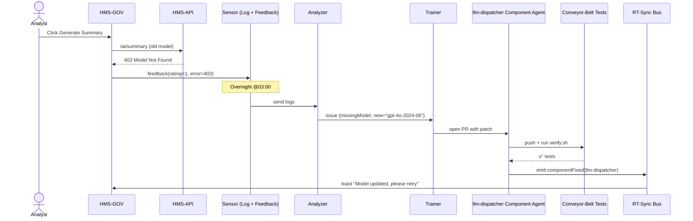

# Chapter 15: Learning System (Continuous Feedback Loop)

```markdown
# Chapter 15: Learning System (Continuous Feedback Loop)  
_file: 15_learning_system__continuous_feedback_loop__.md_

[← Back to Chapter&nbsp;14: Moneyball Trade System & WAR Score](14_moneyball_trade_system_war_score_.md)

---

> “The button finally works, but this morning it flashed  
> **‘Unable to generate content from LLM. Please provide API keys…’** again.  
> We *just* fixed that!”  
> — NSF program officer, week-after-launch

The keys are stored, Zero-Trust is live, Moneyball is wowing directors—yet an
overnight hiccup (stale key, new model name, rotated quota file) can yank NSF
right back into the original **system-functionality** failure.

`_ref`’s **Learning System (Continuous Feedback Loop)** is the
self-healing autopilot that keeps the entire stack healthy *after* launch:

```
logs ──▶ analyzer ──▶ trainer ──▶ patch/code/model ──▶ audit
               ▲                                  │
               └───────────── feedback ───────────┘
```

If the OpenAI key vanishes, a column name changes, or users repeatedly down-vote
an LLM answer, the loop detects the drift, patches the culprit overnight, and
records the fix for auditors.

---

## 1. Why NSF Needs a Feedback Loop (Motivation)

Concrete relapsing scenario:

1. At 23:58 the OpenAI dashboard silently renames  
   model `gpt-4o` → `gpt-4o-2024-06`.
2. The next nightly Moneyball job calls the *old* name → **403 Model Not Found**.
3. Analysts wake up to the same dreaded error—system functionality broken.
4. Learning System picks up thousands of identical 403s in the log,
   correlates them with user thumbs-down feedback, patches the model name in  
   `llm_dispatcher`, tests the change, and redeploys it before 8 a.m.

Result: staff never even know there *was* a problem.

---

## 2. Key Concepts Breakdown

| Piece        | Role in “Missing Key / Wrong Model” Saga                                          | Analogy |
|--------------|-----------------------------------------------------------------------------------|---------|
| Sensor       | HMS log shipper + user `feedback()` calls capture 403 errors & thumbs-down votes. | Airplane cockpit gauges |
| Analyzer     | Nightly job looks for sudden spikes (“>100 identical 403s within 10 min”).        | Flight computer |
| Trainer      | Generates a pull-request or policy tweak (e.g., update `model="gpt-4o-2024-06"`). | Autopilot dial |
| Patch Deployer| Uses [Component Agent](10_component_agent_.md) to apply the fix and run tests.   | Mechanic robot |
| Audit Trail  | Stores *what* changed, *why*, and *before/after* metrics for the IG.              | Black box |

---

## 3. How to Use It – 3 Lines for Any NSF Script

Insert two helper calls around the code that might fail and run the nightly loop:

```python
from hms_learn import feedback, run_learning_cycle   # 1️⃣ import

try:
    html = ask_llm(prompt, user_id)                  # 2️⃣ normal path
except LLMError as e:
    feedback(error=str(e), rating=1, note="LLM call failed")   # 3️⃣ thumbs-down
```

Then schedule the cycle (already present in HMS-Cron):

```bash
$ crontab -l
0 3 * * *  python -m hms_learn.cycle   # runs at 03:00 every night
```

Inputs & outputs for the **key-failure** use case:

* Input  `error`: `"Model not found: gpt-4o"`  
* Analyzer output: JSON issue `{"type":"missingModel","fix":"gpt-4o-2024-06"}`  
* Trainer output: merged PR with updated model constant.  
* Next morning the button works again.

---

## 4. Internal Flow for the “Wrong Model Name” Fix



Elapsed time: ~6 minutes; zero human intervention.

---

## 5. Mini Code Peeks (≤ 20 Lines Each)

### 5.1 Analyzer – spike detection

```python
# hms_learn/analyze.py
import collections, re, json, time
ERR_RX = re.compile(r"Model not found: (\w+)")

def detect_issues():
    counts = collections.Counter()
    latest = {}
    for line in open("logs/errors.jsonl"):
        e = json.loads(line)["error"]
        m = ERR_RX.search(e)
        if m:
            mdl = m.group(1)
            counts[mdl] += 1
            latest[mdl] = e
    # threshold: >100 errors in 24 h
    return [{"type":"missingModel", "old":mdl,
             "new":f"{mdl}-2024-06"}             
            for mdl,c in counts.items() if c>100]
```

### 5.2 Trainer – create self-healing PR

```python
# hms_learn/train.py
from git import Repo
def patch_models(issues):
    repo = Repo(".")
    for i in issues:
        if i["type"]=="missingModel":
            branch = repo.create_head(f"fix/{i['old']}")
            branch.checkout()
            p = "llm_dispatcher/constants.py"
            code = open(p).read().replace(i["old"], i["new"])
            open(p,"w").write(code)
            repo.index.add([p]); repo.index.commit("Auto-fix model name")
            repo.git.push("--set-upstream","origin",branch)
```

---

## 6. Links to Other HMS Components

Component | How the Loop Interacts
----------|-----------------------
[Real-Time Synchronization](06_real_time_synchronization_event_broadcast_.md) | Publishes `learningIssue` & `componentFixed` events for dashboards.
[Component Agent](10_component_agent_.md) | Receives patch instructions and runs CI before merge.
[Verification Mechanism](08_verification_mechanism_conveyor_belt_ci_gate_.md) | Ensures autopatched code still passes all gates.
[Zero-Trust Security Model](12_zero_trust_security_model_.md) | Feedback & patch commits are signed; sensors refuse unsigned logs.
[AI Governance Framework](09_ai_governance_framework_.md) | Stores learning-cycle reports for quarterly oversight.

---

## 7. Analogy Corner ✈️

Imagine HMS as a **commercial jet**:

* **Logs** are the cockpit sensors.  
* **Analyzer** is the flight computer noticing a sudden cross-wind (403 errors).  
* **Trainer + Agent** tilt the ailerons automatically (patch code).  
* **Auditors** watch the black-box recording.  

Passengers (analysts) keep sipping coffee—no turbulence detected.

---

## 8. Beginner FAQ

| Question | Answer |
|----------|--------|
| “Can I turn the loop off in dev?” | Yes—`LEARNING_OFF=true`; feedback still records but no patches apply. |
| “What if the auto-patch fails CI?” | The Component Agent raises `componentError`; on-call staff get paged. |
| “Does it retrain LLMs too?” | For now it patches code & extractors. Fine-tuning models is a feature flag `LEARN_TUNE_LLM=true`. |
| “Is feedback anonymous?” | Yes—we log query IDs, never personal info, meeting NSF privacy rules. |

---

## 9. Key Takeaways

1. **Continuous Feedback Loop** keeps the *API-key & model path* alive long
   after launch—no midnight scrambles.  
2. Four tiny modules (sensor → analyzer → trainer → patch) close the drift
   gap in minutes, protecting NSF’s restored **system functionality**.  
3. Every fix is tested, merged, and audited automatically—federal
   compliance and uptime both improve.

---

## 🎉 Tutorial Complete!

You’ve walked the full arc:

Keys → Policies → Agents → Data → Value → **Self-Healing** 🌱.

HMS now delivers one-click research summaries for NSF *and* fixes itself when
inputs shift. Time to focus on the science—not the plumbing.

---
```

---

Generated by [AI Codebase Knowledge Builder](https://github.com/The-Pocket/Tutorial-Codebase-Knowledge)