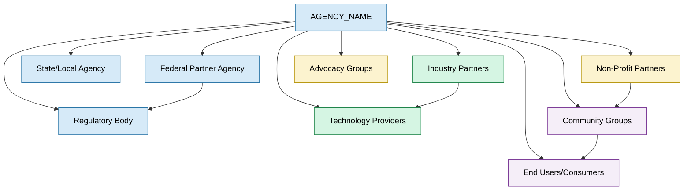
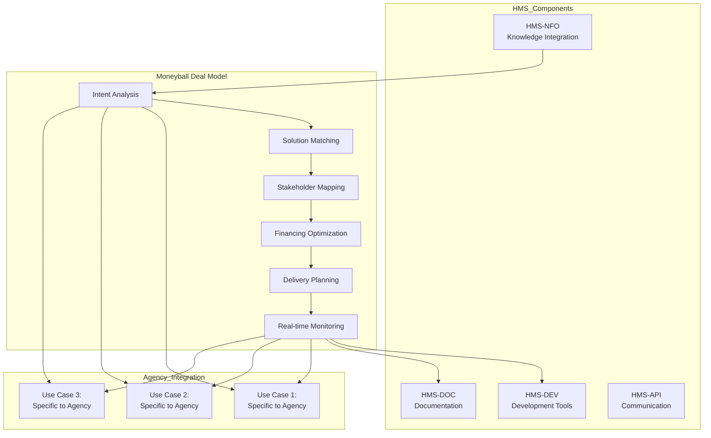
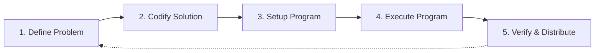

# Moneyball Deal Model: Agency Implementation Template

This template provides a standardized structure for implementing the Moneyball Deal Model within agency documentation. Insert this section into each agency's `04_use_cases.md` file as a new use case.

## Use Case: Cross-Boundary Value Optimization using Moneyball Deal Model

### Problem Statement

[AGENCY_NAME] faces complex challenges that span organizational boundaries and involve multiple stakeholders with diverse interests. Traditional approaches to interagency collaboration and resource allocation often encounter:

- Siloed information and decision-making processes
- Misaligned incentives between stakeholders
- Difficulty quantifying value across different dimensions
- Complex interdependencies creating coordination challenges
- Resource constraints requiring optimal allocation

These challenges prevent [AGENCY_NAME] from fully realizing potential value from collaborations and partnerships across government, private sector, and community stakeholders.

### Stakeholder Analysis



The Moneyball Deal Model specifically addresses the needs of these stakeholders by:

1. **Government Entities**: Maximizing mission fulfillment while optimizing resource allocation and demonstrating value
2. **Private Sector**: Creating clear value propositions with quantifiable returns and risk mitigation
3. **NGOs**: Aligning partnership activities with mission objectives and measuring social impact
4. **Civilian Groups**: Ensuring direct benefits while providing transparent accountability mechanisms

### Value Opportunity Assessment

The Moneyball Deal Model creates value through optimized deal structures that quantify and distribute value across multiple dimensions:

| Value Dimension | Current State | Potential with Moneyball Deal Model | Metric |
|----------------|--------------|-----------------------------------|--------|
| Economic Value | Ad-hoc economic arrangements with unclear ROI | Optimized value distribution with clear economic returns | Deal Value Function (DVF) score |
| Social Impact | Difficult to measure or attribute | Quantified and verified social outcomes | Social Value Units (SVUs) |
| Operational Efficiency | Duplicate efforts across stakeholders | Streamlined processes with shared infrastructure | Process time reduction (%) |
| Risk Reduction | Unquantified and unevenly distributed | Measured and fairly allocated risk | Risk-adjusted value (RAV) |
| Innovation Potential | Limited cross-boundary innovation | Accelerated cross-sector innovation | Innovation Index |

### HMS Solution: Moneyball Deal Model Implementation

[AGENCY_NAME] will implement the Moneyball Deal Model through an integrated HMS component architecture:



#### Implementation Steps

1. **Intent Identification**
   - Document [AGENCY_NAME]'s specific challenges and opportunities
   - Define value dimensions relevant to agency mission
   - Map stakeholder landscape and relationship network

2. **Solution Matching**
   - Develop agency-specific solution database
   - Implement neural network-based solution matching
   - Create weighted scoring system for agency priorities

3. **Stakeholder Mapping**
   - Document stakeholder capabilities and resources
   - Define value preferences for each stakeholder type
   - Implement win-win calculation framework with agency-specific parameters

4. **Financing Optimization**
   - Define financing mechanisms available to [AGENCY_NAME]
   - Implement optimization algorithms for resource allocation
   - Develop risk-sharing models appropriate for public sector context

5. **Delivery Planning**
   - Create responsibility matrix templates for agency context
   - Define verification and validation mechanisms
   - Implement expertise allocation algorithms

6. **Real-time Monitoring**
   - Define key metrics for [AGENCY_NAME] deals
   - Implement dashboard for agency leadership
   - Create alert system for deal performance issues

#### Deal Execution Framework

The Moneyball Deal Model follows a structured 5-step process:



Each step is supported by HMS components and agency-specific customizations:

1. **Define Problem**: HMS-NFO provides contextual knowledge to accurately define agency challenges
2. **Codify Solution**: Neural network matching identifies optimal solutions based on agency constraints
3. **Setup Program**: Win-win calculation framework ensures all stakeholders receive positive value
4. **Execute Program**: Integration with agency operational systems enables efficient implementation
5. **Verify & Distribute**: Real-time monitoring tracks performance and distributes value

### Expected Outcomes

The implementation of the Moneyball Deal Model within [AGENCY_NAME] will deliver:

1. **Quantified Value Creation**
   - 15-30% increase in total value created through optimized deal structures
   - Value distribution across stakeholders that ensures sustainable participation
   - Transparent measurement of cross-boundary value creation

2. **Enhanced Collaboration**
   - Structured framework for multi-stakeholder collaboration
   - Common value language across government, private, and non-profit sectors
   - Reduction in coordination failures and transaction costs

3. **Improved Resource Allocation**
   - Data-driven optimization of resource deployment
   - Reduction in duplicative efforts across organizational boundaries
   - Higher return on taxpayer resources through multiplier effects

4. **Accelerated Innovation**
   - Cross-pollination of ideas across traditional boundaries
   - Incentive structures that reward collaborative innovation
   - Rapid scaling of successful models through deal replication

### Chain of Recursive Thoughts (CoRT) Analysis

The Moneyball Deal Model implementation for [AGENCY_NAME] requires careful consideration from multiple perspectives:

1. **Value Definition Perspective**
   - How should [AGENCY_NAME] define and measure value in its specific context?
   - What weight should be given to economic versus social or mission-driven outcomes?
   - How can we ensure value metrics align with agency strategic objectives?

2. **Stakeholder Equity Perspective**
   - How do we ensure fair value distribution across stakeholders with different power levels?
   - What mechanisms can prevent unintended consequences for vulnerable stakeholders?
   - How should conflicts between stakeholder interests be resolved?

3. **Implementation Realism Perspective**
   - What organizational changes are needed to support this model?
   - How will existing processes and systems need to adapt?
   - What training and capacity building is required for successful adoption?

4. **Long-term Sustainability Perspective**
   - How will the model evolve as [AGENCY_NAME]'s priorities shift?
   - What governance structures ensure continued optimization?
   - How can institutional knowledge be maintained through personnel changes?

Through recursive analysis of these perspectives, [AGENCY_NAME] will develop a tailored implementation approach that addresses agency-specific considerations while maintaining the core mathematical integrity of the Moneyball Deal Model.

### Agency-Specific Deal Example

**Deal Name**: [EXAMPLE_DEAL_NAME]

**Intent**: [Brief description of agency-specific problem/opportunity]

**Stakeholders**:
- [AGENCY_NAME] (Primary government entity)
- [Partner 1] (Government partner)
- [Partner 2] (Private sector entity)
- [Partner 3] (Community organization)

**Value Components**:
- Economic value: [Agency-specific economic components]
- Social impact: [Agency-specific social outcomes]
- Operational efficiency: [Agency-specific process improvements]
- Risk reduction: [Agency-specific risk mitigation]

**Deal Structure**:
```
{
  "dealId": "AGENCY-001",
  "intent": "[Agency-specific intent]",
  "solution": [
    "[Solution component 1]",
    "[Solution component 2]"
  ],
  "stakeholders": [
    {
      "name": "[AGENCY_NAME]",
      "role": "[Agency role in deal]",
      "value_received": "[Quantified value for agency]" 
    },
    {
      "name": "[Partner 1]",
      "role": "[Partner 1 role in deal]",
      "value_received": "[Quantified value for Partner 1]"
    }
    // Additional stakeholders
  ],
  "verification": {
    "metrics": [
      "[Agency-specific metrics]"
    ],
    "timeline": "[Agency-specific timeline]",
    "responsible_parties": "[Agency-specific responsibilities]"
  }
}
```

This example demonstrates how the Moneyball Deal Model creates a structured, transparent framework for [AGENCY_NAME] to optimize complex multi-stakeholder collaborations while ensuring win-win outcomes for all participants.