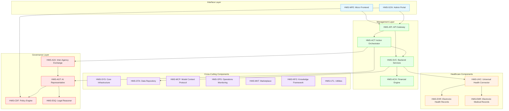
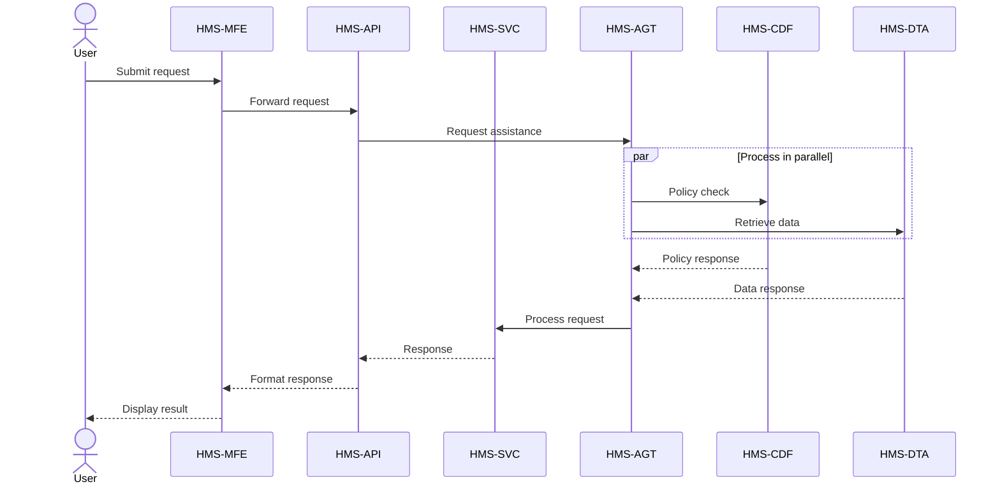
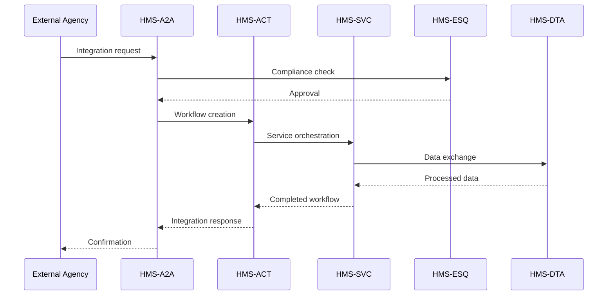
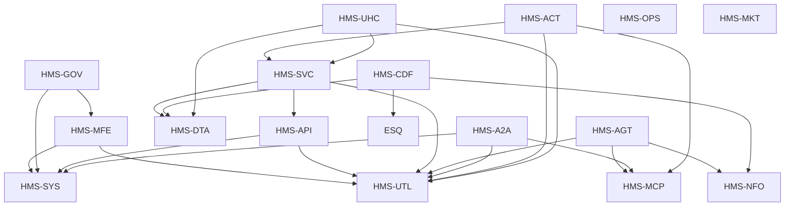

# HMS Components Overview

This document provides a comprehensive overview of the core components that make up the HMS platform, explaining their purpose, functionality, and relationships.

## Component Ecosystem

## Core Component Descriptions

### Interface Layer

| Component | Description | Primary Functionality |
|-----------|-------------|----------------------|
| **HMS-MFE** | Micro Frontend Experience | Provides modular UI components, enables consistent user experiences across agencies, and supports intent-driven navigation |
| **HMS-GOV** | Administrative Portal | Offers governance tools, admin interfaces, configuration controls, and policy management interfaces |

### Management Layer

| Component | Description | Primary Functionality |
|-----------|-------------|----------------------|
| **HMS-API** | API Gateway | Manages API routing, authentication, rate limiting, and serves as the entry point for all service requests |
| **HMS-SVC** | Backend Services | Provides core business logic, implements domain-specific functionality, and orchestrates workflows |
| **HMS-ACT** | Action Orchestrator | Coordinates agent activities, manages workflow execution, and handles complex process flows |
| **HMS-ACH** | Financial Engine | Processes financial transactions, handles payment clearance, and manages fiscal operations |

### Governance Layer

| Component | Description | Primary Functionality |
|-----------|-------------|----------------------|
| **HMS-AGT** | AI Representative Agent | Provides AI assistant capabilities, expert guidance, and intelligent interfaces for users |
| **HMS-AGX** | Agent Extensions | Extends agent capabilities with specialized skills, domain knowledge, and additional tools |
| **HMS-CDF** | Codified Democracy Foundation | Implements legislative engines, policy workflows, and democratic process modeling |
| **HMS-ESQ** | Legal Reasoning | Provides compliance checks, legal analysis, regulatory assessment, and risk evaluation |
| **HMS-A2A** | Inter-Agency Exchange | Facilitates secure agency communication, cross-agency workflows, and data sharing |

### Cross-Cutting Components

| Component | Description | Primary Functionality |
|-----------|-------------|----------------------|
| **HMS-SYS** | Core Infrastructure | Manages system infrastructure, deployment, scaling, and foundational services |
| **HMS-DTA** | Data Repository | Provides centralized data storage, knowledge management, and data governance |
| **HMS-MCP** | Model Context Protocol | Standardizes AI model interactions, provides context management, and ensures consistent model behavior |
| **HMS-OPS** | Operations Monitoring | Handles system monitoring, alerting, logging, and operational metrics |
| **HMS-MKT** | Marketplace | Provides capability discovery, component sharing, and extension distribution |
| **HMS-NFO** | Knowledge Framework | Manages domain knowledge, training data, and information retrieval services |
| **HMS-UTL** | Utilities | Provides shared utilities, common code libraries, and reusable functions |

### Healthcare Components

| Component | Description | Primary Functionality |
|-----------|-------------|----------------------|
| **HMS-UHC** | Universal Health Connector | Connects to health systems, standardizes health data, and integrates with care providers |
| **HMS-EHR** | Electronic Health Records | Manages longitudinal patient records, health history, and cross-provider information |
| **HMS-EMR** | Electronic Medical Records | Handles provider-specific medical records, clinical documentation, and treatment data |

## Component Interactions and Workflows

HMS components interact through well-defined interfaces to provide comprehensive workflows. Below are key interaction patterns:

### User Request Flow

### Agency Integration Flow

## Component Versioning

HMS components follow semantic versioning (MAJOR.MINOR.PATCH) with consistent upgrade paths and backward compatibility guarantees. Version alignment ensures compatibility across the ecosystem.

## Extension Points

Each HMS component provides extension points to customize functionality:

- **HMS-MFE**: Custom UI components, themes, and navigation flows
- **HMS-SVC**: Service plugins, custom endpoints, and business logic extensions
- **HMS-AGT**: Agent skills, specialized knowledge bases, and interaction patterns
- **HMS-CDF**: Policy templates, workflow definitions, and process models
- **HMS-A2A**: Agency connection adapters, protocol extensions, and data mappings

## Cross-Component Services

Several services span multiple components:

1. **Authentication & Authorization**: Identity management, roles, and permissions
2. **Logging & Monitoring**: Centralized logging, metrics collection, and alerting
3. **Configuration Management**: Dynamic configuration, feature flags, and settings
4. **Error Handling**: Standardized error responses, retry mechanisms, and fallbacks
5. **Data Validation**: Schema validation, data quality checks, and normalization

## Component Discovery

The HMS-MKT component provides dynamic discovery of available components and their capabilities. This enables agencies to find, evaluate, and integrate components based on their specific needs.

## Component Dependencies

This diagram illustrates the dependency relationships between components, helping with deployment planning and understanding component coupling.

## Agency-Specific Component Customizations

Different agency types may require specialized component configurations:

### Federal Agencies

Federal agencies typically use the full HMS component stack with additional security and compliance extensions for HMS-ESQ and HMS-CDF components.

### State Agencies

State agencies often focus on HMS-MFE, HMS-SVC, HMS-AGT, and HMS-UHC components with state-specific policy extensions and local integrations.

### International Health Systems

International health systems typically emphasize HMS-UHC, HMS-EHR, HMS-EMR with region-specific adaptations for language, regulatory requirements, and healthcare standards.