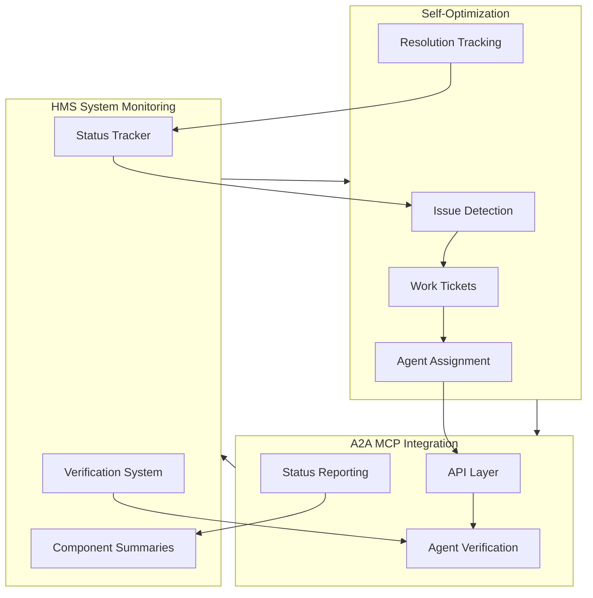

# HMS System Monitoring and Self-Optimization

This document explains how the HMS system monitoring, verification, and self-optimization processes work together to ensure the health and continuous improvement of the HMS ecosystem.

> **Related Documents:**
> - [HMS Trade System & Moneyball Dashboard](../HMS_TRADE_MONEYBALL_EXAMPLE.md)
> - [Moneyball-Buffett Approach to Trade Deficits](../MONEYBALL_BUFFETT_DEFICIT_APPROACH.md)

## System Overview

The HMS monitoring and self-optimization framework consists of several integrated components:



1. **Component Verification System**:
   - Ensures agents understand components before contributing
   - Uses repository analysis data for component-specific questions
   - Blocks unauthorized operations via pre-commit hooks

2. **Status Tracking System**:
   - Monitors component starts and test runs
   - Maintains operational status for all components
   - Generates comprehensive health reports

3. **Component Summary Generation**:
   - Creates detailed component profiles with operational status
   - Incorporates repository analysis data
   - Identifies issues and integration points

4. **Self-Optimization Workflow**:
   - Automatically detects issues
   - Creates work tickets for appropriate agents
   - Facilitates component fixes and improvements

5. **A2A MCP Integration**:
   - Provides API for agent-to-agent communication
   - Enables cross-component collaboration
   - Integrates with verification and status systems

## Key Files and Components

### Verification System
- `setup_verification.py`: Core verification system for human developers
- `repo_analysis_verifier.py`: Generates verification questions from repository analysis
- `agent_verification.py`: Handles agent verification
- `pre-commit-hook.py`: Enforces verification via Git hooks
- `mcp_verification_adapter.py`: MCP adapter for verification

### Status Tracking System
- `status_tracker.py`: Core status tracking functionality
- `component_summary_generator.py`: Generates component summaries
- `a2a_integration.py`: API for agent integration
- `batch_process_all_components.py`: Processes all components in batch
- `update_all_component_status.sh`: Master script for updating all components

### Data Directories
- `status/`: Component status data
- `summaries/`: Generated component summaries
- `work_tickets/`: Automated work tickets
- `logs/`: System logs

## How It Works

### 1. Continuous Status Monitoring

The system continuously monitors the status of all HMS components:

```
┌─────────────────┐      ┌─────────────────┐      ┌─────────────────┐
│ HMS Component   │─run→│ Status Tracker   │─log→│ Status Data      │
│                 │      │                 │      │                 │
└─────────────────┘      └─────────────────┘      └─────────────────┘
```

- Components report their start attempts and test runs
- The status tracker records success/failure and timestamps
- Status data is stored for analysis and reporting

### 2. Component Summaries

Component summaries are generated by combining status data with repository analysis:

```
┌─────────────────┐      ┌─────────────────┐      ┌─────────────────┐
│ Repository      │─data→│ Component       │─out→│ Comprehensive    │
│ Analysis Data   │      │ Summary Gen     │      │ Summaries       │
└─────────────────┘      └─────────────────┘      └─────────────────┘
       ↑                         ↑
       │                         │
┌─────────────────┐      ┌─────────────────┐
│ Git Repository  │      │ Status Data     │
│                 │      │                 │
└─────────────────┘      └─────────────────┘
```

- Repository analysis provides component structure and purpose
- Status data provides operational status and test results
- The combined data creates comprehensive component profiles

### 3. Self-Optimization Workflow

When issues are detected, the system initiates a self-optimization workflow:

```
┌─────────────────┐      ┌─────────────────┐      ┌─────────────────┐
│ Component Issue │─trig→│ Work Ticket     │─assg→│ Responsible     │
│ Detection       │      │ Generation      │      │ Agent           │
└─────────────────┘      └─────────────────┘      └─────────────────┘
                                                          │
┌─────────────────┐      ┌─────────────────┐             │
│ Updated Status  │←log─┤ Issue Resolution │←────────────┘
│                 │      │                 │
└─────────────────┘      └─────────────────┘
```

- Issues are detected during status monitoring
- Work tickets are generated with detailed information
- Tickets are assigned to the appropriate agent (HMS-DEV or component agent)
- Agents resolve issues and update the component's status

### 4. Verification System Integration

The verification system ensures agents understand components before contributing:

```
┌─────────────────┐      ┌─────────────────┐      ┌─────────────────┐
│ Agent Request   │─req→│ Verification     │←data─┤ Repository      │
│ to Modify       │      │ Check           │      │ Analysis        │
└─────────────────┘      └─────────────────┘      └─────────────────┘
                                 │
                                 │ allow/block
                                 ↓
┌─────────────────┐      ┌─────────────────┐
│ Component       │←mod─┤ Authorized       │
│ Code/Config     │      │ Modification    │
└─────────────────┘      └─────────────────┘
```

- Agents must pass verification before modifying components
- Verification uses repository analysis data for relevant questions
- Pre-commit hooks enforce verification requirements
- MCP integration enables programmatic verification

## Running the System

### Scheduled Updates

The system is designed to run as a scheduled job, updating the status of all components:

```bash
# Run a full update of all components
./docs/verification/update_all_component_status.sh

# Generate a report without simulating starts/tests
./docs/verification/update_all_component_status.sh --report-only

# Skip simulation during update
./docs/verification/update_all_component_status.sh --no-simulate
```

### Agent Participation

Agents can participate in the system via the A2A MCP integration:

```bash
# Check verification status
python3 docs/verification/a2a_integration.py --check "agent-id:HMS-API"

# Verify an agent for a component
python3 docs/verification/a2a_integration.py --verify "agent-id:HMS-API"

# Get component status
python3 docs/verification/a2a_integration.py --status HMS-API

# Get work tickets assigned to an agent
python3 docs/verification/a2a_integration.py --tickets "HMS-DEV-AGENT"
```

### Processing Specific Components

You can also process specific components individually:

```bash
# Process a specific component
python3 docs/verification/batch_process_all_components.py --component HMS-API

# List all available components
python3 docs/verification/batch_process_all_components.py --list

# Generate a health report
python3 docs/verification/status_tracker.py health --save
```

## Integration with HMS Ecosystem

The monitoring and self-optimization system integrates with several HMS components:

- **HMS-DEV**: Receives status updates and work tickets
- **HMS-A2A**: Enables agent-to-agent communication about status
- **HMS-MCP**: Provides protocol for agent interaction
- **HMS-DOC**: Receives documentation updates based on status

## Example: Self-Healing Workflow

Here's how the system handles a component failure:

1. HMS-API fails to start due to a missing environment variable
2. Status tracker detects the failure and records it
3. A work ticket is automatically generated for HMS-DEV
4. HMS-DEV agent receives notification via MCP
5. HMS-DEV agent analyzes the issue and sets the missing variable
6. HMS-API starts successfully on the next attempt
7. Status tracker records the successful start
8. Component summary is updated with the resolution

## Best Practices

1. **Regular Updates**:
   - Run `update_all_component_status.sh` daily
   - Include it in CI/CD pipelines

2. **Work Ticket Management**:
   - Agents should update tickets when working on issues
   - Close tickets when issues are resolved

3. **Verification**:
   - All agents should verify themselves before modifying components
   - Use A2A MCP integration for programmatic verification

4. **Status Monitoring**:
   - Monitor the system health report for trends
   - Address degraded components promptly

## Customization

The system can be customized in several ways:

1. **Component Detection**:
   - Modify `get_available_components()` to detect additional components

2. **Status Criteria**:
   - Adjust operational status calculations in `update_operational_status()`

3. **Work Assignment**:
   - Customize `determine_responsible_agent()` to match your organization

4. **Integration**:
   - Modify `a2a_integration.py` to integrate with your MCP implementation

## Conclusion

The HMS System Monitoring and Self-Optimization framework provides a comprehensive solution for tracking component status, generating detailed summaries, and enabling self-healing through automated work tickets. By integrating with the verification system and A2A MCP, it ensures that all components in the HMS ecosystem remain operational and continuously improve.