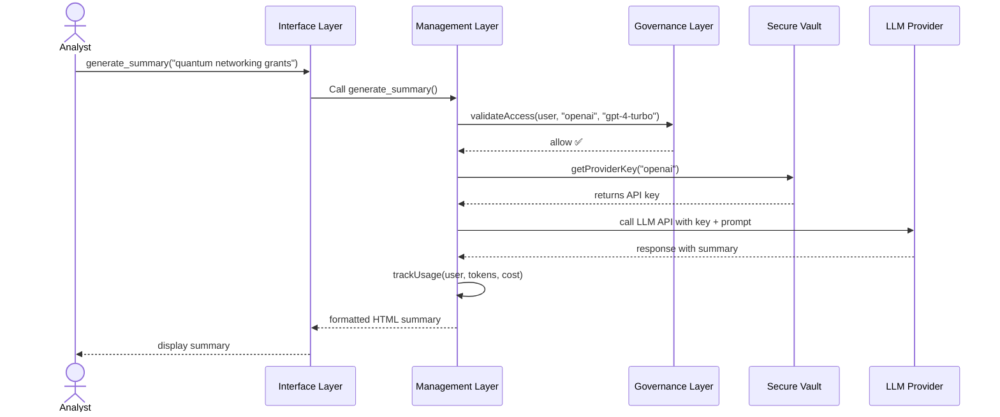
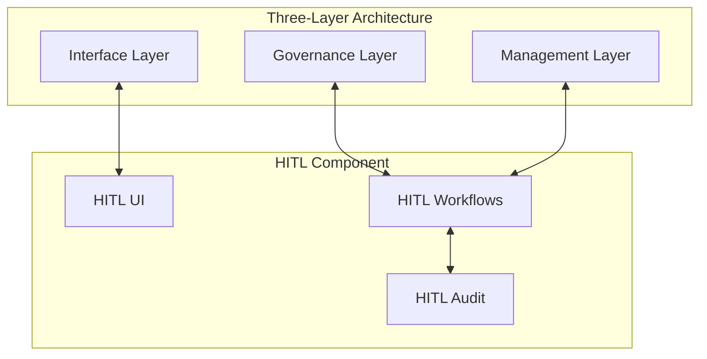

# Chapter 1: System Architecture - The Three-Layer Framework

> "Why can't I just click **'Generate Research Summary'**?"
>
> — NSF program officer, day 1 of pilot

## 1. Introduction: The Challenge of Modern System Design

Imagine this scene: A National Science Foundation (NSF) researcher needs to quickly summarize recent publications on quantum networking grants. They log into the system and click the "Generate Research Summary" button, but instead of getting their summary, they see an error:

```
Unable to generate content from LLM.
Please provide API keys for Anthropic Claude, OpenAI GPT, or Google Gemini models.
```

This seemingly simple error illustrates a fundamental challenge in modern system architecture: balancing user experience, security requirements, and operational efficiency. The researcher doesn't care about API keys—they just want their summary. Yet the system needs secure API key management that complies with federal regulations while maintaining a smooth user experience.

The Three-Layer Architecture pattern resolves this tension by clearly separating concerns:

```
Governance  →  Management  →  Interface
 City Hall      Public Works     Service Desk
```

This chapter introduces the Three-Layer Architecture and demonstrates how implementing it creates robust, secure, and user-friendly systems. By the end, you'll understand how this pattern can transform your own system designs.

## 2. Key Concepts: Understanding the Three Layers

### The Three Layers Explained

The Three-Layer Architecture separates system responsibilities into distinct layers, each with its own clear purpose:

| Layer        | Responsibility                              | Real-World Analogy       |
|--------------|---------------------------------------------|--------------------------|
| Governance   | Policy, rules, and compliance               | City Hall writing laws    |
| Management   | Operation, execution, and resource handling | Public Works running utilities |
| Interface    | User interaction and experience             | Service Desk helping citizens |

#### Governance Layer

The Governance layer defines the rules, policies, and boundaries of the system. It answers questions like:

* Who is allowed to use which services?
* What are the spending limits for each group?
* What security policies must be enforced?
* How should critical resources be audited?

In our NSF example, the Governance layer stores rules about which user roles can access which LLM providers, along with budget constraints—but never the actual API keys themselves.

```yaml
# governance/llm_policy.yaml
provider_policies:
  openai:
    allowed_roles: [nsf_research_staff]
    daily_budget_usd: 50
```

#### Management Layer

The Management layer implements and enforces the policies defined by Governance. It handles operational tasks like:

* Secure storage and rotation of credentials
* Resource allocation and throttling
* Orchestration of service calls
* Usage tracking and reporting

In our NSF example, the Management layer retrieves API keys from a secure vault, monitors spending against budgets, and executes the actual calls to LLM providers.

```python
# management/llm_dispatcher.py
def dispatch(prompt, user, provider="openai"):
    assert governance.allowed(user.role, provider)
    key = secret_vault.get_latest(provider)
    return call_llm_api(key, prompt)
```

#### Interface Layer

The Interface layer provides the tools and experiences that users directly interact with. This includes:

* User interfaces (web, mobile, CLI)
* API endpoints for programmatic access
* Notifications and feedback mechanisms
* Input validation and error handling

For NSF researchers, the Interface layer presents a simple "Generate Research Summary" button in a web dashboard and a REST API for programmatic access.

```python
# interface/llm_route.py
@app.post("/ai/summary")
def generate():
    user = current_user()
    text = request.json["prompt"]
    html = management.dispatch(text, user)
    return {"html": html}
```

### Why Three Layers Work Better Than Two

You might wonder: why not just combine Interface and Management, or Management and Governance? The three-layer separation provides several critical benefits:

1. **Security**: Access controls and sensitive operations are isolated from user-facing code
2. **Compliance**: Clear separation of policy from implementation facilitates auditing
3. **Agility**: Interface changes don't require Management rewrites, and vice versa
4. **Scalability**: Each layer can scale independently based on its unique needs
5. **Resilience**: Issues in one layer are contained and don't cascade to others

In our NSF example, if we combined layers:

* Combining Interface and Management would expose API key handling logic to user-facing code, creating security risks
* Combining Management and Governance would force policy changes to go through the same deployment cycle as operational code

The three-layer approach keeps each concern isolated, resulting in a more robust system.

## 3. Technical Implementation: Building the Three Layers

Let's implement the Three-Layer Architecture for our NSF Research Summary Generator example. We'll walk through the details of each layer, showing how they work together while remaining distinct.

### Governance Layer Implementation

The Governance layer consists of:

1. Policy configuration files
2. Validation logic
3. Audit mechanisms

**Policy Configuration:**

```yaml
# governance/llm_policy.yaml
provider_policies:
  openai:
    models: [gpt-3.5-turbo, gpt-4-turbo]
    allowed_roles: [nsf_research_staff, nsf_admin]
    daily_budget_usd: 50
    key_rotation_days: 30
  anthropic:
    models: [claude-3-opus, claude-3-sonnet]
    allowed_roles: [nsf_research_staff]
    daily_budget_usd: 25
    key_rotation_days: 30
  
role_policies:
  nsf_research_staff:
    max_tokens_per_request: 8000
    request_rate_limit: 50
    require_approval_over_usd: 5.00
  nsf_admin:
    max_tokens_per_request: 16000
    request_rate_limit: 100
    require_approval_over_usd: 10.00
```

**Validation Logic:**

```typescript
// governance/validator.ts
export function validateAccess(
  user: User, 
  provider: string, 
  model: string
): ValidationResult {
  const policy = loadPolicy('llm_policy.yaml');
  
  // Check if provider exists in policy
  if (!policy.provider_policies[provider]) {
    return { allowed: false, reason: 'Provider not configured' };
  }
  
  // Check if user role is allowed for this provider
  const providerPolicy = policy.provider_policies[provider];
  if (!user.roles.some(role => providerPolicy.allowed_roles.includes(role))) {
    return { allowed: false, reason: 'Role not authorized for this provider' };
  }
  
  // Check if model is allowed
  if (!providerPolicy.models.includes(model)) {
    return { allowed: false, reason: 'Model not available' };
  }
  
  // Additional checks (budget, etc.) would go here
  
  return { allowed: true };
}
```

**Audit Trail:**

```typescript
// governance/audit.ts
export function logPolicyAccess(
  user: User,
  resource: string,
  action: string,
  result: boolean
): void {
  const entry = {
    timestamp: new Date().toISOString(),
    user_id: user.id,
    user_roles: user.roles,
    resource,
    action,
    result,
    policy_version: getCurrentPolicyVersion()
  };
  
  // Write to tamper-proof storage
  auditStore.append('policy_access', entry);
}
```

### Management Layer Implementation

The Management layer handles:

1. Secure key storage and retrieval
2. Service orchestration
3. Usage tracking and budgeting

**Key Management:**

```typescript
// management/key_manager.ts
export async function getProviderKey(provider: string): Promise<string> {
  const keyName = `${provider}_api_key`;
  
  // Get from secure vault (HashiCorp Vault, AWS Secrets Manager, etc.)
  const key = await secretVault.getSecret(keyName);
  
  if (!key) {
    throw new Error(`No API key available for ${provider}`);
  }
  
  // Record key usage
  await trackKeyUsage(provider, keyName);
  
  return key;
}

async function trackKeyUsage(provider: string, keyName: string): Promise<void> {
  await db.keyUsage.create({
    provider,
    keyName,
    timestamp: new Date(),
  });
}
```

**Service Orchestration:**

```typescript
// management/llm_service.ts
export async function generateSummary(
  prompt: string, 
  user: User, 
  options: SummaryOptions = {}
): Promise<string> {
  // Default provider selection logic (could be more sophisticated)
  const provider = options.provider || 'anthropic';
  const model = options.model || getDefaultModel(provider);
  
  // Check governance policies
  const validation = governance.validateAccess(user, provider, model);
  if (!validation.allowed) {
    throw new Error(`Access denied: ${validation.reason}`);
  }
  
  // Check budget
  const budgetCheck = await checkBudget(user, provider);
  if (!budgetCheck.allowed) {
    throw new Error(`Budget exceeded: ${budgetCheck.reason}`);
  }
  
  // Get API key
  const apiKey = await keyManager.getProviderKey(provider);
  
  // Call the provider
  const result = await callProviderApi(provider, model, prompt, apiKey);
  
  // Track usage and spend
  await trackUsage(user, provider, model, result.usage);
  
  return result.content;
}
```

**Usage Tracking:**

```typescript
// management/usage_tracker.ts
export async function trackUsage(
  user: User,
  provider: string,
  model: string,
  usage: { prompt_tokens: number, completion_tokens: number }
): Promise<void> {
  // Calculate cost based on provider pricing
  const cost = calculateCost(provider, model, usage);
  
  // Record usage
  await db.usage.create({
    userId: user.id,
    timestamp: new Date(),
    provider,
    model,
    promptTokens: usage.prompt_tokens,
    completionTokens: usage.completion_tokens,
    totalTokens: usage.prompt_tokens + usage.completion_tokens,
    cost,
  });
  
  // Update daily budget usage
  await updateBudgetUsage(user, provider, cost);
}
```

### Interface Layer Implementation

The Interface layer provides:

1. User interfaces (web, mobile)
2. API endpoints
3. User feedback

**Web Interface (React):**

```tsx
// interface/ResearchSummaryComponent.tsx
import React, { useState } from 'react';

export function ResearchSummaryGenerator() {
  const [prompt, setPrompt] = useState('');
  const [summary, setSummary] = useState('');
  const [loading, setLoading] = useState(false);
  const [error, setError] = useState<string | null>(null);
  
  async function handleGenerateSummary() {
    setLoading(true);
    setError(null);
    
    try {
      const response = await fetch('/api/ai/summary', {
        method: 'POST',
        headers: { 'Content-Type': 'application/json' },
        body: JSON.stringify({ prompt })
      });
      
      if (!response.ok) {
        const errorData = await response.json();
        throw new Error(errorData.message || 'Failed to generate summary');
      }
      
      const data = await response.json();
      setSummary(data.html);
    } catch (err) {
      setError(err.message);
    } finally {
      setLoading(false);
    }
  }
  
  return (
    <div className="summary-generator">
      <h2>Research Summary Generator</h2>
      
      <textarea
        value={prompt}
        onChange={(e) => setPrompt(e.target.value)}
        placeholder="Enter a research topic or query..."
        rows={4}
      />
      
      <button 
        onClick={handleGenerateSummary}
        disabled={loading || !prompt.trim()}
      >
        {loading ? 'Generating...' : 'Generate Research Summary'}
      </button>
      
      {error && (
        <div className="error-message">
          {error}
        </div>
      )}
      
      {summary && (
        <div className="summary-result" dangerouslySetInnerHTML={{ __html: summary }} />
      )}
    </div>
  );
}
```

**API Endpoint (Express):**

```typescript
// interface/api/summary_route.ts
import express from 'express';
import { authMiddleware } from './auth';
import { llmService } from '../../management/llm_service';

const router = express.Router();

router.post('/ai/summary', authMiddleware, async (req, res) => {
  try {
    const { prompt, provider, model } = req.body;
    const user = req.user;
    
    if (!prompt || typeof prompt !== 'string') {
      return res.status(400).json({ message: 'Valid prompt is required' });
    }
    
    const html = await llmService.generateSummary(prompt, user, { provider, model });
    
    res.json({ html });
  } catch (error) {
    // Handle specific error types
    if (error.message.includes('Access denied')) {
      return res.status(403).json({ message: error.message });
    }
    if (error.message.includes('Budget exceeded')) {
      return res.status(402).json({ message: error.message });
    }
    if (error.message.includes('No API key available')) {
      return res.status(503).json({ 
        message: 'Unable to generate content from LLM. Please provide API keys for Anthropic Claude, OpenAI GPT, or Google Gemini models.' 
      });
    }
    
    // Generic error
    console.error('Summary generation error:', error);
    res.status(500).json({ message: 'Failed to generate summary' });
  }
});

export default router;
```

**Python Client Library:**

```python
# client library for analysts
import requests, getpass

class ResearchAPI:
    def __init__(self, base_url="https://hms-api.gov.ai"):
        self.base_url = base_url
        self.token = None
    
    def login(self):
        self.token = getpass.getpass("HMS session token: ")
    
    def generate_summary(self, prompt, provider=None, model=None):
        if not self.token:
            self.login()
            
        data = {"prompt": prompt}
        if provider:
            data["provider"] = provider
        if model:
            data["model"] = model
            
        response = requests.post(
            f"{self.base_url}/ai/summary",
            headers={"Authorization": f"Bearer {self.token}"},
            json=data
        )
        
        if response.status_code != 200:
            error_data = response.json()
            raise Exception(f"API error ({response.status_code}): {error_data.get('message')}")
            
        return response.json()["html"]
```

## 4. Hands-On Example: The NSF Research Summary Generator

Let's walk through a complete example of the NSF Research Summary Generator using our Three-Layer Architecture.

### Step 1: Creating the Governance Policy File

First, an NSF administrator creates a policy file that allows research staff to use LLM models:

```yaml
# governance/llm_policy.yaml
provider_policies:
  openai:
    models: [gpt-4-turbo]
    allowed_roles: [nsf_research_staff]
    daily_budget_usd: 50
    key_rotation_days: 30
```

This file is stored in the governance repository, following the established process:

1. Create policy file
2. Submit for review
3. Get approval from security team
4. Deploy using Policy Deployment process

### Step 2: Setting Up API Keys with HITL (Human-in-the-Loop)

For this example, we need to provision an OpenAI API key. The process is:

1. An analyst tries to use the system but sees the "Please provide API keys" error
2. The system automatically triggers a key request in the HITL queue
3. Carol (Security Engineer) and Dr. Lee (Program Director) receive the request
4. They review and approve the key request through the HITL interface
5. The key is stored in the secure vault

```html
<!-- HITL interface for approving key requests -->
<template>
  <div class="request-review">
    <h3>API-Key Request #101</h3>
    <div class="request-details">
      <p><strong>Provider:</strong> OpenAI</p>
      <p><strong>Models:</strong> gpt-4-turbo</p>
      <p><strong>Requested by:</strong> System (Automated Trigger)</p>
      <p><strong>Purpose:</strong> Enable Research Summary Generation for NSF staff</p>
    </div>

    <textarea v-model="note" placeholder="Why approve / reject?"/>
    <div class="actions">
      <button @click="decide('APPROVE')">Approve</button>
      <button @click="decide('REJECT')">Reject</button>
    </div>
  </div>
</template>
```

### Step 3: Using the Research Summary Generator

Now, the NSF researcher can use the system:

```python
# analyst_notebook.py
from research_api import ResearchAPI

api = ResearchAPI()

# The researcher writes a prompt
prompt = "Summarize recent work on quantum networking grants."

# They call the API
summary_html = api.generate_summary(prompt)

# Display the result
print(summary_html)
```

### Step 4: Under the Hood - What Happens in Each Layer

When the researcher sends the request, here's what happens in each layer:



1. **Interface Layer:** Receives the request, validates user input
2. **Management Layer:** Checks policy, retrieves key, calls the LLM API
3. **Governance Layer:** Validates access based on the policy file
4. **Management Layer:** Tracks usage, records cost, formats response
5. **Interface Layer:** Returns formatted HTML to the researcher

### Step 5: Handling Edge Cases

What happens if something goes wrong? Let's explore a few edge cases:

#### Budget Exceeded:

If a researcher exceeds their daily budget:

1. The Management layer checks current usage against policy limits
2. When the limit is reached, an error is returned
3. The Interface layer shows a clear message to the user

#### New LLM Provider:

If NSF wants to add Google's Gemini models:

1. Update the Governance policy file to include Gemini
2. Deploy the updated policy
3. Provision API keys through the HITL process
4. No code changes needed in the Management or Interface layers

This demonstrates how the Three-Layer Architecture adapts to change with minimal disruption.

## 5. Connection to Other Components

The Three-Layer Architecture connects with many other components in a modern system. Here's how it integrates with other key architecture patterns:

### Human-in-the-Loop (HITL) Integration

The HITL cockpit directly interfaces with our architecture:

1. **Governance Layer:** Defines who can approve requests and what policies apply
2. **Management Layer:** Implements the request queuing and approval workflow
3. **Interface Layer:** Provides dashboards for reviewers to approve/reject requests



### Real-Time Synchronization

The event broadcast system ensures all components stay in sync:

1. **Governance Layer:** Emits policy change events
2. **Management Layer:** Listens for policy updates and key rotation events
3. **Interface Layer:** Updates UI based on system state changes

### Policy Deployment Pipeline

The deployment pipeline moves policies between environments:

1. **Governance Layer:** Source of truth for policies
2. **Management Layer:** Consumes deployed policies
3. **Interface Layer:** May show deployment status to administrators

### Verification Mechanism

The system verifies that policies are correctly applied:

1. **Governance Layer:** Defines compliance checks
2. **Management Layer:** Executes verification tests
3. **Interface Layer:** Displays verification results

## 6. Summary and Next Steps

### Key Takeaways

The Three-Layer Architecture separates concerns to create more robust, secure, and flexible systems:

1. **Governance Layer:** Sets the rules and policies
   - Policy files define what's allowed
   - Clear audit trail for compliance
   - Separation of policy from implementation

2. **Management Layer:** Handles operations and resources
   - Manages sensitive credentials securely
   - Tracks usage and enforces limits
   - Orchestrates service calls

3. **Interface Layer:** Provides user experience
   - Simple, focused user interfaces
   - Clear error handling
   - Abstracts complexity

By implementing this architecture for our NSF Research Summary Generator, we've seen how it:

- Resolves the "Please provide API keys" error without compromising security
- Creates clear boundaries between concerns
- Adapts easily to new requirements like adding LLM providers
- Integrates with other system components like HITL and policy deployment

### What's Next?

In the next chapter, we'll explore the Human-in-the-Loop (HITL) pattern in depth, examining how it enables:

- Human oversight of AI systems
- Clear approval workflows
- Audit trails for regulatory compliance
- Graceful handling of edge cases

The HITL pattern works hand-in-hand with the Three-Layer Architecture to create systems that are both automated and accountable.

## 7. Exercises for the Reader

1. **Design Exercise:** Sketch a Three-Layer Architecture for a system that recommends government grant opportunities to researchers based on their publication history.

2. **Implementation Exercise:** Create a simple policy file in YAML format that defines which user roles can access different data sources in your organization.

3. **Analysis Exercise:** Review an existing system and identify how it could benefit from clearer separation between governance, management, and interface concerns.

4. **Integration Exercise:** Design how the Three-Layer Architecture would connect with an existing authentication system in your organization.

5. **Challenge Exercise:** How would you modify the Three-Layer Architecture to support a multi-tenant SaaS application where each tenant has different policy requirements?

---

In Chapter 2, we'll dive into the Human-in-the-Loop (HITL) pattern and see how it provides critical oversight for AI systems in government and enterprise contexts.