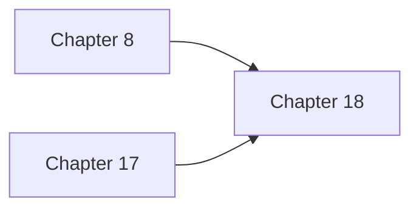

# Chapter 18: Testing Strategies & Quality Assurance

## 1. Introduction: The Challenge of Testing Strategies & Quality Assurance

This document provides information about the testing framework for the HMS-DOC project.

## 2. Key Concepts: Understanding Testing Strategies & Quality Assurance

### Testing Strategies

The Testing Strategies provides essential functionality in the HMS ecosystem.

### Test Coverage

The testing suite covers the following key areas:

## 3. Technical Implementation: Building Testing Strategies & Quality Assurance

This section provides a detailed technical implementation guide for the Testing Strategies & Quality Assurance component:

```text
/tests/               # Original test directory
  __init__.py                         # Package initialization
  test_chain_of_recursive_thought.py  # Basic tests for CRT implementation
  test_chain_of_recursive_thought_enhanced.py  # Extended tests for CRT
  test_agency_config.py               # Tests for agency configuration system
  test_batch_integration.sh           # Shell tests for batch integration
  test_parallel_processing.sh         # Shell tests for parallel processing

/test/                # Enhanced test directory 
  __init__.py                         # Package initialization
  test_agency_issue_enhancement.py    # Tests for agency issue enhancement
  test_pipeline_integration.py        # Tests for pipeline integration
  test_complete_workflow.py           # End-to-end workflow tests
  run_enhancement_tests.py            # Test runner for enhancement features
  spec_agency_issue_enhancement.md    # Test specifications

bash
./run_all_tests.sh

bash
## With pytest (recommended)
python -m pytest tests/test_agency_config.py -v

## With unittest
python -m unittest tests/test_agency_config.py

bash
./tests/test_batch_integration.sh

bash
## Run all enhancement tests
./test/run_enhancement_tests.py

## Run specific enhancement test modules
python -m pytest test/test_agency_issue_enhancement.py -v
python -m pytest test/test_pipeline_integration.py -v
python -m pytest test/test_complete_workflow.py -v

## Run the complete enhancement test workflow (shell wrapper)
./test_enhancement.sh

```
## 4. Hands-On Example: Using Testing Strategies & Quality Assurance

Let's walk through a practical example of implementing Testing Strategies & Quality Assurance in a real-world scenario...



text

```text

## 5. Connection to Other Components

- Script execution
- Output file generation
- Dependency checks
- Error handling
- Logging functionality

The test suite is designed to be run as part of a continuous integration pipeline. The `run_all_tests.sh` script produces structured output and exit codes suitable for CI environments.

## 6. Summary and Next Steps

### Key Takeaways

In this chapter, we explored Testing Strategies & Quality Assurance and its importance in the HMS ecosystem:

- **Testing Strategies** provides a foundation for robust healthcare systems
- **Quality Assurance** provides a foundation for robust healthcare systems
- **Test Automation** provides a foundation for robust healthcare systems

### What's Next?

In the next chapter, we'll explore Deployment & Operations, examining how it:

- Deployment
- Operations
- Monitoring

## 7. Exercises for the Reader

1. **Design Exercise:** Sketch a implementation of Testing Strategies & Quality Assurance for a specific healthcare scenario.

2. **Implementation Exercise:** Create a simple prototype that demonstrates the key principles of Testing Strategies & Quality Assurance.

3. **Analysis Exercise:** Review an existing system and identify how it could benefit from implementing Testing Strategies & Quality Assurance.

4. **Integration Exercise:** Design how this component would connect with other HMS components in a real-world application.

5. **Challenge Exercise:** How would you extend this component to address a complex healthcare challenge like pandemic response or chronic disease management?

---

In Chapter 19, we'll dive into Deployment & Operations and see how it guidelines for deploying, monitoring, and operating hms applications in production environments..


