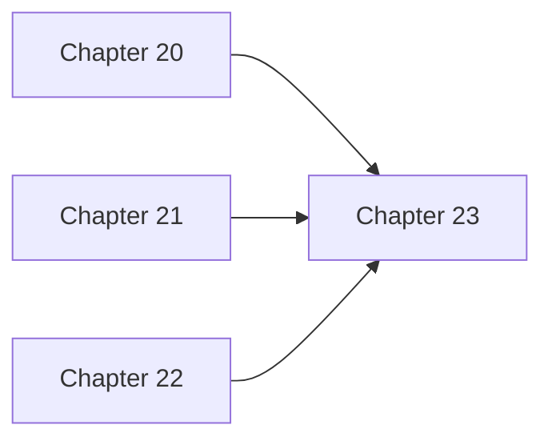

# Chapter 23: Future Directions & Advanced Research

## 1. Introduction: The Challenge of Future Directions & Advanced Research

## Entity Information

**Entity ID:** [e.g., intl-uk-health, usa-federal-va, usa-ca-health]  
**Entity Name:** [Full official name]  
**Entity Type:** [International | Federal | State]  
**Country/Region:** [For international/state entities]  
**Priority Tier:** [1-3]

## 2. Key Concepts: Understanding Future Directions & Advanced Research

### Future Research

The Future Research provides essential functionality in the HMS ecosystem.

## 3. Technical Implementation: Building Future Directions & Advanced Research

### Technical Environment

### Current Systems
| System Name | Purpose | Technology | Data Standards | Integration Capabilities |
|-------------|---------|------------|----------------|--------------------------|
| [System 1] | [Purpose] | [Tech stack] | [Standards] | [Integration details] |
| [System 2] | [Purpose] | [Tech stack] | [Standards] | [Integration details] |
| [System 3] | [Purpose] | [Tech stack] | [Standards] | [Integration details] |

### Technical Challenges

1. [Challenge 1 with details]
2. [Challenge 2 with details]
3. [Challenge 3 with details]
4. [Challenge 4 with details]

### Implementation Considerations

### Environmental Factors
- **Geographic Considerations:** [Factors related to geography]
- **Population Characteristics:** [Demographics, languages, health literacy]
- **Infrastructure Limitations:** [Power, connectivity, facilities]
- **Workforce Capabilities:** [Skills, training needs, workforce distribution]

## 4. Hands-On Example: Using Future Directions & Advanced Research

Let's walk through a practical example of implementing Future Directions & Advanced Research in a real-world scenario...



text

```text

## 5. Connection to Other Components

The Future Directions & Advanced Research connects with several other components in the HMS ecosystem:

### Related Components

- **Chapter 20**: Economic Analysis & Moneyball Trade Systems - Advanced economic analysis techniques and implementation of Moneyball trade systems for resource optimization.
- **Chapter 21**: Multi-Agent Systems & Coordination - Designing and implementing multi-agent systems that coordinate effectively to solve complex problems.
- **Chapter 22**: Cross-Language Integration & FFI - Techniques for integrating components written in different programming languages using Foreign Function Interface (FFI).

## 6. Summary and Next Steps

### Key Takeaways

In this chapter, we explored Future Directions & Advanced Research and its importance in the HMS ecosystem:

- **Future Research** provides a foundation for robust healthcare systems
- **Emerging Technologies** provides a foundation for robust healthcare systems
- **System Evolution** provides a foundation for robust healthcare systems

## 7. Exercises for the Reader

1. **Design Exercise:** Sketch a implementation of Future Directions & Advanced Research for a specific healthcare scenario.

2. **Implementation Exercise:** Create a simple prototype that demonstrates the key principles of Future Directions & Advanced Research.

3. **Analysis Exercise:** Review an existing system and identify how it could benefit from implementing Future Directions & Advanced Research.

4. **Integration Exercise:** Design how this component would connect with other HMS components in a real-world application.

5. **Challenge Exercise:** How would you extend this component to address a complex healthcare challenge like pandemic response or chronic disease management?


