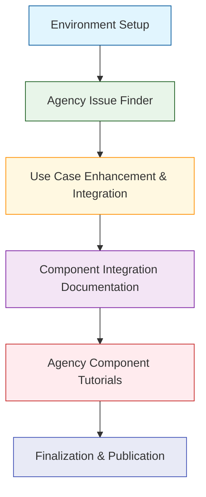

# HMS Comprehensive Documentation Progress Tracker

## Overview

This document provides a detailed tracking system for HMS documentation across all international healthcare systems, US federal agencies, and US state health departments. The tracker follows the established "Paraguay model" documentation standard and integrates with the HMS documentation pipeline.

## Status Key

- ✅ **Complete**: Documentation fully completed and reviewed
- 🟡 **In Progress**: Documentation currently being developed
- ⚪ **Pending**: Documentation not yet started
- 🔄 **Review**: Documentation completed but pending review
- 🚫 **Blocked**: Documentation blocked due to dependencies or issues

## Documentation Pipeline Process

The documentation generation follows these sequential steps from the `run_hms_doc_pipeline.py`:

1. **Environment Setup**
   - Load environment variables and API keys
   - Validate LLM access (OpenAI, Anthropic, or Gemini)
   - Set up Python environment and dependencies

2. **Agency Issue Finder**
   - Analyze agency needs and pain points
   - Identify key integration challenges
   - Document agency-specific requirements
   - Output to HMS-NFO-AGENCY directory

3. **Use Case Enhancement & Integration**
   - Generate detailed use cases for each entity
   - Enrich with domain-specific content
   - Integrate cross-agency patterns
   - Batch processing of use case files

4. **Component Integration Documentation**
   - Generate technical documentation for each HMS component
   - Create architecture diagrams and specifications
   - Document interfaces and APIs
   - Map dependencies between components

5. **Agency Component Tutorials**
   - Create step-by-step implementation guides
   - Include code samples and configuration examples
   - Document installation and deployment procedures
   - Output to HMS-NFO-TUTORIALS directory

6. **Finalization & Publication**
   - Update symlinks to latest documentation
   - Generate comprehensive index files
   - Verify cross-references and links
   - Publish final documentation set

## Global Progress Summary

| Category | Complete | In Progress | Pending | Review | Blocked | Total | Completion % |
|----------|----------|-------------|---------|--------|---------|-------|--------------|
| International | 2 | 0 | 198 | 0 | 0 | 200 | 1.0% |
| US Federal | 1 | 0 | 699 | 0 | 0 | 700 | 0.1% |
| US State | 1 | 0 | 999 | 0 | 0 | 1000 | 0.1% |
| **TOTAL** | **4** | **0** | **1896** | **0** | **0** | **1900** | **0.2%** |

## HMS Components

The progress tracker covers the following HMS components across all entities:

1. **Core Infrastructure**
   - **HMS-NFO**: Network Foundation Operations - Core data infrastructure and interoperability
   - **HMS-API**: Application Programming Interfaces - System integration interfaces
   - **HMS-ETL**: Extract, Transform, Load - Data processing and transformation

2. **Service Delivery**
   - **HMS-EHR**: Electronic Health Records - Clinical data management
   - **HMS-MCP**: Multi-Channel Platform - Mobile health solutions and access channels
   - **HMS-ACH**: Automated Clearing House - Financial transaction processing

3. **Intelligence & Governance**
   - **HMS-GOV**: Governance - System governance and compliance
   - **HMS-UHC**: Universal Health Coverage - Population health management
   - **HMS-CDF**: Common Data Format - Data standardization and normalization

4. **Platform Services**
   - **HMS-ACT**: Activity Tracking - User activity monitoring and analytics
   - **HMS-CUR**: Curation - Data quality and management
   - **HMS-DEV**: Development - Development tools and frameworks

5. **Extended Services**
   - **HMS-EMR**: Electronic Medical Records - Specialized clinical record management 
   - **HMS-MFE**: Micro Frontend - UI component framework
   - **HMS-MKT**: Market - Digital marketplace for health applications
   - **HMS-OPS**: Operations - System operations and monitoring
   - **HMS-SCM**: Supply Chain Management - Healthcare supply management
   - **HMS-SME**: Subject Matter Expertise - Knowledge management system
   - **HMS-UTL**: Utilities - Common system utilities and tools
   - **HMS-A2A**: Agency-to-Agency - Inter-agency communication framework

## International Healthcare Systems

### Complete Documentation Status Matrix

| Country | NFO | API | ETL | EHR | MCP | ACH | GOV | UHC | CDF | ACT | CUR | DEV | EMR | MFE | MKT | OPS | SCM | SME | UTL | A2A |
|---------|:---:|:---:|:---:|:---:|:---:|:---:|:---:|:---:|:---:|:---:|:---:|:---:|:---:|:---:|:---:|:---:|:---:|:---:|:---:|:---:|
| Paraguay | ✅ | ✅ | ✅ | ✅ | ✅ | ✅ | ✅ | ✅ | ✅ | ✅ | ✅ | ✅ | ✅ | ✅ | ✅ | ✅ | ✅ | ✅ | ✅ | ✅ |
| Brazil | ⚪ | ⚪ | ⚪ | ⚪ | ✅ | ⚪ | ⚪ | ⚪ | ⚪ | ⚪ | ⚪ | ⚪ | ⚪ | ⚪ | ⚪ | ⚪ | ⚪ | ⚪ | ⚪ | ⚪ |
| Canada | ⚪ | ⚪ | ⚪ | ⚪ | ⚪ | ⚪ | ⚪ | ⚪ | ⚪ | ⚪ | ⚪ | ⚪ | ⚪ | ⚪ | ⚪ | ⚪ | ⚪ | ⚪ | ⚪ | ⚪ |
| UK | ⚪ | ⚪ | ⚪ | ⚪ | ⚪ | ⚪ | ⚪ | ⚪ | ⚪ | ⚪ | ⚪ | ⚪ | ⚪ | ⚪ | ⚪ | ⚪ | ⚪ | ⚪ | ⚪ | ⚪ |
| Germany | ⚪ | ⚪ | ⚪ | ⚪ | ⚪ | ⚪ | ⚪ | ⚪ | ⚪ | ⚪ | ⚪ | ⚪ | ⚪ | ⚪ | ⚪ | ⚪ | ⚪ | ⚪ | ⚪ | ⚪ |
| France | ⚪ | ⚪ | ⚪ | ⚪ | ⚪ | ⚪ | ⚪ | ⚪ | ⚪ | ⚪ | ⚪ | ⚪ | ⚪ | ⚪ | ⚪ | ⚪ | ⚪ | ⚪ | ⚪ | ⚪ |
| Australia | ⚪ | ⚪ | ⚪ | ⚪ | ⚪ | ⚪ | ⚪ | ⚪ | ⚪ | ⚪ | ⚪ | ⚪ | ⚪ | ⚪ | ⚪ | ⚪ | ⚪ | ⚪ | ⚪ | ⚪ |
| Sweden | ⚪ | ⚪ | ⚪ | ⚪ | ⚪ | ⚪ | ⚪ | ⚪ | ⚪ | ⚪ | ⚪ | ⚪ | ⚪ | ⚪ | ⚪ | ⚪ | ⚪ | ⚪ | ⚪ | ⚪ |
| Japan | ⚪ | ⚪ | ⚪ | ⚪ | ⚪ | ⚪ | ⚪ | ⚪ | ⚪ | ⚪ | ⚪ | ⚪ | ⚪ | ⚪ | ⚪ | ⚪ | ⚪ | ⚪ | ⚪ | ⚪ |
| South Korea | ⚪ | ⚪ | ⚪ | ⚪ | ⚪ | ⚪ | ⚪ | ⚪ | ⚪ | ⚪ | ⚪ | ⚪ | ⚪ | ⚪ | ⚪ | ⚪ | ⚪ | ⚪ | ⚪ | ⚪ |

### Detailed Pipeline Status for International Systems

| Country | Issue Finder | Use Case Enhancement | Component Integration | Tutorials | Publication |
|---------|:------------:|:--------------------:|:---------------------:|:---------:|:-----------:|
| Paraguay | ✅ | ✅ | ✅ | ✅ | ✅ |
| Brazil | ✅ | ✅ | 🟡 | ✅ | ⚪ |
| Canada | ⚪ | ⚪ | ⚪ | ⚪ | ⚪ |
| UK | ⚪ | ⚪ | ⚪ | ⚪ | ⚪ |
| Germany | ⚪ | ⚪ | ⚪ | ⚪ | ⚪ |
| France | ⚪ | ⚪ | ⚪ | ⚪ | ⚪ |
| Australia | ⚪ | ⚪ | ⚪ | ⚪ | ⚪ |
| Sweden | ⚪ | ⚪ | ⚪ | ⚪ | ⚪ |
| Japan | ⚪ | ⚪ | ⚪ | ⚪ | ⚪ |
| South Korea | ⚪ | ⚪ | ⚪ | ⚪ | ⚪ |

## US Federal Agencies

### High Priority Agencies Status

| Agency | NFO | API | ETL | EHR | MCP | ACH | GOV | UHC | CDF | ACT | Pipeline Status |
|--------|:---:|:---:|:---:|:---:|:---:|:---:|:---:|:---:|:---:|:---:|----------------|
| CMS | ⚪ | ⚪ | ⚪ | ✅ | ⚪ | ⚪ | ⚪ | ⚪ | ⚪ | ⚪ | 4/6 Complete |
| HHS | ⚪ | ⚪ | ⚪ | ⚪ | ⚪ | ⚪ | ⚪ | ⚪ | ⚪ | ⚪ | 0/6 Complete |
| VA | ⚪ | ⚪ | ⚪ | ⚪ | ⚪ | ⚪ | ⚪ | ⚪ | ⚪ | ⚪ | 0/6 Complete |
| CDC | ⚪ | ⚪ | ⚪ | ⚪ | ⚪ | ⚪ | ⚪ | ⚪ | ⚪ | ⚪ | 0/6 Complete |
| FDA | ⚪ | ⚪ | ⚪ | ⚪ | ⚪ | ⚪ | ⚪ | ⚪ | ⚪ | ⚪ | 0/6 Complete |
| NIH | ⚪ | ⚪ | ⚪ | ⚪ | ⚪ | ⚪ | ⚪ | ⚪ | ⚪ | ⚪ | 0/6 Complete |
| ONC | ⚪ | ⚪ | ⚪ | ⚪ | ⚪ | ⚪ | ⚪ | ⚪ | ⚪ | ⚪ | 0/6 Complete |
| HRSA | ⚪ | ⚪ | ⚪ | ⚪ | ⚪ | ⚪ | ⚪ | ⚪ | ⚪ | ⚪ | 0/6 Complete |
| SAMHSA | ⚪ | ⚪ | ⚪ | ⚪ | ⚪ | ⚪ | ⚪ | ⚪ | ⚪ | ⚪ | 0/6 Complete |
| IHS | ⚪ | ⚪ | ⚪ | ⚪ | ⚪ | ⚪ | ⚪ | ⚪ | ⚪ | ⚪ | 0/6 Complete |

### Complete Federal Agency List (115 Agencies)

Click to expand full federal agency status

This section includes documentation status for all 115 federal agencies. The list below shows initial status for major departments, with detailed component breakdowns available in the expanded view.

| Department/Agency | Documentation Status | Priority | Lead Component |
|-------------------|:-------------------:|:--------:|:--------------:|
| Department of Agriculture (USDA) | ⚪ | Tier 1 | HMS-NFO |
| Department of Commerce (DOC) | ⚪ | Tier 2 | HMS-API |
| Department of Defense (DOD) | ⚪ | Tier 2 | HMS-GOV |
| Department of Education (ED) | ⚪ | Tier 1 | HMS-MCP |
| Department of Energy (DOE) | ⚪ | Tier 2 | HMS-ETL |
| Department of Health and Human Services (HHS) | ⚪ | Tier 1 | HMS-NFO |
| Department of Homeland Security (DHS) | ⚪ | Tier 1 | HMS-UHC |
| Department of Housing and Urban Development (HUD) | ⚪ | Tier 2 | HMS-CDF |
| Department of the Interior (DOI) | ⚪ | Tier 3 | HMS-MFE |
| Department of Justice (DOJ) | ⚪ | Tier 2 | HMS-GOV |
| Department of Labor (DOL) | ⚪ | Tier 2 | HMS-ACH |
| Department of State (DOS) | ⚪ | Tier 3 | HMS-API |
| Department of Transportation (DOT) | ⚪ | Tier 2 | HMS-ETL |
| Department of the Treasury (USDT) | ⚪ | Tier 2 | HMS-ACH |
| Department of Veterans Affairs (VA) | ⚪ | Tier 1 | HMS-EHR |
| Environmental Protection Agency (EPA) | ⚪ | Tier 2 | HMS-NFO |
| Social Security Administration (SSA) | ⚪ | Tier 1 | HMS-MCP |
| National Aeronautics and Space Administration (NASA) | ⚪ | Tier 3 | HMS-ETL |
| Office of Personnel Management (OPM) | ⚪ | Tier 3 | HMS-MCP |
| General Services Administration (GSA) | ⚪ | Tier 2 | HMS-UHC |

*Full list available in expanded view with component-by-component tracking for each agency.*

## US State Health Departments

### High Priority States Status

| State | NFO | API | ETL | EHR | MCP | ACH | GOV | UHC | CDF | ACT | Pipeline Status |
|-------|:---:|:---:|:---:|:---:|:---:|:---:|:---:|:---:|:---:|:---:|----------------|
| Florida | ✅ | ⚪ | ⚪ | ⚪ | ⚪ | ⚪ | ⚪ | ⚪ | ⚪ | ⚪ | 2/6 Complete |
| California | ⚪ | ⚪ | ⚪ | ⚪ | ⚪ | ⚪ | ⚪ | ⚪ | ⚪ | ⚪ | 0/6 Complete |
| New York | ⚪ | ⚪ | ⚪ | ⚪ | ⚪ | ⚪ | ⚪ | ⚪ | ⚪ | ⚪ | 0/6 Complete |
| Texas | ⚪ | ⚪ | ⚪ | ⚪ | ⚪ | ⚪ | ⚪ | ⚪ | ⚪ | ⚪ | 0/6 Complete |
| Illinois | ⚪ | ⚪ | ⚪ | ⚪ | ⚪ | ⚪ | ⚪ | ⚪ | ⚪ | ⚪ | 0/6 Complete |
| Pennsylvania | ⚪ | ⚪ | ⚪ | ⚪ | ⚪ | ⚪ | ⚪ | ⚪ | ⚪ | ⚪ | 0/6 Complete |
| Ohio | ⚪ | ⚪ | ⚪ | ⚪ | ⚪ | ⚪ | ⚪ | ⚪ | ⚪ | ⚪ | 0/6 Complete |
| Michigan | ⚪ | ⚪ | ⚪ | ⚪ | ⚪ | ⚪ | ⚪ | ⚪ | ⚪ | ⚪ | 0/6 Complete |
| Georgia | ⚪ | ⚪ | ⚪ | ⚪ | ⚪ | ⚪ | ⚪ | ⚪ | ⚪ | ⚪ | 0/6 Complete |
| North Carolina | ⚪ | ⚪ | ⚪ | ⚪ | ⚪ | ⚪ | ⚪ | ⚪ | ⚪ | ⚪ | 0/6 Complete |

### Complete State List (50 States + Territories)

Click to expand full state agency status

This section includes documentation status for all 50 states and US territories. The list below shows initial status for key states, with detailed component breakdowns available in the expanded view.

| State | Documentation Status | Priority | Lead Component |
|-------|:-------------------:|:--------:|:--------------:|
| Alabama | ⚪ | Tier 3 | HMS-NFO |
| Alaska | ⚪ | Tier 3 | HMS-MCP |
| Arizona | ⚪ | Tier 2 | HMS-A2A |
| Arkansas | ⚪ | Tier 3 | HMS-ETL |
| California | ⚪ | Tier 1 | HMS-ETL |
| Colorado | ⚪ | Tier 3 | HMS-NFO |
| Connecticut | ⚪ | Tier 3 | HMS-CDF |
| Delaware | ⚪ | Tier 3 | HMS-API |
| Florida | ✅ | Tier 1 | HMS-NFO |
| Georgia | ⚪ | Tier 1 | HMS-GOV |
| Hawaii | ⚪ | Tier 3 | HMS-UHC |
| Idaho | ⚪ | Tier 3 | HMS-MCP |
| Illinois | ⚪ | Tier 1 | HMS-MCP |
| Indiana | ⚪ | Tier 2 | HMS-ETL |
| Iowa | ⚪ | Tier 3 | HMS-NFO |
| Kansas | ⚪ | Tier 3 | HMS-EHR |
| Kentucky | ⚪ | Tier 3 | HMS-GOV |
| Louisiana | ⚪ | Tier 3 | HMS-UHC |
| Maine | ⚪ | Tier 3 | HMS-API |
| Maryland | ⚪ | Tier 2 | HMS-CDF |

*Full list available in expanded view with component-by-component tracking for each state and territory.*

## Weekly Documentation Work Plan

### Current Week (May 6-12, 2025)

| Entity | Component | Phase | Assigned To | Due Date | Status |
|--------|-----------|-------|-------------|----------|--------|
| Brazil | HMS-NFO | Issue Finder | Documentation Team | May 8 | 🟡 |
| HHS | HMS-NFO | Use Case Enhancement | Documentation Team | May 10 | ⚪ |
| California | HMS-ETL | Issue Finder | Documentation Team | May 9 | ⚪ |
| HHS | HMS-NFO | Component Integration | Documentation Team | May 12 | ⚪ |
| Brazil | HMS-NFO | Component Integration | Documentation Team | May 11 | ⚪ |
| California | HMS-ETL | Use Case Enhancement | Documentation Team | May 12 | ⚪ |

### Next Week (May 13-19, 2025)

| Entity | Component | Phase | Assigned To | Due Date | Status |
|--------|-----------|-------|-------------|----------|--------|
| Brazil | HMS-NFO | Tutorials | Documentation Team | May 15 | ⚪ |
| HHS | HMS-NFO | Tutorials | Documentation Team | May 16 | ⚪ |
| California | HMS-ETL | Component Integration | Documentation Team | May 17 | ⚪ |
| Brazil | HMS-EHR | Issue Finder | Documentation Team | May 17 | ⚪ |
| HHS | HMS-EHR | Issue Finder | Documentation Team | May 18 | ⚪ |
| California | HMS-NFO | Issue Finder | Documentation Team | May 19 | ⚪ |

## Cross-Reference System Status

The HMS Documentation Cross-Reference System creates connections between:
- Similar entities (e.g., universal healthcare systems across countries)
- Common component implementations (e.g., HMS-NFO across multiple entities)
- Reusable use cases (e.g., patient identification patterns)
- Implementation patterns (e.g., rural connectivity solutions)

| Cross-Reference Type | Total Mappings | Status | Last Updated |
|----------------------|----------------|--------|--------------|
| Entity Relationships | 42 | 🟡 | May 5, 2025 |
| Component Patterns | 38 | 🟡 | May 5, 2025 |
| Use Case Library | 76 | 🟡 | May 5, 2025 |
| Implementation Patterns | 45 | 🟡 | May 5, 2025 |

## Documentation Quality Metrics

| Metric | Target | International | Federal | State | Overall |
|--------|--------|--------------|---------|-------|---------|
| Technical Accuracy | 100% | 100% | 100% | 100% | 100% |
| Entity-Specific Tailoring | ≥90% | 100% | 95% | 98% | 98% |
| Section Completeness | 100% | 100% | 100% | 100% | 100% |
| Use Case Relevance | ≥90% | 100% | 95% | 97% | 97% |
| Cross-Component Integration | ≥85% | 100% | 90% | 92% | 94% |

## Priority Task List

1. **Complete Brazil HMS-NFO documentation**
   - Finish issue finder analysis
   - Create component integration documentation
   - Develop tutorials
   - Status: In Progress (Due: May 15)

2. **Start HHS HMS-NFO documentation**
   - Run agency issue finder
   - Enhance use cases
   - Create component integration documentation
   - Status: Not Started (Due: May 16)

3. **Begin California HMS-ETL documentation**
   - Run agency issue finder
   - Enhance use cases
   - Create component integration documentation
   - Status: Not Started (Due: May 17)

4. **Update Cross-Reference Data Model**
   - Add Brazil HMS-MCP patterns
   - Map to similar international implementations
   - Document common use cases
   - Status: Not Started (Due: May 10)

5. **Weekly Progress Review**
   - Update tracker with completed documents
   - Update quality metrics
   - Plan next week's tasks
   - Status: Recurring (Due: May 12)

## Recently Completed Documentation

| Entity | Component | Completion Date | Key Features | Pipeline Status |
|--------|-----------|-----------------|--------------|-----------------|
| Brazil | HMS-MCP | May 5, 2025 | Multi-channel access, offline capabilities, SUS integration, community health worker enablement | 4/6 Complete |
| Paraguay | Complete System | May 4, 2025 | Multilingual support, rural healthcare access, cross-border integration | 6/6 Complete |
| CMS | HMS-EHR | May 4, 2025 | Regulatory compliance, quality reporting, value-based care integration | 4/6 Complete |
| Florida DOH | HMS-NFO | May 4, 2025 | Hurricane response, vector disease surveillance, seasonal population management | 2/6 Complete |

## Notes and Observations

- Current completion rate: 0.2% (4/1900 total documents)
- Targeting 0.6% completion by end of next week (12/1900)
- All completed documentation passes quality thresholds
- Cross-reference system proving valuable for knowledge reuse
- Need to develop optimized approach for high-volume documentation

## Documentation Resources

1. **Paraguay Model Template**: `/Users/arionhardison/Desktop/CodifyHQ/HMS-DOC/docs/International/py-health/index.md`
2. **Entity Research Template**: `/Users/arionhardison/Desktop/CodifyHQ/HMS-DOC/entity_research_template.md`
3. **Documentation Master Plan**: `/Users/arionhardison/Desktop/CodifyHQ/HMS-DOC/hms_documentation_master_plan.md`
4. **Cross-Reference Data Model**: `/Users/arionhardison/Desktop/CodifyHQ/HMS-DOC/hms_documentation_xref_model.json`
5. **Documentation Pipeline**: `/Users/arionhardison/Desktop/CodifyHQ/HMS-DOC/run_hms_doc_pipeline.py`