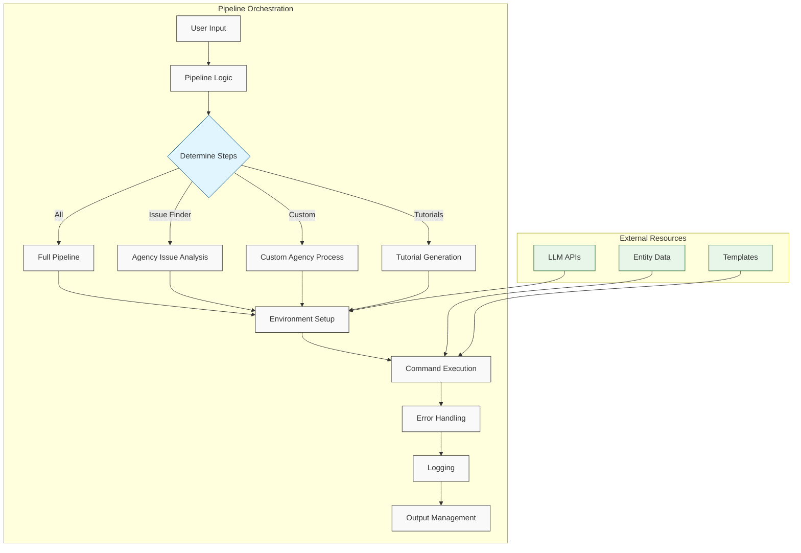
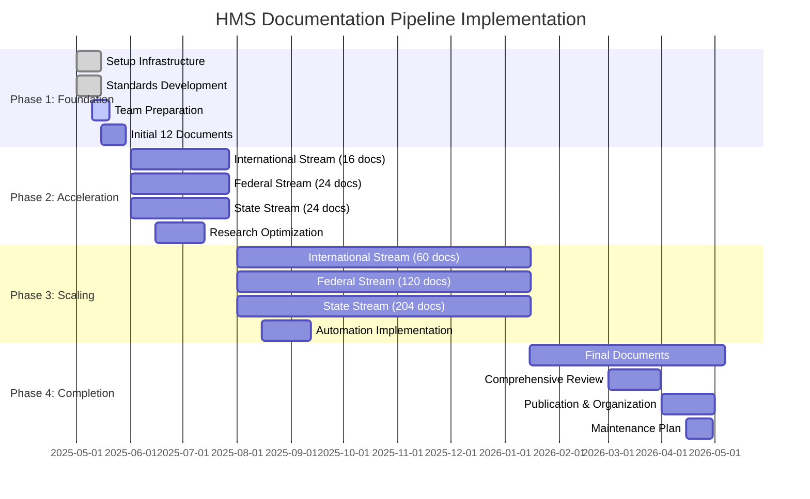

# HMS Documentation Pipeline Reference

## Overview

This document provides detailed reference information about each step in the HMS documentation generation pipeline. The pipeline is orchestrated by `run_hms_doc_pipeline.py` and consists of several sequential steps that transform entity research into comprehensive, standardized documentation.

## Pipeline Steps

### 1. Environment Setup

**Purpose:** Initialize the environment and validate essential dependencies.

**Process:**
1. Load environment variables from `.env` file
2. Validate LLM API keys (OpenAI, Anthropic, or Gemini)
3. Set up Python environment and dependencies
4. Configure working directories and paths

**Key Scripts:**
- `setup_hms_doc_env.sh` - Main environment setup script
- `run_hms_doc_pipeline.py` - Environment validation section

**Output:**
- Configured runtime environment
- Validated API keys
- Logging setup in `logs/pipeline_run_[timestamp].log`

### 2. Agency Issue Finder

**Purpose:** Analyze agencies to identify key integration challenges and document entity-specific requirements.

**Process:**
1. Gather entity data from agency JSON files
2. Run issue analysis to identify integration challenges
3. Evaluate specific needs and constraints
4. Document priorities and approach for implementation
5. Generate agency-specific issue reports

**Key Scripts:**
- `scripts/run_agency_issue_finder.sh` - Main runner script
- `src/agency_issue_finder.py` - Core issue analysis
- `run_hms_doc_pipeline.py` - Orchestration

**Output:**
- Agency issue documentation in `docs/HMS-NFO-AGENCY-[timestamp]/`
- Issue trackers in JSON format
- Initial use case outlines

### 3. Use Case Enhancement & Integration

**Purpose:** Generate detailed, domain-specific use cases and integrate cross-agency patterns.

**Process:**
1. Process base use cases from issue finder
2. Enhance with domain-specific details
3. Integrate patterns across similar entities
4. Generate comprehensive use case documentation
5. Apply economic model for impact assessment

**Key Scripts:**
- `scripts/batch_integrate_enhanced_use_cases.sh` - Main integration script
- `enhance_agency_use_cases_with_issues.py` - Use case enhancement
- `integrate_economic_model.py` - Economic impact modeling

**Output:**
- Enhanced use case files
- Use case JSON data for component integration
- Economic impact assessments
- Cross-entity pattern documentation

### 4. Component Integration Documentation

**Purpose:** Generate technical documentation for each HMS component and its entity-specific implementation.

**Process:**
1. Map enhanced use cases to HMS components
2. Generate component-specific technical documentation
3. Create architecture diagrams and specifications
4. Document interfaces and APIs
5. Map dependencies between components

**Key Scripts:**
- `scripts/run_generate_all.sh` - Main component integration script
- `src/generate_agency_docs.py` - Core document generator
- `src/generate_improved_agency_docs.py` - Enhanced documentation

**Output:**
- Component documentation files in entity directories
- Technical specifications
- Integration architecture diagrams
- Implementation specifications

### 5. Agency Component Tutorials

**Purpose:** Create step-by-step implementation guides with code samples and configuration examples.

**Process:**
1. Use enhanced use case and component documents
2. Generate tutorials for each component
3. Include code samples and configuration examples
4. Create step-by-step implementation guides
5. Include testing and verification guidance

**Key Scripts:**
- `src/generate_agency_component_tutorials.py` - Main tutorial generator
- `src/generate_improved_agency_component_tutorials.py` - Enhanced tutorials

**Output:**
- Tutorial documentation in `docs/HMS-NFO-TUTORIALS-[timestamp]/`
- Code samples
- Configuration examples
- Implementation checklists

### 6. Finalization & Publication

**Purpose:** Finalize, organize, and publish the complete documentation set.

**Process:**
1. Update symlinks to latest documentation
2. Generate comprehensive index files
3. Verify cross-references and links
4. Create navigation structure
5. Publish final documentation set

**Key Scripts:**
- `scripts/update_latest_symlinks.sh` - Symlink updater
- `src/generate_main_index.py` - Index generator

**Output:**
- Updated symlinks (`HMS-NFO-AGENCY-latest`, `HMS-NFO-TUTORIALS-latest`)
- Main index files
- Complete documentation set
- Navigation structure

## Pipeline Configuration

### Environment Variables

- `OPENAI_API_KEY` - OpenAI API key for LLM calls
- `ANTHROPIC_API_KEY` - Anthropic API key for Claude model access
- `GEMINI_API_KEY` - Google Gemini API key for fallback LLM

### Directory Structure

- `BASE_DIR` - Root directory of the HMS-DOC project
- `DOCS_DIR` - Main documentation output directory
- `AGENCY_ISSUE_OUTPUT_BASE` - Base path for agency issue output
- `TUTORIAL_OUTPUT_BASE` - Base path for tutorial output
- `LOG_DIR` - Directory for pipeline logs

### Command Line Arguments

The `run_hms_doc_pipeline.py` script accepts the following modes:

- `all` - Run the complete pipeline (default)
- `issue_finder` - Run only the agency issue finder step
- `enhance_integrate` - Run use case enhancement and integration
- `integration` - Run component integration documentation
- `tutorials` - Run agency component tutorials
- `custom_issue` - Run issue finder for a specific agency

Additional flags:
- `--agency` - Specify agency name for custom_issue mode
- `--issue` - Specify issue topic for custom_issue mode
- `--state` - Specify state for custom agency (optional)
- `--type` - Specify agency type for custom agency (optional)
- `--skip-env` - Skip environment setup
- `--run-all-after-issue` - Run integration and tutorials after issue finder

## Example Commands

```bash
# Run the complete pipeline
python run_hms_doc_pipeline.py all

# Run only the agency issue finder for a custom agency
python run_hms_doc_pipeline.py custom_issue --agency hhs --issue interoperability

# Run tutorials generation only
python run_hms_doc_pipeline.py tutorials

# Run issue finder and then all subsequent steps
python run_hms_doc_pipeline.py issue_finder --run-all-after-issue
```

## Pipeline Orchestration

The `run_hms_doc_pipeline.py` orchestrator manages the entire process flow as shown below:



The orchestrator handles:

1. **Pipeline logic** - Determining which steps to run based on user input
2. **Environment management** - Setting up and validating the environment
3. **Command execution** - Running sub-scripts with appropriate parameters
4. **Error handling** - Managing errors and providing feedback
5. **Logging** - Comprehensive logging of all pipeline activities
6. **Output management** - Managing and organizing documentation outputs

## Quality Assurance

Each pipeline stage includes validation checks to ensure documentation quality:

1. **Technical accuracy** - Validates accuracy of technical information
2. **Completeness** - Ensures all required sections are present
3. **Contextual relevance** - Verifies documentation is tailored to the entity
4. **Consistency** - Checks for consistent terminology and structure
5. **Cross-references** - Validates cross-references between documents

## Implementation Timeline

The pipeline is designed to process documentation in batches, following this timeline:



Detailed targets:

- **Phase 1 (Weeks 1-4):** Foundation setup and 12 priority documents
- **Phase 2 (Weeks 5-12):** 64 documents (8 per week)
- **Phase 3 (Weeks 13-36):** 384 documents (16 per week)
- **Phase 4 (Weeks 37-52):** Remaining documents and finalization

## References

- **Documentation Master Plan**: `/Users/arionhardison/Desktop/CodifyHQ/HMS-DOC/hms_documentation_master_plan.md`
- **Entity Research Template**: `/Users/arionhardison/Desktop/CodifyHQ/HMS-DOC/entity_research_template.md`
- **Pipeline Script**: `/Users/arionhardison/Desktop/CodifyHQ/HMS-DOC/run_hms_doc_pipeline.py`
- **Paraguay Model**: `/Users/arionhardison/Desktop/CodifyHQ/HMS-DOC/docs/International/py-health/index.md`