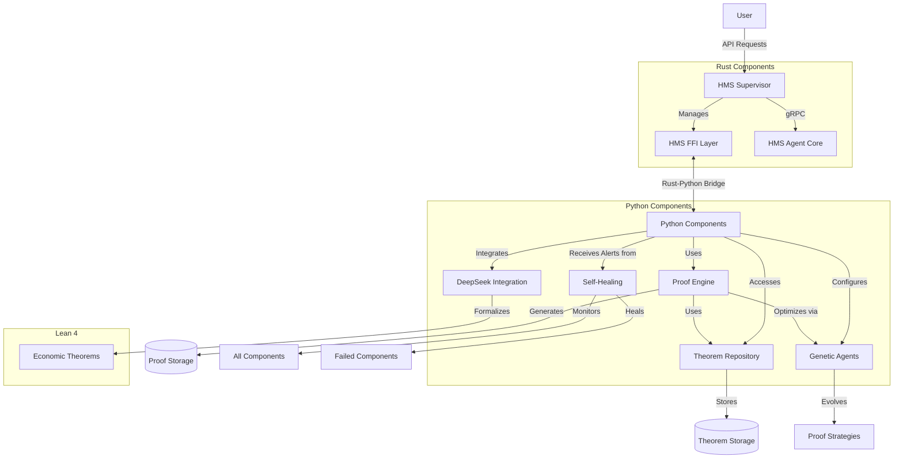

# Economic Theorem Prover Architecture

This document provides a comprehensive overview of the Economic Theorem Prover architecture with Self-Healing Genetic Agents.

## System Architecture

The system is composed of several coordinated components that work together to provide economic theorem proving capabilities with self-healing genetic algorithms for optimization.

## Component Descriptions

### Rust Components

1. **HMS Supervisor**
   - Central orchestration component
   - Manages requests and lifecycle of the system
   - Provides gRPC API for external interaction
   - Coordinates between different components

2. **HMS AGT (Agent Core)**
   - Core implementation of agent behaviors
   - Supports genetic algorithm operations
   - Maintains agent populations
   - Tracks evolutionary progress

3. **HMS FFI (Foreign Function Interface)**
   - Enables interoperability between Rust and Python
   - Provides bidirectional communication
   - Handles data serialization/deserialization
   - Manages memory safety between languages

### Python Components

1. **Theorem Repository**
   - Stores and manages economic theorems
   - Provides search and retrieval capabilities
   - Maintains metadata about theorems
   - Tracks theorem relationships

2. **Proof Engine**
   - Processes theorem proving requests
   - Coordinates proof strategy selection
   - Integrates with external provers
   - Verifies and validates proofs

3. **Genetic Agents**
   - Implements evolutionary algorithm for proof strategies
   - Defines fitness functions for strategy evaluation
   - Handles mutation and crossover operations
   - Tracks strategy performance over generations

4. **DeepSeek Integration**
   - Integrates with DeepSeek-Prover-V2
   - Formats theorems for external proving
   - Interprets proof results
   - Enhances strategies with AI capabilities

5. **Self-Healing**
   - Monitors system health
   - Detects component failures
   - Implements recovery strategies
   - Logs and alerts on issues

### Lean 4 Components

1. **Economic Theorems**
   - Formal definitions of economic theorems
   - Proof skeletons and tactics
   - Verification framework
   - Mathematical foundations

## Data Flow

1. **Theorem Registration**
   - User submits a theorem via HMS Supervisor
   - Supervisor passes the theorem to Theorem Repository via FFI
   - Repository stores the theorem and returns confirmation

2. **Theorem Proving**
   - User requests a proof via HMS Supervisor
   - Supervisor passes the request to Proof Engine via FFI
   - Proof Engine retrieves the theorem from Repository
   - If genetic optimization requested, Genetic Agents optimize strategies
   - Proof Engine attempts proof using selected strategies
   - Results are returned via FFI to Supervisor and to user

3. **Strategy Optimization**
   - Genetic Agents evolve proof strategies over generations
   - Fitness is evaluated based on proof success, efficiency, etc.
   - Best strategies are maintained and further evolved
   - Optimization results are stored for future use

4. **Self-Healing Process**
   - Monitor continuously checks component health
   - If failures detected, healing actions are triggered
   - System attempts to restore functionality
   - Alerts are generated for persistent issues

## Protocol Interfaces

The system uses the following key interfaces:

1. **External API (gRPC)**
   - `ProveTheorem`: Submit a theorem for proving
   - `RegisterTheorem`: Register a new theorem
   - `OptimizeProofStrategy`: Optimize proof strategies
   - `GetHealthStatus`: Check system health

2. **FFI Interface**
   - `register_theorem`: Pass theorem data between languages
   - `prove_theorem`: Request theorem proving
   - `optimize_proof_strategy`: Request strategy optimization
   - `get_health_status`: Get health information

## Development and Deployment

The system supports the following development and deployment models:

1. **Local Development**
   - All components run locally
   - Mock implementations available for development
   - Unit tests for individual components
   - Integration tests for system verification

2. **Distributed Deployment**
   - Components can be deployed across multiple hosts
   - gRPC enables network communication
   - Health monitoring ensures system reliability