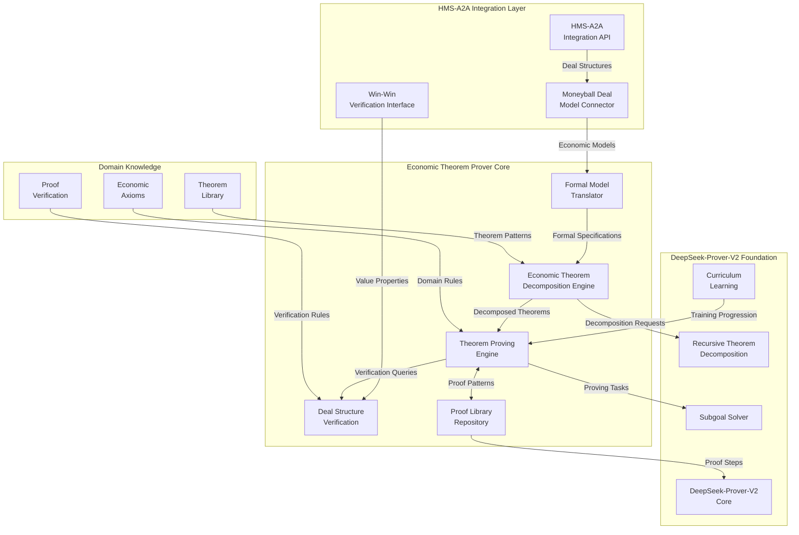
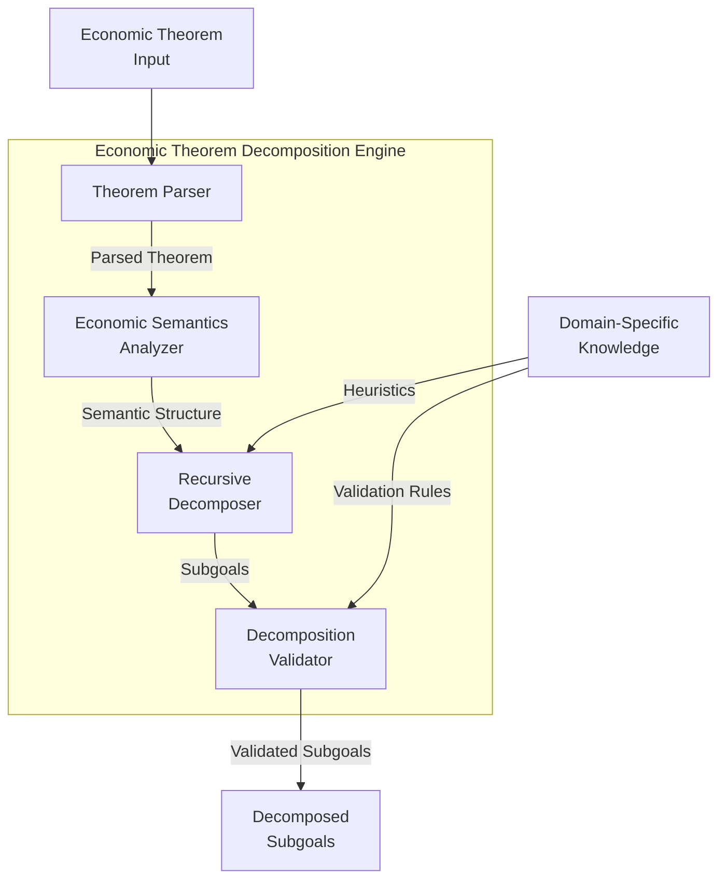
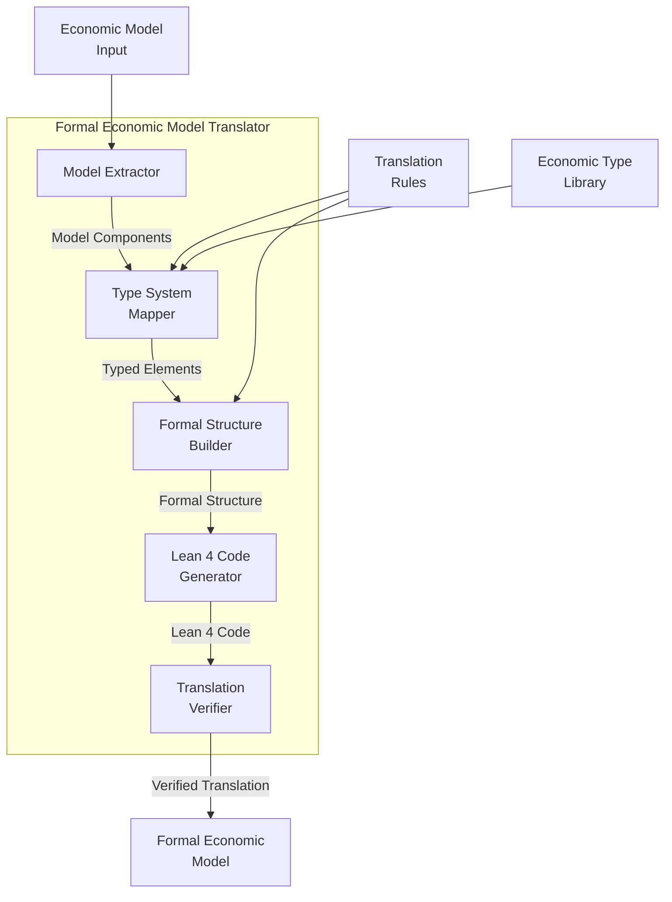
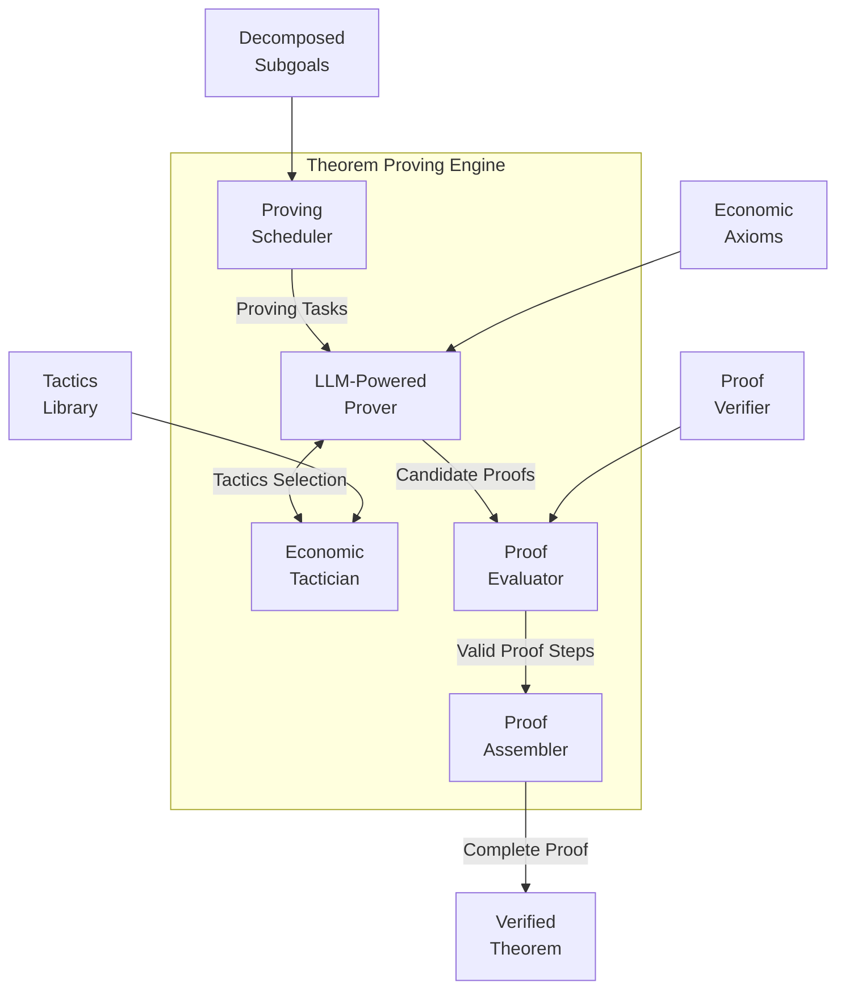
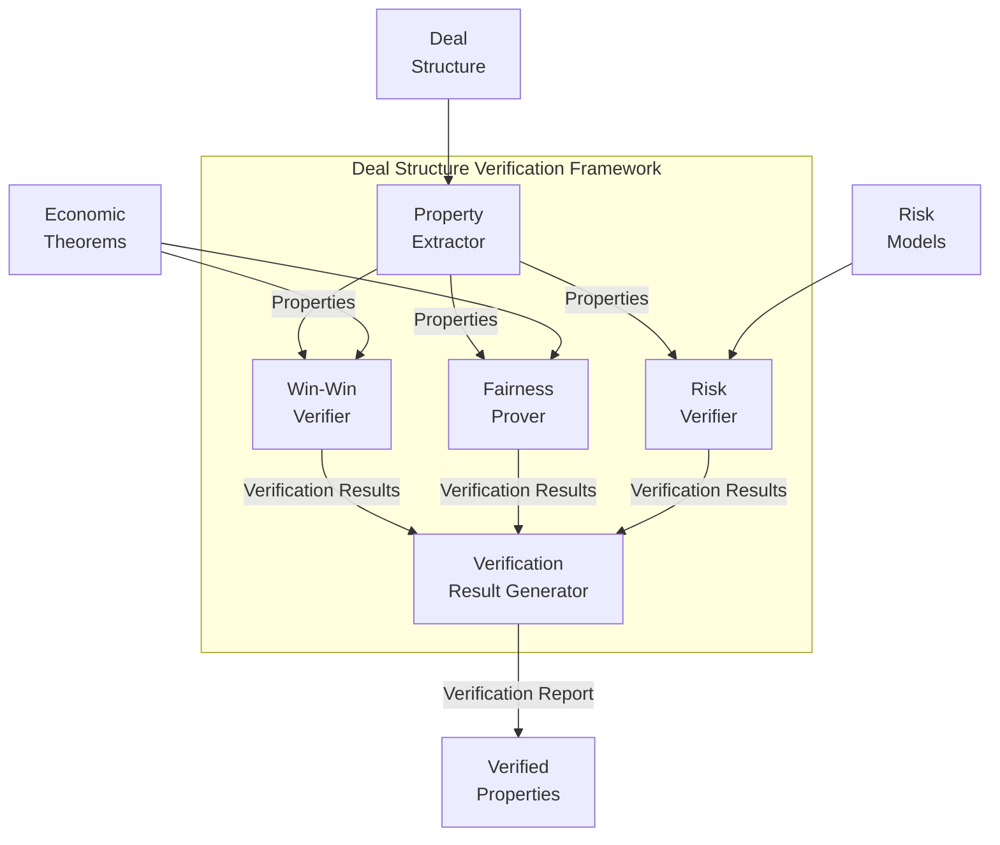
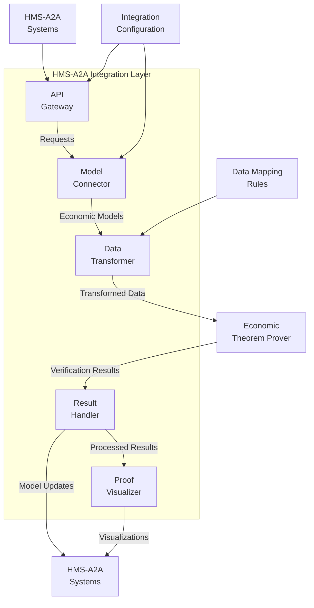
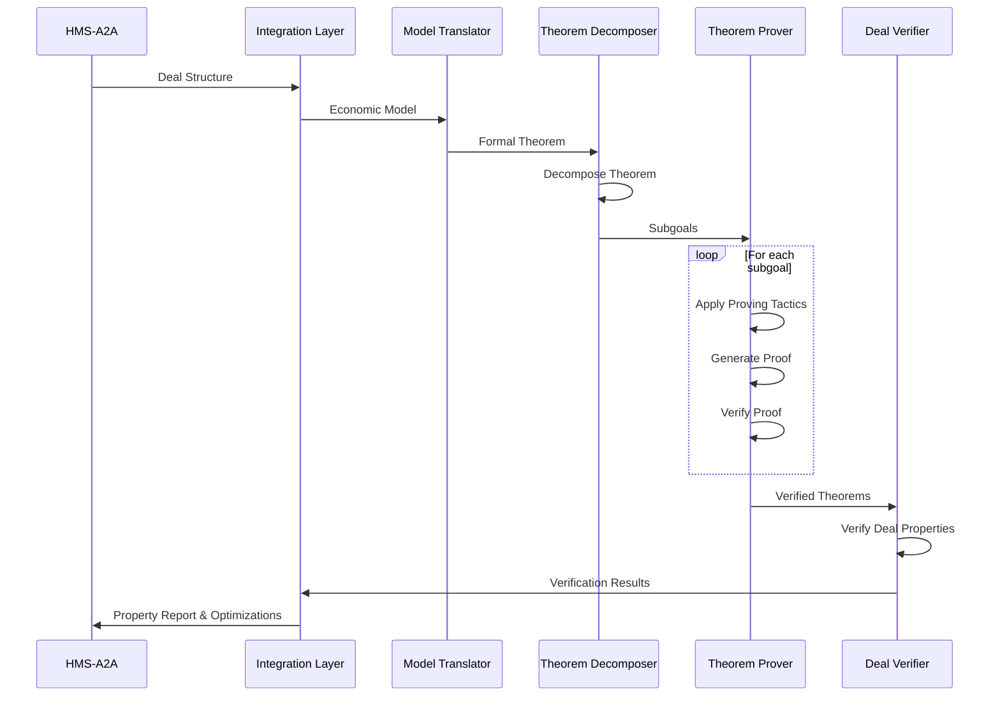
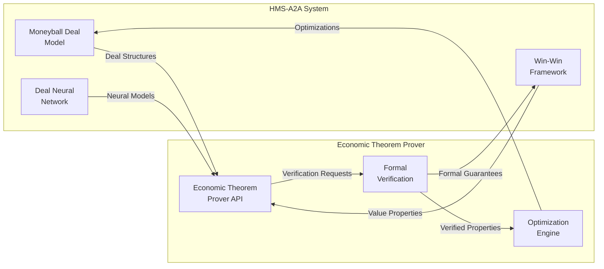
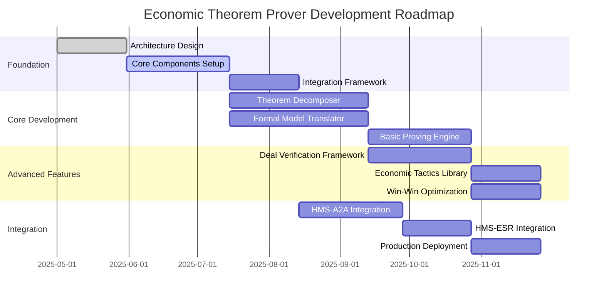

# Economic Theorem Prover Architecture

This document outlines the high-level and detailed architecture for the Economic Theorem Prover system based on DeepSeek-Prover-V2.

## System Overview

The Economic Theorem Prover is a specialized system for formal verification of economic models, deal structures, and value distribution mechanisms. It adapts DeepSeek-Prover-V2's recursive theorem proving architecture to the economic domain, with particular focus on verifying win-win properties and optimizing deal structures within the HMS ecosystem.

## High-Level Architecture

## Component Details

### 1. Economic Theorem Decomposition Engine

**Key Components:**
- **Theorem Parser**: Processes input economic theorems into structured representations
- **Economic Semantics Analyzer**: Analyzes economic meaning and identifies key components
- **Recursive Decomposer**: Breaks down theorems into subgoals using DeepSeek-V3 architecture
- **Decomposition Validator**: Verifies correctness of decomposition

### 2. Formal Economic Model Translator

**Key Components:**
- **Model Extractor**: Extracts components from economic models and deal structures
- **Type System Mapper**: Maps economic concepts to formal mathematical types
- **Formal Structure Builder**: Constructs formal mathematical structures
- **Lean 4 Code Generator**: Generates Lean 4 theorem statements and definitions
- **Translation Verifier**: Ensures correctness of the translation

### 3. Theorem Proving Engine

**Key Components:**
- **Proving Scheduler**: Manages proving tasks and dependencies
- **LLM-Powered Prover**: Leverages DeepSeek-Prover-V2 for automated proof generation
- **Economic Tactician**: Provides specialized tactics for economic theorem proving
- **Proof Evaluator**: Evaluates correctness of proof steps
- **Proof Assembler**: Combines subproofs into complete theorem proofs

### 4. Deal Structure Verification Framework

**Key Components:**
- **Property Extractor**: Identifies properties to verify in deal structures
- **Win-Win Verifier**: Verifies win-win properties of deals
- **Fairness Prover**: Proves fairness and optimal value distribution
- **Risk Verifier**: Verifies risk-related properties
- **Verification Result Generator**: Produces comprehensive verification reports

### 5. Integration Layer

**Key Components:**
- **API Gateway**: Provides unified API access to theorem proving capabilities
- **Model Connector**: Connects to HMS-A2A models and extracts relevant data
- **Data Transformer**: Transforms data between HMS-A2A and theorem prover formats
- **Result Handler**: Processes verification results for HMS-A2A consumption
- **Proof Visualizer**: Creates visualizations of proofs and verification results

## Data Flow

## Integration Points

### HMS-A2A Integration

## Development Roadmap

## Architecture Principles

1. **Domain-Specific Specialization**: Tailor DeepSeek-Prover-V2 architecture for economic theorems
2. **Modular Design**: Enable component-wise development and enhancement
3. **Verified Translation**: Ensure correctness of translations between economic and formal domains
4. **Recursive Decomposition**: Apply the recursive theorem proving technique to economic problems
5. **Seamless Integration**: Provide natural integration with HMS-A2A components

## Performance Considerations

- **Theorem Complexity Handling**: Use hierarchical decomposition for complex economic theorems
- **Proof Caching**: Cache common proof patterns to improve performance
- **Parallel Subgoal Solving**: Process independent subgoals in parallel
- **Adaptive Proving Strategies**: Select proving strategies based on theorem characteristics
- **Progressive Verification**: Implement tiered verification based on deal complexity

This architecture provides a comprehensive framework for implementing the Economic Theorem Prover system, adapting DeepSeek-Prover-V2's powerful recursive theorem proving capabilities to the economic domain while ensuring seamless integration with the HMS ecosystem.