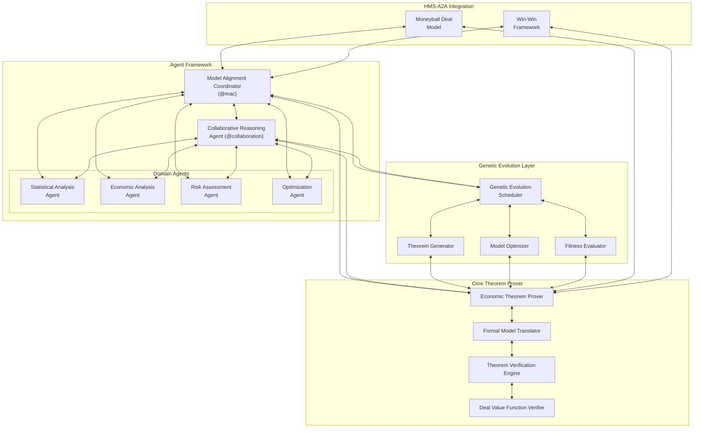
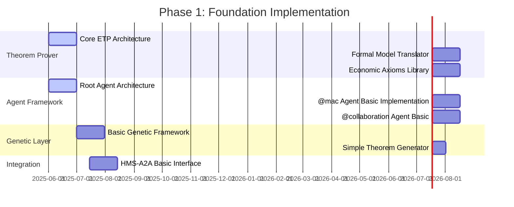
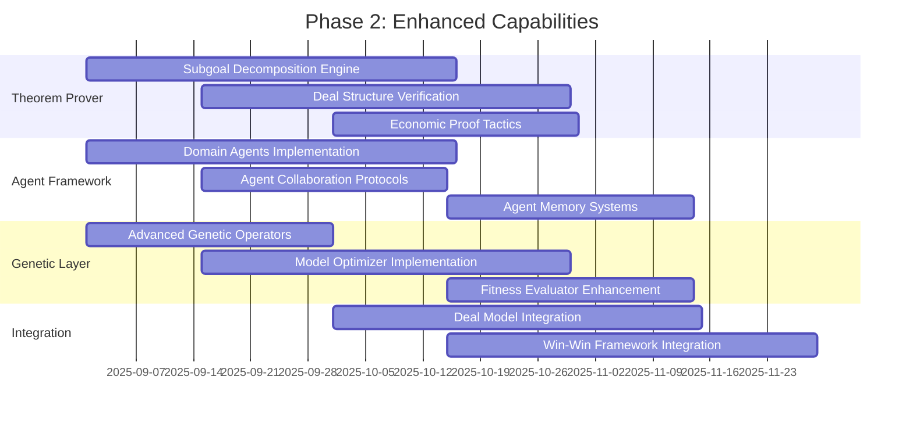
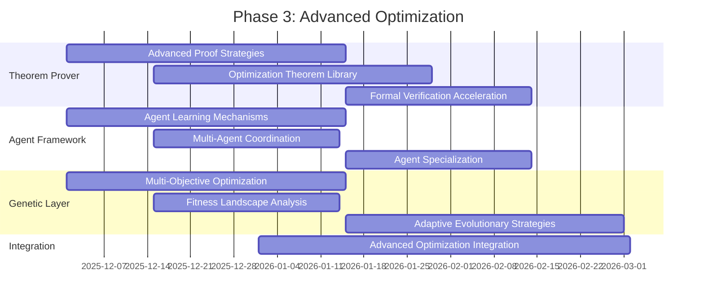
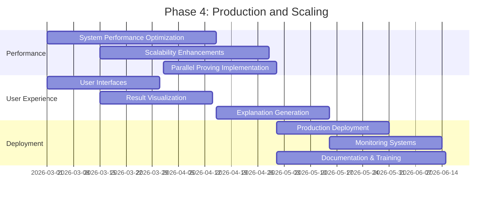
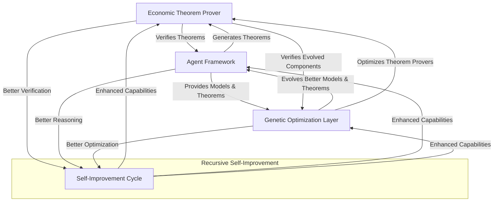

# Economic Theorem Prover: Comprehensive Implementation Plan

## 1. Executive Summary

This comprehensive implementation plan outlines a multi-phase approach to develop a robust Economic Theorem Proving (ETP) ecosystem that leverages DeepSeek-Prover-V2's formal verification capabilities for economic models. The system integrates three core components:

1. **Economic Theorem Prover (ETP)**: A formal verification engine based on DeepSeek-Prover-V2 customized for economic theorems.
2. **Agent Framework**: A hierarchical agent architecture for economic reasoning and theorem generation.
3. **Genetic Optimization Layer**: An evolutionary system for continually improving economic models and theorems.

The implementation follows a recursive, self-improving approach where formal verification capabilities enhance agent reasoning, while genetic optimization improves the system's performance over time.

## 2. System Architecture Overview

## 3. Core Theorem Prover Implementation

### 3.1 Subgoal Decomposition Engine

**Purpose:** Break complex economic theorems into manageable subgoals.

**Components:**
- **Theorem Parser**: Analyzes economic theorems and identifies structure
- **Decomposition Strategies**:
  - Problem-space decomposition (breaking problems into sub-problems)
  - Domain-specific decomposition (using economic domain knowledge)
  - Recursive decomposition (applying decomposition to resulting subgoals)
- **Verification Planning**: Determines optimal verification strategy for each subgoal

**Implementation Strategy:**
1. Adapt DeepSeek-V3 for economic theorem decomposition
2. Implement economic domain-specific tokenization and parsing
3. Create specialized decomposition heuristics for economic theorems
4. Develop subgoal dependency tracking and management

### 3.2 Formal Economic Model Translator

**Purpose:** Translate economic models into formal mathematical representations.

**Components:**
- **Type System Mapper**: Maps economic concepts to formal types
- **Property Extractor**: Identifies verifiable properties in economic models
- **Translation Verifier**: Ensures correctness of translations
- **Lean 4 Code Generator**: Produces formal code for theorem verification

**Implementation Strategy:**
1. Create typing rules for economic concepts (stakeholders, values, deals, etc.)
2. Implement bidirectional translation between economic and formal domains
3. Develop verification mechanisms for translation correctness
4. Build a library of economic axioms and theorems

### 3.3 Economic Theorem Proving Core

**Purpose:** Apply formal verification to economic theorems.

**Components:**
- **Proving Scheduler**: Manages proving tasks and resource allocation
- **Proving Tactics Library**: Economic-specific proving strategies
- **Recursive Proving Engine**: Solves decomposed subgoals
- **Proof Assembler**: Combines subproofs into complete theorem proofs

**Implementation Strategy:**
1. Adapt DeepSeek-Prover-V2's reinforcement learning for economic domain
2. Implement economic-specific proof tactics
3. Create a curriculum of progressively challenging economic theorems
4. Develop specialized proof verification for economic properties

### 3.4 Deal Structure Verification Framework

**Purpose:** Verify mathematical properties of deal structures.

**Components:**
- **Win-Win Verifier**: Verifies win-win properties of deals
- **Fairness Prover**: Verifies fairness properties
- **Risk Verifier**: Verifies risk-related properties
- **Optimization Verifier**: Verifies optimality properties

**Implementation Strategy:**
1. Formalize core economic properties (win-win, fairness, etc.)
2. Implement specialized verification for each property type
3. Create property-specific proof strategies
4. Build a library of verification patterns for common deal structures

## 4. Agent Framework Implementation

### 4.1 Root Agent Architecture

**Purpose:** Establish foundational agent capabilities for economic reasoning and theorem generation.

**Core Agent Components:**
- **Perception Module**: Processes economic data and model structures
- **Reasoning Engine**: Applies economic reasoning to generate and evaluate hypotheses
- **Theorem Formulation**: Converts economic insights into formal theorem statements
- **Verification Interface**: Communicates with the theorem prover
- **Decision Making**: Makes economic decisions based on verified properties
- **Memory System**: Stores and retrieves past theorems, proofs, and insights

**Implementation Strategy:**
1. Develop a unified agent protocol for economic reasoning
2. Implement core reasoning patterns for economic theorem generation
3. Create interfaces for agent-prover communication
4. Build persistence mechanisms for theorems and proofs

### 4.2 Model Alignment Coordinator (@mac)

**Purpose:** Coordinates alignment between economic models and formal verification.

**Specialized Capabilities:**
- **Model Structure Analysis**: Analyzes economic model structures
- **Formal Alignment Checking**: Verifies alignment between models and formal representations
- **Translation Supervision**: Oversees translation between domains
- **Inconsistency Detection**: Identifies inconsistencies between models and formal representations
- **Uncertainty Quantification**: Quantifies uncertainty in economic models
- **Context Management**: Maintains economic context for theorem proving

**Implementation Strategy:**
1. Implement economic model structural analysis
2. Create bidirectional mappings between economic and formal domains
3. Develop metrics for model alignment quality
4. Build inconsistency detection and resolution mechanisms

### 4.3 Collaborative Reasoning Agent (@collaboration)

**Purpose:** Facilitates collaborative theorem proving and economic reasoning.

**Specialized Capabilities:**
- **Multi-Agent Coordination**: Coordinates multiple reasoning agents
- **Reasoning Synthesis**: Synthesizes multiple lines of reasoning
- **Insight Integration**: Integrates insights from diverse sources
- **Conflict Resolution**: Resolves conflicts in economic reasoning
- **Collective Theorem Refinement**: Collaboratively refines theorem statements
- **Proof Validation**: Validates proofs through multiple perspectives

**Implementation Strategy:**
1. Implement agent communication protocols for collaborative reasoning
2. Create synthesis mechanisms for diverse reasoning approaches
3. Develop conflict detection and resolution strategies
4. Build collaborative proof refinement processes

### 4.4 Domain-Specific Agents

#### 4.4.1 Statistical Analysis Agent

**Purpose:** Applies statistical reasoning to economic theorems.

**Specialized Capabilities:**
- **Statistical Model Verification**: Verifies statistical properties of economic models
- **Distribution Analysis**: Analyzes probability distributions in economic contexts
- **Uncertainty Propagation**: Tracks uncertainty through economic theorems
- **Risk Quantification**: Quantifies risks in economic scenarios

#### 4.4.2 Economic Analysis Agent

**Purpose:** Applies economic theory to theorem formulation and verification.

**Specialized Capabilities:**
- **Economic Principle Application**: Applies economic principles to theorem formulation
- **Market Dynamics Analysis**: Analyzes market dynamics in economic theorems
- **Game Theory Application**: Applies game theory to economic scenarios
- **Incentive Structure Analysis**: Analyzes incentive structures in deals

#### 4.4.3 Risk Assessment Agent

**Purpose:** Specializes in risk-related properties and theorems.

**Specialized Capabilities:**
- **Risk Factor Identification**: Identifies risk factors in economic models
- **Risk Distribution Analysis**: Analyzes risk distribution across stakeholders
- **Risk Mitigation Theorem Generation**: Generates theorems about risk mitigation
- **Stress Testing**: Applies stress testing to economic models

#### 4.4.4 Optimization Agent

**Purpose:** Specializes in optimization theorems and properties.

**Specialized Capabilities:**
- **Objective Function Formulation**: Formulates objective functions for optimization
- **Constraint Identification**: Identifies constraints in economic models
- **Optimization Theorem Generation**: Generates theorems about optimal solutions
- **Solution Space Exploration**: Explores solution spaces for economic problems

## 5. Genetic Evolution Layer

### 5.1 Genetic Optimization Framework

**Purpose:** Continuously improve economic theorems and models through evolutionary algorithms.

**Core Components:**
- **Population Management**: Manages populations of theorems and models
- **Genetic Operators**: Implements mutation, crossover, and selection
- **Fitness Evaluation**: Evaluates the quality of theorems and models
- **Evolution Scheduler**: Schedules evolutionary processes
- **Convergence Monitoring**: Monitors convergence of evolutionary processes

**Implementation Strategy:**
1. Design theorem and model representations for genetic algorithms
2. Implement genetic operators for economic theorems
3. Create fitness functions for theorem quality
4. Build scheduling mechanisms for evolutionary processes

### 5.2 Theorem Generator

**Purpose:** Generates and evolves economic theorems.

**Components:**
- **Theorem Templates**: Templates for common economic theorem patterns
- **Mutation Operators**: Operators for mutating theorem statements
- **Crossover Mechanisms**: Mechanisms for combining theorems
- **Novelty Detection**: Identifies novel and interesting theorems
- **Theorem Validation**: Validates generated theorems for well-formedness

**Implementation Strategy:**
1. Create a library of economic theorem templates
2. Implement specialized mutation operators for economic theorems
3. Design crossover mechanisms that preserve theorem semantics
4. Develop novelty metrics for economic theorems

### 5.3 Model Optimizer

**Purpose:** Optimizes economic models through genetic algorithms.

**Components:**
- **Model Representation**: Represents economic models for genetic optimization
- **Model Mutation**: Mutates economic model parameters and structures
- **Model Crossover**: Combines economic models
- **Model Evaluation**: Evaluates economic models against objectives
- **Model Selection**: Selects economic models for the next generation

**Implementation Strategy:**
1. Design economic model representation for genetic algorithms
2. Implement model mutation operators that preserve economic validity
3. Create model crossover mechanisms that combine economic features
4. Develop evaluation metrics for economic model quality

### 5.4 Fitness Evaluator

**Purpose:** Evaluates the fitness of theorems and models.

**Components:**
- **Theorem Fitness Metrics**: Metrics for theorem quality
- **Model Fitness Metrics**: Metrics for model quality
- **Multi-Objective Evaluation**: Evaluates against multiple objectives
- **Pareto Front Tracking**: Tracks Pareto-optimal solutions
- **Fitness Landscape Analysis**: Analyzes fitness landscapes for guidance

**Implementation Strategy:**
1. Design comprehensive fitness metrics for economic theorems
2. Implement multi-objective evaluation for economic models
3. Create Pareto front tracking mechanisms
4. Develop fitness landscape analysis tools

## 6. Integration with HMS-A2A

### 6.1 Moneyball Deal Model Integration

**Purpose:** Integrate the Economic Theorem Prover with the Moneyball Deal Model.

**Integration Points:**
- **Deal Structure Extraction**: Extracts deal structures for verification
- **Formal Property Verification**: Verifies formal properties of deals
- **Theorem Application**: Applies verified theorems to deal analysis
- **Optimization Suggestion**: Suggests deal optimizations based on theorems
- **Win-Win Verification**: Verifies win-win properties of deals

**Implementation Strategy:**
1. Create extractors for deal structures from the Moneyball model
2. Implement property mapping between models
3. Develop bidirectional data flow between systems
4. Build optimization suggestion mechanisms

### 6.2 Win-Win Calculation Framework Integration

**Purpose:** Integrate the Economic Theorem Prover with the Win-Win Calculation Framework.

**Integration Points:**
- **Win-Win Property Extraction**: Extracts win-win properties for verification
- **Formal Win-Win Verification**: Formally verifies win-win properties
- **Theorem Application**: Applies theorems to win-win analysis
- **Optimization Suggestion**: Suggests win-win optimizations based on theorems
- **Value Distribution Verification**: Verifies value distribution properties

**Implementation Strategy:**
1. Create extractors for win-win properties
2. Implement formal verification of win-win conditions
3. Develop theorem application mechanisms for win-win analysis
4. Build optimization suggestion mechanisms for win-win properties

## 7. Implementation Phases

### Phase 1: Foundation (Months 1-3)

**Key Deliverables:**
- Core Economic Theorem Prover implementation
- Basic agent framework with @mac and @collaboration agents
- Fundamental genetic optimization framework
- Initial HMS-A2A integration points

### Phase 2: Enhanced Capabilities (Months 4-6)

**Key Deliverables:**
- Enhanced theorem proving with subgoal decomposition
- Complete domain agent implementations
- Advanced genetic optimization capabilities
- Comprehensive HMS-A2A integration

### Phase 3: Advanced Optimization (Months 7-9)

**Key Deliverables:**
- Advanced proof strategies for complex economic theorems
- Sophisticated agent learning and coordination mechanisms
- Multi-objective genetic optimization
- Comprehensive optimization integration with HMS-A2A

### Phase 4: Production and Scaling (Months 10-12)

**Key Deliverables:**
- Optimized, scalable system ready for production
- Comprehensive user interfaces and visualizations
- Production deployment with monitoring
- Complete documentation and training materials

## 8. Recursive Self-Improvement Mechanism

The system employs a recursive self-improvement approach, where formal verification enhances agent reasoning, while genetic optimization improves the system's performance over time:

### 8.1 Self-Improvement Mechanisms

1. **Theorem Quality Improvement**:
   - Agents generate theorems
   - Theorem prover verifies them
   - Genetic algorithms evolve better theorems
   - Agents learn from improved theorems

2. **Model Quality Improvement**:
   - Agents analyze economic models
   - Theorem prover verifies model properties
   - Genetic algorithms evolve better models
   - Agents learn from improved models

3. **Reasoning Improvement**:
   - Agents reason about economic problems
   - Formal verification validates reasoning
   - Genetic algorithms evolve better reasoning strategies
   - Agents incorporate improved reasoning

4. **Verification Improvement**:
   - Theorem prover verifies properties
   - Agents analyze verification results
   - Genetic algorithms evolve better verification strategies
   - Theorem prover incorporates improved strategies

## 9. Evaluation Framework

### 9.1 Theorem Proving Performance

**Metrics:**
- Success rate on economic theorem benchmarks
- Proof complexity handling capabilities
- Performance on recursive economic theorems
- Time to solution for various theorem types

**Evaluation Strategy:**
1. Create comprehensive benchmark of economic theorems
2. Develop automated evaluation pipeline
3. Track performance across system iterations
4. Compare with baseline approaches

### 9.2 Agent Performance

**Metrics:**
- Theorem generation quality
- Reasoning accuracy
- Collaboration effectiveness
- Decision quality based on theorem verification

**Evaluation Strategy:**
1. Design agent evaluation scenarios
2. Implement automated agent evaluation
3. Conduct human-in-the-loop evaluations
4. Track agent performance across system iterations

### 9.3 Genetic Optimization Performance

**Metrics:**
- Convergence rate on optimization tasks
- Quality of evolved theorems and models
- Diversity of solutions
- Pareto front coverage

**Evaluation Strategy:**
1. Create optimization benchmark scenarios
2. Implement automated genetic performance tracking
3. Analyze solution quality and diversity
4. Track optimization performance across system iterations

### 9.4 System Integration Performance

**Metrics:**
- End-to-end performance on HMS-A2A integration
- Deal optimization effectiveness
- Win-win property verification accuracy
- System throughput and scalability

**Evaluation Strategy:**
1. Design integrated system benchmarks
2. Implement automated integration testing
3. Conduct real-world case studies
4. Track integration performance across system iterations

## 10. Risk Management

| Risk Category | Risk Description | Probability | Impact | Mitigation Strategy |
|---------------|------------------|------------|--------|---------------------|
| **Technical** | Theorem proving complexity exceeds capabilities | Medium | High | Progressive curriculum learning, subgoal decomposition |
| **Technical** | Economic model translation errors | Medium | High | Rigorous translation verification, consistency checks |
| **Technical** | Genetic algorithm convergence issues | Medium | Medium | Adaptive evolutionary strategies, diversity preservation |
| **Technical** | Agent reasoning failures | Medium | Medium | Multi-agent verification, reasoning diversity |
| **Integration** | HMS-A2A integration challenges | High | Medium | Incremental integration, comprehensive testing |
| **Integration** | Data format incompatibilities | Medium | Medium | Robust data transformation layer, validation |
| **Performance** | Scaling limitations | Medium | High | Distributed proving, parallel verification |
| **Performance** | Resource consumption issues | High | Medium | Efficient resource allocation, optimization |
| **Theoretical** | Limitations in economic formalization | High | High | Incremental formalization, domain expert collaboration |
| **Theoretical** | Theorem proving undecidability | Medium | High | Bounded verification, approximation techniques |

## 11. Governance and Quality Assurance

### 11.1 Development Governance

**Development Methodology:**
- Agile development with 2-week sprints
- Continuous integration and deployment
- Regular system architecture reviews
- Comprehensive automated testing

**Quality Assurance Process:**
1. Unit testing for all components
2. Integration testing for component interactions
3. System testing for end-to-end functionality
4. Formal verification of critical system components
5. Performance testing for scalability

### 11.2 Theorem Quality Assurance

**Theorem Verification Process:**
1. Syntactic well-formedness checking
2. Semantic consistency verification
3. Formal proof verification
4. Economic soundness validation
5. Domain expert review

**Model Quality Assurance:**
1. Model consistency checking
2. Property preservation verification
3. Translation correctness verification
4. Economic soundness validation
5. Domain expert review

## 12. Conclusion

The Economic Theorem Prover implementation plan outlines a comprehensive approach to developing a powerful system for formal verification of economic models. By integrating DeepSeek-Prover-V2's capabilities with a sophisticated agent framework and genetic optimization layer, the system will provide robust formal verification for economic theorems, enhancing the HMS ecosystem's capabilities for economic reasoning and deal optimization.

The recursive self-improvement mechanisms ensure that the system continues to evolve and improve over time, while the comprehensive evaluation framework ensures that progress is systematically tracked and verified. The risk management and governance frameworks provide safeguards against potential issues and ensure high quality throughout the development process.

This implementation plan provides a solid foundation for developing a state-of-the-art system that bridges the gap between formal mathematics and economic reasoning, enabling new levels of confidence in economic models and deal structures within the HMS ecosystem.