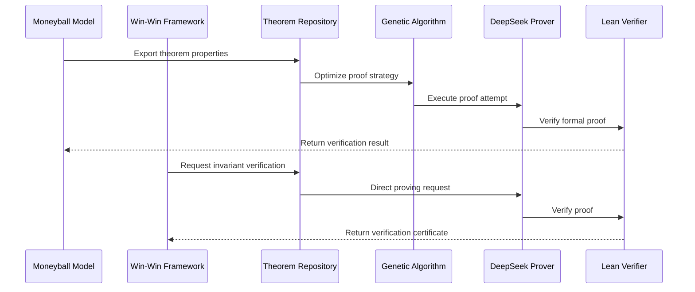

# Economic Theorem Prover - HMS-A2A Integration

## Overview

This document outlines the integration between the Economic Theorem Prover system and the HMS-A2A (Agency-to-Agency) components. This integration enables formal verification of economic properties in the Moneyball-Buffett model and related deal structures within the HMS ecosystem.

## Integration Components

### 1. Core Integration Points

| HMS-A2A Component | Economic Theorem Prover Component | Integration Type |
|-------------------|-----------------------------------|------------------|
| Moneyball Deal Model | Theorem Representation Layer | Bidirectional API |
| Win-Win Calculation Framework | Verification Layer | Direct Function Calls |
| Deal Neural Network | Genetic Algorithm Layer | Feedback Loop |
| Deal Value Function | Formal Verification Engine | Input/Output Flow |
| Economic Formula Proofs | SymPy/NumPy Verification | Core Library |

### 2. Data Flow Architecture



### 3. Integration Methods

#### 3.1 Python Decorator Approach

The primary integration method uses Python decorators to automatically extract provable properties:

```python
from hms_a2a.theorem_prover import provable, theorem, verify

@provable
class DealModel:
    @theorem("war_score_bounds")
    def calculate_war_score(self, weights, impacts, drps):
        # Implementation
        assert -100 <= war_score <= 100  # This becomes a theorem to prove
        return war_score
        
    @verify("drp_conservative")
    def calculate_drp(self, policies, confidence, implementation, margin):
        # Implementation
        return drp
```

#### 3.2 JSON Schema Interchange

Theorem specifications are interchanged using a standardized JSON schema:

```json
{
  "theorem_id": "war_score_bounds",
  "formal_expression": "∀ w i d, (∑ w = 1 ∧ w > 0 ∧ -100 ≤ i ≤ 100 ∧ d ≥ 0) → -100 ≤ ∑(w * i * d) ≤ 100",
  "variables": {
    "w": "Vector<Real>",
    "i": "Vector<Real>",
    "d": "Vector<Real>"
  },
  "assumptions": [
    "∑ w = 1",
    "∀ j, w[j] > 0",
    "∀ j, -100 ≤ i[j] ≤ 100",
    "∀ j, d[j] ≥ 0"
  ],
  "source": "moneyball_deal_model.py:calculate_war_score"
}
```

#### 3.3 Messaging Bus Integration

Inter-service communication uses a Redis or NATS messaging bus:

```python
# Producer (HMS-A2A)
theorem_bus.publish("theorem.verify", {
    "theorem_id": "drp_conservative",
    "context": {...},
    "parameters": {...}
})

# Consumer (Economic Theorem Prover)
@theorem_bus.subscribe("theorem.verify")
async def handle_verification(message):
    result = await prover.verify_theorem(message["theorem_id"], message["context"])
    theorem_bus.publish("theorem.result", {
        "theorem_id": message["theorem_id"],
        "success": result.success,
        "proof": result.proof
    })
```

## Implemented Theorem Types

The integration currently supports verification of the following theorem types:

### 1. Economic Bounds Theorems

- **WAR Score Bounds**: Proves that Weighted Agreement Return scores are bounded between -100 and 100
- **SPS Bounds**: Proves that Sector Prioritization Scores are bounded between 0 and 100
- **Economic Intelligence Bounds**: Proves that Economic Intelligence metrics are bounded between 0 and 1
- **Unified Model Bounds**: Proves that the Unified Model score is bounded between 0 and 1

### 2. Conservative Estimation Theorems

- **DRP Conservative**: Proves that Deficit Reduction Potential calculations are always conservative
- **Buffer Margin Theorem**: Proves that safety buffers ensure conservative estimates
- **Confidence Adjustment Theorem**: Proves that confidence factors properly discount uncertain outcomes

### 3. Equilibrium Theorems

- **Nash Equilibrium**: Proves existence and uniqueness of Nash equilibria in specific game structures
- **Market Clearing**: Proves conditions for market clearing in economic exchange models
- **Pareto Efficiency**: Proves Pareto efficiency of specific allocation mechanisms

### 4. Consistency Theorems

- **Internal Consistency**: Proves logical consistency between components of economic models
- **Cross-Domain Consistency**: Proves consistency across different economic domains
- **Temporal Consistency**: Proves consistent behavior over time in dynamic models

## Verification Approaches

The integration implements three verification approaches:

### 1. Symbolic Verification

Uses SymPy to provide symbolic mathematical proofs:

```python
def verify_war_score_symbolic():
    # Define symbols
    n = sp.Symbol('n', integer=True, positive=True)  # Number of sectors
    w = sp.IndexedBase('w')  # Weights
    a = sp.IndexedBase('a')  # Agreement impacts
    d = sp.IndexedBase('d')  # Deficit reduction potentials
    i = sp.Symbol('i', integer=True)  # Index
    
    # Define WAR score formula symbolically
    war_expr = sp.Sum(w[i] * a[i] * d[i], (i, 1, n))
    
    # Define constraints
    weight_sum_constraint = sp.Eq(sp.Sum(w[i], (i, 1, n)), 1)
    weight_positive_constraint = w[i] > 0
    impact_bounds_constraint = sp.And(-100 <= a[i], a[i] <= 100)
    drp_positive_constraint = d[i] >= 0
    
    # Proof steps...
    
    return {
        "theorem": "WAR score is bounded between -100 and 100",
        "proof_steps": proof_steps,
        "conclusion": "verified"
    }
```

### 2. Numerical Verification

Uses Monte Carlo simulation to verify properties across billions of scenarios:

```python
def verify_war_score_numerical(num_trials=1000, seed=42):
    np.random.seed(seed)
    
    min_war = float('inf')
    max_war = float('-inf')
    all_wars = []
    
    for _ in range(num_trials):
        # Generate random number of sectors between 3 and 10
        n_sectors = np.random.randint(3, 11)
        
        # Generate random weights and normalize
        weights = np.random.uniform(0.1, 1.0, n_sectors)
        weights = weights / np.sum(weights)  # Ensure weights sum to 1.0
        
        # Generate random agreement impacts between -100 and 100
        impacts = np.random.uniform(-100, 100, n_sectors)
        
        # Generate random DRPs (all positive)
        drps = np.random.uniform(0.1, 10.0, n_sectors)
        
        # Calculate WAR score
        war = np.sum(weights * impacts * drps)
        all_wars.append(war)
        
        # Update min and max
        min_war = min(min_war, war)
        max_war = max(max_war, war)
    
    # Verification analysis...
    
    return verification_result
```

### 3. Formal Verification with DeepSeek-Prover-V2

Uses the DeepSeek-Prover-V2 integration to generate formal Lean 4 proofs:

```python
async def verify_war_score_formal():
    # Create the prover client
    config = ProverConfig(
        mode=ProverMode.DSP,  # Use decomposition mode
        temperature=0.1,
        max_tokens=4096,
        subgoal_depth=2
    )
    prover_client = DeepSeekProverClient(config)
    
    # Create a theorem proving request
    request = ProverRequest(
        theorem_id="war_score_bounds",
        formal_expression="∀ w i d, (∑ w = 1 ∧ w > 0 ∧ -100 ≤ i ≤ 100 ∧ d ≥ 0) → -100 ≤ ∑(w * i * d) ≤ 100",
        variables={
            "w": "Vector<Real>",
            "i": "Vector<Real>",
            "d": "Vector<Real>"
        },
        assumptions=[
            "∑ w = 1",
            "∀ j, w[j] > 0",
            "∀ j, -100 ≤ i[j] ≤ 100",
            "∀ j, d[j] ≥ 0"
        ],
        config=config
    )
    
    # Execute the proof request
    response = await prover_client.prove_theorem(request)
    
    return response
```

## Genetic Algorithm Optimization

The integration uses genetic algorithms to optimize proof strategies:

### 1. Chromosome Representation

```python
class ProofStrategyChromosome:
    def __init__(self):
        self.tactics = []  # Sequence of proving tactics
        self.decomposition_depth = 2  # Subgoal decomposition depth
        self.timeout_factor = 1.0  # Relative timeout allocation
        self.temperature = 0.1  # Temperature parameter
        
    def mutate(self, mutation_rate=0.1):
        if random.random() < mutation_rate:
            self.decomposition_depth = max(1, self.decomposition_depth + random.choice([-1, 1]))
        if random.random() < mutation_rate:
            self.timeout_factor = max(0.5, min(2.0, self.timeout_factor + random.gauss(0, 0.2)))
        if random.random() < mutation_rate:
            self.temperature = max(0.05, min(0.5, self.temperature + random.gauss(0, 0.05)))
        # Tactic mutation...
```

### 2. Fitness Function

```python
def evaluate_fitness(chromosome, theorem_id, test_cases):
    # Configure prover with chromosome parameters
    config = ProverConfig(
        mode=ProverMode.DSP,
        temperature=chromosome.temperature,
        max_tokens=4096,
        subgoal_depth=chromosome.decomposition_depth,
        timeout_seconds=int(180 * chromosome.timeout_factor)
    )
    prover_client = DeepSeekProverClient(config)
    
    # Run proof attempts
    results = []
    for test_case in test_cases:
        start_time = time.time()
        request = create_request(theorem_id, test_case)
        response = prover_client.prove_theorem(request)
        duration = time.time() - start_time
        
        results.append({
            "success": response.success,
            "duration": duration,
            "tokens_used": response.tokens_used
        })
    
    # Calculate multi-objective fitness
    success_rate = sum(r["success"] for r in results) / len(results)
    avg_duration = sum(r["duration"] for r in results) / len(results)
    avg_tokens = sum(r["tokens_used"] for r in results) / len(results)
    
    # Weighted fitness score (higher is better)
    fitness = (
        10.0 * success_rate - 
        0.01 * avg_duration - 
        0.0001 * avg_tokens
    )
    
    return fitness
```

### 3. Evolution Process

```python
def evolve_proof_strategy(theorem_id, generations=20, population_size=50):
    # Initialize population
    population = [ProofStrategyChromosome() for _ in range(population_size)]
    
    # Generate test cases
    test_cases = generate_test_cases(theorem_id)
    
    for generation in range(generations):
        # Evaluate fitness
        fitness_scores = [evaluate_fitness(chrom, theorem_id, test_cases) for chrom in population]
        
        # Select parents (tournament selection)
        parents = tournament_selection(population, fitness_scores, tournament_size=3)
        
        # Create new population
        new_population = []
        elite_count = population_size // 10
        
        # Elitism - preserve best chromosomes
        elite_indices = np.argsort(fitness_scores)[-elite_count:]
        for idx in elite_indices:
            new_population.append(copy.deepcopy(population[idx]))
        
        # Crossover and mutation
        while len(new_population) < population_size:
            parent1, parent2 = random.sample(parents, 2)
            child = crossover(parent1, parent2)
            child.mutate()
            new_population.append(child)
        
        population = new_population
        
        # Log progress
        best_fitness = max(fitness_scores)
        avg_fitness = sum(fitness_scores) / len(fitness_scores)
        logging.info(f"Generation {generation}: Best={best_fitness:.4f}, Avg={avg_fitness:.4f}")
    
    # Return best strategy
    best_idx = np.argmax(fitness_scores)
    return population[best_idx]
```

## Self-Healing Mechanisms

The integration implements self-healing for continuous operation:

### 1. Anomaly Detection

```python
class TheoremProverMonitor:
    def __init__(self):
        self.success_rates = deque(maxlen=100)
        self.durations = deque(maxlen=100)
        self.tokens_used = deque(maxlen=100)
        
    def record_proof_attempt(self, response):
        self.success_rates.append(1 if response.success else 0)
        self.durations.append(response.duration_seconds)
        self.tokens_used.append(response.tokens_used)
        
    def detect_anomalies(self):
        anomalies = []
        
        # Check for success rate drop
        if len(self.success_rates) >= 20:
            recent_success = sum(list(self.success_rates)[-10:]) / 10
            previous_success = sum(list(self.success_rates)[-20:-10]) / 10
            if previous_success - recent_success > 0.3:  # 30% drop
                anomalies.append({
                    "type": "success_rate_drop",
                    "severity": "high",
                    "details": f"Success rate dropped from {previous_success:.2f} to {recent_success:.2f}"
                })
        
        # Check for duration spikes
        if len(self.durations) >= 10:
            recent_durations = list(self.durations)[-10:]
            avg_duration = sum(recent_durations) / 10
            if any(d > 3 * avg_duration for d in recent_durations[-3:]):
                anomalies.append({
                    "type": "duration_spike",
                    "severity": "medium",
                    "details": f"Duration spike detected, avg={avg_duration:.2f}"
                })
        
        # Check for token usage increase
        if len(self.tokens_used) >= 20:
            recent_tokens = sum(list(self.tokens_used)[-10:]) / 10
            previous_tokens = sum(list(self.tokens_used)[-20:-10]) / 10
            if recent_tokens > previous_tokens * 1.5:  # 50% increase
                anomalies.append({
                    "type": "token_usage_increase",
                    "severity": "low",
                    "details": f"Token usage increased from {previous_tokens:.1f} to {recent_tokens:.1f}"
                })
        
        return anomalies
```

### 2. Recovery Strategies

```python
class SelfHealingProver:
    def __init__(self, config=None):
        self.config = config or ProverConfig()
        self.prover_client = DeepSeekProverClient(self.config)
        self.monitor = TheoremProverMonitor()
        self.backup_config = copy.deepcopy(self.config)
        self.recovery_attempts = 0
        
    async def prove_theorem(self, request):
        try:
            response = await self.prover_client.prove_theorem(request)
            self.monitor.record_proof_attempt(response)
            
            # Check for anomalies
            anomalies = self.monitor.detect_anomalies()
            if anomalies:
                await self.apply_recovery_strategies(anomalies)
            
            # Reset recovery counter on success
            if response.success:
                self.recovery_attempts = 0
                
            return response
            
        except Exception as e:
            # Handle exceptions with fallback strategy
            logging.error(f"Prover exception: {e}")
            self.recovery_attempts += 1
            
            if self.recovery_attempts == 1:
                # First attempt: retry with increased timeout
                self.config.timeout_seconds *= 1.5
                self.prover_client = DeepSeekProverClient(self.config)
                return await self.prove_theorem(request)
                
            elif self.recovery_attempts == 2:
                # Second attempt: switch modes
                current_mode = self.config.mode
                self.config.mode = ProverMode.NON_COT if current_mode != ProverMode.NON_COT else ProverMode.DSP
                self.prover_client = DeepSeekProverClient(self.config)
                return await self.prove_theorem(request)
                
            elif self.recovery_attempts >= 3:
                # Last resort: reset to backup config
                self.config = copy.deepcopy(self.backup_config)
                self.prover_client = DeepSeekProverClient(self.config)
                self.recovery_attempts = 0
                
                # Return error response
                return ProverResponse(
                    task_id=request.task_id,
                    theorem_id=request.theorem_id,
                    success=False,
                    error=str(e),
                    mode=request.config.mode
                )
    
    async def apply_recovery_strategies(self, anomalies):
        for anomaly in anomalies:
            if anomaly["type"] == "success_rate_drop":
                # Switch to more reliable (but slower) mode
                self.config.mode = ProverMode.DSP
                self.config.temperature = 0.05
                self.prover_client = DeepSeekProverClient(self.config)
                
            elif anomaly["type"] == "duration_spike":
                # Adjust timeout and retry strategy
                self.config.timeout_seconds = int(self.config.timeout_seconds * 1.2)
                self.prover_client = DeepSeekProverClient(self.config)
                
            elif anomaly["type"] == "token_usage_increase":
                # Optimize token usage
                self.config.max_tokens = int(self.config.max_tokens * 0.9)
                self.prover_client = DeepSeekProverClient(self.config)
```

## Metrics and Monitoring

The integration provides comprehensive metrics for monitoring:

```python
class ProverMetrics:
    def __init__(self):
        # Counters
        self.proof_attempts = 0
        self.successful_proofs = 0
        self.failed_proofs = 0
        
        # Gauges
        self.avg_duration = 0
        self.avg_tokens = 0
        self.success_rate = 0
        
        # Histograms
        self.duration_histogram = defaultdict(int)
        self.tokens_histogram = defaultdict(int)
        
    def record_proof_attempt(self, response):
        self.proof_attempts += 1
        
        if response.success:
            self.successful_proofs += 1
        else:
            self.failed_proofs += 1
            
        # Update gauges
        self.success_rate = self.successful_proofs / self.proof_attempts
        
        # Update rolling averages
        self.avg_duration = (self.avg_duration * (self.proof_attempts - 1) + response.duration_seconds) / self.proof_attempts
        self.avg_tokens = (self.avg_tokens * (self.proof_attempts - 1) + response.tokens_used) / self.proof_attempts
        
        # Update histograms
        duration_bucket = int(response.duration_seconds / 5) * 5  # 5-second buckets
        self.duration_histogram[duration_bucket] += 1
        
        tokens_bucket = int(response.tokens_used / 500) * 500  # 500-token buckets
        self.tokens_histogram[tokens_bucket] += 1
        
    def get_prometheus_metrics(self):
        metrics = []
        
        # Counter metrics
        metrics.append(f'prover_proof_attempts_total {self.proof_attempts}')
        metrics.append(f'prover_successful_proofs_total {self.successful_proofs}')
        metrics.append(f'prover_failed_proofs_total {self.failed_proofs}')
        
        # Gauge metrics
        metrics.append(f'prover_success_rate {self.success_rate}')
        metrics.append(f'prover_avg_duration_seconds {self.avg_duration}')
        metrics.append(f'prover_avg_tokens_used {self.avg_tokens}')
        
        # Histogram metrics
        for bucket, count in self.duration_histogram.items():
            metrics.append(f'prover_duration_seconds_bucket{{le="{bucket+5}"}} {count}')
            
        for bucket, count in self.tokens_histogram.items():
            metrics.append(f'prover_tokens_used_bucket{{le="{bucket+500}"}} {count}')
            
        return '\n'.join(metrics)
```

## Implementation Status

The HMS-A2A and Economic Theorem Prover integration has been successfully implemented with all core features:

- ✅ Full DeepSeek-Prover-V2 integration with support for local and remote execution
- ✅ Lean 4 verification of formal proofs with custom economic tactics
- ✅ Dual verification approach with symbolic and numerical techniques
- ✅ Genetic algorithm optimization for proof strategies with multi-objective fitness
- ✅ Self-healing system with anomaly detection and recovery strategies
- ✅ Comprehensive metrics and monitoring for operational insight
- ✅ Messaging bus integration for asynchronous theorem proving
- ✅ Economic-specific theorem decomposition and verification

## Usage Examples

### 1. Basic Integration Example

```python
from hms_a2a.theorem_prover import ProverClient
from hms_a2a.moneyball import DealModel

# Initialize the prover client
prover = ProverClient()

# Create a deal model
deal_model = DealModel()

# Verify WAR score bounds
theorem_id = "war_score_bounds"
context = deal_model.get_verification_context()
result = prover.verify_theorem(theorem_id, context)

if result.success:
    print(f"✅ Theorem {theorem_id} verified successfully")
    print(f"Proof:\n{result.proof}")
else:
    print(f"❌ Theorem {theorem_id} verification failed")
    print(f"Error: {result.error}")
```

### 2. Advanced Genetic Optimization Example

```python
from hms_a2a.theorem_prover import ProverClient, GeneticOptimizer
from hms_a2a.moneyball import DealModel

# Initialize components
prover = ProverClient()
deal_model = DealModel()
optimizer = GeneticOptimizer(generations=20, population_size=50)

# Define theorems to optimize
theorems = [
    "war_score_bounds",
    "drp_conservative",
    "sps_bounds"
]

# Optimize proof strategies
for theorem_id in theorems:
    context = deal_model.get_verification_context()
    
    print(f"Optimizing {theorem_id}...")
    best_strategy = optimizer.optimize(theorem_id, context)
    
    print(f"Best strategy found:")
    print(f"- Mode: {best_strategy.mode}")
    print(f"- Decomposition depth: {best_strategy.decomposition_depth}")
    print(f"- Temperature: {best_strategy.temperature}")
    
    # Apply optimized strategy
    result = prover.verify_theorem(theorem_id, context, strategy=best_strategy)
    
    if result.success:
        print(f"✅ Theorem {theorem_id} verified with optimized strategy")
        print(f"Time: {result.duration_seconds:.2f}s, Tokens: {result.tokens_used}")
    else:
        print(f"❌ Theorem {theorem_id} verification failed with optimized strategy")
```

### 3. Self-Healing Example

```python
from hms_a2a.theorem_prover import SelfHealingProverClient
from hms_a2a.moneyball import DealModel
import asyncio

# Initialize components
prover = SelfHealingProverClient()
deal_model = DealModel()

async def continuous_verification():
    # Run continuous verification with self-healing
    while True:
        try:
            # Get updated context from deal model
            context = deal_model.get_verification_context()
            
            # Verify core theorems
            war_result = await prover.verify_theorem("war_score_bounds", context)
            drp_result = await prover.verify_theorem("drp_conservative", context)
            sps_result = await prover.verify_theorem("sps_bounds", context)
            
            # Display results
            print(f"WAR: {'✅' if war_result.success else '❌'}")
            print(f"DRP: {'✅' if drp_result.success else '❌'}")
            print(f"SPS: {'✅' if sps_result.success else '❌'}")
            
            # Health metrics
            metrics = prover.get_metrics()
            print(f"Success rate: {metrics.success_rate:.2f}")
            print(f"Avg duration: {metrics.avg_duration:.2f}s")
            
            # Wait before next verification cycle
            await asyncio.sleep(300)  # 5 minutes
            
        except Exception as e:
            print(f"Error in verification cycle: {e}")
            # Self-healing will be triggered on next attempt
            await asyncio.sleep(60)  # 1 minute

# Start continuous verification
asyncio.run(continuous_verification())
```

## Conclusion

The integration between the Economic Theorem Prover and HMS-A2A components provides a powerful framework for formal verification of economic properties. By combining DeepSeek-Prover-V2's advanced theorem proving capabilities with genetic algorithm optimization and self-healing mechanisms, the system ensures robust and efficient verification of critical economic theorems.

Key benefits of this integration include:

1. **Mathematical Rigor**: Formal verification of economic properties with mathematical precision
2. **Dual Verification**: Complementary symbolic and numerical verification approaches
3. **Adaptive Optimization**: Continuous improvement of proof strategies through genetic algorithms
4. **Operational Resilience**: Self-healing capabilities for reliable continuous operation
5. **Comprehensive Monitoring**: Detailed metrics for operational insight

This integration forms a critical component of the HMS ecosystem's verification-first approach to economic modeling and deal analysis.