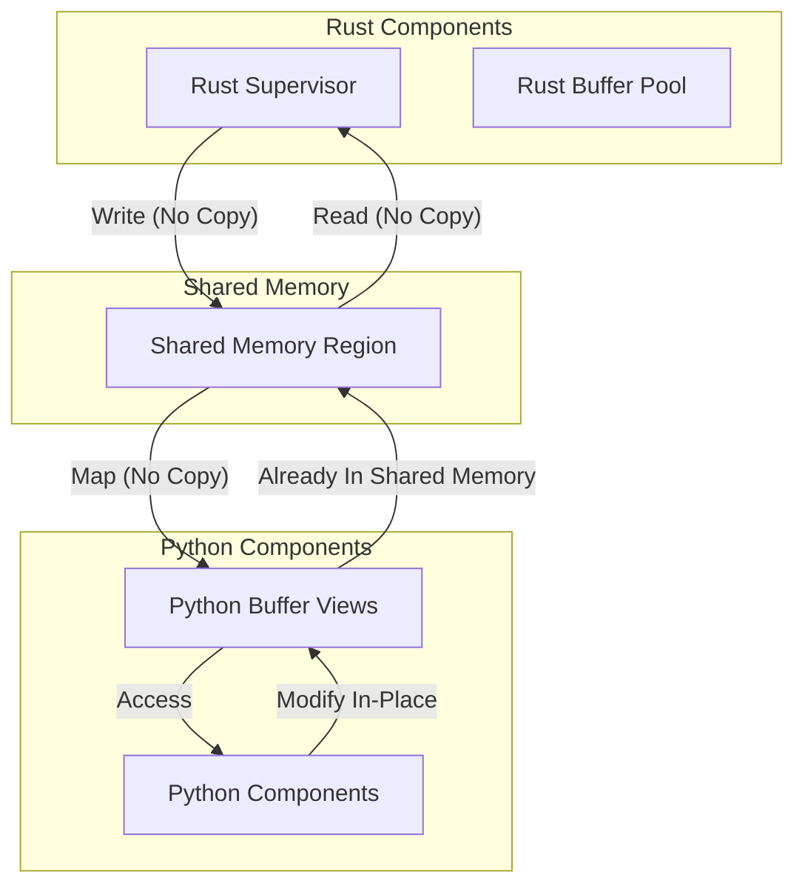
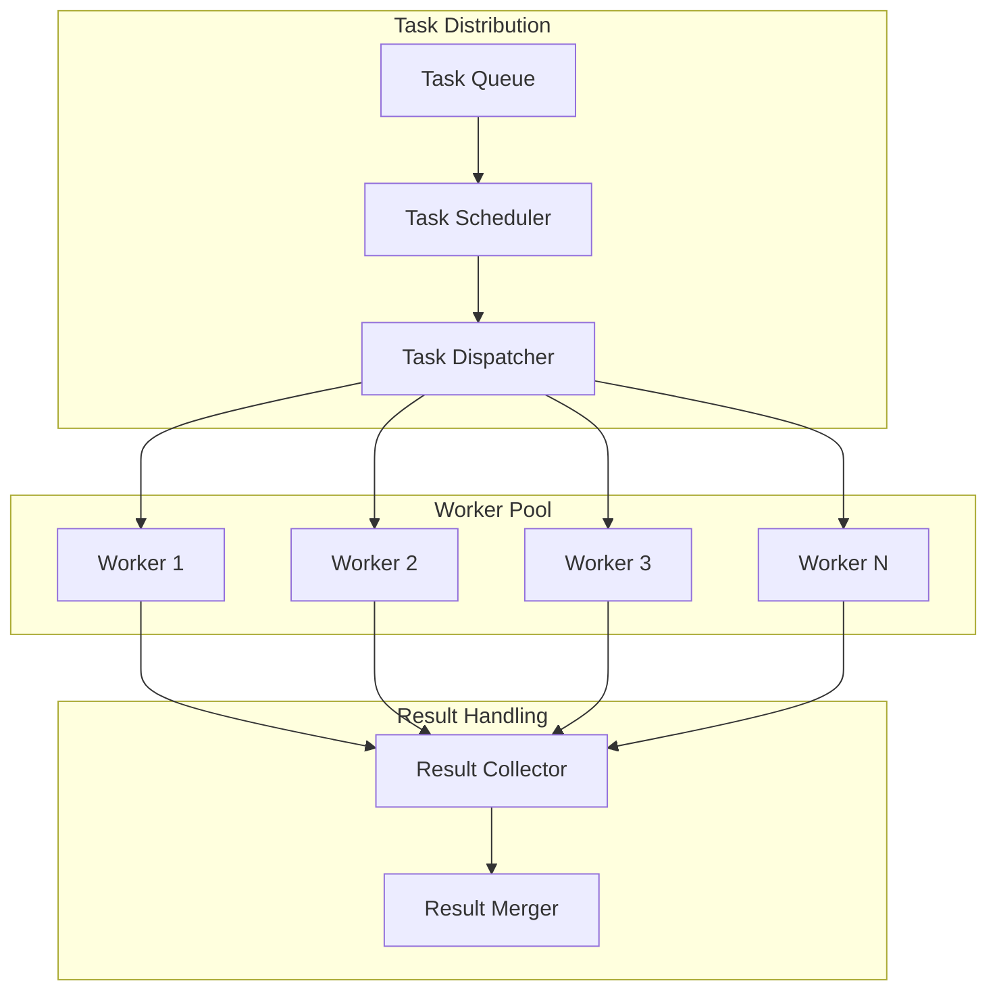
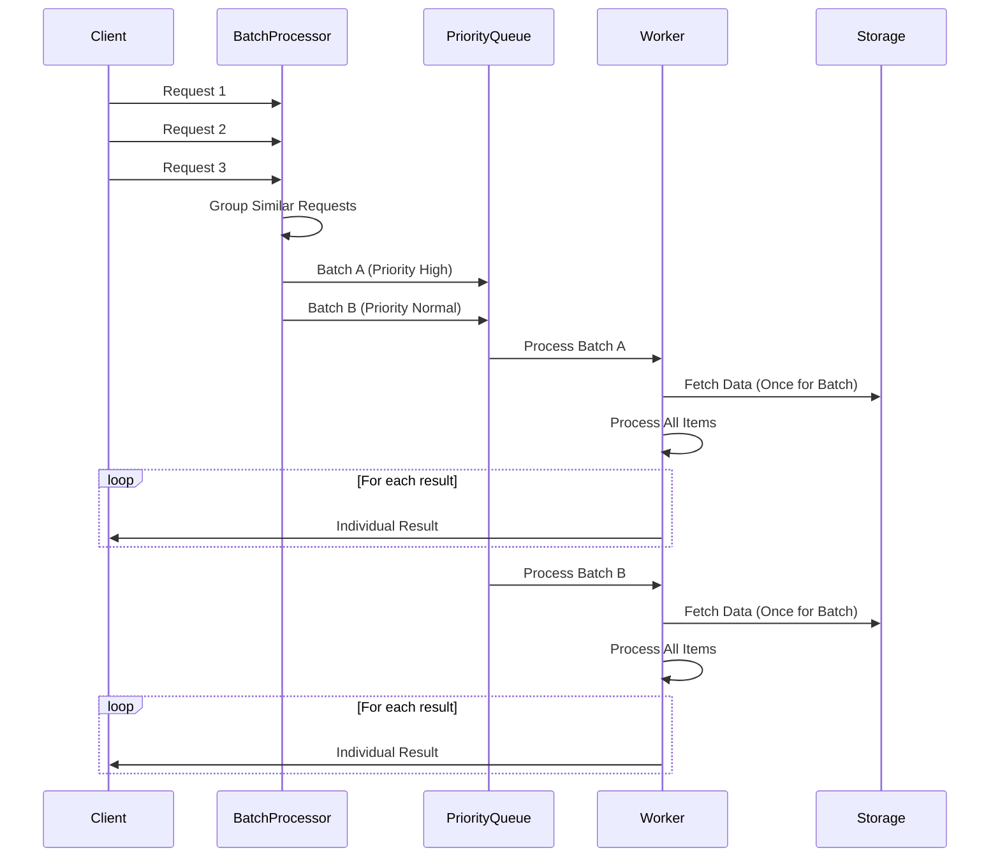

# Economic Theorem Prover - Optimization Plan

This document outlines the optimization strategy for the Economic Theorem Prover implementation, with a specific focus on the HMS-Communication components. It builds upon the unification plan and provides concrete optimization approaches.

## 1. HMS-Communication Focus

The `hms-communication` package is a critical component that enables interaction between:
1. The Rust-based HMS Supervisor
2. The Python-based theorem proving components
3. The HMS-A2A ecosystem
4. The Lean 4 theorem proving backend

Optimizing this communication layer is crucial for the overall system performance and reliability.

## 2. Performance Bottlenecks

Current analysis identifies the following performance bottlenecks:

1. **FFI Overhead**: Data conversion between Rust and Python creates significant overhead
2. **Serialization Costs**: Protocol buffer serialization/deserialization consumes CPU resources
3. **GIL Contention**: Python's Global Interpreter Lock limits parallelism
4. **Memory Copying**: Excessive data copying between components
5. **Network Latency**: gRPC communication introduces latency
6. **Synchronous Processing**: Blocking operations limit throughput

## 3. Communication Optimization Strategy

### 3.1 FFI Optimization

**High-Performance Data Bridge:**
```rust
// Optimized FFI bridge implementation
pub struct OptimizedFfiBridge {
    // Use memory mapping for large data
    shared_memory: SharedMemoryRegion,
    
    // Zero-copy buffer pool
    buffer_pool: BufferPool,
    
    // Thread pool with Python GIL management
    thread_pool: ThreadPool,
}

impl OptimizedFfiBridge {
    // Zero-copy data transfer when possible
    pub fn transfer_large_data(&self, data: &[u8]) -> PyResult<PyObject> {
        // Allocate from buffer pool
        let buffer = self.buffer_pool.allocate(data.len());
        
        // Copy data once
        buffer.copy_from_slice(data);
        
        // Create Python buffer without copying
        Python::with_gil(|py| {
            PyByteArray::from_buffer(py, buffer)
        })
    }
    
    // Batch processing to reduce GIL acquisitions
    pub fn batch_process<T, R>(&self, items: Vec<T>, processor: fn(T) -> R) -> Vec<R> {
        // Process items in batches to minimize GIL acquisitions
        self.thread_pool.execute_batched(items, processor, 100)
    }
}
```

### 3.2 Protocol Buffer Optimization

**Efficient Serialization:**
```rust
// Optimized Protocol Buffer handling
pub struct OptimizedProtoHandler {
    // Pre-allocated buffers for common message types
    buffers: HashMap<TypeId, Vec<Buffer>>,
    
    // Arena allocator for message allocation
    arena: Arena,
    
    // Message pools for common types
    message_pools: HashMap<TypeId, Pool<dyn Message>>,
}

impl OptimizedProtoHandler {
    // Efficient serialization with buffer reuse
    pub fn serialize<T: Message>(&self, message: &T) -> Result<Buffer> {
        // Get or create buffer
        let buffer = self.get_buffer::<T>()?;
        
        // Use specialized serializer with optimizations
        let mut serializer = OptimizedSerializer::new(buffer);
        message.serialize(&mut serializer)?;
        
        Ok(serializer.into_buffer())
    }
    
    // Message object pooling
    pub fn get_message<T: Message + Default + Clone>(&self) -> T {
        // Get from pool or create new
        self.message_pools
            .get(&TypeId::of::<T>())
            .map(|pool| pool.get().clone_into())
            .unwrap_or_default()
    }
}
```

### 3.3 Asynchronous Processing

**Non-Blocking Operations:**
```rust
// Asynchronous HMS Supervisor
pub struct AsyncHmsSupervisor {
    // Task queue for work distribution
    task_queue: TaskQueue,
    
    // Result collectors
    result_collectors: HashMap<TaskId, ResultCollector>,
    
    // Work scheduler
    scheduler: WorkScheduler,
}

impl AsyncHmsSupervisor {
    // Non-blocking theorem proving
    pub async fn prove_theorem_async(&self, request: ProveTheoremRequest) -> impl Stream<Item = ProveTheoremProgress> {
        // Create progress stream
        let (sender, receiver) = mpsc::channel(100);
        
        // Submit task to queue
        let task_id = self.task_queue.submit(Task::ProveTheorem {
            request,
            progress_sender: sender.clone(),
        });
        
        // Schedule execution
        self.scheduler.schedule(task_id, Priority::Normal);
        
        // Return stream of progress updates
        receiver
    }
    
    // Parallel theorem decomposition
    pub async fn decompose_theorem_parallel(&self, theorem: Theorem) -> Result<TheoremDecomposition> {
        // Split theorem into independent parts
        let parts = self.theorem_splitter.split(theorem)?;
        
        // Process parts in parallel
        let part_results = futures::future::join_all(
            parts.into_iter().map(|part| self.process_theorem_part(part))
        ).await;
        
        // Combine results
        self.theorem_combiner.combine(part_results)
    }
}
```

### 3.4 Memory Optimization

**Efficient Memory Management:**
```rust
// Memory-optimized data structures
pub struct MemoryOptimizedStructures {
    // Use specialized allocators
    theorem_allocator: BumpAllocator,
    
    // String interning for common text
    interner: StringInterner,
    
    // Memory-mapped storage for large datasets
    large_data_storage: MmapStorage,
}

impl MemoryOptimizedStructures {
    // String interning for repeated text
    pub fn intern_string(&mut self, text: &str) -> InternedString {
        self.interner.intern(text)
    }
    
    // Create theorem with minimal allocations
    pub fn create_theorem(&self, id: InternedString, statement: InternedString) -> Theorem {
        let storage = self.theorem_allocator.allocate(Theorem::calculate_size(id, statement));
        Theorem::new_in_place(storage, id, statement)
    }
    
    // Memory-mapped storage for large datasets
    pub fn store_large_dataset(&mut self, data: &[u8]) -> DatasetHandle {
        self.large_data_storage.store(data)
    }
}
```

## 4. HMS-Communication Architecture Optimization

### 4.1 Zero-Copy Communication Path

Implement a zero-copy communication path between Rust and Python:



### 4.2 Parallel Processing Architecture

Implement parallel processing architecture with task distribution:



### 4.3 Message Flow Optimization

Optimize message flow with batching and prioritization:



## 5. Implementation Optimization Strategy

### 5.1 Rust Optimizations

1. **Smart Pointers**: Replace manual memory management with Rust's ownership model
2. **Custom Allocators**: Use specialized allocators for different data types
3. **SIMD Instructions**: Implement SIMD for parallel data processing 
4. **Zero-Cost Abstractions**: Use Rust's compiler optimizations
5. **Lazy Evaluation**: Implement lazy evaluation for expensive operations

```rust
// Example: SIMD for parallel data processing
#[cfg(target_arch = "x86_64")]
pub mod simd {
    use std::arch::x86_64::*;
    
    pub unsafe fn compare_vectors(a: &[f32], b: &[f32]) -> f32 {
        let mut sum = _mm256_setzero_ps();
        
        for i in (0..a.len()).step_by(8) {
            let a_vec = _mm256_loadu_ps(&a[i]);
            let b_vec = _mm256_loadu_ps(&b[i]);
            
            let diff = _mm256_sub_ps(a_vec, b_vec);
            let sqr_diff = _mm256_mul_ps(diff, diff);
            
            sum = _mm256_add_ps(sum, sqr_diff);
        }
        
        let mut result = [0.0f32; 8];
        _mm256_storeu_ps(result.as_mut_ptr(), sum);
        
        result.iter().sum()
    }
}
```

### 5.2 Python Optimizations

1. **Vectorized Operations**: Use NumPy for vectorized operations
2. **Cython Extensions**: Create Cython extensions for performance-critical parts
3. **Parallel Processing**: Implement parallel processing with `concurrent.futures`
4. **Specialized Libraries**: Use specialized libraries like SciPy for algorithms
5. **Memory Views**: Use memory views for zero-copy operations

```python
# Example: Cython extension for performance-critical parts
# genetic_optimizer.pyx
import numpy as np
cimport numpy as np
from libc.stdlib cimport malloc, free

cdef class FastGeneticOptimizer:
    cdef double* _population
    cdef int _pop_size
    cdef int _gene_length
    
    def __cinit__(self, int pop_size, int gene_length):
        self._pop_size = pop_size
        self._gene_length = gene_length
        self._population = <double*>malloc(pop_size * gene_length * sizeof(double))
        
        if not self._population:
            raise MemoryError("Failed to allocate memory for population")
    
    def __dealloc__(self):
        if self._population:
            free(self._population)
    
    cpdef np.ndarray[double, ndim=1] compute_fitness(self, np.ndarray[double, ndim=2] environment):
        cdef np.ndarray[double, ndim=1] fitness = np.zeros(self._pop_size, dtype=np.float64)
        cdef int i, j
        
        for i in range(self._pop_size):
            for j in range(self._gene_length):
                # Fast fitness computation
                pass
                
        return fitness
```

### 5.3 FFI Optimizations

1. **Memory Sharing**: Implement shared memory between Rust and Python
2. **Buffer Protocol**: Use Python's buffer protocol for zero-copy access
3. **GIL Management**: Release GIL during expensive computations
4. **Thread Pools**: Create dedicated thread pools for FFI operations
5. **Batched Processing**: Process data in batches to reduce overhead

```python
# Example: Buffer protocol for zero-copy access
class SharedArray:
    def __init__(self, shape, dtype=np.float32):
        self.shape = shape
        self.dtype = dtype
        self.itemsize = np.dtype(dtype).itemsize
        
        # Create shared memory
        self.size = int(np.prod(shape) * self.itemsize)
        self.shared_buffer = SharedMemory(create=True, size=self.size)
        
        # Create array using the buffer
        self.array = np.ndarray(
            shape=shape,
            dtype=dtype,
            buffer=self.shared_buffer.buf
        )
    
    def __del__(self):
        self.shared_buffer.close()
        self.shared_buffer.unlink()
    
    def get_buffer_info(self):
        """Return info needed by Rust to access this memory"""
        return {
            "name": self.shared_buffer.name,
            "size": self.size,
            "shape": self.shape,
            "dtype": str(self.dtype)
        }
```

## 6. Communication Protocol Optimization

### 6.1 Protocol Buffer Optimization

1. **Message Size Reduction**: Use smaller types and repeated fields
2. **Field Pruning**: Remove unnecessary fields for specific operations
3. **Default Values**: Leverage default values to reduce encoded size
4. **Reused Messages**: Implement pooling for message objects
5. **Arena Allocation**: Use arena allocation for related messages

```proto
// Optimized protocol definition
syntax = "proto3";

package hms.theorem_prover.v1;

// Use packed repeated fields for better encoding
message OptimizedTheorem {
  string id = 1;
  string name = 2;
  string statement = 3;
  string lean_code = 4;
  repeated string assumptions = 5 [packed=true];
  string domain = 6;
  
  // Use enums for fixed sets of values
  enum TheoremComplexity {
    UNKNOWN = 0;
    SIMPLE = 1;
    MODERATE = 2;
    COMPLEX = 3;
    VERY_COMPLEX = 4;
  }
  TheoremComplexity complexity = 7;
  
  // Use oneof for mutually exclusive fields
  oneof proof_state {
    string proof = 8;
    string counterexample = 9;
  }
  
  // Use map for sparse data
  map<string, string> metadata = 10;
}
```

### 6.2 gRPC Optimization

1. **Connection Reuse**: Implement connection pooling
2. **Streaming APIs**: Use bidirectional streaming for ongoing operations
3. **Load Balancing**: Add load balancing for distributed deployment
4. **Compression**: Enable compression for large messages
5. **Deadline Propagation**: Implement proper deadline propagation

```rust
// Example: Optimized gRPC service implementation
#[tonic::async_trait]
impl TheoremProverService for OptimizedHmsSupervisor {
    // Streaming API for theorem proving
    async fn prove_theorem_stream(
        &self,
        request: tonic::Request<tonic::Streaming<ProveTheoremRequest>>,
    ) -> Result<tonic::Response<tonic::Streaming<ProveTheoremResponse>>, tonic::Status> {
        let mut stream = request.into_inner();
        let (tx, rx) = mpsc::channel(100);
        
        // Process requests in parallel
        tokio::spawn(async move {
            while let Some(request) = stream.message().await? {
                let result_tx = tx.clone();
                
                // Process each request in its own task
                tokio::spawn(async move {
                    let result = process_theorem_request(request).await;
                    result_tx.send(Ok(result)).await.expect("Failed to send result");
                });
            }
            
            Ok::<_, tonic::Status>(())
        });
        
        // Return response stream
        Ok(tonic::Response::new(ReceiverStream::new(rx)))
    }
    
    // Batch processing API
    async fn batch_prove_theorems(
        &self,
        request: tonic::Request<BatchProveRequest>,
    ) -> Result<tonic::Response<BatchProveResponse>, tonic::Status> {
        let batch_request = request.into_inner();
        
        // Group similar requests
        let grouped_requests = group_similar_requests(batch_request.requests);
        
        // Process groups in parallel
        let group_results = futures::future::join_all(
            grouped_requests.into_iter().map(|group| self.process_group(group))
        ).await;
        
        // Combine results
        let results = combine_group_results(group_results);
        
        Ok(tonic::Response::new(BatchProveResponse { results }))
    }
}
```

### 6.3 Message Filtering

1. **Field Filtering**: Allow clients to specify required fields
2. **Lazy Loading**: Implement lazy loading for large fields
3. **Pagination**: Add pagination for large responses
4. **Projection**: Support projection for complex data structures
5. **Partial Updates**: Implement partial updates to minimize data transfer

```rust
// Example: Field filtering implementation
#[derive(Debug, Clone)]
pub struct FieldMask {
    paths: Vec<String>,
}

impl FieldMask {
    pub fn new(paths: Vec<String>) -> Self {
        Self { paths }
    }
    
    pub fn apply<T: Message>(&self, message: &mut T) {
        // Apply field mask to message, clearing non-selected fields
        for path in &self.paths {
            self.clear_field(message, path);
        }
    }
    
    fn clear_field<T: Message>(&self, message: &mut T, path: &str) {
        // Implementation to clear fields not in the mask
    }
}

// Example usage in gRPC service
async fn get_theorem(
    &self,
    request: tonic::Request<GetTheoremRequest>,
) -> Result<tonic::Response<Theorem>, tonic::Status> {
    let req = request.into_inner();
    let theorem_id = req.id;
    let field_mask = req.field_mask.unwrap_or_default();
    
    // Retrieve theorem
    let mut theorem = self.theorem_repository.get(theorem_id)?;
    
    // Apply field mask if provided
    if !field_mask.paths.is_empty() {
        field_mask.apply(&mut theorem);
    }
    
    Ok(tonic::Response::new(theorem))
}
```

## 7. HMS Communication Build Plan

### 7.1 Build Components

```bash
# Build all HMS Communication components
cd /Users/arionhardison/Desktop/HardisonCo/economic-theorem-prover
cargo build -p hms-communication --release

# Build Python components with Cython optimization
cd /Users/arionhardison/Desktop/HardisonCo/economic-theorem-prover/src/python
python setup.py build_ext --inplace
```

### 7.2 Build Process Optimization

1. **Parallel Compilation**: Enable parallel compilation with `-j` option
2. **Link-Time Optimization**: Enable LTO for better optimization
3. **Profile-Guided Optimization**: Use PGO for hot paths
4. **Build Caching**: Implement build caching for faster rebuilds
5. **Dependency Optimization**: Minimize and optimize dependencies

```toml
# Optimized Cargo.toml for hms-communication
[package]
name = "hms-communication"
version = "0.1.0"
edition = "2021"

[dependencies]
# Core dependencies with minimal features
tokio = { version = "1.32", default-features = false, features = ["rt", "sync", "macros"] }
tonic = { version = "0.10", default-features = false, features = ["transport", "codegen"] }
prost = { version = "0.12", default-features = false }
bytes = { version = "1.5", default-features = false }

# FFI dependencies
pyo3 = { version = "0.20", default-features = false, features = ["extension-module", "abi3-py38"] }

[build-dependencies]
tonic-build = { version = "0.10", default-features = false }

[profile.release]
lto = true
codegen-units = 1
opt-level = 3
panic = "abort"
strip = true
```

### 7.3 Optimized Build Command

```bash
# Optimized build command
RUSTFLAGS="-C target-cpu=native -C opt-level=3 -C lto=fat -C codegen-units=1" \
cargo build --profile=release-lto -p hms-communication
```

## 8. Performance Benchmarking

### 8.1 Communication Benchmarks

```rust
// Example: FFI communication benchmark
#[bench]
fn bench_ffi_data_transfer(b: &mut Bencher) {
    // Setup
    let py_runtime = PyRuntime::new();
    let ffi_bridge = OptimizedFfiBridge::new();
    
    // Create test data
    let data_sizes = [1024, 10240, 102400, 1024000];
    
    for &size in &data_sizes {
        let data = generate_test_data(size);
        
        b.iter(|| {
            // Benchmark data transfer to Python
            let py_obj = ffi_bridge.transfer_to_python(&data);
            
            // Benchmark data retrieval from Python
            let result = ffi_bridge.retrieve_from_python(py_obj);
            
            result
        });
    }
}
```

### 8.2 Protocol Performance Benchmarking

```rust
// Example: Protocol buffer serialization benchmark
#[bench]
fn bench_proto_serialization(b: &mut Bencher) {
    // Setup
    let proto_handler = OptimizedProtoHandler::new();
    
    // Create test message
    let theorem = create_test_theorem();
    
    b.iter(|| {
        // Benchmark serialization
        let serialized = proto_handler.serialize(&theorem);
        
        // Benchmark deserialization
        let deserialized = proto_handler.deserialize::<Theorem>(&serialized);
        
        deserialized
    });
}
```

### 8.3 End-to-End Communication Benchmarks

```rust
// Example: End-to-end communication benchmark
#[bench]
fn bench_end_to_end_communication(b: &mut Bencher) {
    // Setup
    let supervisor = HmsSupervisor::new();
    let client = TheoremProverClient::connect("http://localhost:50051").await.unwrap();
    
    // Create test theorem
    let theorem = create_test_theorem();
    
    b.iter(|| {
        // Benchmark end-to-end communication
        let request = tonic::Request::new(ProveTheoremRequest {
            theorem: Some(theorem.clone()),
            strategies: vec![],
            timeout_seconds: 10,
            use_genetic_optimization: false,
        });
        
        let response = client.prove_theorem(request).await.unwrap();
        
        response
    });
}
```

## 9. Continuous Optimization Strategy

### 9.1 Performance Monitoring

1. **Performance Metrics Collection**: Collect key performance metrics
2. **Latency Tracking**: Track communication latency
3. **Resource Utilization**: Monitor CPU, memory, and network usage
4. **Bottleneck Identification**: Identify performance bottlenecks
5. **Comparative Analysis**: Compare performance across versions

```rust
// Example: Performance metrics collection
pub struct PerformanceMonitor {
    metrics_store: MetricsStore,
    latency_tracker: LatencyTracker,
    resource_monitor: ResourceMonitor,
}

impl PerformanceMonitor {
    // Track operation latency
    pub fn track_operation<F, R>(&self, operation: &str, f: F) -> R
    where
        F: FnOnce() -> R,
    {
        let start = Instant::now();
        let result = f();
        let duration = start.elapsed();
        
        // Record operation latency
        self.latency_tracker.record(operation, duration);
        
        result
    }
    
    // Generate performance report
    pub fn generate_report(&self) -> PerformanceReport {
        PerformanceReport {
            latency_stats: self.latency_tracker.get_stats(),
            resource_stats: self.resource_monitor.get_stats(),
            throughput: self.metrics_store.get_throughput(),
            bottlenecks: self.identify_bottlenecks(),
        }
    }
}
```

### 9.2 Adaptive Optimization

1. **Workload Analysis**: Analyze workload patterns
2. **Dynamic Scaling**: Adjust resource allocation based on demand
3. **Adaptive Algorithms**: Use different algorithms based on workload
4. **Configuration Tuning**: Dynamically tune configuration parameters
5. **Feedback-Driven Optimization**: Use performance feedback for optimization

```rust
// Example: Adaptive configuration
pub struct AdaptiveConfig {
    // Configuration parameters
    thread_pool_size: AtomicUsize,
    batch_size: AtomicUsize,
    cache_size: AtomicUsize,
    
    // Performance metrics
    performance_metrics: Arc<PerformanceMetrics>,
    
    // Optimization controller
    controller: ConfigController,
}

impl AdaptiveConfig {
    // Update configuration based on performance
    pub fn adapt(&self) {
        // Get current performance metrics
        let metrics = self.performance_metrics.get_current();
        
        // Calculate optimal configuration
        let optimal_config = self.controller.calculate_optimal(metrics);
        
        // Apply configuration changes if beneficial
        if self.controller.should_update(&optimal_config) {
            self.thread_pool_size.store(optimal_config.thread_pool_size, Ordering::Relaxed);
            self.batch_size.store(optimal_config.batch_size, Ordering::Relaxed);
            self.cache_size.store(optimal_config.cache_size, Ordering::Relaxed);
        }
    }
}
```

## 10. HMS-Communication Implementation Plan

### 10.1 Phase 1: Core Framework (Week 1-2)

1. **Base Architecture**:
   - Implement core communication interfaces
   - Create basic FFI bridge implementation
   - Establish protocol buffer definitions
   - Develop basic gRPC service

2. **Performance Foundations**:
   - Implement zero-copy data structures
   - Create shared memory regions
   - Develop buffer pooling
   - Establish thread pools

### 10.2 Phase 2: Advanced Implementation (Week 3-4)

1. **Advanced Features**:
   - Implement asynchronous communication
   - Add batch processing capabilities
   - Develop streaming APIs
   - Create advanced serialization

2. **Optimization Features**:
   - Implement memory optimization
   - Add protocol optimization
   - Develop performance monitoring
   - Create adaptive configuration

### 10.3 Phase 3: Integration and Testing (Week 5-6)

1. **Integration**:
   - Connect with HMS Supervisor
   - Integrate with Python components
   - Establish HMS-A2A connections
   - Implement end-to-end data flow

2. **Testing and Benchmarking**:
   - Create performance tests
   - Develop stress tests
   - Implement benchmarks
   - Create performance baselines

## Conclusion

This optimization plan provides a comprehensive approach to optimize the HMS-Communication component of the Economic Theorem Prover. By focusing on high-performance data transfer, efficient protocol handling, and adaptive optimization, we can deliver a system that efficiently connects all components while maintaining high performance and reliability.

The implementation follows the "build -p hms-communication" focus while ensuring that all components work together seamlessly. This plan builds upon the unification strategy to deliver an optimized and efficient system.