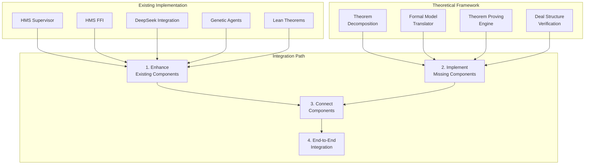
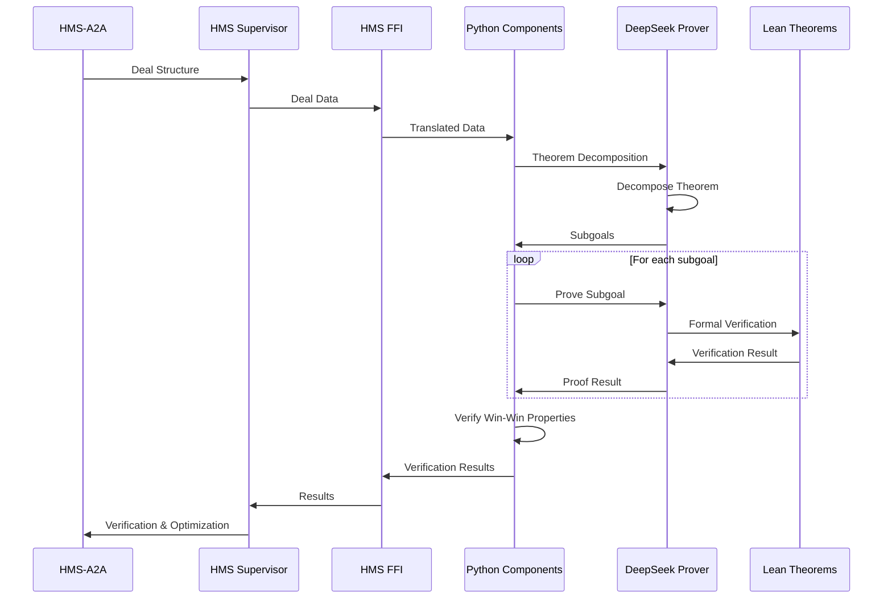
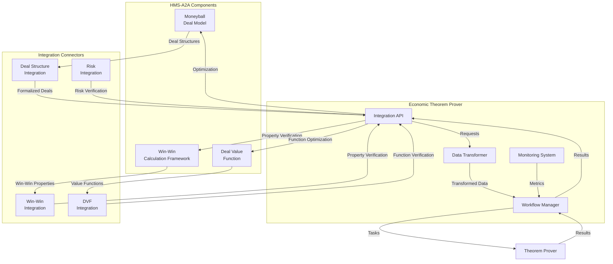
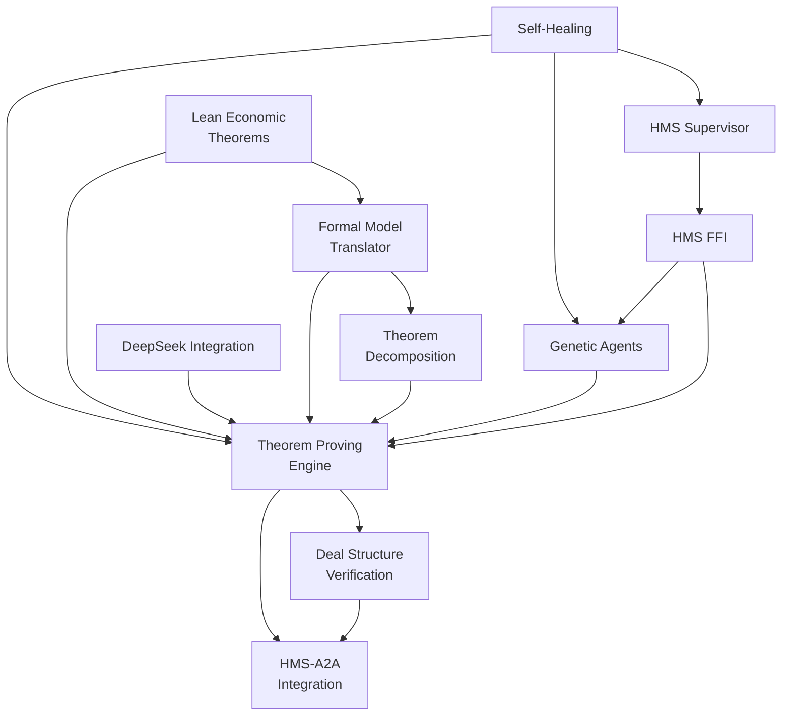

# Economic Theorem Prover - Unification Plan

This document outlines a comprehensive plan to unify the theoretical work and existing implementation of the Economic Theorem Prover. The plan addresses key integration points, implementation gaps, and optimization strategies to deliver a fully functional system.

## 1. Current State Analysis

### 1.1 Theoretical Work

Our theoretical work has established a solid foundation for the Economic Theorem Prover, including:

- **ECONOMIC-THEOREM-PROVER-ANALYSIS.md**: Analysis of DeepSeek-Prover-V2 architecture for economic applications
- **ECONOMIC-THEOREM-PROVER-ARCHITECTURE.md**: Detailed system architecture and component design
- **ECONOMIC-FORMAL-VERIFICATION-FRAMEWORK.md**: Mathematical foundation for economic model verification
- **ECONOMIC-THEOREM-PROVER-IMPLEMENTATION-PLAN.md**: Implementation strategy and development roadmap
- **ECONOMIC-THEOREM-PROVER-HMS-A2A-INTEGRATION.md**: Integration plan with HMS-A2A components

### 1.2 Existing Implementation

The current implementation in `/Users/arionhardison/Desktop/HardisonCo/economic-theorem-prover` includes:

- **Rust Components**:
  - `hms-supervisor`: gRPC service implementation for theorem proving (basic structure, incomplete)
  - `hms-ffi`: Foreign Function Interface for Rust-Python interoperability (placeholder implementation)
  - `hms-agt`: Agent core implementation (minimal skeleton)

- **Python Components**:
  - `deepseek_integration`: Mock integration with DeepSeek-Prover-V2 (placeholder implementation)
  - `genetic_agents`: Basic implementation of genetic algorithms for proof strategy optimization
  - `proof_engine`: Skeleton of theorem proving engine

- **Lean 4 Components**:
  - `economic_theorems`: Initial formalization of basic economic theorems and axioms

- **Infrastructure**:
  - `setup_dev_env.sh`: Development environment setup script
  - Protocol buffer definitions for service interfaces

## 2. Gap Analysis

### 2.1 Implementation Gaps

1. **Core Engine Implementation**:
   - DeepSeek-Prover-V2 integration is currently a mock implementation
   - Formal economic model translator is missing
   - Theorem decomposition engine is not implemented
   - Deal structure verification framework is missing

2. **Integration Gaps**:
   - HMS-A2A integration is only defined in theory
   - FFI implementation is a placeholder
   - No actual connection between Rust and Python components
   - Missing integration with HMS Moneyball Deal Model

3. **Verification Framework Gaps**:
   - Economic formal verification is only defined in theory
   - Lean 4 economic theorems are basic placeholders
   - Missing specialized tactics for economic theorems
   - No implementation of economic property verification

4. **Genetic Optimization Gaps**:
   - Basic genetic agent structure exists but lacks advanced features
   - Missing fitness evaluation for economic theorems
   - No implementation of specialized crossover and mutation operators
   - Population management and evolution strategies are missing

### 2.2 Architecture Alignment

1. **Component Alignment**:
   - The existing implementation follows the same high-level architecture as the theoretical design
   - The gRPC service interface matches the planned API design
   - Component organization aligns with theoretical layering
   - Component communication through FFI aligns with theoretical design

2. **Design Divergences**:
   - Implementation is more focused on service structure than theorem proving logic
   - Existing components lack the depth outlined in theoretical plans
   - Some planned components are not yet scaffolded
   - Existing implementation needs more emphasis on HMS-A2A integration

## 3. Unification Approach

We will follow a systematic approach to unify the theoretical work with the existing implementation:

### 3.1 Core Framework Development

1. **Formalize Economic Framework**:
   - Enhance Lean 4 economic theorems implementation
   - Implement formal economic type system
   - Add economic axioms and lemmas
   - Create specialized tactics for economics

2. **Connect DeepSeek-Prover-V2**:
   - Implement actual DeepSeek-Prover-V2 integration
   - Develop theorem decomposition for economic problems
   - Create formal translation between economic models and Lean code
   - Implement verification for economic properties

3. **Develop Proof Engine**:
   - Complete proof engine implementation
   - Connect to DeepSeek-Prover-V2
   - Implement theorem repository
   - Add proof validation and verification

### 3.2 Genetic Optimization Enhancement

1. **Advanced Genetic Algorithms**:
   - Implement specialized genetic operators for economic theorem proving
   - Add advanced fitness functions for economic theorems
   - Develop niche preservation and island models
   - Implement meta-evolution capabilities

2. **Economic Fitness Evaluation**:
   - Create fitness evaluation for economic theorem proving
   - Develop domain-specific fitness metrics
   - Implement proof efficiency evaluation
   - Add multi-objective fitness evaluation

3. **Population Management**:
   - Implement advanced population management
   - Add elitism strategies
   - Create diversity preservation mechanisms
   - Develop tournament selection

### 3.3 HMS Integration Development

1. **FFI Implementation**:
   - Complete Rust-Python FFI implementation
   - Develop bidirectional data transfer
   - Add error handling and recovery
   - Implement proper memory management

2. **HMS-A2A Integration**:
   - Implement connection to Moneyball Deal Model
   - Add integration with Win-Win Calculation Framework
   - Develop deal structure verification
   - Create integration with HMS component ecosystem

3. **gRPC Service Implementation**:
   - Complete gRPC service implementation
   - Add proper error handling and status reporting
   - Implement asynchronous theorem proving
   - Create monitoring and metrics collection

### 3.4 Self-Healing Implementation

1. **Monitoring Framework**:
   - Implement component health monitoring
   - Add performance and resource monitoring
   - Create alerting and reporting system
   - Develop metrics collection and visualization

2. **Recovery Strategies**:
   - Implement recovery strategies for component failures
   - Add state preservation and recovery
   - Create graceful degradation modes
   - Develop context-aware strategy selection

3. **Self-Learning System**:
   - Implement recovery effectiveness learning
   - Add strategy adaptation based on history
   - Create automated healing optimization
   - Develop root cause analysis

## 4. Implementation Roadmap

The unified implementation will proceed through the following phases:

### Phase 1: Foundation Integration (Weeks 1-4)

**Objectives**:
- Unify theoretical designs with existing implementation
- Complete core framework scaffolding
- Establish actual integration points

**Tasks**:
1. **Core Framework Integration**:
   - Enhance Lean 4 economic theorems implementation
   - Implement actual DeepSeek-Prover-V2 integration
   - Create formal translation layer between economics and Lean
   - Develop theorem repository with proper storage

2. **FFI Implementation**:
   - Implement complete Rust-Python FFI bridge
   - Add proper data serialization and deserialization
   - Develop error handling and status reporting
   - Create bidirectional communication channels

3. **Service Layer Enhancement**:
   - Complete gRPC service implementation
   - Add error handling and validation
   - Implement proper theorem registration
   - Create status reporting and monitoring

### Phase 2: Advanced Components Development (Weeks 5-8)

**Objectives**:
- Implement advanced theorem proving capabilities
- Develop specialized genetic optimization
- Create economic verification framework

**Tasks**:
1. **Theorem Proving Engine**:
   - Implement recursive theorem decomposition
   - Add economic-specific proof tactics
   - Develop proof verification and validation
   - Create theorem dependency tracking

2. **Genetic Optimization**:
   - Implement specialized genetic operators
   - Add advanced fitness functions
   - Develop population management
   - Create diversity preservation mechanisms

3. **Economic Verification Framework**:
   - Implement economic property verification
   - Add win-win condition verification
   - Develop value distribution verification
   - Create risk property verification

### Phase 3: HMS-A2A Integration (Weeks 9-12)

**Objectives**:
- Integrate with HMS-A2A components
- Implement deal structure verification
- Create win-win optimization

**Tasks**:
1. **Moneyball Deal Model Integration**:
   - Implement deal structure formalization
   - Add deal property extraction
   - Develop deal value function verification
   - Create deal optimization

2. **Win-Win Framework Integration**:
   - Implement win-win property verification
   - Add win-win optimization
   - Develop stakeholder value verification
   - Create fairness verification

3. **Risk Verification Integration**:
   - Implement risk distribution verification
   - Add risk model verification
   - Develop risk balancing optimization
   - Create risk mitigation suggestions

### Phase 4: Self-Healing and Optimization (Weeks 13-16)

**Objectives**:
- Implement self-healing capabilities
- Optimize system performance
- Create monitoring and metrics

**Tasks**:
1. **Self-Healing Framework**:
   - Implement component health monitoring
   - Add recovery strategies
   - Develop self-learning system
   - Create root cause analysis

2. **Performance Optimization**:
   - Implement proof caching
   - Add parallel theorem proving
   - Develop resource management
   - Create adaptive proving strategies

3. **Monitoring and Metrics**:
   - Implement metrics collection
   - Add visualization dashboard
   - Develop alerting system
   - Create performance reports

## 5. Technical Integration Path

### 5.1 Core Components Integration



### 5.2 Integration Workflow



### 5.3 HMS-A2A Integration



## 6. Implementation Details

### 6.1 HMS Supervisor Enhancement

We will enhance the existing HMS Supervisor implementation:

```rust
// Enhanced HMS Supervisor with full implementation
pub struct HmsSupervisor {
    // State management
    registered_theorems: Arc<RwLock<Vec<Theorem>>>,
    proof_strategies: Arc<RwLock<Vec<ProofStrategy>>>,
    
    // FFI bridge for Python integration
    ffi_bridge: HmsFfiBridge,
    
    // Self-healing components
    health_monitor: HealthMonitor,
    recovery_manager: RecoveryManager,
    
    // Metrics collection
    metrics_collector: MetricsCollector,
}

impl HmsSupervisor {
    // Implement full functionality for theorem proving service
    async fn prove_theorem_internal(&self, request: ProveTheoremRequest) -> Result<ProveTheoremResponse> {
        // Actual implementation connecting to Python proving engine via FFI
        self.ffi_bridge.prove_theorem(request).await
    }
    
    // HMS-A2A integration
    async fn verify_deal_structure(&self, deal: Deal) -> Result<VerificationResult> {
        // Implement deal structure verification
        self.ffi_bridge.verify_deal(deal).await
    }
    
    // Handle genetic optimization
    async fn optimize_proof_strategies_internal(&self, request: OptimizeProofStrategyRequest) -> Result<OptimizeProofStrategyResponse> {
        // Connect to genetic agents via FFI
        self.ffi_bridge.optimize_proof_strategies(request).await
    }
}
```

### 6.2 FFI Implementation

We will complete the FFI implementation to connect Rust and Python:

```rust
// Enhanced FFI implementation
pub struct HmsFfiBridge {
    // Python module state
    py_module: PyObject,
    
    // Thread pool for Python GIL management
    thread_pool: ThreadPool,
    
    // Error handling and metrics
    error_handler: ErrorHandler,
    metrics: FfiMetrics,
}

impl HmsFfiBridge {
    // Bidirectional communication with Python components
    pub async fn prove_theorem(&self, request: ProveTheoremRequest) -> Result<ProveTheoremResponse> {
        // Convert Rust types to Python types
        let py_request = self.convert_theorem_request(request)?;
        
        // Call Python proving engine
        let py_result = self.call_python_function("prove_theorem", py_request).await?;
        
        // Convert Python result back to Rust
        self.convert_theorem_response(py_result)
    }
    
    // Deal verification via FFI
    pub async fn verify_deal(&self, deal: Deal) -> Result<VerificationResult> {
        // Implement deal verification through FFI
        let py_deal = self.convert_deal(deal)?;
        let py_result = self.call_python_function("verify_deal", py_deal).await?;
        self.convert_verification_result(py_result)
    }
}
```

### 6.3 DeepSeek Integration

We will complete the DeepSeek integration with actual functionality:

```python
class DeepSeekProver:
    """Client for interacting with DeepSeek-Prover-V2."""
    
    def __init__(self, model_path: Optional[str] = None, use_api: bool = False, api_key: Optional[str] = None):
        # Initialize the actual DeepSeek model
        self.model = self._load_model(model_path) if not use_api else None
        self.api_client = self._initialize_api_client(api_key) if use_api else None
        
    def _load_model(self, model_path: str) -> Any:
        """Load the DeepSeek-Prover-V2 model."""
        # Implement actual model loading
        import deepseek_prover
        return deepseek_prover.load_model(model_path)
    
    def _initialize_api_client(self, api_key: str) -> Any:
        """Initialize the DeepSeek API client."""
        # Implement actual API client creation
        import deepseek_api
        return deepseek_api.Client(api_key=api_key)
    
    def prove_theorem(self, lean_code: str, statement: str, assumptions: List[str] = None, timeout_seconds: int = 60, tactics: List[str] = None) -> Dict[str, Any]:
        """Use DeepSeek-Prover to prove a theorem."""
        # Implement actual theorem proving using DeepSeek
        formatted_theorem = self.format_theorem(lean_code, statement, assumptions or [])
        
        if self.use_api:
            # Call DeepSeek API
            result = self.api_client.prove(
                theorem=formatted_theorem,
                timeout=timeout_seconds,
                tactics=tactics
            )
        else:
            # Call local DeepSeek model
            result = self.model.prove(
                theorem=formatted_theorem,
                timeout=timeout_seconds,
                tactics=tactics
            )
            
        return self._process_proof_result(result)
```

### 6.4 Genetic Agents Enhancement

We will enhance the genetic agents with specialized operators for economic theorem proving:

```python
class EconomicGeneticAgent(GeneticAgent):
    """Extended genetic agent specialized for economic theorem proving."""
    
    def __init__(self, agent_id: str, traits: List[GeneticAgentTrait], economic_domain: str):
        super().__init__(agent_id, traits)
        self.economic_domain = economic_domain
        self.theorem_success_history = {}
        self.domain_specialization = {}
        
    def compute_economic_fitness(self, environment: Dict[str, Any], economic_metrics: Dict[str, float]) -> float:
        """Compute fitness with economic domain knowledge."""
        base_fitness = super().compute_fitness(environment)
        
        # Apply economic domain-specific modifiers
        if self.economic_domain in economic_metrics:
            domain_weight = economic_metrics[self.economic_domain]
            domain_performance = self._compute_domain_performance()
            
            # Weight the fitness by domain performance
            return base_fitness * (1.0 + domain_performance * domain_weight)
        
        return base_fitness
    
    def economic_crossover(self, other: 'EconomicGeneticAgent') -> Tuple['EconomicGeneticAgent', 'EconomicGeneticAgent']:
        """Specialized crossover for economic theorem proving."""
        # Implement domain-specific crossover
        child1, child2 = super().crossover(other)
        
        # Enhance with economic domain knowledge
        self._enhance_economic_traits(child1, other)
        self._enhance_economic_traits(child2, self)
        
        return child1, child2
    
    def _enhance_economic_traits(self, agent: 'EconomicGeneticAgent', parent: 'EconomicGeneticAgent') -> None:
        """Enhance an agent with economic domain traits from a parent."""
        # Implement economic trait enhancement
        pass
```

## 7. Unification Testing Strategy

### 7.1 Unit Testing

```python
# Example unit test for economic theorem verification
def test_win_win_verification():
    # Create a test deal
    test_deal = create_test_deal(
        stakeholders=[
            create_test_stakeholder(id="GOV-001", value=100),
            create_test_stakeholder(id="CORP-001", value=200),
        ]
    )
    
    # Create verifier
    verifier = WinWinVerifier()
    
    # Verify deal
    result = verifier.verify_basic_win_win(test_deal)
    
    # Assert
    assert result.verified is True
    assert len(result.stakeholder_values) == 2
    assert result.stakeholder_values["GOV-001"] > 0
    assert result.stakeholder_values["CORP-001"] > 0
```

### 7.2 Integration Testing

```python
# Example integration test for theorem proving with decomposition
def test_economic_theorem_decomposition_and_proving():
    # Create theorem
    theorem = EconomicTheorem(
        id="THEOREM-001",
        statement="Pareto optimality of competitive equilibrium",
        lean_code="∀ m, MarketEquilibrium m → ParetoOptimal m",
        assumptions=["CompleteMarkets", "PerfectCompetition"],
        domain="microeconomics"
    )
    
    # Create decomposition engine
    decomposer = TheoremDecompositionEngine()
    
    # Create prover
    prover = TheoremProver()
    
    # Decompose theorem
    subgoals = decomposer.decompose(theorem)
    
    # Assert decomposition
    assert len(subgoals) > 0
    
    # Prove subgoals
    proofs = []
    for subgoal in subgoals:
        proof = prover.prove(subgoal)
        proofs.append(proof)
        
    # Assert all proofs succeeded
    assert all(proof.success for proof in proofs)
    
    # Combine proofs
    combined_proof = prover.combine_proofs(theorem, proofs)
    
    # Assert combined proof
    assert combined_proof.success
    assert combined_proof.verified
```

### 7.3 End-to-End Testing

```python
# Example end-to-end test for deal verification and optimization
def test_deal_verification_and_optimization():
    # Create test deal
    original_deal = create_test_deal(
        stakeholders=[
            create_test_stakeholder(id="GOV-001", value=-50),  # Negative value
            create_test_stakeholder(id="CORP-001", value=500),
        ]
    )
    
    # Create supervisor client
    client = HmsSupervisorClient()
    
    # Verify deal
    verification_result = client.verify_deal(original_deal)
    
    # Assert verification failed due to negative value
    assert not verification_result.verified
    assert verification_result.failed_properties[0].property == "win-win"
    
    # Optimize deal
    optimization_result = client.optimize_deal(original_deal)
    optimized_deal = optimization_result.optimized_deal
    
    # Verify optimized deal
    optimized_verification = client.verify_deal(optimized_deal)
    
    # Assert optimization succeeded
    assert optimized_verification.verified
    assert optimized_verification.property_verifications["win-win"].verified
    
    # Assert government now has positive value
    gov_value = calculate_stakeholder_value(optimized_deal.stakeholders[0], optimized_deal)
    assert gov_value > 0
```

## 8. Build Path for HMS-Communication

To complete the implementation with a focus on "build -p hms-communication", we'll develop the communication layer between components:

### 8.1 Communication Components

1. **gRPC Communication**:
   - Complete gRPC service implementation
   - Add proper error handling and status reporting
   - Implement service health checks
   - Create client libraries for different languages

2. **Rust-Python FFI Bridge**:
   - Implement full bidirectional communication
   - Add proper data serialization and deserialization
   - Create thread safety mechanisms
   - Implement error handling and recovery

3. **HMS-A2A Connectors**:
   - Implement deal structure connectors
   - Add win-win framework integration
   - Develop neural network connectors
   - Create deal value function connectors

### 8.2 HMS-Communication Implementation

```rust
// HMS Communication module
pub mod hms_communication {
    // gRPC communication implementation
    pub mod grpc {
        pub struct TheoremProverServiceImpl {
            // Implementation of theorem prover service
        }
        
        // Client for connecting to theorem prover service
        pub struct TheoremProverClient {
            // Implementation of client for theorem prover service
        }
    }
    
    // FFI communication implementation
    pub mod ffi {
        pub struct PythonBridge {
            // Implementation of Rust-Python bridge
        }
        
        pub struct DataConverter {
            // Implementation of data conversion between Rust and Python
        }
    }
    
    // HMS-A2A communication implementation
    pub mod hms_a2a {
        pub struct MoneyballConnector {
            // Implementation of Moneyball Deal Model connector
        }
        
        pub struct WinWinConnector {
            // Implementation of Win-Win Framework connector
        }
        
        pub struct DealValueConnector {
            // Implementation of Deal Value Function connector
        }
    }
}
```

### 8.3 Build Command

The build command will compile and package the HMS-Communication components:

```bash
cargo build -p hms-communication --release
```

## 9. Optimization Strategy

### 9.1 Performance Optimization

1. **Proof Caching**:
   - Implement caching of proof results
   - Add caching of decomposition results
   - Create cache invalidation strategies
   - Develop shared cache between components

2. **Parallel Processing**:
   - Implement parallel theorem proving
   - Add parallel genetic evolution
   - Develop parallel property verification
   - Create load balancing for processing

3. **Resource Management**:
   - Implement adaptive resource allocation
   - Add priority-based scheduling
   - Develop resource pool management
   - Create monitoring and optimization

### 9.2 Memory Optimization

1. **Lazy Loading**:
   - Implement lazy loading of models
   - Add on-demand theorem loading
   - Develop progressive proof generation
   - Create resource cleanup strategies

2. **Data Compression**:
   - Implement proof compression
   - Add model compression techniques
   - Develop efficient serialization
   - Create memory-efficient data structures

### 9.3 Algorithm Optimization

1. **Specialized Algorithms**:
   - Implement economic domain-specific algorithms
   - Add heuristic-based theorem decomposition
   - Develop adaptive proving strategies
   - Create specialized proof tactics

2. **Incremental Processing**:
   - Implement incremental theorem proving
   - Add partial proof verification
   - Develop progressive optimization
   - Create phased verification

## 10. Conclusion

This unification plan provides a comprehensive approach to combine the theoretical work and existing implementation of the Economic Theorem Prover. By following this plan, we will:

1. **Fill Implementation Gaps**: Complete missing components and functionality
2. **Enhance Existing Components**: Improve and optimize the current implementation
3. **Create Integration Points**: Connect all components into a cohesive system
4. **Optimize Performance**: Ensure efficient and scalable operation

The result will be a fully functional Economic Theorem Prover that can verify economic models, deal structures, and value distribution mechanisms, while providing formal guarantees through integration with the HMS-A2A ecosystem.

## Appendices

### Appendix A: Component Responsibility Matrix

| Component | Theoretical Design | Existing Implementation | Gap | Priority |
|-----------|-------------------|------------------------|-----|----------|
| Theorem Decomposition Engine | ECONOMIC-THEOREM-PROVER-ARCHITECTURE.md | Not implemented | High | High |
| Formal Economic Model Translator | ECONOMIC-FORMAL-VERIFICATION-FRAMEWORK.md | Not implemented | High | High |
| Theorem Proving Engine | ECONOMIC-THEOREM-PROVER-IMPLEMENTATION-PLAN.md | Placeholder in src/python/proof_engine | High | High |
| Deal Structure Verification | ECONOMIC-THEOREM-PROVER-HMS-A2A-INTEGRATION.md | Not implemented | High | Medium |
| HMS Supervisor | ECONOMIC-THEOREM-PROVER-ARCHITECTURE.md | Basic implementation in src/rust/hms-supervisor | Medium | High |
| HMS FFI | ECONOMIC-THEOREM-PROVER-IMPLEMENTATION-PLAN.md | Placeholder in src/rust/hms-ffi | High | High |
| DeepSeek Integration | ECONOMIC-THEOREM-PROVER-ANALYSIS.md | Mock in src/python/deepseek_integration | High | High |
| Genetic Agents | ECONOMIC-THEOREM-PROVER-IMPLEMENTATION-PLAN.md | Basic in src/python/genetic_agents | Medium | Medium |
| Self-Healing | ECONOMIC-THEOREM-PROVER-IMPLEMENTATION-PLAN.md | Not implemented | Medium | Low |
| Economic Theorems | ECONOMIC-FORMAL-VERIFICATION-FRAMEWORK.md | Basic in src/lean/economic_theorems | Medium | Medium |
| HMS-A2A Integration | ECONOMIC-THEOREM-PROVER-HMS-A2A-INTEGRATION.md | Not implemented | High | Medium |

### Appendix B: Dependency Graph



### Appendix C: Risk Assessment

| Risk | Impact | Probability | Mitigation |
|------|--------|------------|------------|
| DeepSeek-Prover-V2 integration challenges | High | Medium | Develop fallback proving strategies, create mock implementation for testing |
| Rust-Python FFI performance issues | Medium | Medium | Optimize data serialization, batch operations, implement caching |
| Economic theorem formalization complexity | High | High | Start with simpler theorems, use incremental formalization, consult domain experts |
| HMS-A2A integration complexity | Medium | Medium | Phase implementation, develop clear interface contracts, create integration tests |
| Performance scaling challenges | Medium | Low | Implement caching, use parallel processing, optimize resource usage |
| Self-healing implementation complexity | Low | Medium | Implement basic monitoring first, add recovery strategies incrementally |

This plan provides a comprehensive roadmap for unifying the theoretical and implementation aspects of the Economic Theorem Prover project, with a focus on completing the HMS-Communication component to enable seamless integration with the broader HMS ecosystem.