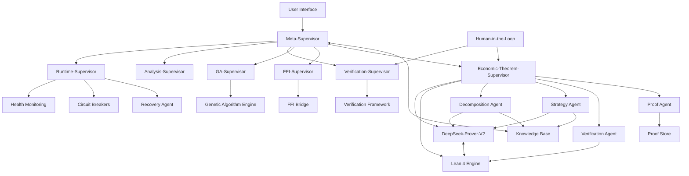

# HMS Final Consolidated Implementation Plan

*Integrating Supervisor Architecture, Multi-Agent Systems, and DeepSeek-Prover-V2 for Economic Theorem Verification*

## 1. Strategic Vision & Objectives

### Primary Goal
To deliver a unified, resilient, self-healing ecosystem where hierarchical supervisors orchestrate specialized agents for health monitoring, verification, and formal economic theorem proving, enabling rigorous validation of deals and economic models via DeepSeek-Prover-V2 integration with Lean 4.

### Key Performance Indicators (KPIs)

| Objective | Target KPIs | Enabling Technologies |
|---|---|---|
| **Resilience** | MTTR < 3 min; Auto-recovery > 95% | Self-healing supervisor architecture; Circuit breakers |
| **Verification Quality** | 90%+ theorem proving accuracy; 100% policy compliance | DeepSeek-Prover-V2; Verification-First framework |
| **Performance** | 30% optimization gains; 500ms P95 latency | GA-RL hybrid agents; Distributed proof farm |
| **Scalability** | 10K+ concurrent agent operations | Kubernetes; Stateless agent design |
| **Theorem Coverage** | 1M+ economic axioms; 95% deal logic formalization | Lean 4 library; CoT integration |

## 2. Integrated Architecture

The consolidated architecture seamlessly merges the Supervisor hierarchy with DeepSeek-Prover-V2 capabilities:



### 2.1 Key Architecture Components

#### Supervisor Layer
- **Meta-Supervisor**: Central orchestrator for all subsystems
- **Economic-Theorem-Supervisor**: Specialized supervisor for economic theorem proving
- **GA-Supervisor**: Manages genetic algorithm optimization for theorem proving
- **Other Supervisors**: Runtime, Analysis, Verification, and FFI supervisors

#### Theorem Proving Core
- **DeepSeek-Prover-V2**: LLM-based theorem proving system
- **Lean 4 Engine**: Formal verification and proof assistant
- **Specialized Agents**: Decomposition, Strategy, Verification, and Proof agents

#### Knowledge & Data Management
- **Knowledge Base**: Centralized repository for axioms, theorems, and proofs
- **Proof Store**: Specialized storage for completed and verified proofs

#### Self-Healing Infrastructure
- **Circuit Breakers**: Prevent cascading failures
- **Recovery Agent**: Automated detection and recovery from failures
- **GA Engine**: Evolves agent strategies to optimize performance

## 3. Comprehensive 5-Phase Implementation Plan

### Phase 1: Foundation (Months 1-3)

**Objective**: Establish core infrastructure and baseline theorem proving capabilities.

#### Deliverables:

1. **Core Supervisor Structure** (Weeks 1-4)
   - Implement Meta-Supervisor and base Supervisor trait
   - Create supervisor registry and communication channels
   - Build supervisor lifecycle management

2. **DeepSeek-Prover-V2 Integration** (Weeks 2-6)
   - Deploy DeepSeek-Prover-V2 environment
   - Create FFI bindings for Rust-Python interoperability
   - Establish basic theorem representation

3. **Lean 4 Foundation** (Weeks 3-8)
   - Set up Lean 4 development environment
   - Implement core economic axioms (utility, preferences, markets)
   - Create theorem parsing and proof verification

4. **A2A Protocol Development** (Weeks 5-10)
   - Define Protobuf schema for agent messaging
   - Implement gRPC transport layer
   - Create message routing system

5. **Economic-Theorem-Supervisor** (Weeks 8-12)
   - Implement specialized supervisor for theorem orchestration
   - Create theorem task allocation logic
   - Build proof verification pipeline

#### Success Criteria:
- End-to-end economic theorem proof of concept with DeepSeek-Prover-V2
- Successful communication between supervisors and agents
- Minimum 10 economic axioms formalized in Lean 4

### Phase 2: Core System (Months 4-8)

**Objective**: Develop specialized theorem proving agents and enhance genetic algorithms.

#### Deliverables:

1. **Specialized Agent Development** (Weeks 13-24)
   - **Decomposition Agent**: Breaks complex theorems into subgoals
   - **Strategy Agent**: Selects proof tactics and strategies
   - **Verification Agent**: Verifies proofs against Lean kernel
   - **Proof Agent**: Executes proofs using DeepSeek-Prover-V2

2. **Enhanced Genetic Algorithms** (Weeks 16-28)
   - Multi-objective fitness function for proofs
   - Adaptive mutation and crossover operators
   - Genetic diversity management

3. **Chain-of-Thought Integration** (Weeks 18-30)
   - Implement DeepSeek CoT reasoning for proof steps
   - Create informal-to-formal translation layer
   - Build proof step validation

4. **Knowledge Base Expansion** (Weeks 22-32)
   - Implement theorem and proof storage
   - Create vector-based similarity search
   - Build automated axiom generation

#### Success Criteria:
- Successfully prove medium-complexity economic theorems
- 30% improvement in proof efficiency over Phase 1
- Specialized agents collaborating effectively

### Phase 3: Self-Healing & Distributed Proving (Months 9-12)

**Objective**: Implement robust self-healing and scale theorem proving capabilities.

#### Deliverables:

1. **Self-Healing Framework** (Weeks 33-40)
   - Implement proof failure detection
   - Create failure diagnosis engine
   - Build automated recovery actions

2. **Distributed Theorem Proving** (Weeks 36-44)
   - Implement parallel proof processing
   - Create proof caching and reuse
   - Build load balancing for proof tasks

3. **Observability Infrastructure** (Weeks 38-46)
   - Implement Prometheus/Grafana integration
   - Create proof-specific metrics and dashboards
   - Build alerting for proof failures

4. **Circuit Breaker Implementation** (Weeks 41-48)
   - Create circuit breakers for theorem proving
   - Implement cascading failure prevention
   - Build automatic retry with exponential backoff

#### Success Criteria:
- System automatically recovers from >95% of induced failures
- Successful concurrent proving of 50+ theorems
- Comprehensive monitoring dashboards for theorem activities

### Phase 4: Advanced Learning & Optimization (Months 13-18)

**Objective**: Implement hybrid GA-RL approach and meta-optimization.

#### Deliverables:

1. **RL Integration** (Weeks 49-58)
   - Implement PPO for tactic selection
   - Create reward shaping for proofs
   - Build experience replay mechanism

2. **Hybrid GA-RL Framework** (Weeks 52-62)
   - Create GA-RL hybrid agents
   - Implement interaction patterns
   - Build adaptive optimization

3. **Meta-Learning** (Weeks 56-66)
   - Implement meta-optimization for GA parameters
   - Create learning transfer between similar theorems
   - Build curriculum learning for complex theorems

4. **Advanced User Interface** (Weeks 60-70)
   - Create theorem visualization tools
   - Build interactive proof assistance
   - Implement proof explanation generation

#### Success Criteria:
- Hybrid approach outperforms pure GA by >20%
- Successful proofs of complex economic theorems
- Interactive proof exploration and visualization

### Phase 5: Production & Marketplace (Months 19-24)

**Objective**: Prepare for enterprise deployment and community engagement.

#### Deliverables:

1. **DevSecOps Pipeline** (Weeks 71-78)
   - Implement CI/CD for theorem proving
   - Create security and compliance checks
   - Build automated deployment

2. **Kubernetes Deployment** (Weeks 74-82)
   - Create Kubernetes operators for HMS
   - Implement autoscaling based on theorem complexity
   - Build resource optimization

3. **Economic Theorem Marketplace** (Weeks 78-86)
   - Create public API and SDK
   - Build theorem submission system
   - Implement proof verification service

4. **Enterprise Integration** (Weeks 82-96)
   - Implement multi-tenancy
   - Create role-based access control
   - Build enterprise security features

#### Success Criteria:
- Production-ready system deployed on Kubernetes
- Successful external verification of economic theorems
- Minimum of 3 pilot partners using the system

## 4. Integration of DeepSeek-Prover-V2 with Supervisor Architecture

### 4.1 Core Integration Components

#### DeepSeek-Prover-V2 Agent Wrapper

```rust
pub struct DeepSeekProverAgent {
    base: Agent,
    model: DeepSeekProverV2Model,
    chain_of_thought_engine: CoTEngine,
    tactic_library: TacticLibrary,
    proof_state_manager: ProofStateManager,
}

impl DeepSeekProverAgent {
    fn new(config: DeepSeekConfig) -> Result<Self>;
    fn decompose_theorem(&self, theorem: &Theorem) -> Result<Vec<Subgoal>>;
    fn generate_proof_step(&self, state: &ProofState) -> Result<ProofStep>;
    fn generate_chain_of_thought(&self, goal: &Goal) -> Result<ChainOfThought>;
    fn translate_to_lean(&self, cot: &ChainOfThought) -> Result<String>;
    fn verify_proof(&self, proof: &Proof) -> Result<VerificationResult>;
}
```

#### Economic-Theorem-Supervisor

```rust
pub struct EconomicTheoremSupervisor {
    deepseek_agents: Vec<DeepSeekProverAgent>,
    decomposition_agents: Vec<DecompositionAgent>,
    strategy_agents: Vec<StrategyAgent>,
    verification_agents: Vec<VerificationAgent>,
    proof_store: ProofStore,
    theorem_database: TheoremDatabase,
    resource_allocator: ResourceAllocator,
}

impl Supervisor for EconomicTheoremSupervisor {
    // Standard supervisor methods
}

impl EconomicTheoremSupervisor {
    fn process_theorem_task(&self, task: TheoremTask) -> Result<TaskStatus>;
    fn allocate_decomposition(&self, theorem: &Theorem) -> Result<AgentAssignment>;
    fn allocate_proof_generation(&self, subgoals: &[Subgoal]) -> Result<Vec<AgentAssignment>>;
    fn allocate_verification(&self, proof: &Proof) -> Result<AgentAssignment>;
    fn handle_proof_failure(&self, failure: &ProofFailure) -> Result<RecoveryAction>;
    fn monitor_proof_progress(&self, task_id: &str) -> Result<ProofProgress>;
}
```

#### FFI Bridge for DeepSeek-Prover-V2

```rust
// Rust side
#[repr(C)]
pub struct DeepSeekProverContext {
    model_ptr: *mut c_void,
    config_ptr: *mut c_void,
}

#[no_mangle]
pub extern "C" fn create_deepseek_context(config_json: *const c_char) -> *mut DeepSeekProverContext;

#[no_mangle]
pub extern "C" fn deepseek_prove_theorem(ctx: *mut DeepSeekProverContext, theorem_str: *const c_char) -> *mut ProofResult;

// Python side
def create_deepseek_context(config: dict) -> int:
    """Create a DeepSeek context and return its pointer."""
    config_json = json.dumps(config)
    return lib.create_deepseek_context(config_json.encode('utf-8'))

def prove_theorem(ctx_ptr: int, theorem: str) -> dict:
    """Use DeepSeek to prove the given theorem."""
    result_ptr = lib.deepseek_prove_theorem(ctx_ptr, theorem.encode('utf-8'))
    return json.loads(ffi.string(lib.get_proof_result_json(result_ptr)).decode('utf-8'))
```

### 4.2 Integration Workflow

1. **Theorem Submission**
   - User or agent submits economic theorem
   - Meta-Supervisor routes to Economic-Theorem-Supervisor

2. **Task Decomposition**
   - Economic-Theorem-Supervisor assigns to Decomposition Agent
   - DeepSeek-Prover-V2 decomposes into subgoals

3. **Proof Strategy Selection**
   - Strategy Agent selects optimal tactics
   - GA-Supervisor provides evolved strategy parameters

4. **Proof Generation**
   - DeepSeek-Prover-V2 generates chain-of-thought reasoning
   - CoT translated to formal Lean 4 proof steps

5. **Verification**
   - Verification Agent validates with Lean 4 kernel
   - Verification-Supervisor enforces policy compliance

6. **Knowledge Update**
   - Proof and theorem stored in Knowledge Base
   - GA-Supervisor updates fitness functions based on results

7. **Self-Healing (if failure)**
   - Runtime-Supervisor detects proof failures
   - Recovery Agent implements mitigation strategies
   - GA-Supervisor evolves new strategies

## 5. Technology Stack & Implementation Details

### 5.1 Core Technologies

- **Rust**: Core supervisor framework, FFI, runtime systems
- **Python**: DeepSeek-Prover-V2 integration, ML components
- **Lean 4**: Formal theorem verification
- **Protobuf/gRPC**: A2A communication protocol
- **PyO3**: Rust-Python bindings
- **Kubernetes**: Production deployment and scaling
- **Prometheus/Grafana**: Metrics and monitoring

### 5.2 DeepSeek-Prover-V2 Integration

#### Theorem Representation

```lean
-- Economic theorem example in Lean 4
theorem no_arbitrage_implies_fair_pricing 
  {S : Type} [Market S] {π : S → ℝ} (h : no_arbitrage π) : 
  ∃ (P : probability_measure S), 
    ∀ (X : S → ℝ), π X = expected_value P X :=
begin
  -- Proof will be generated by DeepSeek-Prover-V2
end
```

#### Chain-of-Thought Processing

```python
def generate_cot_steps(theorem: str, context: List[str]) -> List[str]:
    """Generate chain of thought reasoning steps for economic theorem."""
    prompt = f"""
    Theorem: {theorem}
    
    Context:
    {' '.join(context)}
    
    Generate a step-by-step informal proof of this theorem:
    """
    
    # Call DeepSeek-Prover-V2 with the prompt
    response = deepseek_model.generate(prompt)
    
    # Parse the response into discrete steps
    steps = parse_cot_steps(response)
    
    return steps

def translate_cot_to_lean(cot_steps: List[str], theorem: str) -> str:
    """Translate chain of thought reasoning to formal Lean 4 proof."""
    formal_steps = []
    
    for step in cot_steps:
        # Map informal step to formal Lean tactic
        formal_step = informal_to_formal_mapper.map(step, theorem)
        formal_steps.append(formal_step)
    
    return "\n  ".join(formal_steps)
```

#### Genetic Algorithm Integration

```rust
pub struct ProofGenome {
    tactic_weights: HashMap<String, f64>,
    decomposition_threshold: f64,
    timeout_multiplier: f64,
    cot_depth: usize,
    mutation_rate: f64,
}

impl Genome for ProofGenome {
    fn crossover(&self, other: &Self) -> Self {
        // Implement crossover of proof strategies
    }
    
    fn mutate(&mut self) {
        // Implement mutation of proof parameters
    }
}

pub struct TheoremFitness {
    correctness_weight: f64,
    elegance_weight: f64,
    efficiency_weight: f64,
}

impl FitnessFunction<ProofGenome> for TheoremFitness {
    fn evaluate(&self, genome: &ProofGenome, theorem: &Theorem) -> f64 {
        // Use genome parameters to prove theorem
        let proof_result = prove_with_genome(theorem, genome);
        
        // Calculate fitness components
        let correctness = evaluate_correctness(&proof_result);
        let elegance = evaluate_elegance(&proof_result);
        let efficiency = evaluate_efficiency(&proof_result);
        
        // Weighted sum
        self.correctness_weight * correctness +
        self.elegance_weight * elegance +
        self.efficiency_weight * efficiency
    }
}
```

### 5.3 Self-Healing Mechanisms

```rust
pub enum FailureType {
    DecompositionFailure,
    TacticSelectionFailure,
    ProofGenerationTimeout,
    VerificationFailure,
    ResourceExhaustion,
}

pub struct DiagnosisResult {
    failure_type: FailureType,
    root_cause: String,
    suggested_actions: Vec<RecoveryAction>,
}

pub enum RecoveryAction {
    RetryWithMoreResources,
    RetryWithDifferentDecomposition,
    RetryWithDifferentTactics,
    EvolveNewGenome,
    EscalateToHITL,
}

impl SelfHealingModule {
    fn diagnose_failure(&self, failure: &ProofFailure) -> DiagnosisResult {
        // Implement failure diagnosis logic
    }
    
    fn apply_recovery_action(&self, action: &RecoveryAction, context: &ProofContext) -> Result<RecoveryStatus> {
        // Implement recovery action logic
    }
}
```

## 6. Testing & Verification Strategy

### 6.1 Testing Levels

| Level | Description | Tools | Success Criteria |
|-------|-------------|-------|------------------|
| **Unit Testing** | Testing individual components | Rust: cargo test<br>Python: pytest | ≥90% code coverage |
| **Integration Testing** | Testing component interactions | docker-compose | End-to-end theorem proving |
| **Verification Testing** | Testing theorem correctness | Lean 4 kernel | 100% verification of proofs |
| **Performance Testing** | Testing under load | k6, custom benchmarks | Meet latency/throughput targets |
| **Self-Healing Testing** | Testing recovery capabilities | Chaos testing | 95% auto-recovery rate |

### 6.2 Specialized Theorem Testing

1. **Economic Theorem Corpus**
   - Develop test suite of economic theorems with known proofs
   - Include theorems of varying complexity
   - Create benchmark suite for performance comparison

2. **Chaos Testing for Theorem Proving**
   - Introduce random failures in proof steps
   - Corrupt proof states to test recovery
   - Simulate resource constraints

3. **Verification-First Pipeline**
   - Ensure all generated proofs pass Lean kernel verification
   - Implement policy checks for proof style and efficiency
   - Create audit trail for all verification steps

## 7. Key Risks & Mitigation Strategies

| Risk | Impact | Probability | Mitigation Strategy |
|------|--------|------------|---------------------|
| **DeepSeek Integration Complexity** | High | Medium | Phased approach; start with simple theorems; extensive FFI testing |
| **Proof Performance** | High | High | Distributed proof farm; caching; parallel subgoal processing |
| **Verification Bottlenecks** | Medium | Medium | Lean kernel optimization; proof modularization; verification caching |
| **Model Drift** | Medium | Low | Regular retraining; version pinning; compatibility testing |
| **Resource Consumption** | High | Medium | GPU optimization; proof budget limits; resource quotas |
| **Incorrect Proofs** | Critical | Low | Multi-stage verification; SMT cross-checking; formal verification |

## 8. Next Steps & Immediate Actions

1. **Foundation Setup (Weeks 1-4)**
   - Set up development environment with Rust, Python, and Lean 4
   - Deploy DeepSeek-Prover-V2 in test environment
   - Implement core Supervisor trait and registry

2. **Initial Integration (Weeks 5-8)**
   - Create FFI bindings for DeepSeek-Prover-V2
   - Implement basic theorem representation
   - Develop A2A protocol Protobuf schema

3. **Proof of Concept (Weeks 9-12)**
   - Demonstrate end-to-end theorem proving workflow
   - Validate supervisor coordination of agents
   - Test basic self-healing capabilities

## 9. Conclusion

The HMS Final Consolidated Implementation Plan provides a comprehensive roadmap for integrating the Supervisor Architecture with DeepSeek-Prover-V2 for Economic Theorem Verification. By following this five-phase approach, the system will evolve from basic theorem proving capabilities to a sophisticated, self-healing, multi-agent ecosystem capable of verifying complex economic theorems and deals.

The integration leverages the strengths of both architectures: the hierarchical, resilient nature of the Supervisor structure and the advanced theorem proving capabilities of DeepSeek-Prover-V2 with Lean 4. The GA-RL hybrid approach ensures continuous optimization and adaptation, while comprehensive self-healing mechanisms maintain system reliability.

This plan addresses all key aspects of implementation, from core technology integration to testing, risk mitigation, and deployment, providing a clear path forward for the HMS project's success.