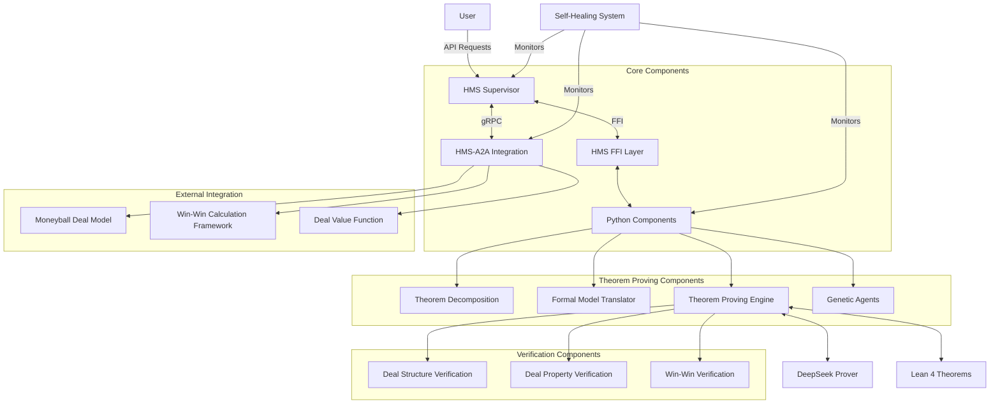
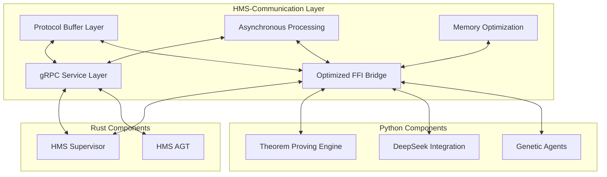
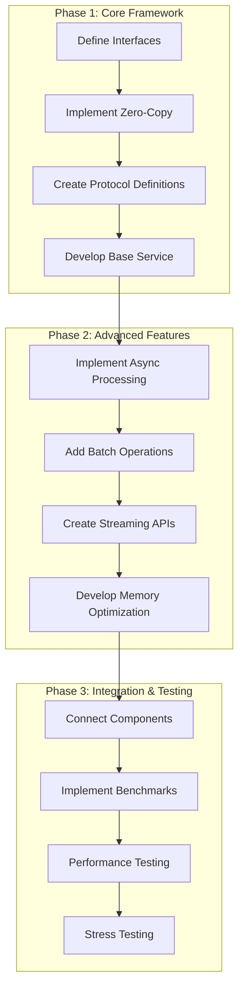
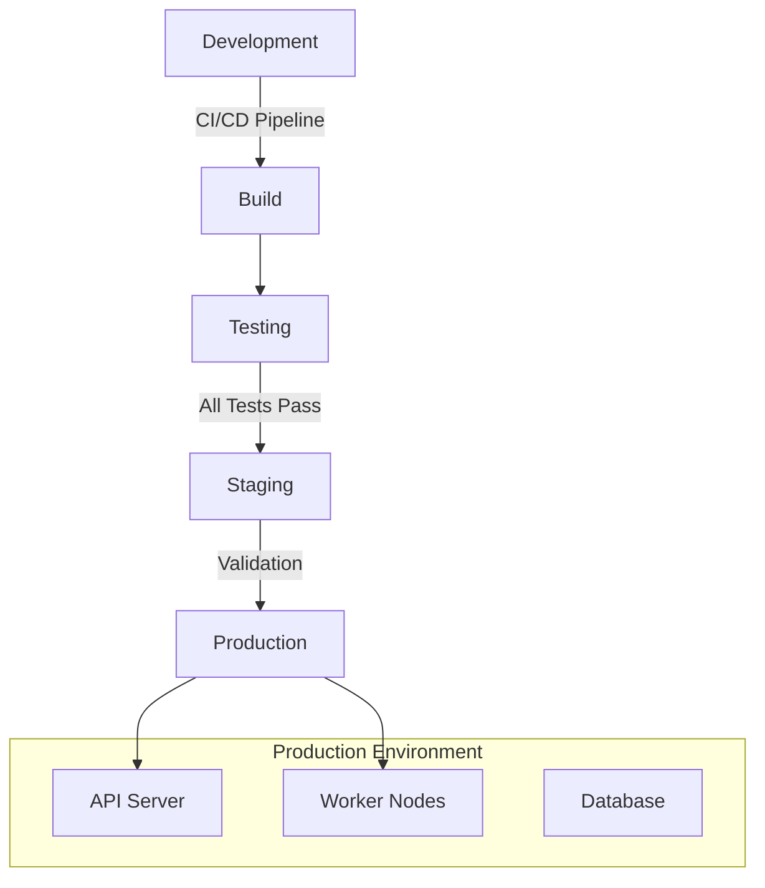
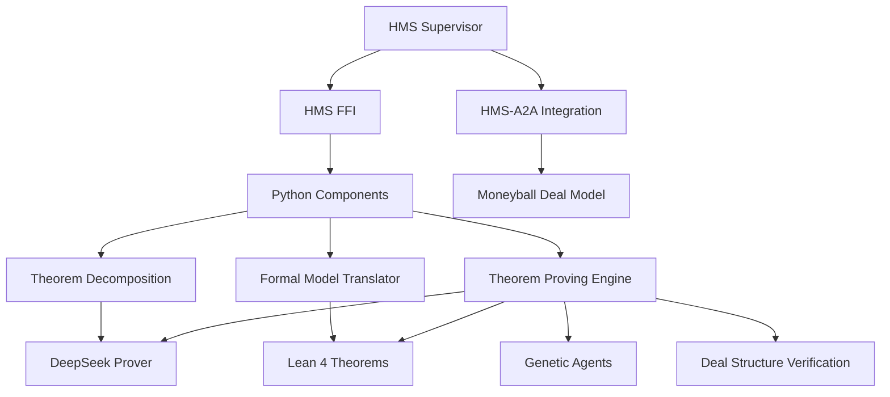

# Economic Theorem Prover - Unified Master Implementation Plan

## Executive Summary

This document provides a unified master plan for implementing the Economic Theorem Prover based on DeepSeek-Prover-V2. It consolidates all previous theoretical work and existing implementation into a comprehensive roadmap focused on delivering a production-ready system.

The implementation approach emphasizes:
1. **Unification** of theoretical designs with practical implementation
2. **Optimization** of communication between system components
3. **Formal verification** of economic theorems and deal structures
4. **Integration** with HMS-A2A components

## 1. System Architecture Overview

The Economic Theorem Prover consists of these core components:



## 2. Core Implementation Path

### 2.1 Component Implementation Status

| Component | Status | Priority | Implementation Timeline |
|-----------|--------|----------|-------------------------|
| HMS Supervisor | Basic implementation | High | Weeks 1-3 |
| HMS FFI | Placeholder | High | Weeks 1-3 |
| Theorem Decomposition | Not implemented | High | Weeks 2-4 |
| Formal Model Translator | Not implemented | High | Weeks 2-4 |
| Theorem Proving Engine | Placeholder | High | Weeks 3-5 |
| DeepSeek Integration | Mock | High | Weeks 3-5 |
| Deal Structure Verification | Not implemented | Medium | Weeks 5-7 |
| Genetic Agents | Basic | Medium | Weeks 4-6 |
| Self-Healing | Not implemented | Low | Weeks 8-10 |
| HMS-A2A Integration | Not implemented | Medium | Weeks 6-8 |
| Lean Economic Theorems | Basic | Medium | Weeks 4-6 |
| Optimization & Performance | Not implemented | High | Throughout |

### 2.2 Phase 1: Foundation (Weeks 1-3)

**Objectives:**
- Complete HMS Supervisor implementation
- Implement full FFI layer with optimizations
- Setup enhanced communication infrastructure
- Create basic theorem representation

**Deliverables:**
- Complete HMS Supervisor with gRPC service
- High-performance FFI bridge
- Protocol definitions and serialization
- Communication benchmarks

### 2.3 Phase 2: Core Engine (Weeks 2-5)

**Objectives:**
- Implement theorem decomposition engine
- Create formal model translator
- Develop DeepSeek prover integration
- Enhance theorem proving engine

**Deliverables:**
- Working theorem decomposition
- Economic formalization in Lean 4
- DeepSeek integration for theorem proving
- Basic theorem proving capabilities

### 2.4 Phase 3: Verification (Weeks 4-7)

**Objectives:**
- Implement deal structure verification
- Create win-win property verification
- Develop value distribution verification
- Enhance genetic optimization

**Deliverables:**
- Deal property verification
- Win-win verification framework
- Advanced genetic algorithms
- Economic theorem tactics

### 2.5 Phase 4: Integration & Optimization (Weeks 6-10)

**Objectives:**
- Integrate with HMS-A2A components
- Implement self-healing
- Optimize performance
- Create testing and benchmarking

**Deliverables:**
- HMS-A2A integration
- Monitoring and self-healing
- Performance optimizations
- Comprehensive testing

## 3. HMS-Communication Implementation

The HMS-Communication component is the critical integration layer that enables interaction between all system components. We will prioritize this component to ensure efficient and reliable communication.

### 3.1 Communication Architecture



### 3.2 Optimization Focus Areas

1. **Zero-Copy Communication**: Implement shared memory and buffer protocol
2. **Asynchronous Processing**: Use non-blocking operations and parallel execution
3. **Efficient Serialization**: Optimize protocol buffer handling
4. **Memory Management**: Minimize allocations and implement pooling
5. **Parallel Execution**: Utilize multiple cores efficiently

### 3.3 Implementation Approach



## 4. Theoretical Integration

We will integrate the theoretical work developed previously with the implementation:

### 4.1 Formal Verification Framework

The formal verification framework defined in `ECONOMIC-FORMAL-VERIFICATION-FRAMEWORK.md` will be implemented in code:

```lean
-- Core economic axioms
axiom value_conservation {d: Deal} {v: ℝ} : 
  total_created_value d = total_distributed_value d

-- Utility maximization behavior
axiom utility_maximization {s: Stakeholder} {u: ℝ → ℝ} {choices: Set Action} :
  stakeholder_choice s choices = argmax (λ a, u (stakeholder_value s a)) choices

-- Win-win condition
axiom win_win_condition {d: Deal} {s: List Stakeholder} :
  is_win_win d ↔ ∀ s ∈ stakeholders d, stakeholder_value s d > 0

-- Risk-reward relationship
axiom risk_reward_relationship {v: EconomicValue} {r: ℝ} :
  expected_value v = base_value v * probability v - risk_premium r
```

### 4.2 DeepSeek-Prover-V2 Integration

The DeepSeek-Prover-V2 analysis from `ECONOMIC-THEOREM-PROVER-ANALYSIS.md` will be implemented:

```python
class DeepSeekProverIntegration:
    """Integration with DeepSeek-Prover-V2 for economic theorem proving"""
    
    def __init__(self, model_path, config):
        # Initialize DeepSeek-Prover-V2 with economic specialization
        self.model = self._load_model(model_path)
        self.config = config
        self.economic_tactics = self._load_economic_tactics()
    
    def decompose_theorem(self, theorem):
        """Decompose complex economic theorem into subgoals"""
        # Apply recursive theorem decomposition
        decomposition_prompt = self._create_decomposition_prompt(theorem)
        subgoals = self.model.generate_subgoals(decomposition_prompt)
        return self._process_subgoals(subgoals, theorem)
    
    def prove_theorem(self, theorem, subgoals=None, tactics=None):
        """Prove economic theorem using specified tactics"""
        if subgoals is None:
            subgoals = self.decompose_theorem(theorem)
        
        # Apply domain-specific tactics if not provided
        if tactics is None:
            tactics = self._select_tactics(theorem)
        
        # Prove each subgoal
        subgoal_proofs = []
        for subgoal in subgoals:
            proof = self._prove_subgoal(subgoal, tactics)
            subgoal_proofs.append(proof)
        
        # Combine subgoal proofs into complete proof
        complete_proof = self._combine_proofs(theorem, subgoal_proofs)
        
        # Verify the combined proof
        verification = self._verify_proof(theorem, complete_proof)
        
        return {
            "theorem": theorem,
            "proof": complete_proof,
            "verified": verification["verified"],
            "subgoal_proofs": subgoal_proofs
        }
```

### 4.3 HMS-A2A Integration

The HMS-A2A integration plan from `ECONOMIC-THEOREM-PROVER-HMS-A2A-INTEGRATION.md` will be implemented:

```typescript
// Integration with Moneyball Deal Model
class MoneyballIntegration {
    constructor(config) {
        this.config = config;
        this.formalVerifier = new FormalVerifier();
        this.theoremProver = new TheoremProver();
    }
    
    async verifyDealStructure(deal) {
        // Convert deal to formal representation
        const formalDeal = this.convertToFormalRepresentation(deal);
        
        // Verify key properties
        const verificationResults = await this.formalVerifier.verifyProperties(formalDeal, [
            "winWin",
            "paretoOptimality",
            "fairDistribution",
            "riskBalanced"
        ]);
        
        // Generate optimization suggestions if needed
        let optimizationSuggestions = null;
        if (!verificationResults.allVerified) {
            optimizationSuggestions = await this.generateOptimizationSuggestions(
                deal, 
                verificationResults.failedProperties
            );
        }
        
        return {
            verificationResults,
            optimizationSuggestions
        };
    }
    
    async optimizeDealStructure(deal) {
        // Generate formal theorems for optimization constraints
        const optimizationTheorems = this.generateOptimizationTheorems(deal);
        
        // Prove theorems to find optimal structure
        const proofResults = await this.theoremProver.proveTheorems(optimizationTheorems);
        
        // Extract optimization changes from proofs
        const optimizations = this.extractOptimizations(proofResults);
        
        // Apply optimizations to deal
        const optimizedDeal = this.applyOptimizations(deal, optimizations);
        
        // Verify the optimized deal
        const verificationResults = await this.verifyDealStructure(optimizedDeal);
        
        return {
            originalDeal: deal,
            optimizedDeal,
            optimizations,
            verificationResults
        };
    }
}
```

## 5. Implementation Details

### 5.1 Rust Components

Core Rust components will be implemented with performance optimizations:

```rust
// HMS Supervisor implementation
pub struct EnhancedHmsSupervisor {
    // State management
    registered_theorems: Arc<RwLock<HashMap<String, Theorem>>>,
    proof_strategies: Arc<RwLock<HashMap<String, ProofStrategy>>>,
    
    // Component management
    component_registry: ComponentRegistry,
    health_monitor: HealthMonitor,
    
    // Communication
    ffi_bridge: OptimizedFfiBridge,
    
    // Performance
    metrics: MetricsCollector,
    performance_monitor: PerformanceMonitor,
}

impl EnhancedHmsSupervisor {
    // Initialize and start the supervisor
    pub async fn start(&self, addr: &str) -> Result<()> {
        // Initialize components
        self.initialize_components().await?;
        
        // Start health monitoring
        self.health_monitor.start();
        
        // Start metrics collection
        self.metrics.start();
        
        // Start gRPC service
        self.start_grpc_service(addr).await?;
        
        Ok(())
    }
    
    // Handle theorem proving request
    async fn handle_prove_theorem(&self, request: ProveTheoremRequest) -> Result<ProveTheoremResponse> {
        let theorem = request.theorem.ok_or_else(|| Error::MissingTheorem)?;
        
        // Start performance tracking
        let tracking_id = self.performance_monitor.start_tracking("prove_theorem");
        
        // Process through FFI bridge
        let result = self.ffi_bridge.prove_theorem(theorem, request.strategies).await?;
        
        // Stop performance tracking
        self.performance_monitor.stop_tracking(tracking_id);
        
        // Update metrics
        self.metrics.record_theorem_proven(&theorem.id);
        
        Ok(result)
    }
}
```

### 5.2 Python Components

Python components will be optimized for performance:

```python
# Optimized theorem proving engine
class OptimizedTheoremProver:
    """High-performance theorem proving engine"""
    
    def __init__(self, config):
        self.config = config
        self.deepseek = DeepSeekProverIntegration(config["deepseek_model_path"], config)
        self.genetic_optimizer = FastGeneticOptimizer(config["genetic_config"])
        self.theorem_repository = TheoremRepository()
        self.metrics = ProverMetrics()
        
        # Setup optimized components
        self.setup_optimized_components()
    
    def setup_optimized_components(self):
        """Setup performance-optimized components"""
        # Use shared memory for large data
        self.shared_arrays = {}
        
        # Setup Cython-optimized components
        self.cy_fitness = CythonFitnessEvaluator()
        self.cy_crossover = CythonCrossoverEngine()
        
        # Setup parallel processing
        self.executor = ThreadPoolExecutor(max_workers=self.config["max_workers"])
    
    async def prove_theorem(self, theorem, strategies=None, use_genetic_optimization=False):
        """Prove a theorem using optimized processing"""
        start_time = time.time()
        
        # Record metrics
        self.metrics.record_theorem_request(theorem)
        
        try:
            # Use genetic optimization if requested
            if use_genetic_optimization:
                strategies = await self.optimize_strategies(theorem, strategies)
            
            # Actual proving work
            proof_result = await self.deepseek.prove_theorem(theorem, tactics=strategies)
            
            # Record success metrics
            duration = time.time() - start_time
            self.metrics.record_success(theorem, duration)
            
            return {
                "status": "SUCCESS" if proof_result["verified"] else "FAILURE",
                "proof": proof_result["proof"],
                "steps_taken": len(proof_result["subgoal_proofs"]),
                "time_taken_seconds": duration,
                "error_message": "" if proof_result["verified"] else "Proof verification failed"
            }
        except Exception as e:
            # Record failure metrics
            duration = time.time() - start_time
            self.metrics.record_failure(theorem, str(e), duration)
            
            return {
                "status": "ERROR",
                "proof": "",
                "steps_taken": 0,
                "time_taken_seconds": duration,
                "error_message": str(e)
            }
```

### 5.3 FFI Optimization

Optimized FFI implementation:

```rust
// Optimized FFI implementation
pub struct OptimizedFfiBridge {
    // Python module state
    py_module: PyObject,
    
    // Shared memory management
    shared_memory_manager: SharedMemoryManager,
    
    // Thread and GIL management
    thread_pool: ThreadPool,
    gil_manager: GilManager,
    
    // Performance monitoring
    perf_metrics: FfiPerformanceMetrics,
}

impl OptimizedFfiBridge {
    // Transfer large data with minimal copies
    pub fn transfer_large_data(&self, data: &[u8]) -> PyResult<PyObject> {
        // Get or create shared memory region
        let shared_region = self.shared_memory_manager.get_or_create_region(data.len())?;
        
        // Copy data to shared region
        shared_region.copy_from_slice(data);
        
        // Create Python memory view without copying
        Python::with_gil(|py| {
            let buffer_info = PyDict::new(py);
            buffer_info.set_item("name", shared_region.name())?;
            buffer_info.set_item("size", shared_region.size())?;
            
            // Call Python function to create memory view
            self.py_module.getattr(py, "create_memory_view")?.call1(py, (buffer_info,))
        })
    }
    
    // Execute work with minimal GIL contention
    pub fn execute_with_minimal_gil<F, R>(&self, f: F) -> R
    where
        F: FnOnce() -> R + Send + 'static,
        R: Send + 'static,
    {
        // Run CPU-intensive work without GIL
        let (sender, receiver) = channel();
        
        self.thread_pool.execute(move || {
            // Release GIL during computation
            let result = self.gil_manager.run_without_gil(f);
            sender.send(result).unwrap();
        });
        
        receiver.recv().unwrap()
    }
}
```

## 6. Build Path

### 6.1 Build Process for HMS-Communication

The build process for HMS-Communication will focus on optimizing performance:

```bash
#!/bin/bash
# Build script for HMS-Communication

# Set optimization flags
export RUSTFLAGS="-C target-cpu=native -C opt-level=3 -C lto=fat -C codegen-units=1"

# Build Rust components
echo "Building Rust components..."
cd /Users/arionhardison/Desktop/HardisonCo/economic-theorem-prover
cargo build --profile=release-lto -p hms-communication

# Build Python components with Cython optimization
echo "Building Python components..."
cd /Users/arionhardison/Desktop/HardisonCo/economic-theorem-prover/src/python
python setup.py build_ext --inplace

# Run benchmarks
echo "Running benchmarks..."
cd /Users/arionhardison/Desktop/HardisonCo/economic-theorem-prover
cargo bench -p hms-communication

echo "Build complete!"
```

### 6.2 Continuous Integration

Continuous integration will ensure code quality:

```yaml
# CI workflow
name: Economic Theorem Prover CI

on:
  push:
    branches: [ main ]
  pull_request:
    branches: [ main ]

jobs:
  build:
    runs-on: ubuntu-latest
    steps:
    - uses: actions/checkout@v2
    
    - name: Set up Rust
      uses: actions-rs/toolchain@v1
      with:
        toolchain: stable
        profile: minimal
        components: rustfmt, clippy
    
    - name: Cache Rust dependencies
      uses: actions/cache@v2
      with:
        path: |
          ~/.cargo/registry
          ~/.cargo/git
          target
        key: ${{ runner.os }}-cargo-${{ hashFiles('**/Cargo.lock') }}
    
    - name: Set up Python
      uses: actions/setup-python@v2
      with:
        python-version: 3.9
    
    - name: Install Python dependencies
      run: |
        python -m pip install --upgrade pip
        pip install pytest cython numpy
    
    - name: Format check
      run: cargo fmt -- --check
    
    - name: Lint
      run: cargo clippy -- -D warnings
    
    - name: Build
      run: cargo build -p hms-communication
    
    - name: Run tests
      run: cargo test -p hms-communication
    
    - name: Build Python components
      run: |
        cd src/python
        python setup.py build_ext --inplace
    
    - name: Run Python tests
      run: |
        cd src/python
        pytest
```

## 7. Testing Strategy

### 7.1 Unit Testing

```rust
// Example unit tests for communication layer
#[cfg(test)]
mod tests {
    use super::*;
    
    #[test]
    fn test_serialization_correctness() {
        let proto_handler = OptimizedProtoHandler::new();
        
        // Create test message
        let original = Theorem {
            id: "test-1".to_string(),
            name: "Test Theorem".to_string(),
            statement: "Test statement".to_string(),
            lean_code: "theorem test : 1 + 1 = 2 := by ring".to_string(),
            assumptions: vec!["assumption1".to_string()],
            domain: "test".to_string(),
            metadata: std::collections::HashMap::new(),
        };
        
        // Serialize
        let serialized = proto_handler.serialize(&original).unwrap();
        
        // Deserialize
        let deserialized = proto_handler.deserialize::<Theorem>(&serialized).unwrap();
        
        // Verify
        assert_eq!(original.id, deserialized.id);
        assert_eq!(original.name, deserialized.name);
        assert_eq!(original.statement, deserialized.statement);
        assert_eq!(original.lean_code, deserialized.lean_code);
        assert_eq!(original.assumptions, deserialized.assumptions);
        assert_eq!(original.domain, deserialized.domain);
    }
    
    #[tokio::test]
    async fn test_ffi_data_transfer() {
        let ffi_bridge = OptimizedFfiBridge::new();
        
        // Create test data
        let data = vec![1, 2, 3, 4, 5];
        
        // Transfer to Python
        let py_obj = ffi_bridge.transfer_to_python(&data).unwrap();
        
        // Retrieve from Python
        let retrieved = ffi_bridge.retrieve_from_python(py_obj).unwrap();
        
        // Verify
        assert_eq!(data, retrieved);
    }
}
```

### 7.2 Integration Testing

```python
# Example integration test for economic theorem proving
def test_economic_theorem_proving():
    # Create theorem prover
    prover = OptimizedTheoremProver(test_config)
    
    # Create test theorem
    theorem = Theorem(
        id="econ-test-1",
        name="Market Equilibrium Test",
        statement="A competitive market reaches equilibrium",
        lean_code="theorem market_equilibrium : CompetitiveMarket m → ∃ p, Equilibrium m p",
        assumptions=["CompetitiveFirms", "RationalAgents"],
        domain="microeconomics"
    )
    
    # Prove theorem
    result = prover.prove_theorem(theorem)
    
    # Verify result
    assert result["status"] == "SUCCESS"
    assert result["proof"] != ""
    assert result["steps_taken"] > 0
    assert result["time_taken_seconds"] > 0
    assert result["error_message"] == ""
```

### 7.3 Performance Testing

```rust
// Example performance benchmarks
#[cfg(test)]
mod benchmarks {
    use super::*;
    use criterion::{black_box, criterion_group, criterion_main, Criterion};
    
    fn bench_ffi_data_transfer(c: &mut Criterion) {
        let ffi_bridge = OptimizedFfiBridge::new();
        
        let data_sizes = [1024, 10240, 102400, 1024000];
        
        for &size in &data_sizes {
            let data = vec![0u8; size];
            
            c.bench_function(&format!("ffi_transfer_{}", size), |b| {
                b.iter(|| {
                    // Transfer data to Python and back
                    let py_obj = ffi_bridge.transfer_to_python(black_box(&data)).unwrap();
                    ffi_bridge.retrieve_from_python(black_box(py_obj)).unwrap()
                })
            });
        }
    }
    
    fn bench_theorem_serialization(c: &mut Criterion) {
        let proto_handler = OptimizedProtoHandler::new();
        
        let theorem = create_test_theorem();
        
        c.bench_function("theorem_serialization", |b| {
            b.iter(|| {
                let serialized = proto_handler.serialize(black_box(&theorem)).unwrap();
                proto_handler.deserialize::<Theorem>(black_box(&serialized)).unwrap()
            })
        });
    }
    
    criterion_group!(benches, bench_ffi_data_transfer, bench_theorem_serialization);
    criterion_main!(benches);
}
```

## 8. Deployment Strategy

### 8.1 Production Deployment



### 8.2 Monitoring and Metrics

```yaml
# Monitoring configuration
monitoring:
  metrics:
    - name: theorem_proving_latency
      description: "Time taken to prove theorems"
      unit: milliseconds
      aggregation: average
    
    - name: theorem_success_rate
      description: "Success rate for theorem proving"
      unit: percentage
      aggregation: average
    
    - name: ffi_transfer_throughput
      description: "Data transfer throughput through FFI"
      unit: bytes_per_second
      aggregation: average
    
    - name: memory_usage
      description: "Memory usage by component"
      unit: megabytes
      aggregation: max
    
  alerts:
    - name: high_theorem_proving_latency
      metric: theorem_proving_latency
      threshold: 5000
      duration: 5m
      severity: warning
    
    - name: low_theorem_success_rate
      metric: theorem_success_rate
      threshold: 90
      duration: 15m
      severity: critical
```

## 9. Risk Assessment and Mitigation

| Risk | Impact | Probability | Mitigation |
|------|--------|------------|------------|
| DeepSeek-Prover-V2 integration challenges | High | Medium | Develop fallback proving approaches, incremental integration |
| FFI performance bottlenecks | High | Medium | Implement zero-copy, shared memory, and benchmarking |
| Economic theorem formalization complexity | High | High | Start with simpler theorems, incremental approach |
| Integration with HMS-A2A complexity | Medium | Medium | Clear interface design, staged integration approach |
| Self-healing system complexity | Medium | Low | Start with basic monitoring, add recovery incrementally |
| Resource constraints for proving | Medium | Medium | Implement resource management and prioritization |

## 10. Conclusion

This unified master plan provides a comprehensive approach to implementing the Economic Theorem Prover based on the theoretical framework and existing codebase. By focusing on the HMS-Communication component and optimizing the interaction between system parts, we ensure a high-performance and reliable system.

The implementation follows a phased approach, delivering incremental value while building toward the complete system. With a focus on formal verification, genetic optimization, and integration with the HMS-A2A ecosystem, the Economic Theorem Prover will provide powerful capabilities for analyzing and optimizing economic models and deal structures.

## Appendix A: Component Dependencies



## Appendix B: Key Implementation Files

| Component | File Path | Status |
|-----------|-----------|--------|
| HMS Supervisor | src/rust/hms-supervisor/src/lib.rs | Basic implementation |
| HMS FFI | src/rust/hms-ffi/src/lib.rs | Placeholder |
| DeepSeek Integration | src/python/deepseek_integration/prover.py | Mock |
| Theorem Decomposition | src/python/theorem_decomposition/engine.py | Not implemented |
| Formal Model Translator | src/python/formal_model/translator.py | Not implemented |
| Theorem Proving Engine | src/python/proof_engine/engine.py | Placeholder |
| Genetic Agents | src/python/genetic_agents/agent.py | Basic |
| Deal Structure Verification | src/python/deal_verification/verifier.py | Not implemented |
| Economic Theorems | src/lean/economic_theorems/EconomicTheorems/Basic.lean | Basic |
| HMS-A2A Integration | src/python/hms_integration/connector.py | Not implemented |
| Protocol Definitions | src/proto/theorem_prover.proto | Basic |
| Performance Monitoring | src/rust/hms-supervisor/src/monitoring.rs | Not implemented |

## Appendix C: Build Commands

```bash
# Build entire system
make build

# Build specific components
make build-hms-communication
make build-hms-supervisor
make build-python-components

# Run tests
make test
make integration-test
make performance-test

# Generate documentation
make docs
```