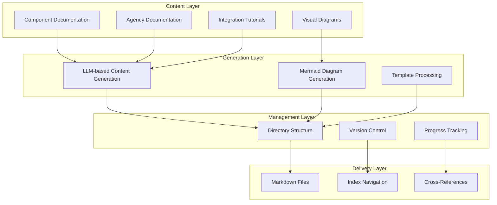
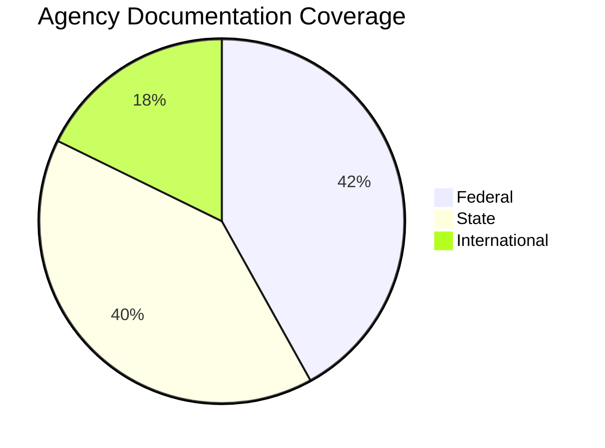
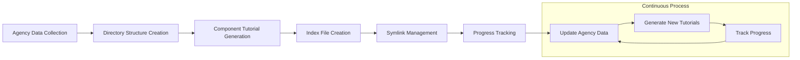

# HMS Documentation System

This document provides a comprehensive overview of the HMS Documentation System, its architecture, components, and capabilities.

## System Purpose

The HMS Documentation System serves as a comprehensive resource for documenting how the HMS platform interacts with and supports various government agencies across federal, state, and international levels. It provides:

1. **Component-specific tutorials** for each HMS module
2. **Agency-specific implementations** showing how each agency uses HMS
3. **Visual diagrams** illustrating workflows and integrations
4. **Best practices** for implementing HMS within government contexts

## Documentation Architecture

The HMS Documentation System uses a layered approach:



## Documentation Types

### Agency Documentation

Agency documentation is organized by agency type:

1. **Federal Agencies** - All 52 federal agencies
2. **State Agencies** - State-level agencies, primarily health departments
3. **International Health Systems** - Major health systems worldwide

For each agency, we provide:
- Agency overview and mission
- HMS integration opportunities
- Component-specific tutorials
- Implementation roadmaps

### Component Documentation

For each HMS component, we provide:

1. **Component Overview** - Purpose, capabilities, and architecture
2. **Integration Points** - How agencies can integrate with the component
3. **Implementation Guide** - Step-by-step implementation instructions
4. **Best Practices** - Guidance for optimal use
5. **Visual Diagrams** - Architecture and workflow diagrams

## System Components

The documentation system consists of several key components:

### Content Generation

- **LLM-based content generation** - Uses AI to create detailed tutorials
- **Template processing** - Applies consistent structure across all documentation
- **Mermaid diagram generation** - Creates visual diagrams for architecture and workflows

### Management System

- **Version control** - Manages documentation versions with timestamps
- **Progress tracking** - Visualizes documentation completion status
- **Automated indexing** - Creates navigational structures

### Delivery Mechanism

- **Markdown files** - Standardized format for all documentation
- **Cross-references** - Links between related content
- **Navigation structure** - Intuitive browsing experience

## Geographic Coverage

The documentation system provides coverage for:

- **Federal Level** - Complete coverage of all federal agencies
- **State Level** - Prioritized coverage of state health departments
- **International** - Key global health systems across 5 continents



## Implementation Process

The documentation generation follows a systematic process:



## Usage Guidelines

The HMS Documentation System is designed to:

1. **Support implementation teams** with detailed guidance
2. **Assist agency stakeholders** in understanding HMS capabilities
3. **Provide technical teams** with integration instructions
4. **Offer decision-makers** with clear value propositions

## Maintenance and Updates

The documentation system is maintained through:

1. **Regular content updates** - New components and capabilities
2. **Agency data refreshes** - Changes to agency structures or needs
3. **Visual diagram updates** - Reflecting architectural changes
4. **Progress monitoring** - Ensuring comprehensive coverage

## Integration with HMS Platform

The documentation system integrates with the HMS platform:

1. **References platform capabilities** with accurate technical details
2. **Aligns with HMS component versions** for implementation accuracy
3. **Reflects the HMS architectural model** for consistency
4. **Supports the HMS implementation methodology** for agencies

## Security and Compliance

The documentation system ensures:

1. **No sensitive information** is included in public documentation
2. **Compliance with agency documentation standards** is maintained
3. **Proper versioning** for audit and tracking
4. **Clear guidance on security implementations** for agencies

## Future Development

Planned enhancements include:

1. **Interactive documentation** with executable examples
2. **Automated testing** of documentation samples
3. **Expanded international coverage** for additional health systems
4. **Component-specific compliance documentation** for regulated sectors
5. **Agency-specific customization** of documentation

## Known Issues and Fixes

### Type Mismatch in Agency Issue Finder

**Issue**: In the `agency_issue_finder.py` script, the `_generate_implementation_guide` method had a type mismatch when processing the `main_flow` field of the use case. The function was expecting strings, but the actual data contained dictionary objects.

**Fix**: Modified line 547 to properly extract the "description" field from each step dictionary:

```python
# Old code (error-prone):
{' → '.join(use_case.get('main_flow', ['Implementation steps not available']))}

# New code (fixed):
{' → '.join([step.get('description', 'Step not available') if isinstance(step, dict) else str(step) for step in use_case.get('main_flow', ['Implementation steps not available'])])}
```

### Incomplete LLM API Functions

**Issue**: The `call_llm.py` module had several incomplete function implementations for API calls to different LLM providers.

**Fix**: Implemented the missing functions:
- `_cache_response`: Added implementation for caching responses
- `_call_anthropic`: Added implementation for Anthropic Claude API calls
- `_call_openai`: Added implementation for OpenAI API calls
- `_call_gemini`: Added implementation for Google Gemini API calls

### Model Configuration

Current supported models:
- Anthropic: "claude-3.5-sonnet-20240620" (default)
- OpenAI: "gpt-4o-mini" (default)
- Google: "gemini-1.5-pro" (default)