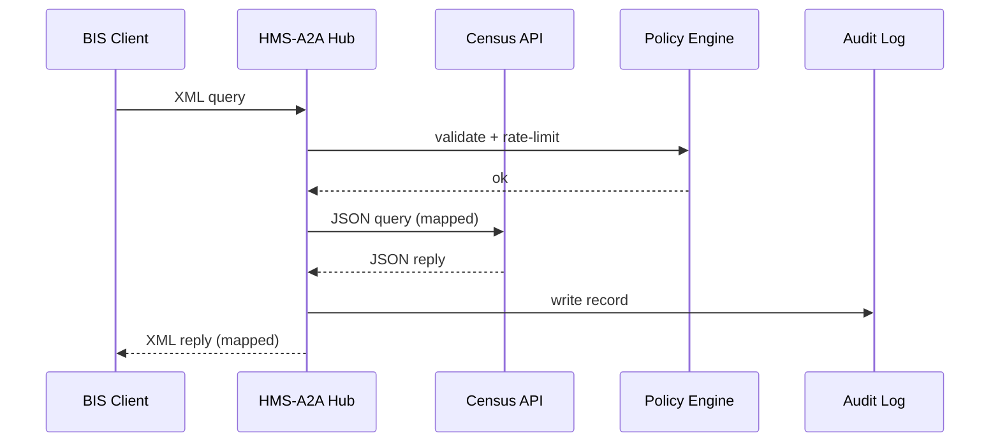

# Chapter 10: Inter-Agency Communication Hub (HMS-A2A)

*(continuing from [Chapter 9: Core Backend Service Layer (HMS-SVC)](09_core_backend_service_layer__hms_svc__.md))*  

---

## 1 · Why Do Agencies Need a “Diplomatic Pouch”?

> Scenario — The **Bureau of Industry & Security (BIS)** needs last-month’s **Census export data** to approve a small-business license.  
> 1. BIS stores requests in XML.  
> 2. Census publishes data as JSON.  
> 3. Each has its own firewall, encryption rules, and audit demands.

Without help you would glue together VPNs, hand-written parsers, and ad-hoc logs—risky and slow.  
**HMS-A2A** is the *diplomatic pouch* that:

1. Negotiates trust (mutual TLS + PKI).  
2. Translates formats (XML ↔ JSON).  
3. Enforces each agency’s policy (rate limits, privacy clauses).  
4. Writes an **immutable audit ribbon** so inspectors can replay the swap.

Beginners can picture A2A as an *API gateway between agencies*; experts recognize its **Policy Enforcement Points** and **PKI mesh** running under the hood.

---

## 2 · Key Concepts in Plain Words

| Term | Friendly Analogy | What It Does |
|------|------------------|--------------|
| Handshake | Diplomat shows passport | Mutual TLS + PKI verifies each side |
| Schema Map | Rosetta Stone | Converts `exporter_id` ↔ `expId` etc. |
| Policy Enforcement Point (PEP) | Customs checkpoint | Rejects oversized or un­authorized payloads |
| Audit Ribbon | Tamper-proof receipt | Stores *who* sent *what* & *when* |
| Trust Mesh | Global address book | Publishes public keys & endpoint URLs |

---

## 3 · Five-Minute Quick-Start  
Goal: BIS pulls *monthly export totals* from Census in **one** Python script.

```python
# bis_pull_census.py   (17 lines)
from hmsa2a import Pouch

# 1️⃣ Connect to the A2A pouch (auto MTLS)
pouch = Pouch(agency="BIS")

# 2️⃣ Draft request in BIS's native XML fields
query = {
    "ExporterID": "123-45-6789",
    "Month": "2024-05"
}

# 3️⃣ Send & receive. A2A handles translation, policy & logging
data = pouch.get("CENSUS", "/exports/summary", query)

print(data)          # JSON already mapped to BIS schema
```

Typical output:

```json
{
  "expId": "123-45-6789",
  "month": "2024-05",
  "totalUsd": 158000
}
```

What you *did not* write: TLS code, XML-JSON mapping, or audit logic—A2A did it.

---

## 4 · What Happens Behind the Curtain?



Only **five** actors; every hop is encrypted and signed.

---

## 5 · Under the Hood (Simplified Code)

### 5.1  Handshake & Trust Mesh (12 lines)

```python
# hmsa2a/handshake.py
import ssl, requests

def mtls_session(agency):
    ctx = ssl.create_default_context()
    ctx.load_cert_chain(f"/keys/{agency}.crt", f"/keys/{agency}.key")
    ctx.load_verify_locations("/keys/root_ca.pem")
    return requests.Session()  # TLS layer auto-attached
```

• Loads the agency’s certificate.  
• Verifies the remote certificate against the **root CA** published in the Trust Mesh.

### 5.2  Schema Mapping (15 lines)

```python
# hmsa2a/mapper.py
MAPS = {
  ("BIS", "CENSUS"): {"ExporterID": "exporter_id", "Month": "month"},
  ("CENSUS", "BIS"): {"exporter_id": "expId", "month": "month"}
}

def map_fields(data, src, dst):
    rule = MAPS[(src, dst)]
    return {rule[k]: v for k, v in data.items()}
```

Input + rule → clean output.  
Adding a new partner = add one `MAPS` line.

### 5.3  Policy Enforcement (18 lines)

```python
# hmsa2a/policy.py
LIMITS = {"BIS": {"max_months": 12}}

def check(agency, payload):
    if "Month" in payload:
        months = payload["Month"].split(",")
        if len(months) > LIMITS[agency]["max_months"]:
            raise ValueError("Too many months requested")
```

Rejects over-broad requests *before* they leave BIS.

---

## 6 · Hands-On Exercise

1. `pip install hmsa2a`  
2. Copy `bis_pull_census.py` and run it—observe the JSON.  
3. Modify the query to request **18 months** (`"Month":"2023-01,2023-02,…"`) and rerun.  
   You should see:  
   ```
   ValueError: Too many months requested
   ```

---

## 7 · Common Beginner Questions

**Q: Is HMS-A2A just an ordinary API gateway?**  
A: It *looks* like one to callers, but includes built-in schema maps, cross-agency PKI, and an immutable audit ribbon.

**Q: How do I add a new partner agency?**  
A: In HMS-GOV upload:  
```yaml
partner: FEMA
endpoint: https://api.fema.gov
cert: fema.pem
map:
  BIS→FEMA: {ExporterID: exporter_id}
  FEMA→BIS: {exporter_id: expId}
```
The Trust Mesh propagates the cert; no code redeploy needed.

**Q: Where are audit logs stored?**  
A: Append-only table inside [Central Data Repository (HMS-DTA)](19_central_data_repository__hms_dta__.md); hashed hourly for tamper-proofing.

---

## 8 · How A2A Connects to the Rest of HMS-NFO

* **Micro-Frontends**—Citizen uploads a file in [HMS-MFE](04_micro_frontend_interface_layer__hms_mfe__.md); the backend fetches verification data from another agency via A2A.  
* **Workflows**—A step inside [HMS-ACT](08_activity___workflow_orchestrator__hms_act___hms_oms__.md) uses A2A to call IRS before proceeding.  
* **Agents**—An AI agent from [HMS-AGT](06_ai_agent_framework__hms_agt___hms_agx__.md) can request records from Social Security securely.  
* **Oversight**—PEP violations trigger alerts in [HITL](07_human_in_the_loop_oversight__hitl__.md) for manual review.

---

## 9 · What You Learned

1. **HMS-A2A** is the encrypted *diplomatic pouch* moving data between government agencies.  
2. It handles trust, translation, policy, and audits—so you write only business code.  
3. A complete cross-agency call fit in **17 lines** of Python.  

Next we’ll venture *outside* government walls and sync with commercial or international systems through adapters you can swap in and out: [External System Sync & Integration Layer](11_external_system_sync___integration_layer_.md).

---

---

Generated by [AI Codebase Knowledge Builder](https://github.com/The-Pocket/Tutorial-Codebase-Knowledge)