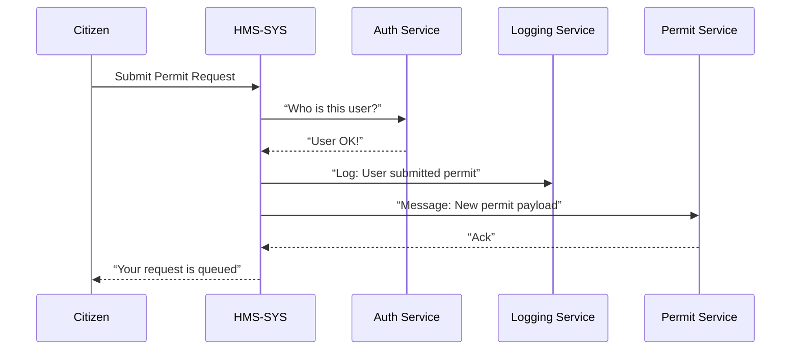
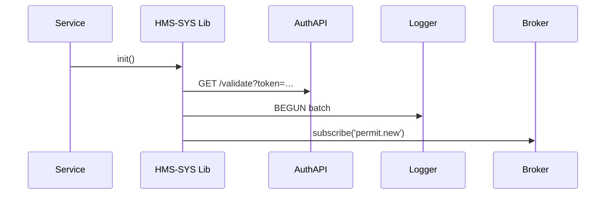

# Chapter 1: Core Infrastructure (HMS-SYS)

Welcome to the very first chapter of HMS-ACH! Here we’ll explore **Core Infrastructure (HMS-SYS)**—the “utility grid” beneath every module in our government platform.

## 1. Why Core Infrastructure Matters

Imagine a city without roads, power lines, or water pipes. Nothing works—neither hospitals nor fire stations. In HMS, **HMS-SYS** is that grid:

- It handles logging: Who did what and when?
- It enforces security: Who’s allowed to see which data?
- It routes messages: How do services talk to each other?

### Concrete Use Case: Federal Permit Application

A citizen submits a federal construction permit request.  
1. **Authenticate** the user.  
2. **Log** the submission event.  
3. **Queue** the request for the Permit Service.

HMS-SYS makes steps 1–3 easy and consistent across all modules.

---

## 2. Key Concepts

1. **Authentication Service**  
   Verifies identities (e.g., a U.S. Marshals officer or a citizen).  
2. **Authorization Service**  
   Grants or denies access to resources (e.g., view case files).  
3. **Logging Service**  
   Records events (audit trails for compliance).  
4. **Messaging Bus**  
   Routes messages reliably (e.g., permit requests to the right microservice).  
5. **Service Registry**  
   Keeps track of all running services and their locations.

---

## 3. High-Level Workflow



1. **Submit**: Citizen calls HMS-SYS.  
2. **Auth**: HMS-SYS asks Auth Service.  
3. **Log**: HMS-SYS writes an event.  
4. **Queue**: HMS-SYS pushes to the Permit Service.  
5. **Respond**: HMS-SYS returns a confirmation.

---

## 4. Using HMS-SYS in Your Code

Here’s how a microservice (e.g. Permit Service) plugs into HMS-SYS:

```javascript
// file: permit-service/index.js
const HMS = require('hms-sys')

// Initialize core infra
const core = HMS.init({ serviceName: 'PermitSvc' })

// Define a handler
core.onMessage('permit.new', async (payload) => {
  // payload = { userId, permitData }
  await core.auth.check(payload.userId, 'create-permit')
  // process permit...
  return { status: 'accepted', id: 1234 }
})
```
> This snippet shows a service registering a message handler.  
> 1. `init` wires up logging, auth, messaging.  
> 2. `core.auth.check` enforces permissions.

---

## 5. Under the Hood: What Really Happens

### 5.1 Step-by-Step Walkthrough

1. **Init**  
   - Reads config (URL of Auth Service, Logging endpoint, message broker).  
2. **Auth Check**  
   - Sends HTTP request to Auth Service.  
   - Waits for allow/deny.  
3. **Logging**  
   - Batch‐sends events to Logging Service over gRPC.  
4. **Messaging**  
   - Publishes or subscribes to a topic in RabbitMQ or Kafka.

### 5.2 Internal Sequence



---

## 6. Diving Into Code

Below is a simplified glimpse of the core library:

```javascript
// file: hms-sys/core.js
const http = require('http')
const amqp = require('amqplib')

exports.init = ({ serviceName }) => {
  // 1) Connect to Auth and Logging
  const authUrl = process.env.AUTH_URL
  const logClient = http.request(process.env.LOG_URL)
  // 2) Connect to Message Broker
  const channel = await amqp.connect(process.env.BROKER).then(c=>c.createChannel())
  
  return {
    auth: {
      check: async (userId, action) => {
        // Simplified auth call
        const res = await http.get(`${authUrl}/check?user=${userId}&act=${action}`)
        return res.statusCode === 200
      }
    },
    onMessage: (topic, handler) => {
      channel.consume(topic, msg => {
        // parse, call handler, ack
        const data = JSON.parse(msg.content)
        handler(data).then(() => channel.ack(msg))
      })
    }
  }
}
```
> We skip error‐handling and config details for clarity.

---

## 7. Summary

In this chapter you learned:
- Why **HMS-SYS** is like a city’s utilities grid.
- The core services: Authentication, Authorization, Logging, Messaging, Registry.
- How to wire up a microservice with `HMS.init()`.
- A peek at the internal flow and code.

Up next, we’ll dive deeper into how microservices themselves are built on top of this grid.  
[Backend Microservices Layer (HMS-SVC)](02_backend_microservices_layer__hms_svc__.md)

---

Generated by [AI Codebase Knowledge Builder](https://github.com/The-Pocket/Tutorial-Codebase-Knowledge)