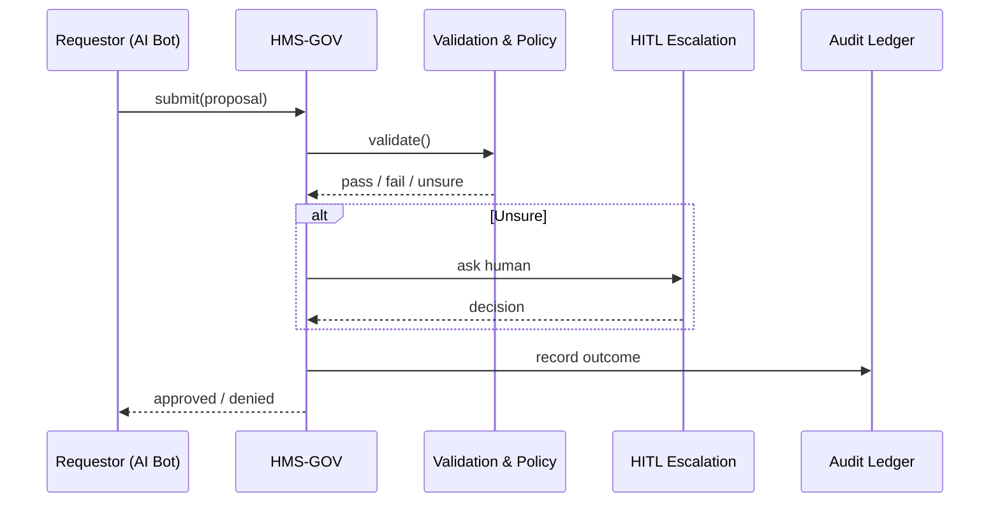

# Chapter 1: Governance Layer (HMS-GOV)

> “Every clever piece of code that touches a public service should meet in the city-council chamber before it meets a citizen.”  

Welcome to the first stop on our HMS-ACH journey. In this chapter we will meet the Governance Layer (HMS-GOV), the place where rules, ethics, and transparency are enforced before any change goes live.

---

## 1. Why Do We Need a Governance Layer?

### A quick story

The **Office of Postsecondary Education (OPE)** wants to shorten the **FAFSA** review cycle from 5 days to 2 days. A developer writes an AI-powered optimization rule that re-orders application queues. ✨  
But before the rule is deployed, we must check:  

* Does it disadvantage any group?  
* Does it break privacy law?  
* Is the logic explainable to auditors?  

HMS-GOV is the checkpoint that answers these questions automatically and records the answers for later audits.

---

## 2. High-Level View

Think of HMS-GOV as a three-part city-council meeting:

```
+--------------+     +-----------------+     +----------------+
|  Proposal    | --> |  Deliberation   | --> |  Resolution    |
| (AI change)  |     | (policy check)  |     | (approve/deny) |
+--------------+     +-----------------+     +----------------+
```

1. **Proposal** – Any subsystem (finance, health, education) submits a change request.  
2. **Deliberation** – Automated engines verify legal, ethical, and security constraints.  
3. **Resolution** – HMS-GOV approves, rejects, or asks for a human decision.

---

## 3. Key Concepts (Beginner Friendly)

| Concept | Plain-English Analogy |
|---------|----------------------|
| Policy Knob | A light switch on the council wall (“Enable 2-day FAFSA reviews”) |
| Validation Engine | The legal advisor who reads every clause |
| Ethics & Privacy Filter | The civil-rights watchdog in the room |
| Audit Hook | The stenographer writing everything down |
| Delegation Gateway | A doorway to [Human-in-the-Loop Oversight (HITL)](06_human_in_the_loop_oversight__hitl__.md) when machines are unsure |

---

## 4. Hands-On Example: Proposing a Hospital Scheduling Rule

Below is a **tiny** Python-like snippet that a developer (or AI agent) might run.

```python
# 1. Compose the change request --------------------
proposal = {
    "module": "HMS-HLT",
    "description": "Reduce check-in buffer from 30m to 15m",
    "impact": ["patient_flow", "privacy", "staff_hours"],
    "author": "ai_scheduler_bot_v2"
}

# 2. Send it to HMS-GOV --------------------------------
response = hms_gov.submit(proposal)

# 3. Interpret the response ----------------------------
if response["status"] == "approved":
    deploy_rule()
else:
    print("Denied:", response["reason"])
```

Explanation  
• `proposal` lists **what** we want to change.  
• `hms_gov.submit()` is the single public call to the Governance Layer.  
• The response tells us whether we can safely run `deploy_rule()`.

That’s it! For beginners, the takeaway is: *all modifications funnel through one guardian.*

---

## 5. What Happens Inside?



Five participants—easy to remember!

---

## 6. Peek Under the Hood (Simplified Code)

File: `hms_gov/core.py`

```python
def submit(proposal: dict) -> dict:
    """
    Main entry the outside world calls.
    Returns {'status': 'approved' | 'denied', 'reason': str}
    """
    if not _basic_schema_ok(proposal):
        return {"status": "denied",
                "reason": "Malformed proposal"}

    # Run through rule packs stored in
    # Policy & Process Registry (see Chapter 12)
    violations = _run_policy_checks(proposal)

    if violations:
        _audit(proposal, "denied", violations)
        return {"status": "denied",
                "reason": "; ".join(violations)}

    # Optional: ask human when confidence is low
    if _needs_human(proposal):
        decision = _delegate_to_hitl(proposal)  # Chapter 6 link
        _audit(proposal, decision)
        return decision

    _audit(proposal, "approved")
    return {"status": "approved", "reason": "All clear"}
```

Highlights  
1. `_run_policy_checks()` pulls rules from the central registry— nothing is hard-coded.  
2. `_delegate_to_hitl()` sends edge cases to [Human-in-the-Loop Oversight (HITL)](06_human_in_the_loop_oversight__hitl__.md).  
3. `_audit()` appends the result to the immutable [Compliance & Audit Ledger](14_compliance___audit_ledger_.md).

---

## 7. Connecting to Other Layers

• Users and admins will request changes through the [Interface Layer (User & Admin Portals)](02_interface_layer__user___admin_portals__.md).  
• Permissions are enforced with the [Access & Authorization Matrix](03_access___authorization_matrix_.md).  
• Approved changes are orchestrated by the [Management Layer](07_management_layer__service_orchestration__.md).

---

## 8. Mini Checklist Before You Move On

✅ All changes flow through HMS-GOV.  
✅ Policies live outside your code in the registry.  
✅ Every decision is logged for auditors.  
✅ Unsure cases go to humans (HITL).  

---

## 9. Conclusion & Next Steps

You now know **why** and **how** the Governance Layer acts as the gatekeeper for ethical, legal, and transparent AI operations in HMS-ACH. In the next chapter we will see how real users and administrators **interact** with the system through clean, guided portals.

👉 Continue to [Interface Layer (User & Admin Portals)](02_interface_layer__user___admin_portals__.md)

---

Generated by [AI Codebase Knowledge Builder](https://github.com/The-Pocket/Tutorial-Codebase-Knowledge)