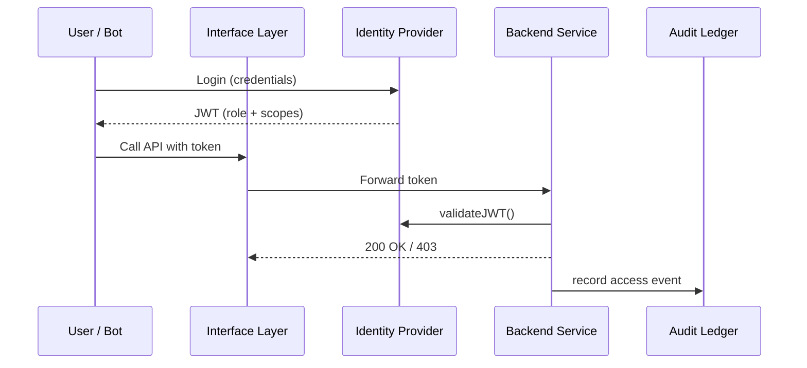

# Chapter 3: Access & Authorization Matrix

> “A door without a lock is just a hole in the wall.”  

In [Chapter&nbsp;2: Interface Layer (User & Admin Portals)](02_interface_layer__user___admin_portals__.md) citizens and clerks happily clicked **Submit** and **Approve**.  
But *who* decided that Officer Chen could approve María’s noise-complaint while María herself could only see her own ticket?

Meet the **Access & Authorization Matrix**—the color-coded key ring that decides “who can see or change what” across every screen, API, and AI agent in HMS-ACH.

---

## 1. Why Do We Need a Matrix?  

### Use-Case: Updating a Student Loan Record  
1. **Citizen Alex** logs in to view his payment history.  
2. **Clerk Maya** updates an incorrect interest rate.  
3. **Auditor Sam** investigates whether Maya’s change followed policy.  
4. **AI Agent Bot-42** runs overnight reconciliations.

If any actor can perform any action, a single typo—or malicious script—could alter thousands of federal loan records.  
The Matrix prevents this by combining three layers:

1. OAuth 2.0 tokens (identity)  
2. Role-Based Access Control (RBAC) tables (authority)  
3. FedRAMP controls (government compliance)

---

## 2. Key Concepts in Plain English  

| Term | Badge Color | One-Line Analogy |
|------|-------------|------------------|
| Identity Provider (IdP) | Silver | The DMV photo counter—proves you are you |
| Role | Blue, Green, Red | “Citizen”, “Clerk”, “Auditor”, “AI Agent” |
| Permission / Scope | Shape on badge | “Read Payments”, “Edit Rates”, “View Logs” |
| Access Matrix | Wall chart | Rows = roles, Columns = actions, ✔️ marks allowed |
| FedRAMP Control | Gold sticker | Extra seal that says “Meets federal audit rules” |

---

## 3. A 60-Second Tour of the Matrix  

Below is a **micro** version of the real YAML file stored in `matrix/student_loans.yml`.

```yaml
roles:
  citizen:
    can:
      - loan:read_own
  clerk:
    can:
      - loan:read_any
      - loan:update_rates
  auditor:
    can:
      - loan:read_any
      - audit:read_logs
  ai_agent:
    can:
      - loan:read_any
      - loan:reconcile
fedramp_level: moderate
```

Explanation  
• `roles` lists badges.  
• Each `can` entry is an **action scope**.  
• `fedramp_level` tags the entire file for auditors.

---

## 4. Getting a Token (Outside View)

### Step A – Citizen Login (Front-End)

```javascript
// 1) Redirect user to IdP
window.location = oauth.authorizeURL();

// 2) After login, IdP sends ?code=ABC back
const token = await oauth.fetchToken("ABC");
```

The browser now holds a signed **JWT** like:

```json
{
  "sub": "user_123",
  "role": "citizen",
  "scope": ["loan:read_own"]
}
```

### Step B – API Call

```javascript
api.get("/loans", { headers: { Authorization: `Bearer ${token}` }});
```

That’s it! No custom crypto needed—just OAuth and a short JSON Web Token.

---

## 5. Enforcing the Matrix (Server View)

File: `middleware/auth.py`

```python
def check(scope_needed):
    def wrapper(fn):
        def inner(req, *a, **kw):
            tok = decode_jwt(req.headers["Authorization"])
            if scope_needed not in tok["scope"]:
                raise HTTPError(403, "Forbidden")
            return fn(req, *a, **kw)
        return inner
    return wrapper
```

Usage:

```python
@router.post("/loans/{id}/rate")
@check("loan:update_rates")
def update_rate(req, id):
    ...
```

• `decode_jwt` verifies signature + expiry.  
• If the badge lacks the right “shape,” a **403 Forbidden** is returned.

---

## 6. What Happens Under the Hood?



Five actors—none bite.

---

## 7. Under-the-Hood Code Peek  

File: `matrix/loader.py` (loads YAML once)

```python
import yaml
from functools import lru_cache

@lru_cache
def get_matrix():
    with open("matrix/student_loans.yml") as f:
        return yaml.safe_load(f)
```

File: `authz/resolver.py` (maps role → scopes)

```python
def scopes_for(role):
    m = get_matrix()
    return set(m["roles"][role]["can"])
```

File: `authz/validator.py`

```python
def token_has_scope(token, needed):
    return needed in set(token["scope"])
```

These tiny helpers keep the core rule set outside your code so an auditor can read the same YAML you do—*FedRAMP loves that*.

---

## 8. Putting It All Together – Mini Integration Test

```python
def test_citizen_cannot_update():
    t = {"role": "citizen", "scope": ["loan:read_own"]}
    assert not token_has_scope(t, "loan:update_rates")
```

Run `pytest` → green dot ✔️.

---

## 9. FAQ for Beginners

**Q: What if a clerk needs temporary auditor rights?**  
A: Create a short-lived OAuth scope `auditor:temp24h` and attach it via HMS-GOV approval.  

**Q: Do I need to learn FedRAMP?**  
A: Not today. Just keep the matrix file version-controlled and signed; compliance officers handle the paperwork.  

**Q: Can AI Agents share tokens?**  
A: No—each bot gets its own service account with the *ai_agent* role. Easier to revoke.

---

## 10. Checklist Before You Continue  

☑ Tokens prove identity (OAuth).  
☑ Roles map to scopes via a YAML Matrix.  
☑ One decorator (`@check`) blocks forbidden calls.  
☑ Every access is logged for [Compliance & Audit Ledger](14_compliance___audit_ledger_.md).  

---

## 11. Conclusion & Next Steps  

You now know how the Access & Authorization Matrix hands out color-coded badges and enforces them—whether the caller is a citizen, clerk, auditor, or AI bot. 🎟️🔒

Next, we’ll explore how the system gently *guides* each authorized user through complex tasks using AI-generated hints in [Intent-Driven Navigation (AI-Guided Journeys)](04_intent_driven_navigation__ai_guided_journeys__.md).

---

---

Generated by [AI Codebase Knowledge Builder](https://github.com/The-Pocket/Tutorial-Codebase-Knowledge)