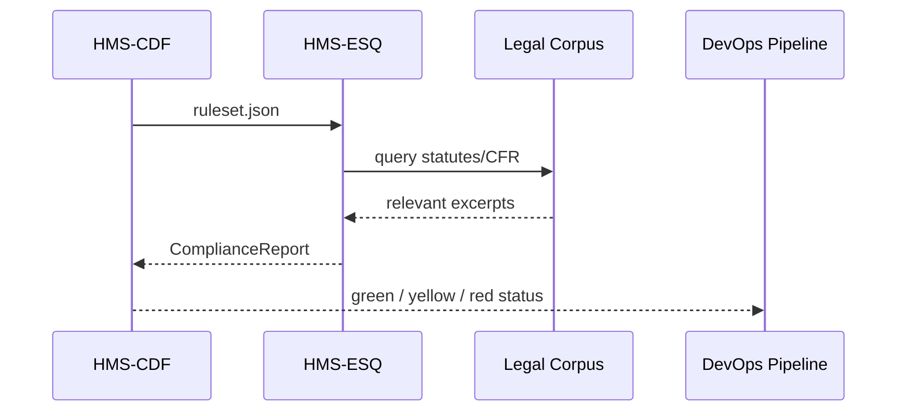
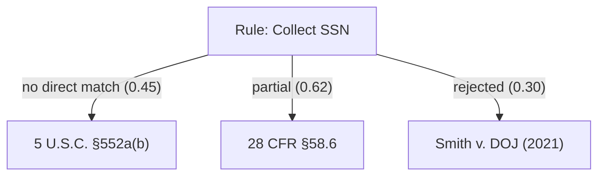

# Chapter 3: Compliance & Legal Reasoning (HMS-ESQ)


*(continuing from [Chapter 2: Legislative Codification Engine (HMS-CDF)](02_legislative_codification_engine__hms_cdf__.md))*  

---

## 1. Why Do We Need HMS-ESQ?

Picture the **U.S. Trustee Program** rolling out a new electronic form for bankruptcy petitions.  
The form is already:

1. Drafted, reviewed, and signed in [HMS-GOV](01_governance_layer__hms_gov__.md).  
2. Codified into a machine-readable rule set by [HMS-CDF](02_legislative_codification_engine__hms_cdf__.md).

But before the form touches the public, we still have scary questions:

* Does it violate any CFR citation about data retention?  
* Does it over-collect Personally Identifiable Information (PII) under the Privacy Act?  
* If an AI agent tries to “simplify” the form, will it accidentally **overreach** legal boundaries?

**HMS-ESQ** is the forever-awake **Office of General Counsel in code** that answers those questions.  
It ingests **statutes, CFR sections, agency manuals, and case law** to:

1. Run automated compliance checks.  
2. Provide exact legal citations when something looks fishy.  
3. Flag potential overreach *before* anything hits production.

The result: no surprise phone calls from OMB, DOJ, or a federal judge.

---

## 2. High-Level Use Case (Our Running Story)

Goal: Publish the new bankruptcy e-form at `forms.usdoj.gov/bankruptcy/petition`.  

We will:

1. Send the codified rule set to HMS-ESQ.  
2. Receive a **green, yellow, or red** compliance report.  
3. Act on the report—automatically stop deployment if red.

---

## 3. Key Concepts (Plain English)

| Term | Friendly Description |
|------|----------------------|
| Legal Corpus | The library: statutes, CFR, agency memos, case law. |
| Compliance Check | A robot paralegal that compares a proposed rule against the corpus. |
| Citation Graph | A map that shows *why* something passed or failed. |
| Overreach Detector | Looks for authority mismatches (e.g., form asks for data never authorized by law). |
| Confidence Score | 0–1 number showing how sure the engine is about each finding. |
| “Stoplight” Report | Green = good, Yellow = caution, Red = block release. |

---

## 4. Using HMS-ESQ in 12 Lines

### 4.1. Send a Rule Set for Review

```python
# file: demo_esq.py
from hms_esq import ESQ

esq = ESQ(url="http://localhost:9090")

with open("ruleset.json") as f:
    rules = f.read()

report = esq.review(rules)
print(report.stoplight)     # "yellow"
for item in report.flags:
    print(item.summary)
```

Expected console:

```
yellow
1. Privacy Act conflict: SSN collection lacks 552a notice (confidence 0.92)
2. CFR 28 §58.6 requires retention notice (confidence 0.78)
```

Explanation  
• `review()` uploads the machine-readable rules.  
• HMS-ESQ returns a `ComplianceReport` object with a stoplight status and detailed flags.  
• You decide whether to fix or override (with proper HITL logging, of course).

---

### 4.2. Minimal “Fix & Re-check” Loop

```python
# remove SSN field from form metadata...
rules = patch_ruleset(rules, remove="ssn")

if esq.review(rules).stoplight == "green":
    deploy(rules)  # send downstream to HMS-ACH
```

*If the stoplight is green, the deployment continues to the [Payment & Clearinghouse Engine (HMS-ACH)](04_payment___clearinghouse_engine__hms_ach__.md).*

---

## 5. What Happens Under the Hood?



---

## 6. Under-the-Hood Walkthrough (No Heavy Code Yet)

1. **Parse** – ESQ tokenizes the ruleset into obligations (“collect SSN”, “retain data 7 yrs” …).  
2. **Match** – Each obligation is matched against authority in the Legal Corpus.  
3. **Score** – A confidence score is calculated using a mix of keyword overlap and previous case-law embeddings.  
4. **Aggregate** – Scores roll up into Green/Yellow/Red.  
5. **Explain** – A citation graph is generated so humans (and auditors) can trace decisions.

---

## 7. Tiny Peek at the Source

### 7.1. Router (FastAPI, 15 lines)

```python
# file: hms_esq/api.py
from fastapi import FastAPI, HTTPException
from .core import analyze

app = FastAPI()

@app.post("/review")
async def review(ruleset: str):
    try:
        report = await analyze(ruleset)
        return report.dict()
    except ValueError as e:
        raise HTTPException(status_code=422, detail=str(e))
```

Explanation  
• Exposes one endpoint `/review`.  
• Delegates all logic to `core.analyze()`.

---

### 7.2. Analyzer Core (excerpt, 20 lines)

```python
# file: hms_esq/core.py
import json
from .legal import corpus, compare

async def analyze(ruleset_txt: str):
    rules = json.loads(ruleset_txt)

    obligations = extract(rules)          # → ["collect_ssn", "retain_7yrs", ...]
    flags = []
    for obl in obligations:
        hits = compare(obl, corpus)       # returns [(citation, score), ...]
        top = max(hits, key=lambda h: h[1])
        if top[1] < 0.8:                  # < 0.8 = shaky authority
            flags.append({
                "summary": f"No clear authority for {obl}",
                "citation": top[0],
                "confidence": round(top[1], 2)
            })
    stoplight = "red" if flags else "green"
    return ComplianceReport(stoplight, flags)
```

Explanation  
• `extract()` is a simple regex & JSONPath helper.  
• `compare()` uses embeddings cached in `legal.corpus`.  
• Confidence threshold (0.8) is configurable.

---

## 8. Visualizing a Citation Graph



Yellow nodes (scores < 0.8) trigger flags.

---

## 9. Frequently Asked Questions

**Q1: Where does the legal corpus live?**  
A: Inside a Postgres DB seeded nightly from govinfo.gov, e-CFR, and a small set of key case law. The sync job belongs to [Inter-Agency Data Exchange (HMS-A2A)](07_inter_agency_data_exchange__hms_a2a__.md).

**Q2: Can we override a red flag?**  
Yes, but HMS-GOV requires a **Human-in-the-Loop (HITL)** signature stating *why*.

**Q3: Does ESQ do budget scoring again?**  
No. That stays in HMS-CDF. ESQ focuses on legal authority & compliance.

---

## 10. Mini Challenge (Optional)

1. Change the field label “Date of Birth” to “Birth City and Hospital.”  
2. Run `esq.review()` again.  
3. ESQ should return **red** because the form now requests sensitive data with no statutory basis.

---

## 11. What We Learned

• HMS-ESQ acts as an automated **compliance firewall** between codified rules and real-world deployment.  
• It leverages a living legal corpus to give **explainable pass/fail results**.  
• Developers can treat it like a CI test—fail fast before citizens or auditors notice.

Ready to move money, fees, and refunds once our policy is legally clean? Jump to [Chapter 4: Payment & Clearinghouse Engine (HMS-ACH)](04_payment___clearinghouse_engine__hms_ach__.md).

---

Generated by [AI Codebase Knowledge Builder](https://github.com/The-Pocket/Tutorial-Codebase-Knowledge)