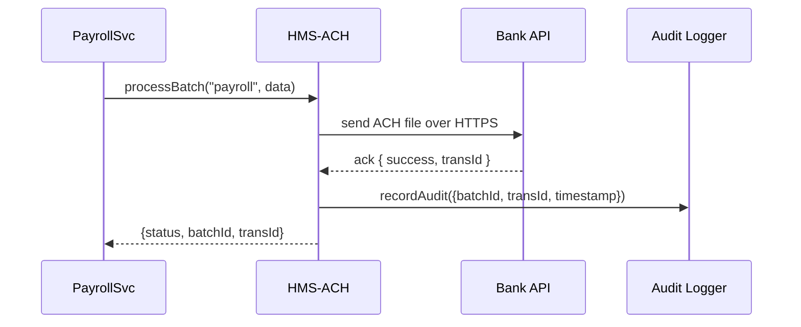

# Chapter 4: Financial Services Module (HMS-ACH)

Welcome back! In [Chapter 3: Backend API Layer](03_backend_api_layer_.md) we learned how to expose a unified HTTP interface for all microservices. Now we turn to the “finance office” of our system: the **Financial Services Module (HMS-ACH)**.

---

## 1. Why HMS-ACH?

Think of HMS-ACH as the city hall finance office that processes:

- **Payrolls** for government employees  
- **Vendor payments** (stationery, IT contracts)  
- **Expense reimbursements** (travel, training)  

Our goal is to automate these payments securely, keep track of every transaction, and provide clear audit trails—just like a real treasurer’s office.

### Concrete Use Case: Monthly Payroll

Each month the **Payroll Service** collects salaries:

1. Gathers `{ empId, bankAccount, amount }` for all staff  
2. Builds an **ACH file** (standard payment format)  
3. Sends it to the bank  
4. Receives confirmation and a transaction ID  
5. Records an audit entry for compliance  

HMS-ACH wraps all of this into one simple interface so your service only needs to call `processBatch`.

---

## 2. Key Concepts

1. **ACH Batch**  
   A file that lists multiple payments in a bank‐friendly format.  
2. **Secure Transmission**  
   All files are sent over HTTPS or SFTP with encryption.  
3. **Reconciliation**  
   Matching bank acknowledgments to your original requests.  
4. **Audit Trail**  
   Immutable logs of who sent what, when, and with what result.  
5. **Error Handling**  
   Automatic retries and clear error codes when something goes wrong.

---

## 3. Using HMS-ACH in Your Code

Below is a minimal example. We’ll build a tiny **PayrollSvc** that sends our January payroll.

```javascript
// file: payroll-service/index.js
const ach = require('hms-ach').init({ serviceName: 'PayrollSvc' })

async function sendJanuaryPayroll() {
  const payrollData = [
    { empId: 101, account: '123-456', amount: 3000.00 },
    { empId: 102, account: '234-567', amount: 3200.00 }
  ]

  // 1) Call HMS-ACH to process our batch
  const result = await ach.processBatch('payroll', payrollData)

  // 2) Inspect the response
  console.log(result)
  // Example output:
  // { status: 'completed', batchId: 'payroll-202401', transId: 'ACH12345' }
}

sendJanuaryPayroll()
```

Explanation:

1. `init()` wires up logging, bank connection, and audit  
2. `processBatch(type, items)` builds an ACH file, sends it, waits for the bank  
3. The returned object tells you if it succeeded, and gives you IDs

---

## 4. What Happens Under the Hood?

Here’s a step-by-step view when you call `processBatch`:



1. **PayrollSvc** calls `processBatch`.  
2. **HMS-ACH** formats data into a bank‐standard file.  
3. It sends the file to the **Bank API**.  
4. The bank replies with success/failure and a transaction ID.  
5. HMS-ACH writes an audit record.  
6. Your service receives the final result.

---

## 5. Inside HMS-ACH: A Peek at Code

Let’s inspect a simplified slice of the HMS-ACH core library.

```javascript
// file: hms-ach/core.js
const https = require('https')

exports.init = ({ serviceName }) => {
  // 1) Setup audit logger (omitted)
  // 2) Read BANK_URL from environment
  const bankUrl = process.env.BANK_URL

  return {
    processBatch: async (type, items) => {
      const batchId = `${type}-${Date.now()}`
      const fileContent = buildACHFile(batchId, items)
      
      // Send file to bank
      const response = await postToBank(bankUrl, fileContent)
      
      // Record audit (omitted details)
      await logAudit({ serviceName, batchId, response })

      return {
        status: response.success ? 'completed' : 'failed',
        batchId,
        transId: response.transId
      }
    }
  }
}

// Helpers (simplified; real code would handle errors, retries, format details)
function buildACHFile(batchId, items) {
  return `#ACH ${batchId}\n` + items.map(i => `${i.empId},${i.account},${i.amount}`).join('\n')
}

function postToBank(url, content) {
  // Returns a promise that resolves to { success: true, transId: 'ACH12345' }
  return new Promise((resolve) => {
    /* HTTPS POST logic omitted */
    resolve({ success: true, transId: 'ACH12345' })
  })
}
```

Explanation:

- We build a simple text file in ACH‐like format.  
- We send it via HTTPS (in production you’d use SFTP or secure API).  
- We log an audit record so regulators can trace every batch.

---

## 6. Summary

In this chapter we covered:

- Why we need a **Financial Services Module** to handle payroll, vendor payments, and reimbursements.  
- How to call `ach.processBatch(...)` from your microservice.  
- The internal workflow: file creation → secure send → bank acknowledgment → audit.  
- A peek at the core implementation of HMS-ACH.

Up next, we’ll learn how to keep external systems (like legacy tax or treasury databases) in sync with our HMS platform.  
[Chapter 5: External System Synchronization](05_external_system_synchronization_.md)

---

Generated by [AI Codebase Knowledge Builder](https://github.com/The-Pocket/Tutorial-Codebase-Knowledge)