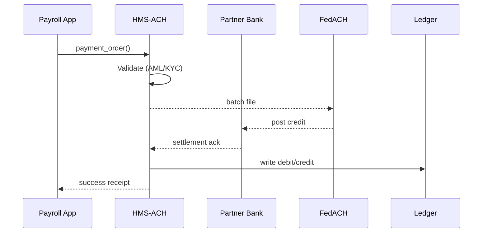

# Chapter 4: Payment & Clearinghouse Engine (HMS-ACH)

*(continuing from [Chapter&nbsp;3: Compliance & Legal Reasoning (HMS-ESQ)](03_compliance___legal_reasoning__hms_esq__.md))*  

---

## 1. Why Do We Need HMS-ACH?

Picture **West Point** on payday.  
Thousands of cadets expect their stipends to show up in their bank accounts **before breakfast**.  
Behind the scenes, dozens of rules apply:

* The Treasury must verify each cadet passed background checks (AML/KYC).  
* Any garnishments (e.g., unpaid child support) must be withheld.  
* The Department of Labor wants the payment recorded for statistics.  
* Auditors need a crystal-clear trail **down to the penny**.

Trying to stitch this together with ad-hoc scripts is asking for a 3 a.m. crisis call from OMB.

**HMS-ACH** is our **digital Treasury window**:  
a 24/7, never-tired clerk that **validates, settles, and reconciles** every payment—be it cadet stipends, NSF research grants, small-business tax refunds, or license fees.

---

## 2. Key Concepts (Plain English)

| Term | Friendly Description |
|------|----------------------|
| Payment Order | A “check” in JSON form: who gets paid, how much, and why. |
| Validator | The bouncer: runs AML/KYC, budget caps, and policy checks before money moves. |
| Switch | The router: picks the right network (FedACH, FedWire, RTP, card rails). |
| Settlement | The second the money legally changes hands. |
| Reconciliation | Making sure books on **both** sides match, flagging any penny off. |
| Ledger Micro-Service | Tiny database that writes an immutable “debit / credit” entry per event. |

---

## 3. 5-Minute Walking Tour

We will send $1 000 to Cadet «Jane Doe» at **USAA Bank**.

### 3.1. Install & Configure (one-time)

```bash
pip install hms-ach
export ACH_BANK_ENDPOINT="https://sandbox-bank.gov/api"
```

### 3.2. Draft a Payment Order

```python
# file: demo_ach.py
from hms_ach import ACH, PaymentOrder

ach = ACH()                                # uses env vars for config

cadet_pay = PaymentOrder(
    id="PAY-2024-0515-0001",
    amount=1_000_00,            # cents
    currency="USD",
    recipient={
        "name": "Jane Doe",
        "routing": "314074269",
        "account": "9876543210"
    },
    purpose="West Point monthly stipend"
)
```

Explanation  
• We create an `ACH` engine object.  
• `amount` is in **cents** to avoid floating-point bugs.  
• `purpose` helps auditors & AML screeners.

### 3.3. Validate, Settle, Reconcile

```python
if ach.validate(cadet_pay):
    ach.settle(cadet_pay)
    ach.reconcile(cadet_pay.id)
```

Console (conceptual):

```
✓ KYC match
✓ Treasury fund balance OK
✓ Sent to FedACH batch #792
✓ Confirmed by USAA (t+1)
Ledger entry: DR Treasury / CR Jane Doe  $1,000.00
```

That’s it—Cadet Jane sees her money the next morning.

---

## 4. What Happens Under the Hood?



---

## 5. Under-the-Hood Modules (No Heavy Code)

1. **Validator**  
   • Calls OFAC and FinCEN lists.  
   • Checks budget allotment from [Chapter 1: HMS-GOV](01_governance_layer__hms_gov__.md).  
   • Confirms policy authority with [HMS-ESQ](03_compliance___legal_reasoning__hms_esq__.md).

2. **Switch**  
   • Simple rule table (`routing.startswith("026") → FedACH`).  
   • Fallback to same-day FedWire for amounts > \$100 000.

3. **Settlement Worker**  
   • Runs every minute.  
   • Pulls “pending” orders, groups by bank, sends one compact file.

4. **Reconciler**  
   • Listens for bank webhooks.  
   • Auto-fixes minor rounding differences; escalates mismatches to HITL.

---

## 6. Tiny Peek at the Source

### 6.1. Router (FastAPI, 18 lines)

```python
# file: hms_ach/api.py
from fastapi import FastAPI
from .core import validate, settle

app = FastAPI()

@app.post("/payments")
def create(order: dict):
    if not validate(order):
        return {"status": "rejected"}
    receipt = settle(order)
    return {"status": "accepted", "receipt": receipt}
```

Explanation  
• One endpoint: `/payments`.  
• Rejects immediately if `validate()` fails.  
• `settle()` pushes to an internal queue; client gets a receipt ID.

### 6.2. Validator Core (excerpt, 15 lines)

```python
# file: hms_ach/validator.py
def validate(order):
    if hits_sanctions(order["recipient"]["name"]):
        log("AML_FAIL", order)
        return False
    if order["amount"] > current_budget(order["purpose"]):
        log("OVER_BUDGET", order)
        return False
    # call HMS-ESQ to make sure purpose is authorized
    ok = esq_client.check_purpose(order["purpose"])
    return ok
```

Explanation  
• Three quick checks: sanctions, budget, legal purpose.  
• Each failure writes to an audit log.

---

## 7. Frequently Asked Questions

**Q1: How is HMS-ACH different from a normal bank ACH file?**  
HMS-ACH adds **policy and audit layers** on top of plain banking rails, so every cent complies with federal rules automatically.

**Q2: What if a payment bounces?**  
The Reconciler flips the ledger entry to “failed” and triggers a **HITL** task to correct the recipient details.

**Q3: Does HMS-ACH handle credit-card payments?**  
Yes. The Switch chooses card gateways (e.g., Pay.gov) when the `method="CARD"` flag is present.

---

## 8. Mini Challenge (Optional)

1. Change the amount to **$150 000**.  
2. Run the script again.  
3. Observe the console log: `Switching to FedWire – high-value payment`.

Can you update the Switch rule so anything > \$50 000 also uses FedWire?

---

## 9. What We Learned

• HMS-ACH is the **always-awake clerk** that moves money while enforcing AML, policy, and audit rules.  
• A simple three-step API—`validate → settle → reconcile`—hides all the banking complexity.  
• Under the hood, small modules (Validator, Switch, Settlement Worker, Reconciler) keep concerns isolated and traceable.

Ready to see how all these micro-services talk to each other behind the scenes? Jump to [Chapter&nbsp;5: Micro-Services Spine](05_micro_services_spine_.md).

---

Generated by [AI Codebase Knowledge Builder](https://github.com/The-Pocket/Tutorial-Codebase-Knowledge)