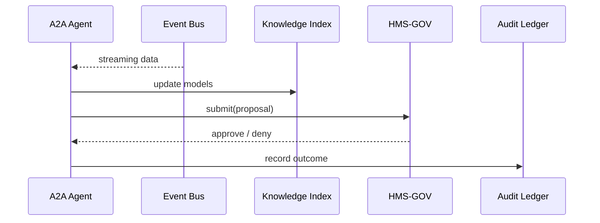

# Chapter 5: AI Representative Agent (A2A Node)

_In the last chapter we learned how [Intent-Driven Navigation (AI-Guided Journeys)](04_intent_driven_navigation__ai_guided_journeys__.md) walks each citizen through a task step-by-step.  
But who keeps those journeys fresh when laws, budgets, or user behavior change overnight?_

Enter the **AI Representative Agent**, our sleepless policy analyst that lives inside HMS-A2A.

---

## 1. Motivation — A Concrete Use-Case

### Story: Shortening Veterans’ Benefit Claims  
The **Department of Veterans Affairs (VA)** wants to cut the average disability-claim review time from **90 days to 45 days**.  
Instead of commissioning a six-month study, they turn on the A2A Agent for the “VA-BENEFITS” module:

1. It reads the public statute, past approval data, and incoming Event-Bus logs.  
2. It notices that 23 % of claims wait on a missing medical form.  
3. It drafts a brand-new journey step: _“Auto-import DoD Medical Records when claimant consents.”_  
4. It submits the proposal to the Backend API.  
5. If the [Governance Layer](01_governance_layer__hms_gov__.md) approves, the step quietly appears in the next release.  
6. If the change reduces wait time, the Agent’s “promotion score” goes up; if it backfires, it is put **on probation**.

One digital civil servant, thousands of claims sped up.

---

## 2. Key Concepts (Plain-English Cheatsheet)

| Term | Beginner Analogy | One-Line Description |
|------|------------------|----------------------|
| A2A Node | 24/7 intern | Runs inside HMS-A2A, learns and drafts improvements. |
| Knowledge Feed | Newspaper stack | Event logs, regulations, and user data the Agent constantly reads. |
| Draft Proposal | Suggestion memo | JSON describing a new or changed process. |
| Success Score | Performance review | % of its proposals that succeed after deployment. |
| Probation / Promotion | HR status | Thresholds that limit or expand what the Agent may change. |

---

## 3. Using the Agent (Exterior View)

You **don’t** call deep ML libraries.  
You send **one** JSON file to the Agent and listen for proposals.

### 3.1 Registering a Knowledge Feed

```python
agent.register_feed(
    name="va_claim_logs",
    source="event_bus://va.benefits.claim_submitted")
```
_Explanation_: The Agent now listens to every new VA claim event.

### 3.2 Receiving a Draft Proposal

```python
proposal = agent.wait_for_proposal(timeout=3600)

print(proposal)
# {
#   "module": "HMS-VET",
#   "description": "Auto-import DoD Medical Records",
#   "change_type": "add_step",
#   "journey_id": "VA_CLAIM_2023",
#   "author": "a2a_node_7"
# }
```
You can immediately forward this to Governance:

```python
hms_gov.submit(proposal)       # See Chapter 1
```

That’s it—no more than 20 lines of code and the VA gets a smart suggestion.

---

## 4. What Happens Under the Hood?



Five players, clear roles.

---

## 5. Internal Implementation (Gentle Dive)

### 5.1 Mini File Layout

```
hms_a2a/
 ├─ agent.py        # main loop
 ├─ scorer.py       # tracks success %
 └─ feeds/
     └─ va_claims.py
```

### 5.2 agent.py (core loop – 18 lines)

```python
class A2AAgent:
    def __init__(self, name):
        self.name = name
        self.score = 0.0          # success rate
        self.feeds = []

    def register_feed(self, name, source):
        self.feeds.append(EventFeed(name, source))

    def run(self):
        for event in self._stream():
            idea = self._think(event)
            if idea and self._allowed():
                self._propose(idea)

    def _allowed(self):
        return self.score >= 0.6   # <60 % = probation

    # ... _stream, _think, _propose hidden for brevity ...
```

_Beginner Notes_  
• `run()` listens forever.  
• `_think()` turns raw events into a proposal draft (e.g., add a journey step).  
• `_allowed()` blocks big changes if the Agent’s score dips below 60 %.

### 5.3 scorer.py (12 lines)

```python
def update(agent_name, approved, effective):
    """
    approved: Governance said 'yes'
    effective: KPI improved after rollout
    """
    rec = db.get("scores", agent_name) or {"succ": 0, "total": 0}
    if approved and effective:
        rec["succ"] += 1
    rec["total"] += 1
    rec["rate"] = rec["succ"] / rec["total"]
    db.upsert("scores", agent_name, rec)
```

_Each deployment feeds this function so the Agent earns (or loses) trust._

---

## 6. How the Agent Interacts with Other Layers

• **Governance Check** – every proposal flows through [Chapter 1](01_governance_layer__hms_gov__.md).  
• **Auth Boundaries** – the Agent’s API calls are signed with an `ai_agent` role defined in the [Access & Authorization Matrix](03_access___authorization_matrix_.md).  
• **Human Escalation** – if the Agent falls below 60 % success or submits a high-risk change, it is auto-routed to [Human-in-the-Loop Oversight (HITL)](06_human_in_the_loop_oversight__hitl__.md).  
• **Process Storage** – accepted drafts are versioned in the [Policy & Process Registry](12_policy___process_registry_.md).

---

## 7. Frequently Asked (Beginner) Questions

**Q1: Can an Agent delete an existing step?**  
A: Only if its success score is > 80 % and the Governance Layer’s risk classifier is “low.” Otherwise a human must sign off.

**Q2: What if two Agents propose conflicting changes?**  
A: Governance treats them like two memos in the inbox—both evaluated, highest KPI win, rest archived.

**Q3: How do I pause an Agent?**  
A: Call `agent.set_status("paused")`. It keeps learning but stops proposing.

---

## 8. Mini Checklist Before You Move On

☑ Agents read live data via Event Bus.  
☑ They draft JSON proposals—not code patches.  
☑ Governance approves, rejects, or escalates.  
☑ Success rate controls probation vs. promotion.  
☑ Every action is logged in the Audit Ledger.

---

## 9. Conclusion & Next Steps

You’ve met your first **digital civil servant**—the A2A Agent that quietly refines government services and earns its keep through real-world impact.

In the next chapter we’ll look at the safety net that catches anything the Agent (or a human) might get wrong:  
[Human-in-the-Loop Oversight (HITL)](06_human_in_the_loop_oversight__hitl__.md) 📋👩‍⚖️

---

Generated by [AI Codebase Knowledge Builder](https://github.com/The-Pocket/Tutorial-Codebase-Knowledge)