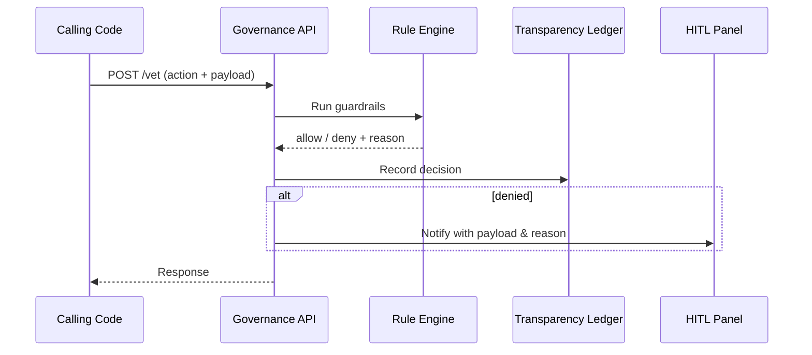

# Chapter 5: Governance Layer & AI Values Framework
*(continues from [Human-In-The-Loop (HITL) Control Panel](04_human_in_the_loop__hitl__control_panel_.md))*  

---

## 1. Why Do We Need a “Constitution” for Software?

### A concrete story

The U.S. Census Bureau wants to publish an AI-generated infographic that highlights migration trends.  
Before anything goes live, three invisible questions must be answered:

1. Does the chart expose any personally-identifiable information?  
2. Is every number traceable back to an official public dataset?  
3. Has the public-website style guide (WCAG accessibility) been met?

Humans could skim the file, but mistakes slip through.  
The **Governance Layer (HMS-GOV)** is our tireless constitutional referee.  
Every action coming from any agent, micro-frontend, or backend call passes through this layer.  
If a rule is violated, the action is blocked and routed back to the [HITL Panel](04_human_in_the_loop__hitl__control_panel_.md) for review.

> Think of it as the *Bill of Rights* baked into every line of code.

---

## 2. Key Concepts (plain words)

| Term | What it really means | Analogy |
|------|----------------------|---------|
| Guardrail | One yes/no test (e.g., “no PII leaks”). | Airport scanner |
| Values Manifest | YAML file listing mandatory guardrails for an agency. | Agency rulebook |
| Governance API | Single endpoint that every service must call: `POST /vet`. | Supreme Court clerk desk |
| Transparency Ledger | Immutable log of every decision (`allow` / `deny`). | Congressional Record |
| Override Token | A signed approval coming from the HITL panel. | Presidential veto override |

---

## 3. Quick Start — “Wrap” Any Action in 10 Lines

Below we protect a **ReportGenerator** skill used by [HMS-AGT](01_ai_representative_agent__hms_agt__.md).

```python
# generate_report.py
from hms_gov import vet                # tiny helper shipped with HMS-GOV
from hms_agt import Agent, PdfSkill

agent = Agent("CensusReporter", skills=[PdfSkill()])

draft = agent.run("Create migration report for ages 18-24")

# Ask the Governance Layer before publishing
decision = vet(action="publish", payload=draft, agency="Census")
if decision == "allow":
    print("✅ Report cleared for publication")
else:
    print("⛔ Blocked – reason:", decision)
```

Explanation  
1 – 3 Import the one-line `vet` helper.  
5   Construct the AI agent.  
7   Agent creates a PDF draft.  
10  Call **Governance**; it returns either `"allow"` *or* a human-readable reason.  
13-14 Act based on the verdict.

---

## 4. What Happens Behind the Scenes?



Steps in words:

1. Any service calls `/vet`.  
2. The **Rule Engine** checks every guardrail in the requesting agency’s *Values Manifest*.  
3. Decision is immutably logged.  
4. If blocked, humans are alerted via the HITL dashboard.  
5. Caller receives the verdict within ~50 ms.

---

## 5. A Peek Inside the Rule Engine

### 5.1 Values Manifest (YAML, 12 lines)

```yaml
# manifests/census.yaml
guardrails:
  - pii_redaction
  - data_source_verification
  - accessibility_check
  - copyright_compliance
```

Beginners’ note:  
Add or remove IDs—no code changes needed.

### 5.2 Minimal Guardrail Function (8 lines)

```python
# guardrails/pii_redaction.py
def run(payload, **_):
    # naive check for SSN-like patterns
    import re
    if re.search(r"\b\d{3}-\d{2}-\d{4}\b", payload):
        return "PII detected (looks like SSN)."
    return None   # means pass
```

If the function returns a **string**, the action is blocked and the string is shown as the reason.

### 5.3 Governance API (abridged, 17 lines)

```python
# hms_gov/api.py
from flask import Flask, request, jsonify
from .loader import load_manifest, load_guardrail

app = Flask(__name__)

@app.post("/vet")
def vet():
    req = request.get_json()
    manifest = load_manifest(req["agency"])
    for g_id in manifest["guardrails"]:
        reason = load_guardrail(g_id).run(req["payload"])
        if reason:
            _log(req, "deny", reason)
            return jsonify({"decision":"deny", "reason":reason})
    _log(req, "allow")
    return jsonify({"decision":"allow"})
```

• `load_manifest()` simply reads the YAML file.  
• Guardrails are imported as Python modules and executed one-by-one.  
• `_log()` writes to the ledger (tiny append-only CSV for demo).

---

## 6. Adding a New Rule in 30 Seconds

Scenario: Congress updates copyright statutes; all published material must now include a “source citation” field.

1. Create `guardrails/source_citation.py`

```python
def run(payload, **_):
    if '"source":' not in payload.lower():
        return "Missing source citation."
```

2. Append the guardrail ID to any manifest that needs it:

```yaml
guardrails:
  - source_citation     # new!
```

3. No restart required—modules are hot-loaded.

---

## 7. Where Does Governance Plug In?

• [AI Representative Agent](01_ai_representative_agent__hms_agt__.md) – wraps every `Skill.execute()` call.  
• [Intent-Driven Navigation Engine](03_intent_driven_navigation_engine_.md) – vet proposed micro-journeys for policy order violations.  
• [HITL Control Panel](04_human_in_the_loop__hitl__control_panel_.md) – displays blocked items and can issue **Override Tokens**.  
• [Legal & Compliance Reasoner](08_legal___compliance_reasoner__hms_esq__.md) – generates suggested guardrails from new legislation.  
• [Observability & Metrics Stack](14_observability___metrics_stack__hms_ops__.md) – graphs pass / fail counts for transparency dashboards.

---

## 8. Frequently Asked Questions

**Q: Does this slow my service down?**  
A: A typical vet call with 5 guardrails completes in < 50 ms. Heavy checks (e.g., large PDF scans) are off-loaded to async workers.

**Q: Can I bypass a rule during emergencies?**  
A: Yes—issue an **Override Token** from the HITL panel. The action is logged as *override* and flagged for later audit.

**Q: Who writes guardrails?**  
A: Most agencies start with the starter pack shipped in HMS-GOV. Legal teams can add or modify rules in plain Python without touching core code.

**Q: How is the Transparency Ledger protected?**  
A: Decisions are hashed and chained (simple blockchain) inside the [Secure Infrastructure Core](15_secure_infrastructure_core__hms_sys__.md).

---

## 9. Wrap-Up

In this chapter you:

• Saw why a *constitutional* layer is vital when AI meets public policy.  
• Wrapped an AI action in a 10-line `vet()` call.  
• Learned how guardrails are declared (YAML) and coded (tiny Python).  
• Walked through the end-to-end decision flow and its immutable ledger.

Next we’ll orchestrate cleared actions into full policy workflows:  
[Policy Workflow Engine (HMS-CDF)](06_policy_workflow_engine__hms_cdf__.md)

Welcome to safer, more transparent software!

---

Generated by [AI Codebase Knowledge Builder](https://github.com/The-Pocket/Tutorial-Codebase-Knowledge)