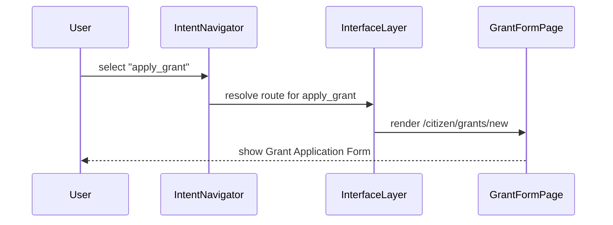

# Chapter 5: Intent-Driven Navigation

In the previous chapter we built user‐facing **Portals** and **Pages** in the [Interface Layer](04_interface_layer_.md). Now we’ll go one step further: instead of showing every menu item all the time, we’ll guide users by **their goals**—just like dynamic directional signage in a federal building. Welcome to **Intent-Driven Navigation**!

---

## 1. Why Intent-Driven Navigation?

Imagine you walk into a U.S. Department of Education office. You see a lobby screen that asks:

- “Are you here to *apply for a grant*?”  
- “Or to *check an existing application*?”  
- “Or to *report a compliance issue*?”

Based on your choice, the signage changes to point you toward the right counter—no confusing menus, no deep knowledge of department structure. You get to your goal quickly.

On the web, our **Intent-Driven Navigation** does the same in applications like:

- A Federal Grants Portal  
- A License Renewal System  
- A Citizen Complaints Dashboard  

Without it, users might click “Forms → Grants → Step 4 → …” and get lost. With it, they simply pick their **intent** (“apply_grant”) and go directly to the correct page.

---

## 2. Key Concepts

1. **Intent**  
   A named user goal, e.g. `apply_grant` or `renew_license`.  
2. **Route**  
   The URL or workflow path that satisfies the intent, e.g. `/citizen/grants/new`.  
3. **Intent Map**  
   A registry mapping each intent key to its label and route.  
4. **Navigator**  
   A small component that:  
   - Knows all registered intents.  
   - Renders an “intent menu.”  
   - Resolves a selected intent to its route.

---

## 3. Using Intent-Driven Navigation

Here’s how a beginner might use an `IntentNavigator` in code:

```python
# File: app.py
from hms_ach.intent_navigation import IntentNavigator

# 1. Create the navigator
nav = IntentNavigator()

# 2. Register user intents with labels and routes
nav.register_intent(
    "apply_grant",
    label="Apply for a Grant",
    route="/citizen/grants/new"
)
nav.register_intent(
    "renew_license",
    label="Renew Your License",
    route="/citizen/license/renew"
)
nav.register_intent(
    "file_complaint",
    label="File a Complaint",
    route="/citizen/complaints/new"
)

# 3. Show the dynamic menu
print(nav.render_intent_menu())
# Output:
# • Apply for a Grant (/citizen/grants/new)
# • Renew Your License (/citizen/license/renew)
# • File a Complaint (/citizen/complaints/new)

# 4. Navigate when the user picks an intent
path = nav.navigate("apply_grant")
print(path)
# Output: /citizen/grants/new
```

Explanation:
- We register each **intent** with a human‐friendly label and the page `route`.  
- `render_intent_menu()` builds a bullet list for the UI.  
- `navigate("apply_grant")` returns the URL to send the user.

---

## 4. Under the Hood: Step-by-Step Flow

When a citizen chooses “Apply for a Grant,” here’s what happens:



1. **Selection**: User clicks their goal.  
2. **Resolution**: Navigator looks up the route.  
3. **Render**: Interface Layer sends the right page.  
4. **Display**: User sees exactly the form they need.

---

## 5. Peek at the Code

Let’s look inside **intent_navigation.py** to see how simple this is.

### 5.1 Registration & Menu Rendering

```python
# File: hms_ach/intent_navigation.py

class IntentNavigator:
    def __init__(self):
        # intent_key -> {label, route}
        self.intents = {}

    def register_intent(self, key, label, route):
        self.intents[key] = {"label": label, "route": route}

    def render_intent_menu(self):
        # Build a bullet list of all intents
        lines = []
        for intent in self.intents.values():
            lines.append(f"• {intent['label']} ({intent['route']})")
        return "\n".join(lines)
```

- `self.intents` holds every intent’s label and route.  
- `render_intent_menu()` loops through and builds a simple menu.

### 5.2 Navigation Logic

```python
    def navigate(self, intent_key):
        intent = self.intents.get(intent_key)
        if not intent:
            return "Intent not found."
        return intent["route"]
```

- We look up the chosen `intent_key`.  
- If missing, we return an error message; otherwise, the correct route.

---

## 6. Conclusion

You’ve learned how **Intent-Driven Navigation** guides users by their goals—just like dynamic signage in a government office. It’s built on simple concepts: **intents**, **routes**, and a **navigator** that ties them together. This keeps interfaces clean and tasks efficient, even for non-technical citizens.

Next up, we’ll build reusable UI widgets powered by these intents in the [Frontend Component Library](06_frontend_component_library_.md).

---

Generated by [AI Codebase Knowledge Builder](https://github.com/The-Pocket/Tutorial-Codebase-Knowledge)