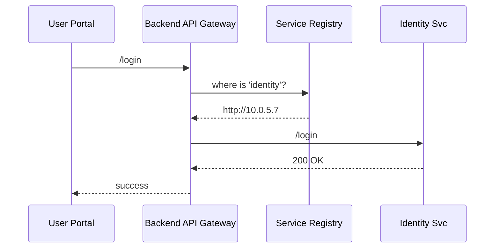

# Chapter 5: Micro-Services Spine  
*(continuing from [Chapter 4: Payment & Clearinghouse Engine (HMS-ACH)](04_payment___clearinghouse_engine__hms_ach__.md))*  

---

## 1. Why Do We Need a “Spine”?

Imagine you are renewing a U.S. passport online.  
What *looks* like one website is really a bundle of tiny services:

* An **Identity** service checks your login.  
* A **Payment** service (that’s [HMS-ACH](04_payment___clearinghouse_engine__hms_ach__.md)) charges the fee.  
* A **Document** service stores your new photo.  
* A **Notification** service emails you when it ships.

These services need roads to talk to each other—fast, safe, and upgrade-friendly.  
That highway network is the **Micro-Services Spine**.

---

## 2. The Highway Analogy

```
┌─────────┐        /login        ┌──────────────┐
│  Portal │ ───►  ─────────────► │  HMS-SYS     │
└─────────┘                     (Identity Svc)
                                 ▲        │ /pay
                                 │        ▼
                           /photo│  ┌──────────────┐
                                 └──│  HMS-ACH     │
                                    (Payment Svc)
```

Just like adding an extra lane on I-95 doesn’t close the whole interstate, we can add or update a service without stopping the entire site.

---

## 3. Key Concepts (No Jargon, Promise!)

| Term | Friendly Description |
|------|----------------------|
| Service | A mini-app that does **one** job well (e.g., payments). |
| API | A short, well-marked exit ramp cars (requests) use. |
| Service Registry | The map that says “Identity lives at 10.0.5.7”. |
| Load Balancer | A traffic cop that splits cars across multiple lanes. |
| Version Tag | A billboard: “You’re on v1—v2 available next exit”. |
| Circuit Breaker | An orange cone; if a lane is broken, traffic is re-routed. |

---

## 4. A 10-Minute Walking Tour

### 4.1. Spin Up Two Tiny Services

```python
# file: identity.py  (HMS-SYS mock)
from fastapi import FastAPI
app = FastAPI()
@app.get("/health")    # 5 lines total
def ok(): return {"up": True}
```

```python
# file: photo.py  (HMS-SVC mock)
from fastapi import FastAPI
app = FastAPI()
@app.get("/health")
def ok(): return {"up": True}
```

Each file is <10 KB and starts independently:  

```bash
uvicorn identity:app --port 8001 &
uvicorn photo:app    --port 8002 &
```

### 4.2. Register Them in the Spine

```python
# file: register.py
from hms_spine import Spine     # thin wrapper around etcd/consul

spine = Spine("http://localhost:8500")  # Service Registry
spine.register("identity", "http://localhost:8001")
spine.register("photo",    "http://localhost:8002")
```

*Explanation*  
• `register()` writes a key/value pair so any other service can discover the URL.  
• No hard-coded IPs—move containers, nothing breaks.

### 4.3. Discover & Call a Service

```python
# file: caller.py
from hms_spine import Spine
import httpx

spine = Spine("http://localhost:8500")
url   = spine.lookup("identity") + "/health"
resp  = httpx.get(url).json()
print(resp)            # => {'up': True}
```

One line (`lookup`) replaces dozens of config files.

---

## 5. What Happens Behind the Curtain?



If *Identity v2* appears at `10.0.9.3`, the registry updates and traffic shifts automatically—no downtime.

---

## 6. Under-the-Hood Modules

1. **Registry (Consul/etcd)**  
   • Holds keys like `identity → http://10.0.5.7`.  
   • Performs health checks every 5 s; dead links are dropped.

2. **Sidecar Proxy (Envoy)**  
   • Sits next to every service container.  
   • Handles load-balancing and circuit-breaking—code stays clean.

3. **Spine SDK (`hms_spine`)**  
   • Thin Python helper you saw above.  
   • Hides the gory Consul/Envoy details.

---

## 7. Tiny Peek at `hms_spine`

```python
# file: hms_spine/core.py  (18 lines)
import requests, os, json

REG_URL = os.getenv("REG_URL", "http://localhost:8500")

def _key(name): return f"/services/{name}"

class Spine:
    def __init__(self, reg=REG_URL):
        self.reg = reg.rstrip("/")

    def register(self, name, url):
        body = {"Value": url.encode().hex()}
        requests.put(f"{self.reg}/v1/kv{_key(name)}", data=json.dumps(body))

    def lookup(self, name):
        r = requests.get(f"{self.reg}/v1/kv{_key(name)}")
        data = r.json()[0]["Value"]
        return bytes.fromhex(data).decode()
```

*Explanation*  
• Uses Consul’s simple key/value HTTP API.  
• Encodes URL as hex to avoid escaping issues.  
• Very few lines—easy to audit or fork.

---

## 8. Upgrade-Without-Outage Demo

1. Start **Identity v1** (`8001`) and register it.  
2. Deploy **Identity v2** on `8003` and *also* register it.  
3. Set **weight** in the registry: `v1:80 %, v2:20 %`.  
4. Gradually move to `100 % v2`.  
5. Deregister v1 → zero downtime.

No 3 a.m. maintenance window required.

---

## 9. Common Questions

**Q1: Do I *have* to learn Consul or Envoy?**  
No. The `hms_spine` SDK shields you until you’re ready.

**Q2: What about security?**  
Each sidecar enforces mTLS, and the Registry only answers to the [Governance Layer](01_governance_layer__hms_gov__.md) for write access.

**Q3: Where does monitoring happen?**  
[Operational Monitoring & Telemetry (HMS-OPS)](10_operational_monitoring___telemetry__hms_ops__.md) scrapes every sidecar for metrics like latency and error rate.

---

## 10. Mini Challenge (Optional)

*Goal:* Simulate a broken photo service and watch the circuit breaker kick in.

```bash
pkill -f "uvicorn photo"       # stop photo service
python caller.py               # same code as §4.3
```

Expected output:

```
Traceback...
hms_spine.exceptions.CircuitOpen: 'photo' temporarily unavailable (3/3 failures)
```

Within 30 s the Registry health check will mark it dead; traffic stops automatically.

---

## 11. What We Learned

• The **Micro-Services Spine** is the highway system that lets dozens (or thousands) of tiny services cooperate.  
• A **Registry + Sidecar** pattern provides discovery, load-balancing, versioning, and fault isolation with *minimal* code.  
• Upgrades happen lane-by-lane—citizens never notice the construction.

Ready to see how external callers enter this highway? Continue to [Chapter 6: Backend API Gateway](06_backend_api_gateway_.md).

---

---

Generated by [AI Codebase Knowledge Builder](https://github.com/The-Pocket/Tutorial-Codebase-Knowledge)