# Chapter 6: Backend API Gateway  
*(continuing from [Chapter 5: Micro-Services Spine](05_micro_services_spine_.md))*  

---

## 1. Why Do We Need a Gateway?

Picture the Centers for Disease Control (CDC) launching a new **“Vaccination Finder”** mobile app.  
Every “Find clinics near me” tap ends up touching *many* internal services:

* Identity (`/login`)
* Geo-location (`/zip→lat/long`)
* Inventory (`/clinic/123/vaccines`)
* Payment (`/pay`) if a fee is required

If each public request hit those services directly, we would have to:

* Duplicate **authentication** logic 4×  
* Add **rate-limits** 4×  
* Pipe **logs & metrics** 4×  

The **Backend API Gateway** is our **post-office sorting center**:  
every REST/gRPC “envelope” is stamped with policy checks, throttled, observed, and finally routed to the right micro-service on the Spine.

One door in, one set of rules, endless scalability.

---

## 2. Key Concepts (Zero Jargon)

| Term | Friendly Description |
|------|----------------------|
| Envelope | The HTTP or gRPC request the citizen sends. |
| Policy Stamp | Quick inspection: “Are you authenticated? Is the payload too large?” |
| Rate-Limiter | A turnstile: lets only *N* requests per minute per user or IP. |
| Router | Looks at the address and sends the envelope to the correct micro-service. |
| Metrics Collector | The employee writing “arrived 09:17, processed 09:18” on a clipboard—feeds [HMS-OPS](10_operational_monitoring___telemetry__hms_ops__.md). |
| Plugin | A lego brick you can snap in (e.g., **JWT Auth** plugin, **Replay-Protection** plugin). |

---

## 3. Five-Minute Quick-Start

### 3.1. Spin Up the Gateway

```bash
pip install hms-gateway
hms-gateway start --port 8080    # runs with sane defaults
```

That single command launches:

* TLS termination (HTTPS in, HTTP/2 out)  
* Default 60 req/min rate-limit per IP  
* JSON logs to stdout

### 3.2. Declare Two Routes

```yaml
# file: routes.yaml
routes:
  - path: /login
    service: identity          # service name from the Spine
    plugins: [jwt, rate-60ip]

  - path: /clinics/*
    service: clinic-registry
    plugins: [jwt, quota-1000user]
```

Explanation  
* Each block is an envelope rule.  
* `service` gets resolved via the Service Registry you met in Chapter 5.  
* Plugins are shorthand—no code written by you!

Load the config:

```bash
hms-gateway reload routes.yaml   # zero downtime
```

### 3.3. Test With `curl`

```bash
curl -H "Authorization: Bearer $TOKEN" \
     https://api.cdc.gov/clinics/85123
```

Expected (simplified):

```json
{
  "clinic_id": "85123",
  "vaccines": ["Flu", "COVID-19"]
}
```

No token? You’ll receive `401 Unauthorized`.  
More than 60 requests per minute from the same IP? `429 Too Many Requests`.

---

## 4. What Happens on a Single Request?

```mermaid
sequenceDiagram
    participant User as Citizen App
    participant GW  as API Gateway
    participant REG as Service Registry
    participant SRV as Clinic-Registry Svc
    User->>GW: GET /clinics/85123
    GW-->>User: 401?429?200
    GW->>GW: ① Auth → ② Rate-limit → ③ Log
    GW->>REG: lookup("clinic-registry")
    REG-->>GW: http://10.0.5.9
    GW->>SRV: /clinics/85123
    SRV-->>GW: 200 JSON
    GW-->>User: 200 JSON
```



---

## 5. Under-the-Hood Modules

1. **Listener** – Accepts TLS traffic, decodes HTTP/2 or gRPC.  
2. **Plugin Chain** – Executes each plugin (JWT check, quota, header rewrite).  
3. **Router** – Resolves target URL via the Spine registry.  
4. **Proxy** – Streams request/response, collects latency & status.  
5. **Exporter** – Sends metrics to [Operational Monitoring & Telemetry (HMS-OPS)](10_operational_monitoring___telemetry__hms_ops__.md).

---

## 6. Peek at the Code (Only the Fun Parts)

### 6.1. Tiny Router (Python, 18 lines)

```python
# file: hms_gateway/router.py
from hms_spine import Spine
import httpx, os

spine = Spine(os.getenv("REG_URL", "http://localhost:8500"))

async def route(req):
    rule = match_route(req.path)            # from loaded YAML
    for plugin in rule.plugins:
        await plugin.run(req)               # auth, rate-limit, etc.

    target = spine.lookup(rule.service)     # 'clinic-registry' → URL
    async with httpx.AsyncClient() as c:
        resp = await c.request(req.method,
                               target + req.path,
                               headers=req.headers,
                               content=await req.body())
    record_metrics(req, resp)
    return resp
```

Explanation  
* `match_route` finds the YAML entry.  
* Each plugin can **abort** (`raise HTTPError(401)`) or mutate the request.  
* `record_metrics` is one line that sends a counter & latency to HMS-OPS.

### 6.2. A 10-Line Rate-Limiter Plugin

```python
# file: hms_gateway/plugins/rate_60ip.py
from time import time
bucket = {}   # ip -> [timestamps]

async def run(req):
    ip = req.client.host
    bucket.setdefault(ip, [])
    bucket[ip] = [t for t in bucket[ip] if t > time()-60]
    if len(bucket[ip]) >= 60:
        raise HTTPError(429, "Slow down 🚦")
    bucket[ip].append(time())
```

Yes—it’s literally a dictionary and a list comprehension.  
For production, swap it with Redis, but beginners see the core idea instantly.

---

## 7. Observability in One Sentence

Every request automatically emits:

* `gateway_requests_total{status="200"}`  
* `gateway_request_duration_seconds`  

HMS-OPS scrapes these Prometheus metrics so your dashboard lights up without any extra work.

---

## 8. Frequently Asked Questions

**Q1: Does the Gateway replace the Sidecar Proxies from Chapter 5?**  
No. Sidecars handle **east-west** (service→service) traffic.  
The Gateway handles **north-south** (public→backend) traffic.

**Q2: Can I add my own plugin?**  
Yes—drop a Python file in `hms_gateway/plugins/` with a `run(req)` coroutine.  
It auto-loads on `reload`.

**Q3: How are policies governed?**  
Any YAML change must be signed off in [Governance Layer (HMS-GOV)](01_governance_layer__hms_gov__.md); the Gateway will refuse to load unsigned configs.

---

## 9. Mini Challenge (Optional)

1. Write a plugin `header_gpo.py` that **adds**  
   `X-Served-By: US-GPO` to every response.  
2. Add it to the `/clinics/*` route.  
3. `curl -I` and confirm the header appears.

---

## 10. What We Learned

• The Backend API Gateway is the **single entrance** to your micro-services city.  
• It handles **auth**, **rate-limiting**, **routing**, and **metrics** with *zero* duplicated code.  
• Config is just YAML; custom behavior is a small Python plugin.  

Ready to see how we exchange data with *other* agencies—beyond our own firewalls?  
Head over to [Chapter 7: Inter-Agency Data Exchange (HMS-A2A)](07_inter_agency_data_exchange__hms_a2a__.md).

---

Generated by [AI Codebase Knowledge Builder](https://github.com/The-Pocket/Tutorial-Codebase-Knowledge)