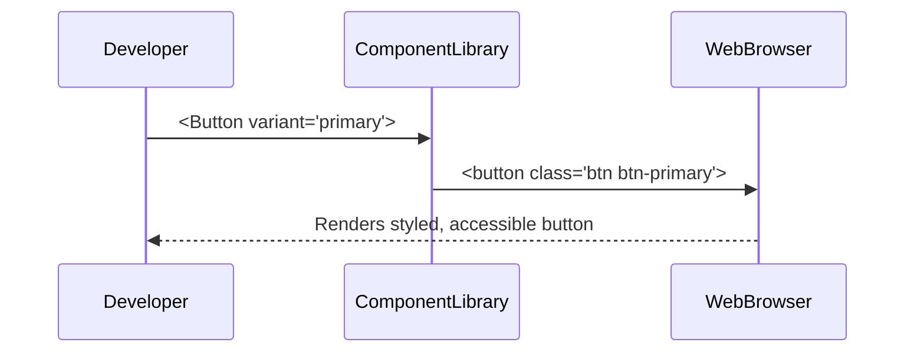

# Chapter 6: Frontend Component Library

In [Chapter 5: Intent-Driven Navigation](05_intent_driven_navigation_.md), you learned how to guide users by their goals. Now it’s time to make those pages look and feel consistent—like using pre-approved stationery in any federal agency. Welcome to the **Frontend Component Library**!

---

## 1. Why a Frontend Component Library?

Imagine the National Institute of Justice builds three portals:

- A **Citizen Portal** for submitting tips.  
- An **Officer Portal** for reviewing cases.  
- An **Admin Console** for audits.

Each portal needs buttons, forms, tables, alerts and more. If every developer writes their own styling, the look and feel become a patchwork:

- Buttons look different.  
- Forms behave inconsistently.  
- Accessibility gaps appear.

A **Frontend Component Library** solves this by providing a shared set of **pre-approved**, **accessible**, and **themed** UI components. Developers simply import and use them—no reinventing the wheel.

---

## 2. Key Concepts

1. **Component**  
   A self-contained UI element (e.g., `<Button>`, `<TextInput>`, `<DataTable>`).  
2. **Props / Variants**  
   Customizable options passed into a component (e.g., size, color).  
3. **Theme**  
   A central palette of colors, fonts, and spacing—like a federal agency’s brand guidelines.  
4. **Accessibility**  
   Built-in support for keyboard navigation, ARIA labels, and contrast standards.

---

## 3. Using the Component Library

Below is a minimal example of building a grant-application form using our library.

```javascript
// File: GrantForm.jsx
import React from 'react'
import { Button, TextInput } from 'hms-ach-ui'  // our shared UI kit

export function GrantForm() {
  return (
    <form>
      <TextInput
        label="Applicant Name"
        name="applicantName"
      />
      <TextInput
        label="Project Title"
        name="projectTitle"
      />
      <Button variant="primary" onClick={() => alert('Submitted!')}>
        Submit Application
      </Button>
    </form>
  )
}
```

Explanation:
- We import `<TextInput>` and `<Button>` from `hms-ach-ui`.  
- Each component comes with built-in styling and labels.  
- The `variant="primary"` prop selects the agency’s main button style.

---

## 4. Under the Hood: What Happens When You Render a Component



1. **Developer** writes `<Button>`.  
2. **ComponentLibrary** translates that into HTML + CSS classes + ARIA.  
3. **Browser** displays a consistent, accessible button.

---

## 5. Peek at the Component Code

Let’s look at a simplified version of our `<Button>` component.

```javascript
// File: hms-ach-ui/components/Button.js
import React from 'react'

export function Button({ variant = 'default', children, ...rest }) {
  // Map variant → CSS class
  const className = `btn btn-${variant}`  
  return (
    <button className={className} {...rest}>
      {children}
    </button>
  )
}
```

Explanation:
- We accept a `variant` prop to switch styles.  
- We build a CSS class name like `btn-primary`.  
- We spread other props (`onClick`, `disabled`, etc.) onto the `<button>`.

---

## 6. Composing More Complex Components

You can build larger widgets by composing basic components. For example, a data table with built-in sorting and styling:

```javascript
// File: hms-ach-ui/components/DataTable.js
import React from 'react'

export function DataTable({ columns, rows }) {
  return (
    <table className="table">
      <thead>
        <tr>
          {columns.map(c => <th key={c.key}>{c.label}</th>)}
        </tr>
      </thead>
      <tbody>
        {rows.map((r,i) => (
          <tr key={i}>
            {columns.map(c => <td key={c.key}>{r[c.key]}</td>)}
          </tr>
        ))}
      </tbody>
    </table>
  )
}
```

Explanation:
- `columns` defines headers and keys.  
- `rows` is an array of data objects.  
- We use agency-wide table styles via `className="table"`.

---

## 7. Conclusion

In this chapter, you learned how a **Frontend Component Library**:

- Provides **consistent**, **accessible**, and **themed** UI building blocks.  
- Lets developers focus on functionality, not CSS.  
- Scales across multiple portals—just like standardized forms in a federal agency.

Next up, we’ll connect these UIs to backend services in the [API Gateway](07_api_gateway_.md).

---

Generated by [AI Codebase Knowledge Builder](https://github.com/The-Pocket/Tutorial-Codebase-Knowledge)