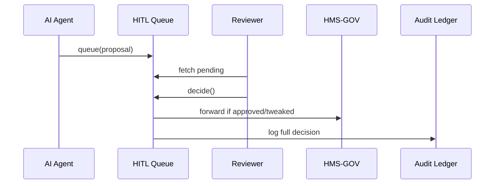

# Chapter 6: Human-in-the-Loop Oversight (HITL)

> “Even the smartest robot still needs a supervisor who can pull the red cord.”  

[← Back to Chapter 5: AI Representative Agent (A2A Node)](05_ai_representative_agent__a2a_node__.md)

---

## 1. Why Do We Need HITL?

### Use-Case: “Raising the Student-Loan Forgiveness Threshold”

1. The A2A Agent (see last chapter) notices that 7 % of low-income borrowers still default.  
2. It proposes **raising the forgiveness threshold from \$20 k to \$22 k**.  
3. Before the rule changes millions of repayment plans, a **human reviewer** must decide:
   • Does this violate the latest budget cap?  
   • Is the economic model transparent enough for Congress?  
4. HITL is the **safety valve** that lets the reviewer *pause, tweak, or veto* the AI’s idea.

Without HITL a single buggy model—or a hacked Agent—could cost taxpayers billions.

---

## 2. Key Concepts (Plain-English Cheat-Sheet)

| Term | Analogy | One-Liner |
|------|---------|-----------|
| Review Queue | Inbox tray | Where AI proposals wait for a human glance |
| Decision Types | Green / Yellow / Red stamps | Approve, Tweak, Veto |
| Pocket Veto Timer | Egg-timer on the desk | Auto-expire if nobody decides in X days |
| Audit Trail | CCTV camera | Immutable log of who did what, when, and why |
| Risk Score | Weather report | Numeric hint that says “stormy” (high risk) or “sunny” (low risk) |

---

## 3. Using HITL in Practice

### 3.1 Pushing a Proposal Into the Queue  

```python
# A2A Agent side (simplified)
proposal = {
    "id": "PR-3821",
    "module": "HMS-ACH",
    "description": "Raise forgiveness threshold to $22k",
    "risk": 0.71           # 0 = low, 1 = high
}
hitl.queue(proposal)       # single public call
```

Explanation  
• The Agent writes **one line**: `hitl.queue()`.  
• The proposal is now visible to reviewers in the *HITL Portal*.

---

### 3.2 Human Reviewer Making a Decision  

```python
# Inside a small Flask route for the reviewer portal
@router.post("/review/{id}")
def decide(id: str, action: str, notes: str):
    hitl.decide(
        proposal_id=id,
        action=action,    # "approve" | "tweak" | "veto"
        comment=notes,
        user=current_user.username)
    return {"status": "recorded"}
```

Typical actions:  
* **approve** – “Looks good; ship it.”  
* **tweak** – “Change \$22 k → \$21 k and add sunset date.”  
* **veto** – “Budget office says no.”

---

### 3.3 What the Reviewer Sees

```mermaid
flowchart TD
  UI[HITL Portal] -->|Click "Pending"| Q(Review Queue)
  Q --> P[Proposal PR-3821]
  P --> D{Approve/Tweak/Veto}
```

One page, three buttons, easy for beginners.

---

## 4. What Happens Behind the Curtain?



Only **five participants**—memorize them and you understand HITL.

---

## 5. Internal Implementation (Code-Light)

### 5.1 File Layout

```
hms_hitl/
 ├─ queue.py       # in-memory or DB backed queue
 ├─ portal.py      # tiny Flask blueprint
 └─ audit_hook.py  # wraps calls to Compliance Ledger
```

### 5.2 queue.py (≤ 20 lines)

```python
_db = {"pending": {}, "decided": {}}

def queue(prop):
    _db["pending"][prop["id"]] = prop

def list_pending():
    return list(_db["pending"].values())

def decide(proposal_id, action, comment, user):
    prop = _db["pending"].pop(proposal_id)
    prop.update({"action": action,
                 "comment": comment,
                 "reviewer": user,
                 "ts": time.time()})
    _db["decided"][proposal_id] = prop
    audit_hook.record(prop)          # eternal log
    if action in ("approve", "tweak"):
        hms_gov.submit(prop)         # re-use Chapter 1 code
```

Beginner highlights  
• Only **six** helper functions.  
• All final decisions flow right back to the [Governance Layer](01_governance_layer__hms_gov__.md).  
• `audit_hook.record` sends an immutable line to the [Compliance & Audit Ledger](14_compliance___audit_ledger_.md).

---

### 5.3 audit_hook.py (8 lines)

```python
def record(entry):
    ledger.append({
        "who": entry["reviewer"],
        "what": entry["action"],
        "id": entry["id"],
        "when": entry["ts"],
        "why": entry["comment"]
    })
```

The ledger is append-only—no edits, no deletes.

---

### 5.4 Pocket Veto Timer (Cron-style, 10 lines)

```python
def sweep_expired(max_days=7):
    now = time.time()
    for pid, p in list(_db["pending"].items()):
        if now - p["ts"] > 86400 * max_days:
            decide(pid, "veto", "auto-expire", "system")
```

If nobody reviews within seven days the system vetoes automatically.

---

## 6. Security & Permissions

• Only users with `role = reviewer` (defined in the [Access & Authorization Matrix](03_access___authorization_matrix_.md)) may hit `/review/{id}`.  
• Every API call carries a JWT so the ledger can **name names**.  
• The HITL Queue itself runs inside the [Governance Layer](01_governance_layer__hms_gov__.md) namespace to prevent bypasses.

---

## 7. Beginner FAQ

**Q: What if two reviewers edit the same proposal?**  
A: First decision wins; the second call receives `409 Conflict`.

**Q: Can a reviewer re-open a vetoed proposal?**  
A: Yes—send `hitl.queue()` again; the ledger will show the full history.

**Q: How do we train new reviewers?**  
A: The portal has a “shadow mode” where trainees make decisions that are logged but not enacted.

---

## 8. Quick Checklist

☑ AI proposals wait in a human review queue.  
☑ Reviewer can Approve, Tweak, or Veto.  
☑ Every click writes to the immutable Audit Ledger.  
☑ Pocket timer auto-vetoes stale items.  
☑ Approved items flow back to Governance for final checks.

---

## 9. Wrap-Up & What’s Next

You now know how **Human-in-the-Loop Oversight** acts as the last line of defense before an AI policy change goes live—just like a governor’s pocket veto but in code.

Ready to see how approved changes actually **roll out across dozens of microservices**?  
Continue to [Management Layer (Service Orchestration)](07_management_layer__service_orchestration__.md) →

---

---

Generated by [AI Codebase Knowledge Builder](https://github.com/The-Pocket/Tutorial-Codebase-Knowledge)