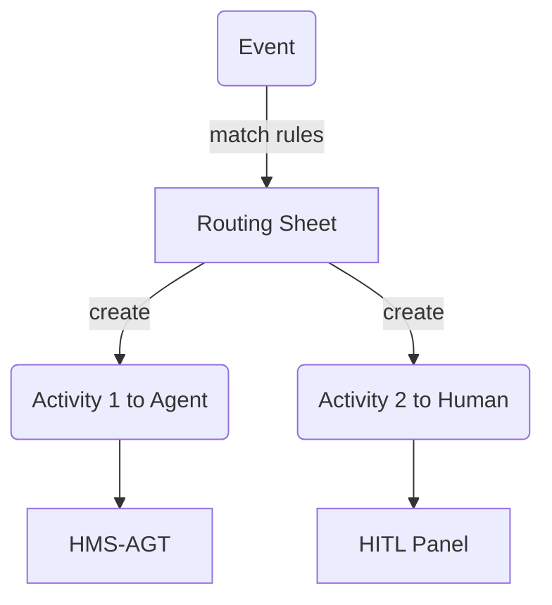
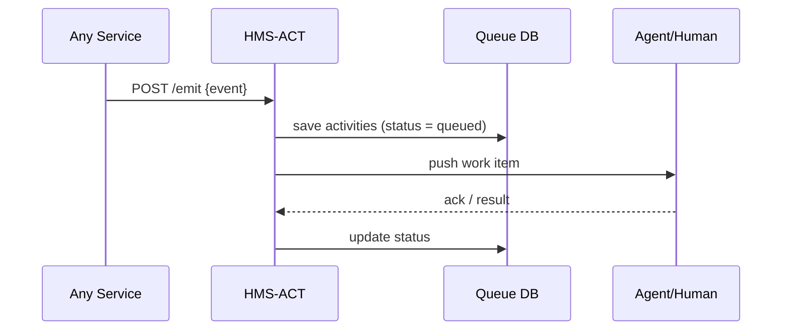

# Chapter 7: Activity Orchestrator (HMS-ACT)  
*(continues from [Policy Workflow Engine (HMS-CDF)](06_policy_workflow_engine__hms_cdf__.md))*  

---

## 1  Why Do We Need an “Air-Traffic Controller” for Software?

### A concrete story  

A citizen opens the city portal at 10 pm and files a **noise complaint** about a loud construction site.  
From that single click the government must:

1. Create a case in the Public Safety database.  
2. Notify the night-shift inspector on duty.  
3. Put a follow-up reminder on tomorrow’s supervisor queue.  
4. Log every action so auditors can later ask *“who did what, when?”*  

Without coordination this becomes e-mail chaos.  
**HMS-ACT** is the *air-traffic controller* that listens for events (planes), assigns them to the right agents or humans (runways), and keeps the entire flight log.

---

## 2  Key Concepts (plain words)

| Term              | What it really means                                    | Analogy                |
|-------------------|---------------------------------------------------------|------------------------|
| Event             | A fact that just happened (“noise complaint filed”).    | Incoming airplane      |
| Activity          | A unit of work to be done (“dispatch inspector”).       | Landing procedure      |
| Queue             | Where activities wait until an agent/human is free.     | Runway waiting line    |
| Agent Target      | A bot (from [HMS-AGT](01_ai_representative_agent__hms_agt__.md)) that can auto-handle an activity. | Auto-pilot             |
| Human Target      | A person reached through the [HITL Panel](04_human_in_the_loop__hitl__control_panel_.md). | Air-traffic officer    |
| Timeline Ledger   | Immutable log of every state change.                    | Flight recorder (“black box”) |

Keep these six words in mind; everything else is just plumbing.

---

## 3  Quick Start — Route One Event in 18 Lines

Below we launch a mini orchestrator, emit a **noise complaint**, and watch the assignment happen.

```python
# demo_act.py
from hms_act import Orchestrator, Event

act = Orchestrator()                           # ❶ create controller

# register two targets
act.register_agent("NoiseBot", skills=["dispatch_inspector"])
act.register_human("night_supervisor", email="sup@city.gov")

# emit an event
ev = Event(type="noise.complaint", data={"location":"3rd & Pine"})
act.emit(ev)                                   # ❷ fire!

# query status
for a in act.activities(ev.id):
    print(a.id, "→", a.status, "→", a.assignee)
```

Typical console output:

```
act-001 → queued    → NoiseBot
act-002 → pending   → night_supervisor
```

Line-by-line:  
❶ `Orchestrator()` boots an in-memory router.  
`register_agent` and `register_human` create two destinations.  
`emit()` converts the one event into two activities:  
• **act-001** auto-handled by *NoiseBot* (dispatch inspector).  
• **act-002** routed to a human for tomorrow’s review.  
The `activities()` helper lists current status.

That’s the whole public API most beginners need!

---

## 4  How Does HMS-ACT Decide Where Things Go?



1. **Event** arrives.  
2. A tiny *Routing Sheet* (YAML) lists which activities must be spawned.  
3. Activities are delivered to either an **Agent** or the **HITL Panel**.  
4. Every status change is written to the **Timeline Ledger** for audits.

---

## 5  Writing Your First Routing Sheet (5 Lines)

```yaml
# routes/noise.yaml
event: noise.complaint
activities:
  - target: agent:NoiseBot
  - target: human:night_supervisor
```

Drop this file in `routes/` and ACT hot-reloads it—no restart.

---

## 6  Internal Walk-Through (step-by-step)



• **Emit**: any service (e.g., [HMS-CDF](06_policy_workflow_engine__hms_cdf__.md)) posts an event.  
• **Persist**: ACT expands to activities and saves them.  
• **Dispatch**: pushes work to the right queue.  
• **Update**: marks success/fail; the ledger is appended.

---

## 7  Peek Inside the Code (all ≤ 20 lines!)

### 7.1 Core Dispatcher (`hms_act/dispatcher.py`)

```python
def dispatch(activity, brokers):
    """Try each broker until one accepts."""
    for b in brokers:
        if b.accepts(activity.target):
            b.push(activity)
            return True
    return False      # stays queued
```

Beginner notes:  
• A *broker* is a tiny adapter (`AgentBroker`, `HumanBroker`, etc.).  
• If no broker accepts, the activity just sits in the queue until one appears.

### 7.2 Timeline Ledger Append (`hms_act/ledger.py`)

```python
import csv, datetime
def log(activity, status):
    with open("timeline.csv", "a", newline="") as f:
        csv.writer(f).writerow([
            datetime.datetime.utcnow().isoformat(),
            activity.id, activity.event_id, status, activity.assignee
        ])
```

Less than 10 lines, yet “black-box” compliance for free.

---

## 8  Replaying History (Audit Mode)

```python
from hms_act import Timeline

for row in Timeline.read("timeline.csv"):
    print(row.timestamp, row.activity_id, "→", row.status)
```

Auditors can answer *“Who touched complaint #123 at 02:14?”* in seconds.

---

## 9  Frequently Asked Questions

**Q: What happens if an agent fails?**  
A: The broker marks the activity `error` and re-queues or escalates to a human after X retries (configurable).

**Q: Is the ledger tamper-proof?**  
A: Each row is additionally hashed and chained by the [Secure Infrastructure Core](15_secure_infrastructure_core__hms_sys__.md).

**Q: Can one event trigger another event?**  
A: Yes—an activity may call `emit()` again, enabling rich chains (e.g., payment cleared → license delivered).

**Q: Does HMS-ACT replace cron jobs?**  
A: Think of ACT as *smart* cron: it schedules work **and** records the who/why/when.

---

## 10  Wrap-Up

In this chapter you:

• Met **HMS-ACT**, the air-traffic controller that turns events into traceable work.  
• Emitted a noise-complaint event and watched it auto-assign to a bot *and* a human.  
• Learned how routing sheets, brokers, and the timeline ledger fit together.  
• Saw that auditing is as simple as reading a CSV.

Next, we’ll teach the platform **how to reason about laws and compliance rules** underlying those activities:  
[Legal & Compliance Reasoner (HMS-ESQ)](08_legal___compliance_reasoner__hms_esq__.md)

Welcome to organized, accountable automation!

---

Generated by [AI Codebase Knowledge Builder](https://github.com/The-Pocket/Tutorial-Codebase-Knowledge)