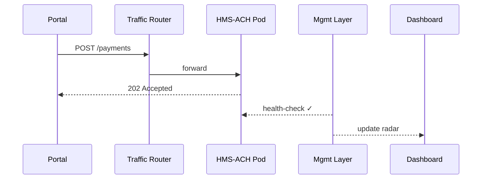

# Chapter 7: Management Layer (Service Orchestration)

[← Back to Chapter 6: Human-in-the-Loop Oversight (HITL)](06_human_in_the_loop_oversight__hitl__.md)

---

## 1. Why Do We Need a Management Layer?

### Use-Case — “Same-Day Disaster Relief Payments”

The Department of Housing and Urban Development (HUD) wants to send **same-day relief payments** to citizens whose homes were damaged by a hurricane.

1. Citizens submit a short form in the **Interface Layer**.  
2. The request triggers three micro-services:  
   • `HMS-FRM` – validates documents  
   • `HMS-ACH` – pushes a payment through the banking rails  
   • `HMS-NOTIFY` – sends status SMS  

If any one of these services stalls or receives too much traffic, thousands of families could wait another night for funds.

**The Management Layer is the air-traffic control tower** that:

* spins up more “payment jets” if load spikes,  
* reroutes traffic if a “document jet” is down for maintenance,  
* shows HUD operators a live radar of every flight (API call).

Without it, micro-services might collide, stall, or leave citizens grounded.

---

## 2. Key Concepts (Plain-English Cheat-Sheet)

| Concept | Friendly Analogy | One-Line Description |
|---------|------------------|----------------------|
| Scheduler | Air-traffic tower clock | Decides when each service takes off and lands. |
| Auto-Scaler | Extra runways | Adds or removes containers based on demand. |
| Health Monitor | Mechanic with a stethoscope | Checks that every container “heart-beats” every few seconds. |
| Traffic Router | Ground crew with flashlights | Directs each API call to the healthiest instance. |
| Dashboard | Radar screen | Real-time view of flights, delays, and emergencies. |

---

## 3. Trying It Out — 12 Lines to Launch a Service

In HMS-ACH you almost never touch Docker or Kubernetes directly.  
You call **one helper** provided by the Management Layer:

```python
from hms_mgmt import orchestrator

payment_service = {
    "name": "hms-ach",
    "image": "registry.gov/hms-ach:1.4",
    "min_replicas": 2,
    "max_replicas": 10,
    "cpu_target": 60            # % per pod
}

orchestrator.deploy(payment_service)
```

What happens?

1. `deploy()` schedules two starter containers (`min_replicas`).  
2. The **Auto-Scaler** watches CPU; if >60 %, it adds more pods up to 10.  
3. The **Health Monitor** sends `/health` pings every 5 sec; any pod that fails twice is replaced automatically.  

No YAML, no hand-written Kubernetes manifests—perfect for beginners.

---

## 4. Step-By-Step: A Citizen Triggers a Payment



Five participants, crystal clear:

* UI – front-end call  
* Traffic Router – load-balances  
* ACH – actual business logic  
* Management Layer – watchdog  
* Dashboard – operator’s live view

---

## 5. What’s Under the Hood?

### 5.1 File Layout (Tiny)

```
hms_mgmt/
 ├─ orchestrator.py   # public helper you imported
 ├─ scheduler.py      # picks nodes & time slots
 ├─ scaler.py         # observes metrics, adds/removes pods
 └─ monitor.py        # health pings & auto-healing
```

### 5.2 orchestrator.py (18 Lines)

```python
import uuid, scheduler, scaler, monitor

def deploy(spec):
    pod_ids = []
    for _ in range(spec["min_replicas"]):
        pod_id = _start_pod(spec)
        pod_ids.append(pod_id)

    # register with scaler & monitor
    scaler.track(spec["name"], spec, pod_ids)
    monitor.watch(pod_ids)

def _start_pod(spec):
    pod_id = str(uuid.uuid4())
    node = scheduler.pick_node()
    # --- Imagine Docker run happens here ---
    print(f"Started {spec['name']} on {node} as {pod_id}")
    return pod_id
```

Beginner notes:

* `_start_pod` hides the container runtime details—no Docker commands to learn.  
* `scaler.track()` and `monitor.watch()` connect the new pods to automatic scaling & health logic.

### 5.3 scaler.py (Excerpt, 14 Lines)

```python
tracked = {}   # service_name -> spec + pods

def track(name, spec, pods):
    tracked[name] = {"spec": spec, "pods": pods}

def tick(metrics):
    for name, data in tracked.items():
        spec, pods = data["spec"], data["pods"]
        cpu = metrics.mean_cpu(pods)
        if cpu > spec["cpu_target"] and len(pods) < spec["max_replicas"]:
            pods.append(_add_pod(spec))
        elif cpu < spec["cpu_target"] / 2 and len(pods) > spec["min_replicas"]:
            _remove_pod(pods.pop())
```

Every “tick” (e.g., every 30 sec) the scaler:

1. Averages CPU per service.  
2. Adds or removes pods to keep usage near the target.

### 5.4 monitor.py (Excerpt, 12 Lines)

```python
def watch(pods):
    for p in pods:
        _ping(p)

def _ping(pod):
    ok = http.get(f"http://{pod}:8080/health").status == 200
    if not ok:
        print("Pod unhealthy → replace")
        orchestrator._start_pod(pod.spec)
```

If a health ping fails twice, the monitor simply starts a new pod—self-healing!

---

## 6. Glue to Other Layers

• **Governance Layer** – any deployment spec over certain limits (e.g., >10 pods) must be cleared by [Chapter 1: Governance Layer (HMS-GOV)](01_governance_layer__hms_gov__.md).  
• **Access & Authorization Matrix** – only users with `role=ops_admin` may call `orchestrator.deploy()` (see [Chapter 3](03_access___authorization_matrix_.md)).  
• **Event Bus & Real-Time Monitoring** – the scaler and monitor emit events like `service.degraded` that flow to the central bus (more in [Chapter 11](11_event_bus___real_time_monitoring_.md)).  
• **Deployment & Versioning Service** – when you push `registry.gov/hms-ach:1.5`, the Management Layer waits for the Versioning Service to mark the image “signed & safe” (see [Chapter 15](15_deployment___versioning_service_.md)).  
• **Backend Microservices Mesh** – the services being orchestrated live here; details in the next chapter.

---

## 7. Beginner FAQ

**Q: Do I need to learn Kubernetes YAML?**  
A: Nope. The `orchestrator` helper writes the manifests for you.

**Q: What happens if all nodes are full?**  
A: `scheduler.pick_node()` returns “none,” triggering a `capacity.alert` event so an operator can add hardware.

**Q: Can I see logs of a single pod?**  
A: Yes. Run `orchestrator.logs(service="hms-ach", pod_id="…")`, which streams last 100 lines.

**Q: How fast does auto-scaling react?**  
A: Default check is every 30 sec, configurable per service.

---

## 8. Quick Checklist

☑ One `deploy()` call spins up, scales, and heals a service.  
☑ Scheduler, Auto-Scaler, and Health Monitor do the heavy lifting.  
☑ Traffic Router keeps API calls flowing to healthy pods.  
☑ Live Dashboard shows status for operators.  
☑ Everything integrates with governance, auth, and monitoring layers.

---

## 9. Conclusion & Next Steps

You now know how the **Management Layer** keeps hundreds of micro-services flying in perfect formation, so citizens never see an “out of service” page when they need help most.

Ready to peek inside those individual airplanes (micro-services) themselves?  
Continue to [Backend Microservices Mesh (HMS-SVC)](08_backend_microservices_mesh__hms_svc__.md) →

---

*End of Chapter 7*

---

Generated by [AI Codebase Knowledge Builder](https://github.com/The-Pocket/Tutorial-Codebase-Knowledge)