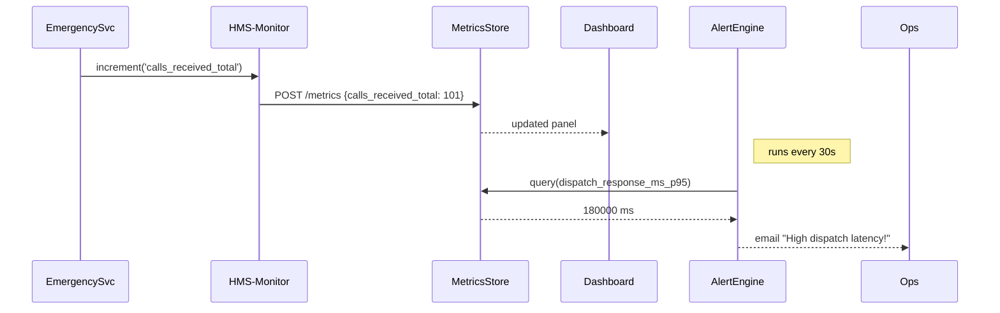

# Chapter 7: Real-time Monitoring & Metrics

Welcome back! In [Chapter 6: Management Layer](06_management_layer_.md) we learned how to orchestrate multi-step workflows. Now we’ll build the “911 operations center” for our platform: the **Real-time Monitoring & Metrics** subsystem.

## 1. Why Real-time Monitoring & Metrics?

Imagine the Federal Emergency Operations Center tracking:

- **Calls per minute** coming into 911  
- **Dispatch response times** for fire, police, EMS  
- **Success rates** of first-responder arrivals  

When you roll out a new routing algorithm, you need to know in seconds if it actually sped up response or caused delays. That’s what real-time dashboards and alerts give you—instant visibility into your key performance indicators (KPIs).

### Concrete Use Case: Emergency Dispatch Service

1. A citizen dials 911 → our `EmergencySvc` logs the timestamp.  
2. A dispatcher is assigned → we record dispatch time.  
3. The ambulance arrives → we log arrival time.  
4. A Grafana dashboard shows **average dispatch latency** over the last 5 minutes.  
5. If the 90th percentile latency exceeds 2 minutes, an alert emails the operations lead.

## 2. Key Concepts

1. **Counters**  
   Monotonically increasing values (e.g., total calls received).  
2. **Gauges**  
   Snapshot values that go up or down (e.g., current queue length).  
3. **Histograms & Timers**  
   Track distributions (e.g., response-time percentiles).  
4. **Dashboards**  
   Visual panels that display metrics in real time.  
5. **Alerts**  
   Triggers when metrics cross thresholds (e.g., error rate > 1%).

## 3. Instrumenting Your Service

Here’s how you add monitoring to your `EmergencySvc`:

```javascript
// file: emergency-service/index.js
const monitor = require('hms-monitor').init({
  serviceName: 'EmergencyDispatch'
})

// Increment total calls
function onCallReceived(call) {
  monitor.increment('calls_received_total')
  const timer = monitor.startTimer('dispatch_response_ms')
  processDispatch(call).then(() => {
    timer.stop()                        // records latency
    monitor.gauge('active_calls', getQueueLength())
  })
}
```

Explanation:  
- `increment` tracks a counter.  
- `startTimer`/`stop` measures dispatch response time in milliseconds.  
- `gauge` records the current queue length.

## 4. What Happens Under the Hood?

When you call `monitor.increment` or `timer.stop`, the library:

1. Buffers the metric in memory.  
2. Periodically flushes batches to the Metrics Store (e.g., Prometheus Pushgateway).  
3. The dashboard system pulls or receives these metrics.  
4. The Alert Engine evaluates rules and notifies you if thresholds are breached.



## 5. Inside HMS-Monitor: A Peek at the Core

Here’s a simplified slice of `hms-monitor` internals:

```javascript
// file: hms-monitor/core.js
let buffer = []

exports.init = ({ serviceName }) => ({
  increment: (name) => buffer.push({ type:'counter', name, value:1 }),
  gauge:    (name, val) => buffer.push({ type:'gauge', name, value:val }),
  startTimer: (name) => {
    const start = Date.now()
    return { stop: () => buffer.push({
      type:'timer', name, value: Date.now()-start
    }) }
  }
})

// Every 10 seconds, flush buffer to store
setInterval(() => {
  postToStore(buffer)
  buffer = []
}, 10000)
```

Explanation:  
- We collect metrics in `buffer`.  
- A background timer sends all buffered metrics every 10 seconds.  
- In real life you’d handle retries, batching limits, and auth.

## 6. Summary

In this chapter you learned how to:

- Instrument your code with **counters**, **gauges**, and **timers**  
- Build a **real-time dashboard** of emergency dispatch KPIs  
- Configure **alerts** to notify you when performance degrades  
- Peek under the hood at how metrics are buffered and flushed

Up next, we’ll ensure our platform complies with policies and regulations in the [Governance Layer](08_governance_layer_.md).

---

Generated by [AI Codebase Knowledge Builder](https://github.com/The-Pocket/Tutorial-Codebase-Knowledge)