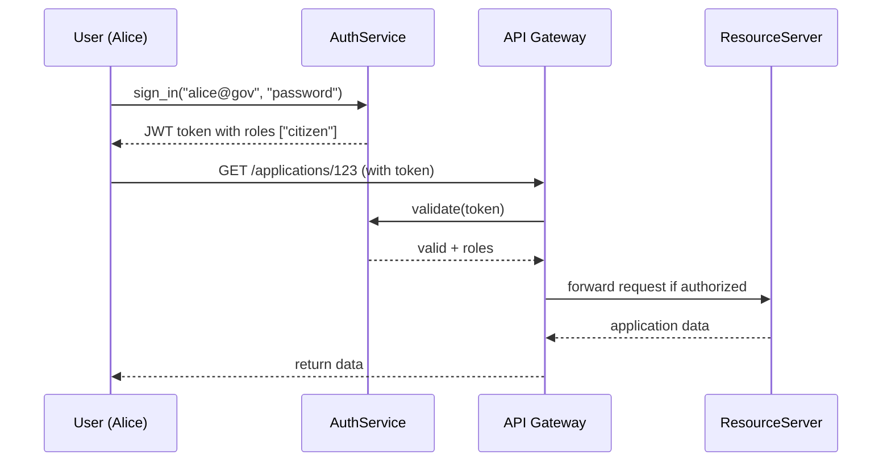

# Chapter 8: Authentication & Authorization

In [Chapter 7: API Gateway](07_api_gateway_.md), we saw how a gateway routes and secures requests to backend services. Now we’ll dive into **Authentication & Authorization**—the security checkpoint that verifies who you are and what you’re allowed to do, just like checking an ID badge before entering restricted areas in a government building.

---

## 1. Why Authentication & Authorization?

Imagine you’re building an online portal for the Federal Communications Commission (FCC) where citizens:

1. **Submit** license‐renewal forms.
2. **View** only their own application status.
3. **Approve** public comments (staff only).

Without security controls:

- Anyone could view or modify any application.
- Malicious users might spam or steal data.

**Authentication** answers: “Who is this user?”  
**Authorization** answers: “What is this user allowed to do?”

Together, they keep sensitive data safe and ensure only the right people access the right functions.

---

## 2. Key Concepts

1. **Identity**  
   A unique user account, e.g. `alice@example.gov`.  
2. **Authentication**  
   Verifying identity (passwords, tokens, ID badges).  
3. **Authorization**  
   Granting permissions (view, edit) based on roles or rules.  
4. **Role**  
   A named group of permissions, e.g. `citizen`, `reviewer`, `admin`.  
5. **Token**  
   A temporary “badge” (JWT) that proves authentication and carries roles.

---

## 3. Using the Auth Module

Below is a minimal example using our `AuthService`. We’ll:

1. **Sign in** a user.
2. **Check** their permission before viewing data.

```python
# File: app.py
from hms_ach.auth import AuthService

auth = AuthService()
# 1. Authenticate and get a token
token = auth.sign_in("alice@gov", "password123")
# 2. Attempt to view an application
if auth.can(token, action="view_application"):
    print("✅ Access granted: showing data...")
else:
    print("🚫 Access denied: insufficient rights.")
```

Explanation:  
- `sign_in` returns a token if credentials match.  
- `can` checks the token’s roles against the requested action.

---

## 4. Under the Hood: Step-by-Step Flow

When Alice logs in and tries to view an application:



1. **Authentication**: Alice provides credentials to AuthService.  
2. **Token Issuance**: AuthService issues a signed JWT carrying roles.  
3. **Gateway Validation**: API Gateway asks AuthService to validate the token.  
4. **Authorization**: Gateway checks if Alice’s roles allow “view_application.”  
5. **Data Access**: If allowed, the request goes to ResourceServer.

---

## 5. Peek at the Auth Implementation

Let’s look at how `AuthService` works under the hood.

### 5.1 AuthService Interface

```python
# File: hms_ach/auth.py

class AuthService:
    def __init__(self):
        # In-memory users + roles store
        self.users = {"alice@gov": {"pwd": "password123", "roles": ["citizen"]}}
```

> We store user records with passwords and assigned roles.

### 5.2 sign_in & can Methods

```python
class AuthService:
    # ... __init__ above ...

    def sign_in(self, username, password):
        user = self.users.get(username)
        if user and user["pwd"] == password:
            # Return a simple token: "username|role1,role2"
            roles = ",".join(user["roles"])
            return f"{username}|{roles}"
        return None

    def can(self, token, action):
        # Decode token
        username, roles_str = token.split("|")
        roles = roles_str.split(",")
        # Simple policy: only 'admin' can delete, 'citizen' can view
        if action.startswith("view") and "citizen" in roles:
            return True
        if action.startswith("delete") and "admin" in roles:
            return True
        return False
```

- `sign_in` checks credentials and builds a lightweight token.  
- `can` splits the token, extracts roles, and applies simple action‐based rules.

---

## 6. Conclusion

In this chapter you learned how to:

- **Authenticate** users and issue tokens.  
- **Authorize** actions based on roles in those tokens.  
- Protect resources behind the API Gateway.

Next up, we’ll look at how individual services implement business logic behind these security controls in [Microservice](09_microservice_.md).

---

Generated by [AI Codebase Knowledge Builder](https://github.com/The-Pocket/Tutorial-Codebase-Knowledge)