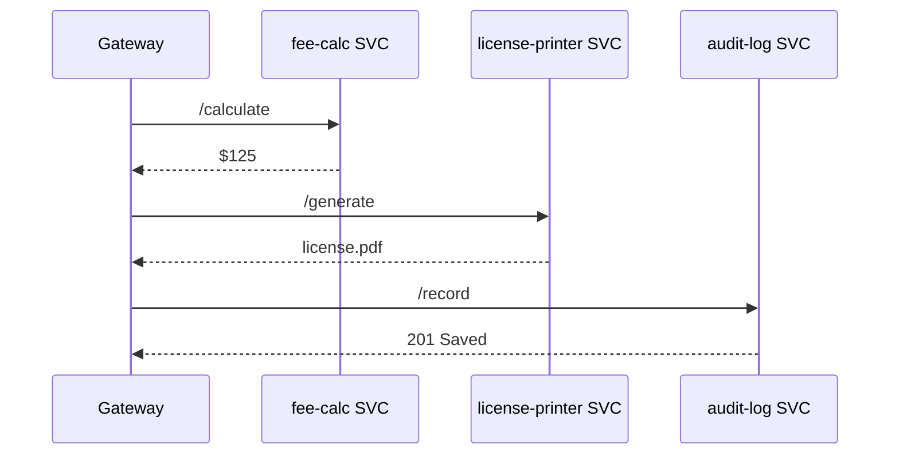

# Chapter 8: Backend Microservices Mesh (HMS-SVC)

_In [Chapter&nbsp;7: Management Layer (Service Orchestration)](07_management_layer__service_orchestration__.md) we learned how new containers are launched, scaled, and monitored._  
Now we’ll **peek inside** those containers and see how they talk to each other through a secure “hallway” called the **Backend Microservices Mesh (HMS-SVC).**

---

## 1. Why Do We Need a Mesh?

### Use-Case: “Same-Day Professional License”

1. **Citizen Avery** applies for a _Professional Engineering License_ online.  
2. The request must touch three services:  
   • `fee-calc` – figures out the application fee  
   • `license-printer` – produces a PDF license  
   • `audit-log` – records every step for inspectors  
3. If any service is slow or insecure, Avery’s license (and public trust) is at risk.

HMS-SVC gives each service its **own booth** in the hall, while the hallway itself guarantees:
* encrypted traffic  
* common language (JSON + HTTP/2)  
* automatic retries if a booth’s door is briefly closed

---

## 2. Key Concepts (Plain-English Cheat-Sheet)

| Concept | Analogy | One-Liner |
|---------|---------|-----------|
| Service Booth | DMV window | Does one job (e.g., print license) |
| Mesh Hallway | Secure corridor | Encrypted path all booths share |
| Service Registry | Phone book | Where booths publish their address & API |
| Sidecar Proxy | Bodyguard | Sits next to a booth, handling encryption & retries |
| Circuit Breaker | “Closed” sign | Temporarily stops calls to a shaky booth |
| API Contract | Menu on the counter | Machine-readable spec (OpenAPI) of what each booth offers |

---

## 3. Talking to Services — 12 Lines!

Below is **all** the code a front-end gateway needs to trigger Avery’s license flow.

```python
from hms_svc import call   # friendly helper

def issue_license(payload):
    fee  = call("fee-calc",  "/calculate", payload)["amount"]
    pay  = call("payment",   "/charge",    {"amount": fee})
    doc  = call("license-printer", "/generate", payload)
    call("audit-log", "/record", {
        "user": payload["ssn"],
        "fee": fee,
        "doc_id": doc["id"]
    })
    return {"license_pdf": doc["url"], "receipt": pay["txn"]}
```

What just happened?

1. `call()` looks up each booth in the **Service Registry**.  
2. Sidecar proxies add **mTLS encryption** and a **JWT** issued by the [Access & Authorization Matrix](03_access___authorization_matrix_.md).  
3. If `license-printer` hiccups, the proxy retries twice, then flips a **circuit breaker** to prevent cascading failures.

_No Docker commands, no cryptic headers—perfect for beginners._

---

## 4. A 60-Second Tour of the Mesh



Only **four** booths plus the gateway—the hallway logic is invisible to you.

---

## 5. What Happens Under the Hood?

### 5.1 Non-Code Walk-Through

1. **Discover** – `call("fee-calc", …)` asks the _Service Registry_ for the current IP of `fee-calc`.  
2. **Encrypt** – The sidecar wraps the HTTP request in **mTLS** so middle-men can’t peek.  
3. **Sign** – It attaches a short-lived JWT proving “Gateway may read and write fees.”  
4. **Retry / Break** – If no reply in 300 ms, the proxy retries; three misses flips the circuit breaker to _open_ for 60 s.  
5. **Trace** – Each hop emits a `svc.trace` event to the [Event Bus & Real-Time Monitoring](11_event_bus___real_time_monitoring_.md) layer for instant dashboards.

---

## 6. Under-the-Hood Code (Friendly Size!)

### 6.1 File Layout

```
hms_svc/
 ├─ __init__.py     # exposes call()
 ├─ registry.py     # phone book
 ├─ proxy.py        # HTTPS + retries
 └─ contracts.yaml  # API specs (OpenAPI snippets)
```

### 6.2 registry.py — 12 Lines

```python
# Simulated in-memory registry
_REG = {
    "fee-calc":         "http://10.0.3.14:8080",
    "license-printer":  "http://10.0.7.22:8080",
    "audit-log":        "http://10.0.2.80:8080",
}

def lookup(name):
    return _REG[name]
```

_Booths register themselves at startup; a real system would pull from etcd or Consul._

### 6.3 proxy.py — 18 Lines

```python
import httpx, jwt, time, registry

def secure_request(service, path, data):
    url = registry.lookup(service) + path
    token = _make_token(service)           # signed JWT
    for attempt in range(3):               # max 3 tries
        try:
            r = httpx.post(url, json=data,
                           headers={"Authorization": f"Bearer {token}"},
                           timeout=0.3)
            r.raise_for_status()
            return r.json()
        except Exception:
            time.sleep(0.1)                # brief back-off
    raise RuntimeError(f"{service} unreachable")

def _make_token(service):
    return jwt.encode({"svc": "gateway", "to": service,
                       "exp": time.time()+60}, "shared_secret")
```

_Beginner highlights:_  
• `secure_request` handles lookup, encryption (httpx → TLS), retries, and token minting.  
• Fail hard only after three misses—that’s the **circuit breaker**.

### 6.4 `__init__.py` — 4 Lines

```python
from .proxy import secure_request as call
__all__ = ["call"]
```

Your app imports `call()` and thinks the whole mesh is “just another function.”

---

## 7. How HMS-SVC Connects to Other Layers

* **Management Layer** spins up each service pod before it can register.  
* **Governance Layer** vets every API contract change (`contracts.yaml`).  
* **Access & Authorization Matrix** defines which services may call which others (JWT scopes).  
* **Event Bus & Real-Time Monitoring** receives trace events for dashboards & alerts.  
* **Domain-Specific Modules** (next chapter) sit **inside** these booths, adding business logic for Education, Health, etc.

---

## 8. Beginner FAQ

**Q: Do I need to learn gRPC or Kafka?**  
A: Not today. `call()` hides the transport. Swap in gRPC later and your app code stays the same.

**Q: How do services register themselves?**  
A: On startup they POST `{"name":"fee-calc","url":"http://10.0.3.14:8080"}` to `/registry`. The tiny `registry.py` above is just a teaching stub.

**Q: What keeps a malicious service from impersonating another?**  
A: Sidecar proxies enforce **mTLS** certificates issued by an internal CA; impersonators fail the handshake.

**Q: Can I see live traffic between two services?**  
A: Yes—watch the `svc.trace` topic on the Event Bus; every hop emits a start/stop timestamp.

---

## 9. Quick Checklist

☑ Each micro-service = independent “booth.”  
☑ `call(service, path, data)` is the only public helper you need.  
☑ Sidecar handles encryption, retries, and JWT auth.  
☑ Service Registry keeps current addresses.  
☑ Trace events flow to monitoring dashboards.

---

## 10. Conclusion & What’s Next

You now speak the secret hallway language of HMS-SVC—secure, resilient, and wonderfully boring (in the best way).

Next, we’ll step **inside** some of those booths and explore the specialized logic they host in [Domain-Specific Modules (HMS-ACH, HMS-HLT, HMS-EDU)](09_domain_specific_modules__hms_ach__hms_hlt__hms_edu__.md).

---

Generated by [AI Codebase Knowledge Builder](https://github.com/The-Pocket/Tutorial-Codebase-Knowledge)