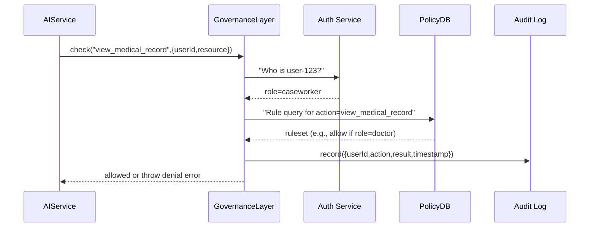

# Chapter 8: Governance Layer

Welcome back! In [Chapter 7: Real-time Monitoring & Metrics](07_real_time_monitoring___metrics_.md) we added dashboards and alerts so administrators see system health at a glance. Now we’ll introduce the **Governance Layer**—our “oversight committee” that enforces transparency, ethics, safety, and privacy rules across every AI call and data flow.

## 1. Why a Governance Layer?

Imagine a federal benefits portal that uses an AI model to review medical records and approve claims. We need to ensure:
- Only doctors or authorized officers view health data (HIPAA compliance).  
- PII is handled safely and erased when required (GDPR).  
- Each decision—“allow” or “deny”—is logged forever without tampering.

The Governance Layer is like a review board that checks every proposed AI action against a set of policies and writes its verdict into an unchangeable audit log.

### Concrete Use Case: Benefit Eligibility Check

1. A caseworker runs `AIService.analyze(record)`.  
2. Before the AI starts, the Governance Layer checks “can this user see medical data?”  
3. If allowed, AI runs; if denied, the request is blocked.  
4. Every check and outcome is recorded in an immutable audit trail.

## 2. Key Concepts

1. Policy Engine  
   The component that evaluates rules (e.g., “only role=doctor can view lab results”).  

2. Policy Rules  
   Configurable statements like “deny access to minors’ data without parental consent.”  

3. Access Control  
   Mechanism that decides allow/deny for any action on any resource.  

4. Compliance Checker  
   Module that maps rules to legal standards (GDPR, HIPAA) and enforces them.  

5. Immutable Audit Log  
   A write-once ledger of every governance decision for later review or legal audit.

## 3. Using the Governance Layer

Below is a minimal example in your AI service.

```javascript
// file: ai-service/index.js
const gov = require('hms-governance').init({
  serviceName: 'BenefitAI'
})

// 1) Before calling the model, check policy
async function safeAnalyze(userId, recordId, input) {
  await gov.check('view_medical_record', {
    userId, resource: recordId
  })
  // 2) If allowed, proceed
  return AIModel.run(input)
}

// 3) Call it
safeAnalyze('user-123', 'rec-456', { symptoms: 'cough' })
  .then(result => console.log('AI result:', result))
  .catch(err => console.error('Governance blocked:', err.message))
```

Explanation:  
- `init()` wires in policy rules, compliance modules, and audit logger.  
- `gov.check(action, context)` throws an error if access is denied, or returns quietly if allowed.  
- Every call to `check` is recorded in an immutable log.

## 4. What Happens Under the Hood?

Here’s a high-level sequence when you call `gov.check(...)`:



1. **Auth Service** verifies user identity and fetches roles.  
2. **PolicyDB** returns relevant rules for the requested action.  
3. **GovernanceLayer** evaluates rules against the user’s role and context.  
4. Outcome is written to the **Audit Log**.  
5. AIService either proceeds or is blocked.

## 5. Inside HMS-Governance: A Peek at the Core

Let’s look at simplified code for the core functions.

```javascript
// file: hms-governance/core.js
exports.init = ({ serviceName }) => {
  // load policies from config or database
  const policies = loadPolicies()
  return {
    check: async (action, ctx) => {
      const user = await authClient.getUser(ctx.userId)
      const rule = policies.find(r => r.action === action)
      const allowed = evaluate(rule, user, ctx.resource)
      await auditLog.write({ serviceName, action, user, allowed, time: Date.now() })
      if (!allowed) throw new Error('Access Denied')
    }
  }
}
function evaluate(rule, user, resource) {
  // very simple: check user.role against rule.allowedRoles
  return rule.allowedRoles.includes(user.role)
}
```

Explanation:  
- `loadPolicies()` reads policy definitions (e.g., JSON rules).  
- `evaluate()` applies a rule to the calling user and resource.  
- `auditLog.write()` appends an entry to an immutable store (could be blockchain, WORM disk, etc.).

## 6. Summary

In this chapter you learned how the **Governance Layer**:

- Acts like an oversight committee for AI and data flows.  
- Checks policies for transparency, ethics, safety, and privacy (GDPR/HIPAA).  
- Records every decision in an immutable audit log.  
- Provides a simple API (`gov.check`) to block or allow actions.

Next up, we’ll dive into policy configuration and management in the [Policy Management Module](09_policy_management_module_.md).

---

Generated by [AI Codebase Knowledge Builder](https://github.com/The-Pocket/Tutorial-Codebase-Knowledge)