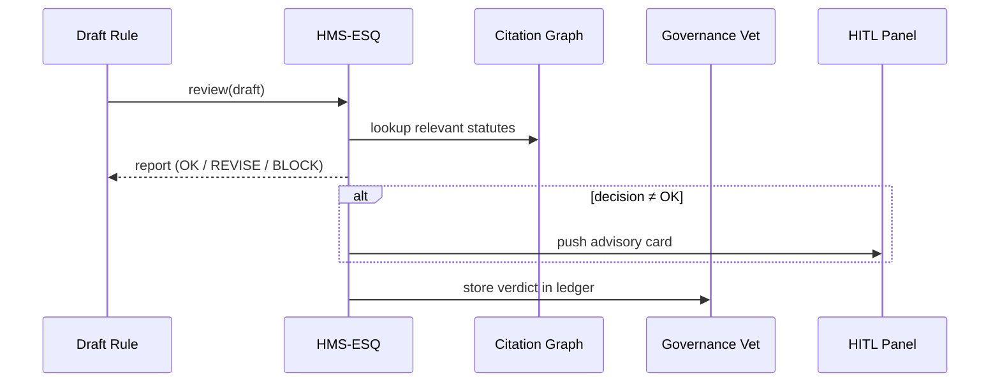

# Chapter 8: Legal & Compliance Reasoner (HMS-ESQ)

*(continues from [Activity Orchestrator (HMS-ACT)](07_activity_orchestrator__hms_act__.md))*  

---

## 1  Why Do We Need a “Virtual Counsel”?

### A concrete story  

The City Office of Cultural Affairs wants to publish a **new copyright-fee schedule** for public libraries.

Legally they must:

1. Respect **Title 17 §802(b)** (board‐approval rule).  
2. Provide **30-day public notice** before fees take effect.  
3. Avoid any conflict with the state’s “Open Knowledge Act.”

Missing just one citation could trigger lawsuits or refund chaos.  
Instead of hiring three paralegals to cross-read statutes, the team pastes their draft into **HMS-ESQ**.  
Within seconds they get:

```
⚠ Conflict with State Open Knowledge Act §4(c)
ℹ Public notice period must be ≥ 30 days (draft sets 14)
✓ No clash with Title 17 §802(b)
```

They fix the draft, re-run the check, and only then let the [Activity Orchestrator](07_activity_orchestrator__hms_act__.md) move the rule forward.

> HMS-ESQ is your *virtual general counsel* that never sleeps and
> already read the entire statute book.

---

## 2  Key Concepts (plain English)

| Term                | What it really means                               |
|---------------------|----------------------------------------------------|
| Draft Rule          | The text you intend to publish (Markdown, PDF…).   |
| Citation Graph      | A pre-indexed map of laws, regs, guidance docs.    |
| Conflict Check      | Scan for any clause that contradicts a higher law. |
| Notice Clock        | Verifies mandated waiting periods (e.g., 30 days). |
| Risk Score          | 0–1 number indicating likelihood of litigation.    |
| Auto-Fix Suggestion | Minimal wording change that would resolve a clash. |

Keep these six words in mind; everything else is plumbing.

---

## 3  Quick Start — Verify a Draft Rule in 18 Lines

```python
# esq_demo.py
from hms_esq import ESQ, RuleDraft

esq = ESQ()                                      # ❶ create counsel

draft = RuleDraft(
    id="LIB-FEES-24",
    text="""
    Section 1 — New checkout fee is $0.25 per item.
    Effective date: July 1, 2024.
    """,
    agency="CulturalAffairs"
)

report = esq.review(draft)                       # ❷ run checks

print("Verdict →", report.decision)              # ❸ show outcome
for note in report.notes:                        # ❹ list issues
    print("•", note)
```

Typical console output:

```
Verdict → REVISE
• Public notice period must be at least 30 days (Title 17 §805)
• Suggest amending “Effective date” to “August 1 2024”
```

Line-by-line:  
❶ Instantiate the reasoner (loads statutes index).  
❷ `review()` runs conflict, notice, and risk checks.  
❸ returns either **OK**, **REVISE**, or **BLOCK**.  
❹ prints human-friendly notes, ready for the HITL Panel.

---

## 4  What Happens Under the Hood?



1. Draft arrives.  
2. ESQ pulls matching statutes/articles from its **Citation Graph** (a SQLite DB).  
3. It runs rule plugins (conflict, notice, risk).  
4. If issues exist, a card appears in the HITL dashboard.  
5. The verdict is also logged in the Governance ledger for audits.

---

## 5  Peeking Inside the Code

### 5.1 Statute Index (YAML, 12 lines)

```yaml
# statutes/title17.yaml
id: 17
name: Copyright Law
sections:
  802b:
    text: "Any new fee schedule shall be approved by the board..."
    notice: 30     # days
  805:
    text: "Public notice of changes shall not be less than 30 days."
```

Adding a new law is as easy as dropping one YAML file into `statutes/`.

### 5.2 Conflict Checker (8 lines)

```python
# hms_esq/checks/conflict.py
def run(draft, context):
    for clause in context.statutes:
        if "fee schedule" in draft.text.lower() \
           and clause.id == "802b" and "board" not in draft.text.lower():
            return "Missing board-approval per Title 17 §802(b)."
```

If the function returns a string → the draft is flagged.

### 5.3 Notice-Period Checker (10 lines)

```python
# hms_esq/checks/notice.py
from datetime import date, timedelta
import re

def run(draft, context):
    eff = re.search(r"Effective date:\s+(.*)", draft.text)
    if not eff: return None
    eff_date = date.fromisoformat(eff.group(1).replace(' ',''))
    required = context.minimum_notice_days()
    if (eff_date - date.today()).days < required:
        return f"Public notice period must be ≥ {required} days."
```

Both checkers are automatically imported; adding new ones is just a file drop.

### 5.4 Mini Reasoner Loop (15 lines)

```python
# hms_esq/core.py  (excerpt)
def review(self, draft):
    ctx = Context(draft, self._statute_lookup(draft))
    notes = []
    for checker in self._plugins:
        note = checker.run(draft, ctx)
        if note: notes.append(note)
    decision = "OK" if not notes else "REVISE"
    return Report(decision=decision, notes=notes)
```

No magic: loop through plugins, collect notes, set verdict.

---

## 6  Adding a New Checker in 30 Seconds

Need to enforce **plain-language grade ≤ 12**?

1. `checks/readability.py`

```python
import textstat
def run(draft, _):
    if textstat.flesch_kincaid_grade(draft.text) > 12:
        return "Reading level above 12th grade; simplify wording."
```

2. Save the file — ESQ hot-loads it.  
3. Future reviews now include readability in the verdict.

---

## 7  Frequently Asked Questions

**Q: Does ESQ replace human lawyers?**  
A: No. It accelerates rote checks so attorneys can focus on nuanced policy.

**Q: Where does ESQ get its statute texts?**  
A: From the [Central Data Repository](12_central_data_repository__hms_dta__.md); a nightly crawler syncs with `govinfo.gov`.

**Q: How do I override a false positive?**  
A: Use the HITL panel’s “Override & Justify” button. The justification is chained in the Secure Ledger.

**Q: Performance?**  
A: A typical 5-page rule with 10 checkers completes in < 200 ms on a laptop.

**Q: Can ESQ draft citations itself?**  
A: Yes—call `esq.autocite(draft)` and it inserts inline references, powered by [HMS-AGT](01_ai_representative_agent__hms_agt__.md).

---

## 8  Wrap-Up

In this chapter you:

• Met **HMS-ESQ**, the tireless virtual counsel.  
• Ran a draft rule through conflict and notice checks in under 20 lines.  
• Saw how YAML statutes + tiny plugin files power the engine.  
• Learned how ESQ plugs into governance and human-review loops.

Next we’ll teach different agencies **how to talk to each other securely** once their rules are cleared:  
[Inter-Agency Protocol (HMS-A2A)](09_inter_agency_protocol__hms_a2a__.md)

Welcome to safer, faster, and lawsuit-free policymaking!

---

Generated by [AI Codebase Knowledge Builder](https://github.com/The-Pocket/Tutorial-Codebase-Knowledge)